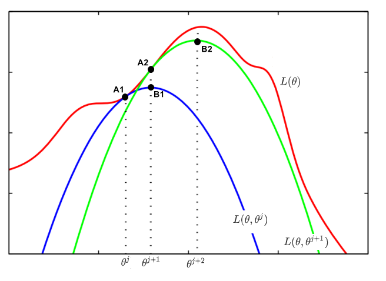

[EM](https://zh.wikipedia.org/wiki/%E6%9C%80%E5%A4%A7%E6%9C%9F%E6%9C%9B%E7%AE%97%E6%B3%95)（Expectation-Maximum）算法也称期望最大化算法，它是1977年由Dempster等人总结 提出。EM算法是最常见的隐变量估计方法，在机器学习中有极为广泛的用途，例如常被用来学习高斯混合模型（Gaussian Mixture Model，简称GMM）的参数；隐式马尔科夫算法（HMM）、LDA主题模型的变分推断等等。

EM算法是一种迭代优化策略，由于它的计算方法中每一次迭代都分两步，其中一个为期望步（**E**xpectation步），另一个为极大步（**M**aximum步），故此得名。

本文主要参考了很多优秀的文章（见参考），添加了一些步骤，是对这些文章的一个阅读记录。

## 问题描述

在构建模型时，我们需要从样本观察数据中，找出样本的模型参数。 而最常用的方法就是极大对数似然估计。 定义如下：

对于$m$个样本观察数据$x=(x^{(1)},x^{(2)},...x^{(m)})$中，找出样本的模型参数$\theta$，采用极大对数似然估计如下：
$$
L(\theta) = \sum\limits_{i=1}^m logP(x^{(i)};\theta)
$$
通过极大化$L(\theta)$，来获得对应的模型参数$\theta$，即：
$$
\theta = arg \max \limits_{\theta}\sum\limits_{i=1}^mL(\theta) 
$$
然而，在很多情况下，有隐藏变量决定观测数据，则函数变成：
$$
L(\theta) = \sum\limits_{i=1}^m log\sum\limits_{z^{(i)}}P(x^{(i)}, z^{(i)};\theta) \tag 1
$$
其中隐藏变量$z=(z^{(1)}. z^{(2)},...,z^{(m)})$。

下面我们来逐步分析，EM算法如何来根据隐藏变量$z$求解$\theta$。

## 算法推导

EM算法的基本思路是，找到似然估计的一个下界，然后不停的迭代，保证每一次迭代（似然估计）的值会逐步提高，这样就会慢慢接近一个（局部）最大值，然后获得其对应的模型参数$\theta$。

### EM流程

首先，我们引入对于隐变量$z^{(i)}$的概率分布 $Q_i(z^{(i)})$，有$m$个样本，则有对应的$m$个$Q$分布。
$$
\begin{align}
L(\theta) &= \sum\limits_{i=1}^m log \sum\limits_{z^{(i)}}P(x^{(i)}, z^{(i)};\theta)
\\ &
=  \sum\limits_{i=1}^m log\sum\limits_{z^{(i)}}Q_i(z^{(i)})\frac{P(x^{(i)}, z^{(i)};\theta)}{Q_i(z^{(i)})} 
\end{align}
$$
> 可以理解为PLSA模型中，有$m$篇文档，有$k$个主题，每一篇文档都有一个主题分布。

接下来，由于log函数是一个凹函数，根据[Jensen 不等式](https://eipi10.cn/mathematics/2020/07/14/jensen/)，可以得到。
$$
\begin{align}
L(\theta)  &
=  \sum\limits_{i=1}^m log\sum\limits_{z^{(i)}}Q_i(z^{(i)})\frac{P(x^{(i)}, z^{(i)};\theta)}{Q_i(z^{(i)})} 
\\ & 
\geq \sum\limits_{i=1}^m  \sum\limits_{z^{(i)}} Q_i(z^{(i)})log\frac{P(x^{(i)}, z^{(i)};\theta)}{Q_i(z^{(i)})}  \tag 2
\end{align}
$$
这样我们就获得了最大似然和函数$L(\theta)$的一个下界。

显然，根据Jensen不等式的等号成立条件，需要满足。
$$
\frac{P(x^{(i)}， z^{(i)};\theta)}{Q_i(z^{(i)})} =c
$$
其中$c$为常数。然后根据$\sum\limits_{z^{(i)}}Q_i(z^{(i)}) =1$，可以进行如下推导：
$$
\begin{align}
\frac{P(x^{(i)}， z^{(i)};\theta)}{Q_i(z^{(i)})} &=c 
\\ P(x^{(i)}， z^{(i)};\theta) & = cQ_i(z^{(i)})
\\ \sum\limits_{z^{(i)}}P(x^{(i)}， z^{(i)};\theta) & = c\sum\limits_{z^{(i)}}Q_i(z^{(i)})
\\ c  & = \sum\limits_{z^{(i)}}P(x^{(i)}， z^{(i)};\theta)
\\ c  & =  P(x^{(i)};\theta)
\end{align}
$$
可得：
$$
\begin{align}
Q_i(z^{(i)})   &=  \frac{P(x^{(i)}， z^{(i)};\theta)}{P(x^{(i)};\theta)} 
\\ Q_i(z^{(i)})  &= P( z^{(i)}\vert x^{(i)};\theta) 
\end{align}
$$
由此，在给定的$\theta$下，当满足了上面的公式，不等式$(2)$等号成立，即：
$$
\begin{align}
L(\theta)  &
=  \sum\limits_{i=1}^m  \sum\limits_{z^{(i)}} Q_i(z^{(i)})log\frac{P(x^{(i)}, z^{(i)};\theta)}{Q_i(z^{(i)})} \tag 3
\end{align}
$$
下面再来看，在给定的$ Q_i(z^{(i)}) $下，能不能进一步优化$\theta$。这时问题变成：
$$
\theta = arg \max \limits_{\theta} \sum\limits_{i=1}^m \sum\limits_{z^{(i)}}Q_i(z^{(i)})log\frac{P(x^{(i)}， z^{(i)};\theta)}{Q_i(z^{(i)})}
$$
总结起来，EM的流程可以概括为：

- 输入：观察数据$x=(x^{(1)},x^{(2)},...x^{(m)})$，联合分布$P(x,z;θ)$, 条件分布$P(z\vert x;θ)$, 最大迭代次数$J$。

- 算法：

    1. 随机初始化模型参数$\theta$的初值$\theta^1$。

    2. for $j$  from $1$ to $J$开始EM算法迭代：

       - E步：计算联合分布的条件概率期望：
         $$
         \begin{align}
         Q_i(z^{(i)}) = P( z^{(i)}|x^{(i)}，\theta^{j}))
         \\ L(\theta, \theta^{j}) = \sum\limits_{i=1}^m\sum\limits_{z^{(i)}}Q_i(z^{(i)})log \frac {P(x^{(i)}， z^{(i)};\theta)} {Q_i(z^{(i)})} \tag 4
    \end{align}
         $$
         
       - M步：极大化$L(\theta)$, 得到$\theta^{j+1}$：
         $$
         \theta^{j+1} = arg \max \limits_{\theta}L(\theta, \theta^{j})
         $$
       
       - 如果$\theta^{j+1}$已收敛，则算法结束。否则继续回到E步进行迭代。

- 输出：模型参数$\theta$。

### 迭代的收敛性

上面梳理了EM的流程，但是还有一个问题：EM算法能保证收敛吗？也就是每一次迭代后，其极大似然概率会逐步提高吗，即：

$$
L(\theta^{j+1}) \geq L(\theta^{j})
$$

根据上面的公式$(3)$和$(4)$，当满足$Q_i(z^{(i)})=P( z^{(i)}\vert x^{(i)};\theta)$，可得：

$$
\begin{align}
L(\theta^{j})  
=  \sum\limits_{i=1}^m  \sum\limits_{z^{(i)}} {Q_i(z^{(i)})}log\frac{P(x^{(i)}, z^{(i)};\theta^{j})}{Q_i(z^{(i)})}  = L(\theta^{j}, \theta^{j})
\end{align}
$$

而根据公式$(2)$，可得

$$
\begin{align}
L(\theta^{j+1}) & =  \sum\limits_{i=1}^m log\sum\limits_{z^{(i)}}Q_i(z^{(i)})\frac{P(x^{(i)}, z^{(i)};\theta^{j+1})}{Q_i(z^{(i)})} 
\\  & \geq \sum\limits_{i=1}^m  \sum\limits_{z^{(i)}} {Q_i(z^{(i)})} log\frac{P(x^{(i)}, z^{(i)};\theta^{j+1})}{Q_i(z^{(i)})} 
\\  & = L(\theta^{j+1}, \theta^{j})
\end{align}
$$

由于$\theta^{j+1} = arg \max \limits_{\theta}L(\theta, \theta^{j})$，所以$L(\theta^{j+1}, \theta^{j})$必然大于等于$L(\theta^{j}, \theta^{j})$，可得：

$$
\begin{align}
L(\theta^{j+1})  & \geq L(\theta^{j+1}, \theta^{j})
\\ & \geq L(\theta^{j}, \theta^{j})
\\ & = L(\theta^{j})
\end{align}
$$

证毕。

还可以用下面 的图形来形象理解。

上图中，红色曲线是$L(\theta)$，蓝色曲线是$L(\theta, \theta^{j})$，绿色曲线是$L(\theta, \theta^{j+1})$。

1. 对于某个$\theta_{j}$， 在$A_1$点， $L(\theta^{j}) = L(\theta^{j}, \theta^{j})$。

2. 在$B_1$点，$L(\theta, \theta^{j})$取最大值，得到$\theta_{j+1}$。

3. 同理，对于某个$\theta_{j+1}$，在$A_2$点， $L(\theta^{j+1}) = L(\theta^{j+1}, \theta^{j+1})$。

   $\vdots$

如此，循环往复，经过多次迭代可以得到局部的最大值。

此外，EM算法可以保证收敛到一个稳定点，但是却不能保证收敛到全局的极大值点，因此它是局部最优的算法。

## 参考

- [wiki: 最大期望算法](https://zh.wikipedia.org/wiki/%E6%9C%80%E5%A4%A7%E6%9C%9F%E6%9C%9B%E7%AE%97%E6%B3%95)
- [EM算法详解](https://zhuanlan.zhihu.com/p/40991784)
- [EM算法原理总结](https://www.cnblogs.com/pinard/p/6912636.html)
- [EM算法推导与三硬币模型](https://galaxychen.github.io/2019/07/22/em-and-three-coins/)
- [EM算法原理及其应用](https://vividfree.github.io/docs/2016-08-19-introduction-about-EM-algorithm-doc1.pdf)

