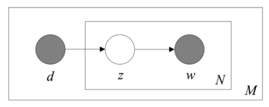

在NLP领域，[PLSA](https://zh.wikipedia.org/wiki/%E6%A6%82%E7%8E%87%E6%BD%9C%E5%9C%A8%E8%AF%AD%E4%B9%89%E5%88%86%E6%9E%90)（Probabilistic Latent Semantic Analysis），即概率隐性语义分析是非常著名的主题模型算法之一。为了能够加深理解，本文将运用EM算法原理来分析推导该模型。

开始之前，再次复习EM算法的流程。

- 输入：观察数据$x=(x_1,x_2,...x_m)$，联合分布$P(x,z;θ)$, 条件分布$P(z\vert x;θ)$, 最大迭代次数$J$。

- 目标函数
  $$
  L(\theta) = \sum\limits_{i=1}^m \log\sum\limits_{z_{i}}P(x_{i}, z_{i};\theta) 
  \\ \theta = arg \max \limits_{\theta}\sum\limits_{i=1}^mL(\theta)
  $$

- 算法：

  1. 随机初始化模型参数$\theta$的初值$\theta^1$。

  2. for $j$  from $1$ to $J$开始EM算法迭代：

     - E步：计算联合分布的条件概率期望：
       $$
       \begin{align}
       Q_i(z_{i}) = P( z_{i}|x_{i};\theta^{j}), \ \ \  \sum\limits_{z_{i}}Q_i(z_{i}) =1
       \\ L(\theta, \theta^{j}) = \sum\limits_{i=1}^m\sum\limits_{z_{i}}Q_i(z_{i})\log \frac {P(x_{i}, z_{i};\theta)} {Q_i(z_{i})} 
       \end{align}
       $$

     - M步：极大化$L(\theta, \theta^{j})$, 得到$\theta^{j+1}$：
       $$
       \theta^{j+1} = arg \max \limits_{\theta}L(\theta, \theta^{j})
       $$

     - 如果$\theta^{j+1}$已收敛，则算法结束。否则继续回到E步进行迭代。

- 输出：模型参数$\theta$。

## 模型

PLSA假定每一篇文档都包含一系列可能的潜在话题，文档中的每一个单词都不是凭空产生的，而是在这些潜在的话题的指引下通过一定的概率生成的。

上图是PLSA的概率图模型表示图。图中的阴影圆圈表示可观测变量（observed variable），非阴影圆圈表示潜在变量（latent variable），箭头表示两变量间的条件依赖性（conditional dependency），方框表示重复抽样，重复次数在方框的右下角。

- $d$代表文章，共有$M $篇文章，$d_m$表示第$m$篇文档；
- $N $代表文章中的单词数， $N_i$代表第$i$篇文章的单词数；
- $w$代表单词，$w_{ij}$表示第$i$篇文章的第$j$个单词；
- $z$是每个单词的潜在的主题分配，$z_{ij} $表示第$i$篇文章的第$j$个单词所属的主题，主题共有$K$ 个，所以$z_{ij} \in \{1, 2, \cdots, K \}$。

GMM（Gaussian Mixture Model） 混合高斯模型也是经典的聚类方法之一。在机器学习、计算机视觉等领域有着广泛的应用。

- 整个分布式由$K$个高斯模型组成，设它们的均值为：$\mu=(\mu_1, \mu_2, \cdots, \mu_K)$，协方差矩阵为$\Sigma=(\Sigma_1, \Sigma_2, \cdots, \Sigma_K)$，则第k个高斯分布的概率密度可以表示为：
  $$
  \mathcal { N } ( \mathrm { x } | \mu_k , \Sigma_k ) = \frac { 1 } { ( 2 \pi ) ^ { D / 2 }  | \Sigma_k |  ^ { 1 / 2 } } \exp \left[ - \frac { 1 } { 2 } ( x - \mu_k ) ^ { T } \Sigma_k  ^ { - 1 } ( x - \mu_k ) \right]
  $$
  其中$D$表示单个样本$x$的维度，$\Sigma_k=\frac 1 m (x-\mu_k)(x-\mu_k)^T $，$\Sigma_k^{-1}$表示协方差矩阵的逆矩阵，

- 整个分布由多个高斯分布**线性**组合而成，$\pi = (\pi_1, \pi_2, \cdots, \pi_K)$表示各个高斯分布的系数（概率），且满足：
  $$
  \sum_{k=1}^K \pi_{k} =1
  $$

- 模型的参数$\theta=(\pi, \mu, \Sigma)$。

- 样本$x = (x_1,x_2,...x_m)$，根据全概率公式，每个样本的概率，可以表示为$K$个高斯分布的组合。
  $$
  P(x_i; \theta)  = \sum _ { k = 1 } ^ { K } \pi _ { k } \mathcal N ( x_i | \mu _ { k } , \Sigma _ { k } )
  $$

- 极大对数似然估计如下：
  $$
  L(\theta) =\sum _ { i = 1 } ^ { m } \log P(x_i; \theta) =\sum _ { i = 1 } ^ { m } \log { \sum _ { k = 1 } ^ { K } \pi _ { k } N ( x _ { i } | \mu _ { k } , \Sigma _ { k } ) }
  $$
  通过极大化$L(\theta)$，来获得对应的模型参数$\theta$，即：
  $$
  \theta = arg \max \limits_{\theta}\sum\limits_{i=1}^mL(\theta)
  $$

- 隐变量设为$z=(z_1,z_2,...z_m)$，表示样本属于某个高斯分布，对于$z_i$，可以有$K$个取值（从$1$到$K$），其对应的概率分布满足。
  $$
  \sum\limits_{z_{i}}Q_i(z_{i}) =1
  $$

## 算法推导

首先，随机初始化模型参数$\theta$的初值$\theta^1= (\pi^1,\mu^1,\Sigma^1)$。然后 for $j$  from $1$ to $J$开始EM算法迭代。还是分为E步和M步。

### E步

E步将计算联合分布的条件概率期望：
$$
\begin{align}
Q_i(z_{i}) &= P( z_{i} \vert x_{i};\theta^{j})
\\ &= \frac {P( z_{i}, x_{i}; \theta^{j})} {P(x_{i}; \theta^{j})}
\end{align}
$$
$$
Q_i(z_{i}=k) =
\frac{\pi _ { k } \mathcal N ( x_i | \mu _ { k } , \Sigma _ { k } )}
{\sum _ { l = 1 } ^ { K } \pi_{ l } \mathcal N ( x_i | \mu _ { l } , \Sigma _ { l } )}
$$

  为了简化表达式，设$z_{ik}$表示$z_{i}=k$，$ \gamma_{ik} = Q_i(z_{i}=k)  $，则：
$$
\begin{align}
       L(\theta, \theta^{j}) = &
       \sum\limits_{i=1}^m\sum\limits_{z_{i}}Q_i(z_{i})\log \frac {P(x_{i},z_{i};\theta)} {Q_i(z_{i})}
       \\ =  &
       \sum\limits_{i=1}^m\sum\limits_{k=1}^K\gamma_{ik}\log \frac {P(x_{i},z_{i}=k;\theta)} {\gamma_{ik}}
       \\ =  &
       \sum\limits_{i=1}^m\sum\limits_{k=1}^K\gamma_{ik}\log \frac {\pi_k\mathcal { N } ( \mathrm { x } | \mu_k , \Sigma_k ) } {\gamma_{ik}}
       \\ =  &
       \sum\limits_{i=1}^m\sum\limits_{k=1}^K\gamma_{ik}\log \frac {\pi_k\frac { 1 } { ( 2 \pi ) ^ { D / 2 }  | \Sigma_k |  ^ { 1 / 2 } } \exp \left[ - \frac { 1 } { 2 } ( x_i - \mu_k ) ^ { T } \Sigma_k  ^ { - 1 } ( x_i - \mu_k ) \right]} {\gamma_{ik}}
       \\ = & 
        \sum\limits_{i=1}^m\sum\limits_{k=1}^K\gamma_{ik} \log\pi_k
        \\ &- \frac { 1 } { 2 }\sum\limits_{i=1}^m\sum\limits_{k=1}^K \gamma_{ik}  ( x_i - \mu_k ) ^ { T } \Sigma_k ^ { - 1 } ( x_i - \mu_k ) 
        \\ & - \frac { 1 } { 2 }\sum\limits_{i=1}^m\sum\limits_{k=1}^K\gamma_{ik} \log |\Sigma_k |  
        \\ & + \sum\limits_{i=1}^m\sum\limits_{k=1}^K\gamma_{ik} \log \frac { 1 } { ( 2 \pi ) ^ { D / 2 }  \gamma_{ik}}   
       \end{align}
$$
由于上面最后一行是常数，在下面求导中，可以忽略。

### M步

M步将极大化$L(\theta, \theta^{j})$, 得到$\theta^{j+1}$：

接下来，分别对$\pi, \mu, \Sigma$分别求导。首先看$\mu$的导数。
$$
\begin{align}
\frac{\partial L(\theta, \theta^{j})}{\partial \mu_k} 
&= \frac{\partial {-\frac { 1 } { 2 }\sum\limits_{i=1}^m \gamma_{ik}  ( x_i - \mu_k ) ^ { T } \Sigma_k  ^ { - 1 } ( x_i - \mu_k )}}{\partial \mu_k} 
\\ &= - 
\sum\limits_{i=1}^m\gamma_{ik}  \Sigma_k ^ {-1 }(  \mu_k - x_i ) 
\\ &  =
\sum\limits_{i=1}^m\gamma_{ik}  \left ( \Sigma_k ^ {-1 }x _i - \Sigma_k ^ {-1 }\mu_k  \right ) 
\end{align}
$$

上面用到了向量求导，公式是：
$$
\frac{\partial  {w}^{T} {B}  {w} } {\partial  {w} } = 
\frac {\partial  {w}^{T} } {\partial  {w} } \cdot {B}  {w} +
\frac {\partial ({B}  {w})^{T} } {\partial  {w} } \cdot  {w}=
({B} + {B}^{T})\cdot  {w}
$$
当$B$是对称矩阵，则$\frac{\partial  {w}^{T} {B}  {w} } {\partial  {w} } = 2  B  w$，所以得出：

$$
\frac{\partial ( x_i - \mu_k ) ^ { T } \Sigma_k ^ { - 1 } ( x_i - \mu_k )}{\partial \mu_k} = 2\Sigma_k ^ { - 1 } ( \mu_k -x_i )
$$
令$\frac{\partial L(\theta, \theta^{j})}{\partial \mu_k}=0$，则：
$$
\begin{align}
     \sum\limits_{i=1}^m\gamma_{ik}  \left ( \Sigma_k ^ {-1 }x_i  - \Sigma_k ^ {-1 }\mu_k  \right ) 
      &= 0
      \\ 
     \Sigma_k ^ {-1 }\sum\limits_{i=1}^m  \left ( \gamma_{ik}  x_i  - \gamma_{ik}\mu_k  \right )   & =0
     \end{align}
$$
由于$\Sigma_k ^ {-1 }$是可逆矩阵，是满秩的，所以下面的公式必然满足。
$$
\begin{align}
 \sum\limits_{i=1}^m\gamma_{ik}  \left (x_i  - \gamma_{ik}\mu_k  \right )    &=0
 \\ \mu_k &= \frac {\sum\limits_{i=1}^m\gamma_{ik}  x_i} {\sum\limits_{i=1}^m\gamma_{ik}} 
 \end{align}
$$
下面再来看$\pi$的导数。由于$\sum_{k=1}^K \pi_{k} =1$，需要构建[拉格朗日乘数](https://zh.wikipedia.org/zh-hans/%E6%8B%89%E6%A0%BC%E6%9C%97%E6%97%A5%E4%B9%98%E6%95%B0)。即：
$$
R(\pi) = L(\theta, \theta^{j}) + \beta(\sum_{k=1}^K \pi_{k}-1)
$$
令$\frac{\partial R(\pi) }{\partial \pi_k}=0$，则：
$$
\begin{align}
\frac{\partial R(\pi) }{\partial \pi_k} &=0
\\ \frac{\partial  \sum\limits_{i=1}^m\gamma_{ik} \log\pi_k }{\partial \pi_k} + \beta &= 0
\\ \frac {\sum\limits_{i=1}^m\gamma_{ik}} {\pi_k}  + \beta &=0
\\ \pi_k &=  \frac {\sum\limits_{i=1}^m\gamma_{ik}} {-\beta}  \tag 2
\end{align}
$$
由于$\sum_{k=1}^K \pi_{k} =1$和$\sum_{k=1}^K \gamma_{ik} = 0$，可得：
$$
\begin{align}
\sum_{k=1}^K  \pi_k &=  \sum_{k=1}^K  \frac {\sum\limits_{i=1}^m\gamma_{ik}} {-\beta}
\\ -\beta &=   \sum\limits_{i=1}^m \sum_{k=1}^K\gamma_{ik}
\\ \beta &= - m
\end{align}
$$
把上面公式带入公式$(2)$，可得：
$$
\pi_k =  \frac 1  {m}  \sum\limits_{i=1}^m\gamma_{ik}
$$

最后再来对$\Sigma$的导数，令$\frac{\partial L(\theta, \theta^{j})}{\partial \Sigma_k}=0$。
$$
\begin{align}
\frac{\partial L(\theta, \theta^{j})}{\partial \Sigma_k} &= 
- \frac { 1 } { 2 } \frac {\partial \sum\limits_{i=1}^m \gamma_{ik}  ( x_i - \mu_k ) ^ { T } \Sigma_k ^ { - 1 } ( x_i - \mu_k )} { \Sigma_k}  - \frac { 1 } { 2 }\frac {\partial\sum\limits_{i=1}^m\gamma_{ik} \log |\Sigma_k |   } {\Sigma_k}
\\ &= 
- \frac { 1 } { 2 }
 \sum\limits_{i=1}^m \gamma_{ik}  \left (  \frac {\partial   ( x_i - \mu_k ) ^ { T } \Sigma_k ^ { - 1 } ( x_i - \mu_k )} { \Sigma_k}  + \frac {\partial \log |\Sigma_k |   } {\Sigma_k}
\right )   \tag 3
\end{align}
$$
根据公式
$$
\frac {\partial |X|} {\partial X} = |X|(X^{-1})^T\\
\frac {\partial a^TX^{-1}b} {\partial X} = -(X^{-1})^T ab^T(X^{-1})^T
$$

> 目前还没有找到证明上面公式的方法，以后再添加吧。

把上面两个公式带入公式$(3)$，可得：
$$
\begin{align}
\frac{\partial L(\theta, \theta^{j})}{\partial \Sigma_k} &= 
- \frac { 1 } { 2 }
 \sum\limits_{i=1}^m \gamma_{ik}  \left (  
-(\Sigma_k^{-1})^T ( x_i - \mu_k )( x_i - \mu_k )^T (\Sigma_k^{-1})^T + \frac 1 {|X|}|X|(\Sigma_k^{-1})^T
\right )  
\\ & = \frac { 1 } { 2 } \sum\limits_{i=1}^m \gamma_{ik}  \left (  
(\Sigma_k^{-1})^T ( x_i - \mu_k )( x_i - \mu_k )^T -I
\right )  (\Sigma_k^{-1})^T
\end{align}
$$
令$\frac{\partial L(\theta, \theta^{j})}{\partial \Sigma_k}=0$，而且由于$\Sigma_k$是对称矩阵，其逆也是对称矩阵，即$\Sigma_k^{-1}=(\Sigma_k^{-1})^T$，可以推得：
$$
\begin{align}
 \sum\limits_{i=1}^m \gamma_{ik} 
 \left (
 (\Sigma_k^{-1})^T ( x_i - \mu_k )( x_i - \mu_k )^T -I  
 \right ) 
 &=  0 
 \\ 
 \sum\limits_{i=1}^m \gamma_{ik} \Sigma_k^{-1}( x_i - \mu_k )( x_i - \mu_k )^T &= I \sum\limits_{i=1}^m \gamma_{ik} 
\\ 
 \sum\limits_{i=1}^m \gamma_{ik}( x_i - \mu_k )( x_i - \mu_k )^T &=  \Sigma_k  \sum\limits_{i=1}^m \gamma_{ik}
\end{align}
$$
最终求得：
$$
\Sigma_k = \frac {\sum\limits_{i=1}^m \gamma_{ik}( x_i - \mu_k )( x_i - \mu_k )^T} { \sum\limits_{i=1}^m \gamma_{ik}}
$$
这样所有的参数完成了一次迭代，然后返回E步进行下一轮迭代。

### 总结

对上面的流程再进行一下简化，可以得到算法流程如下。

1. 随机初始化模型参数$\theta$的初值$\theta^1= (\pi^1,\mu^1,\Sigma^1)$。

2. for $j$  from $1$ to $J$开始EM算法迭代：

   - E步：
     $$
     \begin{align}
     \gamma_{ik}^j =& \frac{\pi _ { k }^j \mathcal N ( x_i | \mu _ { k }^j , \Sigma _ { k }^j )}
     {\sum _ { l = 1 } ^ { K } \pi_{ l }^j \mathcal N ( x_i | \mu _ { l }^j , \Sigma _ { l } )^j} \\
       L(\theta, \theta^{j}) = & 
             \sum\limits_{i=1}^m\sum\limits_{k=1}^K\gamma_{ik} \log\pi_k
             \\ &- \frac { 1 } { 2 }\sum\limits_{i=1}^m\sum\limits_{k=1}^K \gamma_{ik}  ( x - \mu_k ) ^ { T } \Sigma_k ^ { - 1 } ( x_i - \mu_k ) 
             \\ & + \sum\limits_{i=1}^m\sum\limits_{k=1}^K\gamma_{ik} \log \frac { 1 } { ( 2 \pi ) ^ { D / 2 }  | \Sigma_k |  ^ { 1 / 2 } \gamma_{ik}}   
            \end{align}
     $$
     
   - M步：极大化$L(\theta, \theta^{j})$，$\theta^{j+1}=(\pi^{j+1},\mu^{j+1},\Sigma^{j+1})$，各个参数分别如下：
     $$
     \begin{align}
     \pi_k^{j+1} &=  \frac 1  {m}  \sum\limits_{i=1}^m\gamma_{ik}^j  \\
     \mu_k^{j+1} &= \frac {\sum\limits_{i=1}^m\gamma_{ik}^j  x_i} {\sum\limits_{i=1}^m\gamma_{ik}^j}  \\
     \Sigma _ { k }^{j+1} &= \frac  {\sum\limits_{i= 1 }^{m} \gamma_{ik}^j \left( x _ { i } - \mu _ { k }^j \right) \left( x _ { i } - \mu _ { k }^j \right) ^ { T }} {{\sum\limits_{i=1}^m\gamma_{ik}^j} }
     \end{align}
     $$

## 参考

- [EM算法原理及其应用](https://vividfree.github.io/docs/2016-08-19-introduction-about-EM-algorithm-doc1.pdf)
- [EM算法理解的九层境界](https://www.zhihu.com/question/40797593/answer/275171156)
- [wiki: 概率潜在语义分析(PLSA)](https://zh.wikipedia.org/wiki/%E6%A6%82%E7%8E%87%E6%BD%9C%E5%9C%A8%E8%AF%AD%E4%B9%89%E5%88%86%E6%9E%90)
- [NLP —— 图模型（三）pLSA（Probabilistic latent semantic analysis，概率隐性语义分析）模型](https://www.cnblogs.com/Determined22/p/7237111.html)
- 

