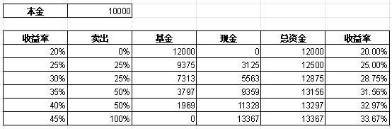
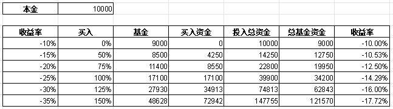

LDA可以挖掘文档的主题分布，对文档进行分组。

一个语料库中有很多文档，一个文档中有很多word。统计学家总是假设这个语料库背后其实有一个模型，使用这个模型可以生成语料库中所有的文档。

## 从最大似然到贝叶斯

## Unigram Model

下面回到我们要解决的问题。Unigram Model假设所有单词的产生都

### 最大似然估计

### 贝叶斯估计

## Topic Model

### PLSA

### LDA

## 参考

- [LDA数学八卦：文本建模（1）](https://link.zhihu.com/?target=http%3A//mp.weixin.qq.com/s%3F__biz%3DMjM5ODkzMzMwMQ%3D%3D%26mid%3D401248275%26idx%3D1%26sn%3Dead133a605152a8c8be4a0b747fe3c20%26scene%3D21%23wechat_redirect)

- [LDA数学八卦：文本建模（2）](https://link.zhihu.com/?target=http%3A//mp.weixin.qq.com/s%3F__biz%3DMjM5ODkzMzMwMQ%3D%3D%26mid%3D401272094%26idx%3D1%26sn%3D62c6f892896160605fdfa93a129d4490%26scene%3D21%23wechat_redirect)

### 资金分配方案：

- 资金池1：50%
  - 长期理财（大于3个月） $\ge$ 30% 。预估年收益：4.x%。
  - 黄金白银 $\le$20%。预估年收益：-5%~10%
- 资金池2：50%
  - 短期理财（小于等于3个月） $\ge$10%。 预估年收益：2%~3%
  - 股票基金 $\le$ 40%。 预估年收益：-10%~20%

### 交易规则：

1. 每两周，保证`资金池1`的资金严格等于`资金池2`资金。

   比如，两周内，股票基金赚了20%的钱，这样`资金池2`的资金会比`资金池1`多，这样就要求把`资金池2`的多出的资金转一半到`资金池1`。这时有两种方法。

   - 把股票基金卖掉一部分，把多出来资金转到`资金池1`
   - 把活期理财转一部分资金到`资金池1`

   如果股票基金亏了，也要反向操作。

2. 如果有新的资金汇入（比如：工资），一半进入`资金池1`，另外一半进入`资金池2`。反正，如果有资金汇出，也是相同规则抽取。

3. 对于`资金池1`

   - 长期理财必须$\ge$ 30%。长期理财不能少于30%
   - 黄金白银 $\le$20%。如果黄金白银赚钱了，超过了20%的比例，每两周，需要把多出来的钱，转到长期理财或者`资金池2`。

4. 对于`资金池2`

   - 短期理财$\ge$10%。长期理财不能少于10%
   - 股票基金 $\le$ 40%。如果股票基金赚钱了，并超过了40%的比例，每两周，需要把多出来的钱，转到短期理财或者`资金池1`。

### 基金操作策略

1. 常规买卖策略。每一周，做如下操作。
   - 当基金赚了20%的钱之后，然后每涨5%，做如下操作

     

   - 当基金亏了10%的钱之后，然后每跌5%，做如下操作

     

