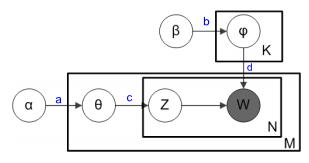
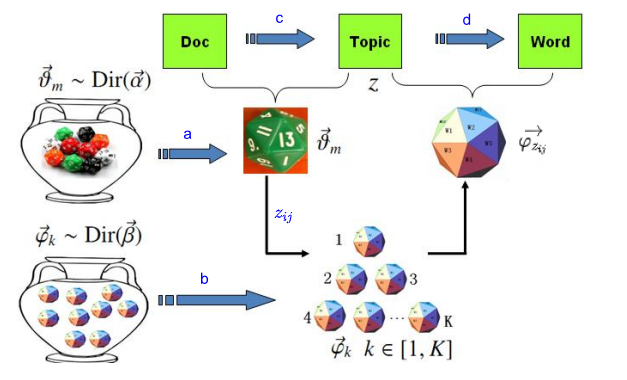

在NLP领域，LDA（Latent Dirichlet Allocation）是非常著名的算法，它是由[David M. Blei](http://www.cs.columbia.edu/~blei/)、[Andrew Ng](https://zh.wikipedia.org/wiki/吴恩达)和[Michael I. Jordan](https://zh.wikipedia.org/wiki/迈克尔·乔丹_(学者))于2003年提出。

LDA算法在文本主题识别、文本分类以及文本相似度计算方面得到广泛的运用，同时它也有很深刻的数学背景，所以非常值得大家进行深入的学习。它有如下特点：

- 它是一个主题模型。它将每篇文档的主题以概率分布的形式给出。
- 它是一个无监督模型，不需要人工标记书，所以该算法得到广泛的运用。
- 它是一个生成模型。 它假定每篇文章中的每个词是由背后的一个潜在的主题中抽取出来：

## 模型概述

上图是LDA的概率图模型表示图。图中的阴影圆圈表示可观测变量（observed variable），非阴影圆圈表示潜在变量（latent variable），箭头表示两变量间的条件依赖性（conditional dependency），方框表示重复抽样，重复次数在方框的右下角。

- $M $代表训练语料中的文章数；
- $K$ 代表主题数量；
- $V $代表训练语料中的所有单词数，
- $N $代表文章中的单词数， $N_i$代表第$i$篇文章的单词数；
- $\theta $是一个$M\times K$ 的矩阵， $ {\theta}_m$代表第$m$篇文章的主题分布；
- $\varphi$ 是一个$K \times V $的矩阵，$ {\varphi}_k$代表编号为 $k$的主题之上的词分布；
- $\alpha $ 是每篇文档的主题分布的先验分布Dirichlet 分布的参数，其中$ \theta_i \sim  Dir( \alpha)$；
- $\beta$是每个主题的词分布的先验分布Dirichlet 分布的参数，其中$ \varphi_k \sim  Dir( \beta)$；
- $w$是可被观测的词，$w_{ij}$表示第$i$篇文章的第$j$个单词；
- $z$是每个对于被观测的词的潜在的主题分配，$z_{ij} $表示第$i$篇文章的第$j$个单词所属的主题。

整个生成过程如下：

- a. 生成$ \theta_m  \sim  Dir( \alpha)$，其中$i \in \{1,2, \cdots, M\}$；
- b. 生成$ \varphi_k \sim  Dir( \beta)$，其中$k \in \{1,2, \cdots, K\}$；
- 生成第$i$篇文章的第$j$个单词，其中$i \in \{1, 2, \cdots, M\} , j \in \{1, 2, \cdots, N_i\}$：
  - c. 从多项分布$Multinomial(\theta_i)$取样，获得一个topic主题$z_{ij} $。
  - d. 从多项分布$ Multinomial(\varphi_{z_{ij}})$取样，获得一个单词$w_{ij} $。

为了更加形象的理解，可以把整个过程看成是扔色子。

- $a$过程：根据$Dir( \alpha)$分布，生成$M$个文章的主题色子，每个色子有$K$个面；
- $b$过程：根据$Dir( \beta)$分布，生成$K$个主题的单词色子，每个色子有$V$个面；
- $c$过程：对于每一个单词，投掷其所在文章对应的色子，获得一个主题$z_{ij}$；
- $d$过程：通过$z_{ij}$获得一个单词色子，然后投掷，获得一个单词。

### 联合概率

由于，$ w$和$\alpha$相互独立，$ \beta$和$z $相互独立，可以得到下面的联合分布。
$$
\begin{align}
p( w,  z\vert  \alpha, \beta) &=  p( w \vert  z, \alpha, \beta) p( z \vert  \alpha, \beta)  
\\ & = p( w \vert  z,   \beta)p( z \vert   \alpha ) \tag 1
\end{align}
$$
$$
p( w \vert  z,   \beta)  =\int p(w \vert z, \varphi) p(\varphi \vert \beta) d \varphi \tag 2
$$

$$
p( z \vert   \alpha ) = \int p(z \vert \theta) p(\theta \vert \alpha) d \theta  \tag 3
$$

其中公式$(3)$代表的过程是：
$$
\alpha \rightarrow \theta_m \rightarrow z_{i,j}
$$
其中公式$(2)$代表的过程是：
$$
\beta \rightarrow \varphi_k  \rightarrow w_{i,j} \leftarrow z_{i,j}
$$
下面首先看公式$(2)$中的$ p(w \vert z, \varphi) $，由于任意一个单词，根据其文章所在主题分布，可以获得一个主题，然后根据主题，可以获得该单词在该主题下的概率，从而得到：
$$
\begin{align}
 p(w \vert z, \varphi) 
 &  = \prod\limits_{k=1}^K \prod\limits_{t=1}^{V} \varphi_{k, t}^{n_{k, t}}   \tag 4
\end{align}
$$
其中$\varphi_{k, t}$表示第$t$个单词在第$k$个主题中的概率，$n_{k, t} $表示第$t$个单词在第$k$个主题出现的次数。下面来看$p(\varphi \vert \beta) $。
$$
\begin{align}
p(\varphi \vert \beta) 
 &  = \prod\limits_{k=1}^K p(\varphi_k \vert \beta)
\\ &  = 
\prod\limits_{k=1}^K  Dirichlet(\varphi_k|  \beta) 
\\ &  = \prod\limits_{k=1}^K \left ( \frac 1 {\triangle(\beta)}
\prod\limits_{t=1}^V\varphi_{k,t}^{\beta_t-1}  \right ) \tag 5
\end{align}
$$

其中$ \triangle(\beta) = \frac {\prod\limits_{t=1}^V\Gamma(\beta_t)} {\Gamma(\sum\limits_{t=1}^V\beta_t)}$。把公式$(4)$和公式$(5)$带入公式$(2)$，可得：
$$
\begin{align}
p( w \vert  z,   \beta)  &=\int p(w \vert z, \varphi) p(\varphi \vert \beta) d \varphi 
\\ & = 
\int \prod\limits_{k=1}^K \prod\limits_{t=1}^{V} \varphi_{k, t}^{n_{k, t}}      \prod\limits_{k=1}^K \left ( \frac 1 {\triangle(\beta)}
\prod\limits_{t=1}^V\varphi_{k,t}^{\beta_t-1}  \right )    d \varphi_k
\\ & = 
\int \prod\limits_{k=1}^K \frac 1 {\triangle(\beta)} 
 \prod\limits_{t=1}^{V}  \varphi_{k, t}^{n_{k, t}+\beta_t-1}       d \varphi_k
\\ & = 
\prod\limits_{k=1}^K \frac 1 {\triangle(\beta)} 
\int \prod\limits_{t=1}^{V}  \varphi_{k, t}^{n_{k, t}+\beta_t-1}       d \varphi_k
\\ & = 
\prod\limits_{k=1}^K \frac {\triangle(n_k +\beta)} {\triangle(\beta)} 
\int \frac 1 {\triangle(n_k +\beta)} \prod\limits_{t=1}^{V}  \varphi_{k, t}^{n_{k, t}+\beta_t-1}       d \varphi_k
\end{align}
$$
由于 $\int \frac 1 {\triangle(n_k +\beta)} \prod\limits_{t=1}^{V}  \varphi_{k, t}^{n_{k, t}+\beta_t-1}       d \varphi =1 $，可得：
$$
\begin{align}
p( w \vert  z,   \beta)  & = 
\prod\limits_{k=1}^K \frac {\triangle(n_k +\beta)} {\triangle(\beta)} 
\tag 6
\end{align}
$$
同理的方式，我们可以计算公式$(3)$：
$$
\begin{align}
p( z \vert   \alpha ) &= \int p(z \vert \theta) p(\theta \vert \alpha) d \theta 
\\ & = 
\int \underbrace{\prod\limits_{m=1}^M \prod\limits_{k=1}^{K} \theta_{m,k}^{n_{m, k}}}_{p(z \vert \theta) }    \ \ \underbrace{ \prod\limits_{m=1}^M \left ( \frac 1 {\triangle(\alpha)}
\prod\limits_{k=1}^{K}\theta_{m,k}^{\alpha_k-1}  \right ) }_{p(\theta \vert \alpha)}   d \theta_m 
\\ & = 
\int \prod\limits_{m=1}^M  \frac 1 {\triangle(\alpha)} 
\prod\limits_{k=1}^{K}  \theta_{m,k}^{n_{m, k}+\alpha_k-1}       d \theta_m
\\ & = 
\prod\limits_{m=1}^M \frac 1 {\triangle(\alpha)} 
\int \prod\limits_{k=1}^{K}  \theta_{m,k}^{n_{m, k}+\alpha_k-1}       d \theta_m
\\ & = 
\prod\limits_{m=1}^M  \frac {\triangle(n_m +\alpha)} {\triangle(\alpha)} 
\underbrace{ \int \frac 1 {\triangle(n_m +\alpha)} \prod\limits_{k=1}^{K}  \theta_{m,k}^{n_{m, k}+\alpha_k-1}       d \theta_m}_{=1}
\\ & =
\prod\limits_{m=1}^M  \frac {\triangle(n_m +\alpha)} {\triangle(\alpha)} 
\tag 7
\end{align}
$$
其中

- $\theta_{m, k}$表示第$k$个主题在第$m$个文章中的概率
- $n_{m, k} $表示第$k$个主题在第$m$个文章中的出现的次数（即该文档下有多少个词被分配到主题$k$）。

接下来把公式$(6)$,$(7)$带入公式$(1)$。
$$
\begin{align}
p( w,  z\vert  \alpha, \beta)  & = p( w \vert  z,   \beta)p( z \vert   \alpha ) 
\\ & = 
\prod\limits_{k=1}^K 
\frac {\triangle(n_k +\beta)} {\triangle(\beta)}  \cdot
\prod\limits_{m=1}^M 
\frac {\triangle(n_m +\alpha)} {\triangle(\alpha)}  \tag 8
\end{align}
$$
其中

- $n_k$指第$k$个主题的单词分布
  $$
  n_k = \{n_{k1}, n_{k2}, \cdots, n_{kt},  \cdots, n_{kV}\}
  $$
  $n_{k, t} $表示第$t$个单词被分配到第$k$个主题的次数。

- $n_m$指第$m$个文章的主题分布
  $$
  n_m = \{n_{m1}, n_{m2}, \cdots, n_{mk},  \cdots, n_{mK}\}
  $$
  $n_{m, k} $表示第$k$个主题在第$m$个文章中的出现的次数（即该文章下有多少个词被分配到主题$k$）。

## 预备知识

### Beta分布和

## 从最大似然到贝叶斯

## Unigram Model

下面回到我们要解决的问题。Unigram Model假设所有单词的产生都

### 最大似然估计

### 贝叶斯估计

## Topic Model

### PLSA

### LDA

## 参考

- [Latent Dirichlet Allocation漫游指南](https://arxiv.org/ftp/arxiv/papers/1908/1908.03142.pdf)

- [LDA数学八卦](https://bloglxm.oss-cn-beijing.aliyuncs.com/lda-LDA%E6%95%B0%E5%AD%A6%E5%85%AB%E5%8D%A6.pdf)

- [Paper: Latent Dirichlet Allocation](https://www.jmlr.org/papers/volume3/blei03a/blei03a.pdf)

- [LDA学习笔记(4) – Gibbs Sampling 推导](https://carlhwang1989.wordpress.com/2015/02/18/lda%E5%AD%A6%E4%B9%A0%E7%AC%94%E8%AE%B04-2/)

- [自然语言处理之LDA主题模型](https://www.cnblogs.com/jiangxinyang/p/9358339.html)

  

