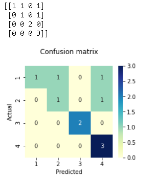

confusion_matrix的例子。

~~~python
import matplotlib.pyplot as plt
import numpy as np
import pandas as pd
import seaborn as sns

from sklearn.metrics import confusion_matrix

def plot_confusion_matrix(labels, preds):
    plt.figure(figsize=(3.5, 3))
    cm = confusion_matrix(labels, preds)
    print(cm)
    df_cm = pd.DataFrame(cm, index=range(1, 5), columns=range(1, 5))
    plt.title("Confusion matrix\n")
    sns.heatmap(df_cm, annot=True, fmt="d", cmap="YlGnBu")
    plt.xlabel("Predicted")
    plt.ylabel("Actual")
    
    plt.show()
    
preds = [1, 2, 2, 4, 3, 3, 4, 4, 4, 4]
labels = [1, 1, 2, 2, 3, 3, 4, 4, 1, 4]

plot_confusion_matrix(labels, preds)
~~~

