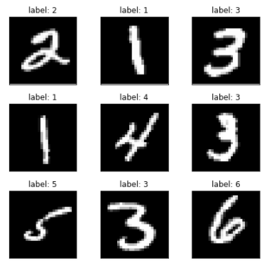
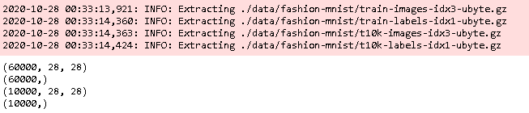
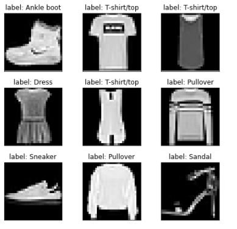
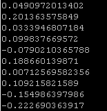
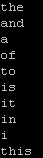
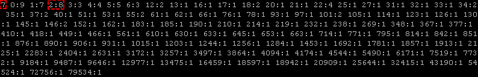
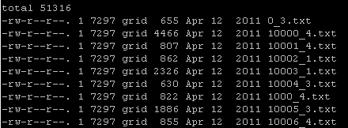
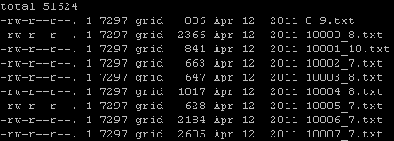
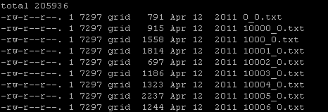

本文主要介绍一些常用的数据集，并采用python代码来获取它们。不定期更新中。

## MNIST

[MNIST](http://yann.lecun.com/exdb/mnist/)（Mixed National Institute of Standards and Technology）数据集是著名的手写数字数据集，被誉为数据科学领域的`果蝇`。

数据分为四部分。

| 数据文件                                                     | 描述         | 数据量 |
| ------------------------------------------------------------ | ------------ | ------ |
| [train-images-idx3-ubyte.gz](http://yann.lecun.com/exdb/mnist/train-images-idx3-ubyte.gz) | training图片 | 60,000 |
| [train-labels-idx1-ubyte.gz](http://yann.lecun.com/exdb/mnist/train-labels-idx1-ubyte.gz) | training标签 | 60,000 |
| [t10k-images-idx3-ubyte.gz](http://yann.lecun.com/exdb/mnist/t10k-images-idx3-ubyte.gz) | training图片 | 10,000 |
| [t10k-labels-idx1-ubyte.gz](http://yann.lecun.com/exdb/mnist/t10k-labels-idx1-ubyte.gz) | training标签 | 10,000 |

其中每张图片由$28 \times 28$ 个像素点构成，每个像素点用一个灰度值($0-255$)表示。

### 数据下载

~~~python
import gzip
import logging
import os
import six.moves.urllib as urllib

logging.basicConfig(format='%(asctime)s: %(levelname)s: %(message)s')
logging.root.setLevel(level=logging.INFO)

def mnist_download(target_path, source_url='http://yann.lecun.com/exdb/mnist', http_proxy=None):
    if http_proxy is not None:
        proxy_handler = urllib.request.ProxyHandler({'http': http_proxy, 'https': http_proxy})
        opener = urllib.request.build_opener(proxy_handler)
    else:
        opener = urllib.request.build_opener()

    urllib.request.install_opener(opener)

    def maybe_download(file_name):
        if not os.path.exists(target_path):
            os.mkdir(target_path)
        file_path = os.path.join(target_path, file_name)
        if not os.path.exists(file_path):
            source_file_url = os.path.join(source_url, file_name)
            logging.info(source_file_url)
            filepath, _ = urllib.request.urlretrieve(source_file_url, file_path)
            statinfo = os.stat(filepath)
            logging.info('Successfully downloaded {} {} bytes.'.format(file_name, statinfo.st_size))
        return file_path

    train_data_path= maybe_download('train-images-idx3-ubyte.gz')
    train_label_path = maybe_download('train-labels-idx1-ubyte.gz')
    test_data_path= maybe_download('t10k-images-idx3-ubyte.gz')
    test_label_path = maybe_download('t10k-labels-idx1-ubyte.gz')
    return train_data_path, train_label_path, test_data_path, test_label_path

local_path = os.path.join('.', 'data/mnist')
train_data_path, train_label_path, test_data_path, test_label_path = mnist_download(local_path)
~~~

### 读取数据

下面抽取其中的label和data。

~~~python
def extract_label(file_path, num_images):
    """
    Extract the labels into a vector of label IDs.
    """

    logging.info('Extracting {}'.format(file_path))
    with gzip.open(file_path) as bytestream:
        bytestream.read(8)
        buf = bytestream.read(1 * num_images)
        labels = np.frombuffer(buf, dtype=np.uint8).astype(np.int64)
        return labels
    
def extract_data(file_path, num_images, normalize=False):
    """输出格式为3D Array[image index, height, width].

    对于同一MNIST, 其channel为1. 如果normalize为True，图片的灰度值从[0, 255]转换到[-0.5, 0.5].
        """
    image_size = 28
    pixel_depth = 255

    logging.info('Extracting {}'.format(file_path))
    with gzip.open(file_path) as bytestream:
        # Skip the magic number and dimensions; we know these values.
        bytestream.read(16)

        buf = bytestream.read(image_size * image_size * num_images)
        data = np.frombuffer(buf, dtype=np.uint8).astype(np.float32)
        if normalize: data = data/pixel_depth - 0.5
        data = data.reshape(num_images, image_size, image_size)
        return data
    

train_data = extract_data(train_data_path, 60000)
train_label = extract_label(train_label_path, 60000)
test_data = extract_data(test_data_path, 10000) 
test_label = extract_label(test_label_path, 10000)

print(train_data.shape)
print(train_label.shape)
print(test_data.shape)
print(test_label.shape)
~~~

显示其中的图片。

~~~python
plt.figure(figsize=(6,6))
for i in range(9):
    plt.subplot(3,3,i+1)
    plt.tight_layout()
    plt.imshow(train_data[i+5], cmap='gray', interpolation='none')
    plt.title("label: {}".format(train_label[i+5]))
    plt.xticks([])
    plt.yticks([])
~~~

## Fashion MNIST

[Fashion-MNIST](https://github.com/zalandoresearch/fashion-mnist)是一个替代MNIST手写数字集的图像数据集。 它是由Zalando（一家德国的时尚科技公司）旗下的研究部门提供，它其涵盖了来自10种类别的共7万个不同商品的正面图。Fashion-MNIST完全克隆了MNIST的所有外在特征。

- 60000张训练图像和对应Label

- 10000张测试图像和对应Label

- 10个类别

  | Label |    Description     |
  | :---: | :----------------: |
  |   0   | T恤（T-shirt/top） |
  |   1   |  裤子（Trouser）   |
  |   2   | 套头衫（Pullover） |
  |   3   |  连衣裙（Dress）   |
  |   4   |    外套（Coat）    |
  |   5   |   凉鞋（Sandal）   |
  |   6   |   衬衫（Shirt）    |
  |   7   | 运动鞋（Sneaker）  |
  |   8   |     包（Bag）      |
  |   9   | 靴子（Ankle boot） |

- 每张图像28x28的分辨率，每个像素点用一个灰度值($0-255$)表示

- 4个GZ文件名称都一样

  | 数据文件                                                     | 描述         | 数据量 |
  | ------------------------------------------------------------ | ------------ | ------ |
  | [train-images-idx3-ubyte.gz](http://yann.lecun.com/exdb/mnist/train-images-idx3-ubyte.gz) | training图片 | 60,000 |
  | [train-labels-idx1-ubyte.gz](http://yann.lecun.com/exdb/mnist/train-labels-idx1-ubyte.gz) | training标签 | 60,000 |
  | [t10k-images-idx3-ubyte.gz](http://yann.lecun.com/exdb/mnist/t10k-images-idx3-ubyte.gz) | training图片 | 10,000 |
  | [t10k-labels-idx1-ubyte.gz](http://yann.lecun.com/exdb/mnist/t10k-labels-idx1-ubyte.gz) | training标签 | 10,000 |

Fashion-MNIST出现的原因之一是，MNIST太简单了。虽然MNIST被誉为数据科学领域的`果蝇`，但目前很多算法都能在其测试集上取得99.6%的超高准确率。

### 数据下载

的确不愧是MNIST的替代，只要设置source_url到新的地址，就可以下载了。

~~~python
local_path = os.path.join('.', 'data/fashion-mnist')
train_data_path, train_label_path, test_data_path, test_label_path = mnist_download(local_path, source_url='http://fashion-mnist.s3-website.eu-central-1.amazonaws.com')
~~~

### 读取数据

同样可以调用上文MNIST中的方法。

~~~python
train_data = extract_data(train_data_path, 60000)
train_label = extract_label(train_label_path, 60000)
test_data = extract_data(test_data_path, 10000) 
test_label = extract_label(test_label_path, 10000)

print(train_data.shape)
print(train_label.shape)
print(test_data.shape)
print(test_label.shape)
~~~

显示其中的图片。

~~~python
labels = ['T-shirt/top', 'Trouser', 'Pullover', 'Dress', 'Coat', 'Sandal',
           'Shirt', 'Sneaker', 'Bag', 'Ankle boot']

plt.figure(figsize=(9,9))
for i in range(9):
    plt.subplot(3,3,i+1)
    plt.tight_layout()
    plt.imshow(train_data[i], cmap='gray', interpolation='none')
    plt.title("label: {}".format(labels[train_label[i]]))
    plt.xticks([])
    plt.yticks([])
~~~

## CIFAR10

[CIFAR-10](https://www.cs.toronto.edu/~kriz/cifar.html)数据集由10类32x32的彩色图片组成，一共包含60000张图片，每一类包含6000图片。其中50000张图片作为训练集，10000张图片作为测试集。

CIFAR-10数据集被划分成了5个训练的batch和1个测试的batch，每个batch均包含10000张图片。测试集batch的图片是从每个类别中随机挑选的1000张图片组成的,训练集batch以随机的顺序包含剩下的50000张图片。所有这些数据保存在一个压缩文件里，下载地址是：https://www.cs.toronto.edu/~kriz/cifar-10-python.tar.gz。

### 数据下载

~~~python
import logging
import os
import tarfile
import six.moves.urllib as urllib

logging.basicConfig(format='%(asctime)s: %(levelname)s: %(message)s')
logging.root.setLevel(level=logging.INFO)

def cifar10_download_and_extract(target_path, source_url="https://www.cs.toronto.edu/~kriz", http_proxy=None):
    if http_proxy is not None:
        proxy_handler = urllib.request.ProxyHandler({'http': http_proxy, 'https': http_proxy})
        opener = urllib.request.build_opener(proxy_handler)
    else:
        opener = urllib.request.build_opener()

    urllib.request.install_opener(opener)

    def maybe_download(file_name):
        if not os.path.exists(target_path):
            os.mkdir(target_path)
        file_path = os.path.join(target_path, file_name)
        if not os.path.exists(file_path):
            source_file_url = os.path.join(source_url, file_name)
            logging.info(source_file_url)
            filepath, _ = urllib.request.urlretrieve(source_file_url, file_path)
            statinfo = os.stat(filepath)
            logging.info('Successfully downloaded {} {} bytes.'.format(file_name, statinfo.st_size))
        return file_path
    
    tar_gz_file = 'cifar-10-python.tar.gz'
    data_path= maybe_download(tar_gz_file)
    
    # extract the tar.gz file
    extract_path = os.path.join(target_path, "cifar-10-batches-py")
    logging.info("extract {} to {}".format(tar_gz_file, extract_path))
    with tarfile.open(data_path, 'r:gz') as tar:        
        tar.extractall(path=target_path)
    return extract_path

local_path = os.path.join('.', 'data/cifar10')
data_path = cifar10_download_and_extract(local_path)
~~~

下载并解压后，其目录结构如下。其中batch 1-5是5个训练数据集，而test_batch是测试数据集。

### 读取数据

~~~python
def extract_data_label(files):
    data = []
    label = []    
    for file in files:
        with open(file, 'rb') as fo:
            entry = pickle.load(fo, encoding='latin1')
        data.append(entry['data'])
        label.extend(entry['labels'])
 
    data = np.vstack(data)
    data = data.reshape(-1, 3, 32, 32)
    data = data.transpose((0, 2, 3, 1))   
    label = np.array(label)
    return data, label

train_files = ['data_batch_1', 'data_batch_2', 'data_batch_3', 'data_batch_4', 'data_batch_5']
train_files = [ os.path.join(data_path, file)  for file in train_files]
test_files = [ os.path.join(data_path, 'test_batch')]

train_data, train_label = extract_data_label(train_files)
test_data, test_label = extract_data_label(test_files)

print(train_data.shape)
print(train_label.shape)
print(test_data.shape)
print(test_label.shape)
~~~

显示其中的图片。

~~~python
plt.rcParams['figure.figsize'] = (10.0, 6.0) 
classes = ('plane', 'car', 'bird', 'cat', 'deer', 'dog', 'frog', 'horse', 'ship', 'truck')

for i in range(15):
    plt.subplot(3,5,i+1)
    plt.tight_layout()
    plt.imshow(train_data[i])
    plt.title("label: {}".format(classes[train_label[i]]))
    plt.xticks([])
    plt.yticks([])
~~~

## IMDb : Large Movie Review Dataset

**IMDb**（Internet Movie Datebase ）是全球最大的互联网影视数据库，而[Large Movie Review Dataset](https://ai.stanford.edu/~amaas/data/sentiment/) 是一个根据IMDB上电影评论而建立的数据集。它由斯坦福大学于 2011 年发布，相关论文有[Learning Word Vectors for Sentiment Analysis](https://ai.stanford.edu/~ang/papers/acl11-WordVectorsSentimentAnalysis.pdf)。

Large Movie Review Dataset包括 50,000 条标记情感的电影评论，其中正面（positive）和负面（negative）的数量各半，然后这些数据又被均匀的分为训练数据和测试数据。此外，它还有 50,000 条未标记情感的评论。在数据集中，每个电影的评论数不超过30条。需要注意的是，每一条标记情感的评论是极端正面或极端负面的，不包括中立的评论。规则如下。

- $score \le 4$：负面评论
- $score \ge 7$：正面评论

数据集下载地址是https://ai.stanford.edu/~amaas/data/sentiment/aclImdb_v1.tar.gz

### 数据下载

~~~python
import gzip
import logging
import os
import tarfile
import six.moves.urllib as urllib

logging.basicConfig(format='%(asctime)s: %(levelname)s: %(message)s')
logging.root.setLevel(level=logging.INFO)

def lmrd_download_and_extract(target_path, source_url='https://ai.stanford.edu/~amaas/data/sentiment/', http_proxy=None):
    if http_proxy is not None:
        proxy_handler = urllib.request.ProxyHandler({'http': http_proxy, 'https': http_proxy})
        opener = urllib.request.build_opener(proxy_handler)
    else:
        opener = urllib.request.build_opener()

    urllib.request.install_opener(opener)

    def maybe_download(file_name):
        if not os.path.exists(target_path):
            os.mkdir(target_path)
        file_path = os.path.join(target_path, file_name)
        if not os.path.exists(file_path):
            source_file_url = os.path.join(source_url, file_name)
            logging.info(source_file_url)
            filepath, _ = urllib.request.urlretrieve(source_file_url, file_path)
            statinfo = os.stat(filepath)
            logging.info('Successfully downloaded {} {} bytes.'.format(file_name, statinfo.st_size))
        return file_path

    tar_gz_file = 'aclImdb_v1.tar.gz'
    data_path= maybe_download(tar_gz_file)
    
    # extract the tar.gz file
    extract_path = os.path.join(target_path, "aclImdb")
    logging.info("extract {} to {}".format(tar_gz_file, extract_path))
    with tarfile.open(data_path, 'r:gz') as tar:        
        tar.extractall(path=target_path)
    return extract_path

local_path = os.path.join('.', 'data/lmrd')
data_path = lmrd_download_and_extract(local_path)
~~~

下载并解压后，其目录结构如下。

- README：数据集说明。

- imdbEr.txt

  imdbEr.txt contains the expected rating for each token in imdb.vocab as computed by (Potts, 2011). The expected rating is a good way to get a sense for the average polarity of a word in the dataset.

  ~~~shell
  head imdbEr.txt
  ~~~

  

- imdb.vocab：总共有89,527个单词

  ~~~shell
  head imdb.vocab
  ~~~

  

- train：训练数据

  - labeledBow.feat：文件是[LIBSVM](https://blog.csdn.net/yangshaojun1992/article/details/87861767)数据格式。采用BOW方法对训练集25,000评论进行编码。下面是其中一行数据。

    

    其中`7`表示评分。`2:8`表示token为2的单词出现了7次。所有单词列表见imdb.vocab文件。

  - unsupBow.feat：文件是LIBSVM格式。采用BOW方法对未标记的50,000评论进行编码。

  - urls_neg.txt：原本这个文件里有每个评论的url地址，但由于IMDB网站的变化，无法指向具体的评论，所以只提供了所评论电影的链接。

  - urls_pos.txt：同上

  - urls_unsup.txt：同上

  - neg：该目录包含12,500个负面评论的文本文件。

    ~~~shell
    ll train/neg | head -10
    ~~~

    

    每个文件名都是[id]_[rating].txt的格式。

    - id：唯一编号
    - rating：表示用户的打分。从1-10。。可以看到rating都是大于等于4的。

  - pos：该目录包含12,500个正面评论的文本文件。

    ~~~shell
    ll train/pos | head -10
    ~~~

    
  
    每个文件名也都是[id]_[rating].txt的格式。可以看到rating都是大于等于7的。

  - unsup：该目录包含50,000个正面评论的文本文件。

    ~~~shell
    ll train/unsup | head -10
    ~~~

    

    每个文件名也都是[id]_[rating].txt的格式。只是所有的rating都是0。

- test：参考上面train目录下同名文件

### 读取数据

查看正面评论文件。

~~~python
train_dir = os.path.join(data_path, 'train/pos')
pos_files = os.listdir(train_dir)
for file_name in pos_files[0:3]:    
    file_path = os.path.join(train_dir, file_name)
    print('-'*30 + file_path + '-'*30 )
    with open(file_path) as f:
        comment = f.read() 
        print(comment if len(comment)<=800 else comment[0:800]+' ...')    
~~~

查看负面评论文件。

~~~python
train_dir = os.path.join(data_path, 'train/neg')
pos_files = os.listdir(train_dir)
for file_name in pos_files[0:3]:    
    file_path = os.path.join(train_dir, file_name)
    print('-'*30 + file_path + '-'*30 )
    with open(file_path) as f:
        comment = f.read() 
        print(comment if len(comment)<=800 else comment[0:800]+' ...')    
~~~

## 参考

- [Fashion-MNIST：替代MNIST手写数字集的图像数据集](https://zhuanlan.zhihu.com/p/28847070)

## 历史

- 2020-10-22：初始版本。包含MNIST和CIFAR10数据集合
- 2020-10-27：新增数据集Fashion MNIST
- 2020-11-04：增加数据集Large Movie Review Dataset

