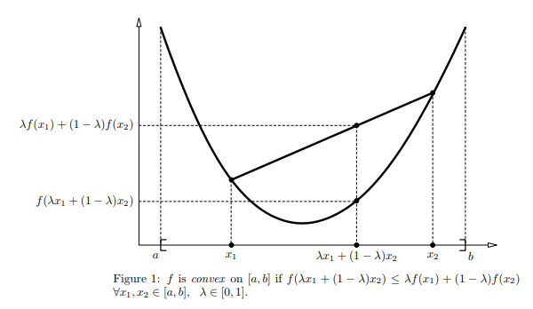

一种优化算法框架，用于含有 隐变量（hidden variable）的概率模型参数的极大似然估计（Maximum Likelihood Estimation, MLE），或极大后验概
率估计（Maximum A Posterior estimation, MAP）. 1977年由Dempster等人 总结 提出.  

## 1. 基础

### Jensen不等式

如果f是凸函数，X是随机变量，$,  \lambda_i \geq 0, \sum\limits_{i=1}^m\lambda_i =1$,   那么

$$

f(\sum\limits_{i=1}^m\lambda_jx_i) \leq \sum\limits_{i=1}^m\lambda_if(x_i)

$$

或者写成：

$$

f(E(x)) \leq E(f(x))

$$

由于$log$是一个凹函数，所以性质相反。

$$

log(\sum\limits_{i=1}^m\lambda_jx_i) \geq \sum\limits_{i=1}^m\lambda_ilog(x_i)   

$$

**等式相等**

要使得上面的公式取等号呢，很明显，要求所有的$f(x)$都相同，也就是常数。

## 2. 算法详解

### 策略

对于$m$个样本观察数据$x=(x^{(1)},x^{(2)},...x^{(m)})$中，找出样本的模型参数$\theta$, 极大化模型分布的对数似然函数如下：

$$

\theta = arg \max \limits_{\theta}\sum\limits_{i=1}^m logP(x^{(i)}|\theta)

$$

如果有假设的未观察到的隐变量$z=(z^{(1)},z^{(2)},...z^{(m)})$，那么：

$$

\theta = arg \max \limits_{\theta}\sum\limits_{i=1}^m logP(x^{(i)}|\theta) = arg \max \limits_{\theta}\sum\limits_{i=1}^m log\sum\limits_{z^{(i)}}P(x^{(i)}， z^{(i)}|\theta)

$$

## 算法

#### 思路分析

由于上面的公式没法直接求解，采用Jensen不等式，可以得到

$$

\begin{align} \sum\limits_{i=1}^m log\sum\limits_{z^{(i)}}P(x^{(i)}， z^{(i)}|\theta)   & = \sum\limits_{i=1}^m log\sum\limits_{z^{(i)}}Q_i(z^{(i)})\frac{P(x^{(i)}， z^{(i)}|\theta)}{Q_i(z^{(i)})} \\ & \geq  \sum\limits_{i=1}^m \sum\limits_{z^{(i)}}Q_i(z^{(i)})log\frac{P(x^{(i)}， z^{(i)}|\theta)}  {Q_i(z^{(i)})}  \label{ref7} \end{align}

$$

如果要满足Jensen不等式的等号，则有：

$$

\frac{P(x^{(i)}， z^{(i)}|\theta)}{Q_i(z^{(i)})} =c, c为常数

$$

是一由于$Q_i(z^{(i)})$个分布，所以满足：

$$

\sum\limits_{z}Q_i(z^{(i)}) =1

$$

根据上面两个公式可以推出：

$$

Q_i(z^{(i)})  = \frac{P(x^{(i)}， z^{(i)}|\theta)}{\sum\limits_{z}P(x^{(i)}， z^{(i)}|\theta)} =  \frac{P(x^{(i)}， z^{(i)}|\theta)}{P(x^{(i)}|\theta)} = P( z^{(i)}|x^{(i)},\theta)

$$

如果$Q_i(z^{(i)}) = P( z^{(i)}|x^{(i)};\theta))$,  则第$\ref{ref7}$式是我们的包含隐藏数据的对数似然的一个下界。如果我们能极大化这个下界，则也在尝试极大化我们的对数似然。即我们需要最大化下式：

$$

arg \max \limits_{\theta} \sum\limits_{i=1}^m \sum\limits_{z^{(i)}}Q_i(z^{(i)})log\frac{P(x^{(i)}， z^{(i)}|theta)}{Q_i(z^{(i)})}

$$

去掉上式中为常数的部分，则我们需要极大化的对数似然下界为：

$$

arg \max \limits_{\theta} \sum\limits_{i=1}^m \sum\limits_{z^{(i)}}Q_i(z^{(i)})log{P(x^{(i)}, z^{(i)}|\theta)}

$$

### 算法流程

输入：观察数据$x=(x^{(1)},x^{(2)},...x^{(m)})$, 联合分布$p(x,z|θ)$, 条件分布$p(z|x, θ)$, 最大迭代次数$J$。

1. 随机初始化模型参数$\theta $的初值。

2.  for j  from 1 to J开始EM算法迭代：

   - E步：计算联合分布的条件概率期望：
     

$$

     Q_i(z^{(i)}) = P( z^{(i)}|x^{(i)}，\theta^{j})) \\ 
     L(\theta, \theta^{j}) = \sum\limits_{i=1}^m\sum\limits_{z^{(i)}}Q_i(z^{(i)})log{P(x^{(i)}， z^{(i)}|\theta)}
     

$$

     
   - M步：极大化$L(θ,θ_j)$,得到$θ^{j+1}$:
     

$$

     
     

$$

     

## 参考

- [EM算法原理总结](https://www.cnblogs.com/pinard/p/6912636.html)
- [（EM算法）The EM Algorithm](https://www.cnblogs.com/jerrylead/archive/2011/04/06/2006936.html)
- [EM算法原理及其应用](https://vividfree.github.io/docs/2016-08-19-introduction-about-EM-algorithm-doc1.pdf)
- [Jensen不等式初步理解及证明](https://zhuanlan.zhihu.com/p/39315786)

