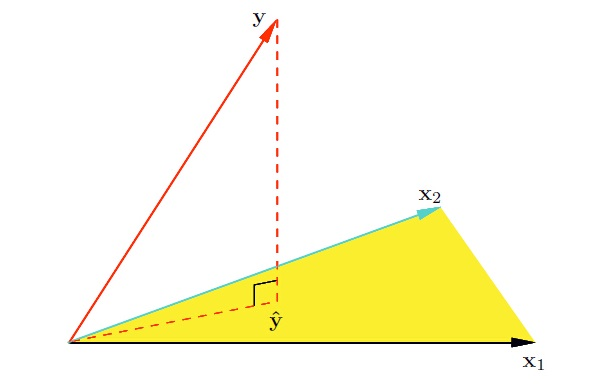

线性回归是利用称为线性回归方程的[最小二乘](https://zh.wikipedia.org/wiki/最小二乘法)函数对一个或多个[自变量](https://zh.wikipedia.org/wiki/自变量)和[因变量](https://zh.wikipedia.org/w/index.php?title=因变量&action=edit&redlink=1)之间关系进行建模的一种[回归分析](https://zh.wikipedia.org/wiki/回归分析). 

## 1.模型

$ \hat y = Xw$

## 2. 损失函数

$\begin{align}
J(w) &= \frac 1 {2m}  \sum_{i=1}^m (\hat y_i - y_i)^2    \\
     &= \frac 1 {2m} (\hat  y - y)^\mathrm{T}( \hat  y  - y)      \\
     &= \frac 1 {2m} (Xw - y)^\mathrm{T}(Xw - y)     
\end{align}$

## 3. 算法

### 3.1 方程式

$w = {(X^\mathrm{T}X)^{-1}}X^\mathrm{T}y  $

#### 3.11 投影

可以把$\hat y$ 看成是$y$ 在$X$向量空间的投影, 而$w$看成$\hat y$在$X$的坐标.  所以$ \hat y  - y $得到的向量应该和$X$垂直. 也就是满足如下公式.

$\begin{align}
X^T (\hat y - y) = 0  \\
X^T (Xw - y) = 0  \\ 
w = {(X^\mathrm{T}X)^{-1}}X^\mathrm{T}y  
\end{align}$

#### 3.12 梯度极值法

$\begin{align}
	J(w) &= (Xw-y)^T(Xw-y) \\ 
		 &= (w^TX^T-y^T)(Xw-y) \\ 
		 &= w^TX^TXw - w^TX^Ty - y^TXw + y^Ty \\
		 &= w^TX^TXw - y^TXw - y^TXw + y^Ty \\
		 &= w^TX^TXw - 2y^TXw + y^Ty \\
\end{align}$

$J(w)$是个凸函数，最小值在所有偏导为0的地方，

$\begin{align}
& \frac{\partial J(w)}{\partial w} = 2X^TXw - 2X^Ty = 0 \\
& w = {(X^\mathrm{T}X)^{-1}}X^\mathrm{T}y  
\end{align} $

### 3.13 梯度下降

$\nabla{w} = \frac 1 m X^\mathrm{T}(Xw - y)  $ 

# 参见

- [CS231n Linear Classification notes](http://cs231n.github.io/linear-classify/)
- [线代随笔05-向量投影](<http://bourneli.github.io/linear-algebra/2016/03/05/linear-algebra-05-projection-and-linear-regression.html>)
- [线代随笔11-线性回归相关的向量求导]( http://bourneli.github.io/linear-algebra/calculus/2016/04/28/linear-algebra-11-derivate-of-linear-regression.html)
- [线代随笔12-线性回归的矩阵推导](http://bourneli.github.io/linear-algebra/calculus/2016/04/30/linear-algebra-12-linear-regression-matrix-calulation.html )
- [机器学习实战教程：线性回归基础篇之预测鲍鱼年龄](http://cuijiahua.com/blog/2017/11/ml_11_regression_1.html) : 这里面介绍了线性回归，加权线性回归，局部加权线性回归。

