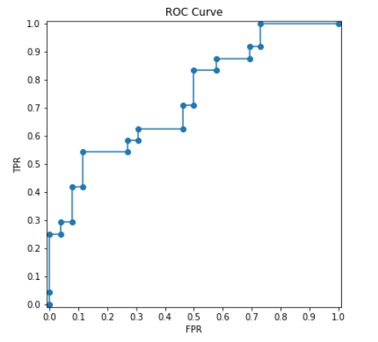

- AUC（Area Under the Curve）
- ROC（Receiver Operating Characteristic）

### 数据。

首先生成测试数据。

~~~python
import numpy as np
import matplotlib.pyplot as plt
from sklearn.metrics import auc, roc_auc_score, roc_curve
from sklearn.utils.extmath import stable_cumsum

row_count=50
np.random.seed(2021)

y_true = np.random.randint(0, label_count+1, row_count)
y_score = np.random.rand(row_count)*8/10 + y_true*2/10

print('-'*100)
print(y_true, y_true.shape)
print('-'*100)
print( y_score, y_score.shape)
~~~

## ROC曲线

[ROC曲线](https://baike.baidu.com/item/ROC曲线/775606)全称为受试者工作特征曲线 （Receiver Operating Characteristic Curve），它是根据一系列不同的二分类方式（阈值threshold），以真阳性率（TPR）为纵坐标，假阳性率（FPR）[为横坐标绘制的]()**[曲线](https://baike.baidu.com/item/曲线/12004395)**。

### 计算逻辑

AUC曲线上计算方式如下：

- 设定若干个thresholds。一般是把y_score的值作为threshold。具体做法是把y_score进行倒序排列，然后前面再加一个比较大的数。

  ~~~python
  desc_score_indices = np.argsort(y_score, kind="mergesort")[::-1]
  thresholds = y_score[desc_score_indices]
  thresholds = np.r_[thresholds[0] + 1, thresholds]
  print(thresholds, len(thresholds))
  ~~~

  

  上面代码节选自源代码，由于考虑了各种特殊情况，源代码要复杂的多。

  以前项目，曾经手工计算过，使用了固定间隔的threshold，比如$[1, 0.9, 0.8, 0.7, 0.6, 0.5，0.4, 0.3, 0.2, 0.1, 0]$

- 遍历thresholds，计算每一个threshold其对应的FPR（False Positive Rate）和TPR（True Positive Rate）。

  设y_score为模型的预测值，当 `y_score >= threshold`，设定为正例，反之是反例。

- 构建曲线图，曲线上点的坐标是(FPR, TPR)。

### roc_curve

非常方便的是，`sklearn.metrics.roc_curve`已经实现了上面所说的AUC计算方式。

~~~python
fpr, tpr, thresholds = roc_curve(y_true, y_score, pos_label=1) 
print('-'*30, 'fpr', '-'*30)
print(fpr, len(fpr))
print('-'*30, 'tpr', '-'*30)
print(tpr, len(tpr))
print('-'*30, 'thresholds', '-'*30)
print(thresholds, len(thresholds))  
~~~

如果仔细观察，会发现上面的thresholds只有24个和上节中的不同，这时因为代码中去除了一些冗余的点，这些点对AUC的计算没有影响。可以手工计算FPR和TPR。

~~~python
def get_fpr_tpr(y_true, y_score, threshold):
    tp = np.sum((y_score>=threshold) * (y_true==1))
    fn = np.sum((y_score<threshold) * (y_true==1))
    fp = np.sum((y_score>=threshold) * (y_true==0))
    tn = np.sum((y_score<threshold) * (y_true==0))

    recall = tp/(tp+fn) 
    precision = tp/(tp+fp) 
    specificity = tn/(tn+fp)   
    
    tpr = recall
    fpr = 1 - specificity
    return fpr, tpr

k = 10  
fpr_manual, tpr_manual = get_fpr_tpr(y_true, y_score, thresholds[k])
print(fpr_manual, tpr_manual)
print(fpr[k], tpr[k])
~~~

然后来画图AUC曲线。

~~~python
def plot_roc_curve(fpr, tpr):
    plt.figure(figsize=(6, 6))    
    plt.title('ROC Curve')
    plt.xlim((-0.01, 1.01))
    plt.ylim((-0.01, 1.01)) 
    plt.ylabel('TPR')
    plt.xlabel('FPR')
    plt.xticks(np.linspace(0, 1, 11))
    plt.yticks(np.linspace(0, 1, 11))
    plt.plot(fpr, tpr, marker='o')
    
    plt.show()
    
plot_roc_curve(fpr, tpr)
~~~

## AUC

AUC（Area Under the Curve），是指ROC曲线下的面积。sklearn中可以有如下几种方式计算。

~~~python
print(roc_auc_score(y_true, y_score))
print(auc(fpr, tpr))
~~~

也可以手工计算。

~~~python
print(np.trapz(y=tpr, x=fpr))
~~~

详细计算方式从略。

### 多个Label的AUC

除了对于binary class的计算AUC外，roc_auc_score还支持多个label的AUC计算。

~~~python
import numpy as np
import matplotlib.pyplot as plt
from sklearn.metrics import auc, roc_auc_score, roc_curve
from sklearn.utils.extmath import stable_cumsum

row_count=50
label_count=3
np.random.seed(2021)

y_true = np.random.randint(0, 2, (row_count, label_count))
y_score = np.random.rand(row_count, label_count)*7/10 + y_true*3/10

print('-'*100)
print(y_true.shape)
print('-'*100)
print(y_score.shape)
~~~

多个Label的AUC计算，有几种策略。

- macro

  对每个Label进行单独计算AUC，然后对计算结果进行平均。

- micro

  把所有的label看成一个label，然后计算这个label的AUC。

- weighted

  对每个Label进行单独计算AUC，然后对计算结果进行加权平均。加权的系数是每个label的个数。

下面重现了roc_auc_score的计算方式。

~~~python
for average in ['macro', 'micro', 'weighted']:
    print('-'*30, average, '-'*30)    
    print(roc_auc_score(y_true, y_score, average=average))

    scores = []
    weights = []
    
    if average=='macro':
        for j in range(label_count):
            scores.append(roc_auc_score(y_true[:,j], y_score[:,j]))
            weights.append(1)
    elif average=='weighted':
        for j in range(label_count):
            scores.append(roc_auc_score(y_true[:,j], y_score[:,j]))
            weights.append(np.sum(y_true[:,j]))            
    elif average=='micro':        
        scores.append(roc_auc_score(y_true.ravel(), y_score.ravel()))
        weights.append(1)

    scores = np.array(scores)
    weights = np.array(weights)/np.sum(weights)    
    print(np.sum(scores*weights))    
~~~

## 参考

- [ROC和AUC介绍以及如何计算AUC](https://www.plob.org/article/10453.html)

