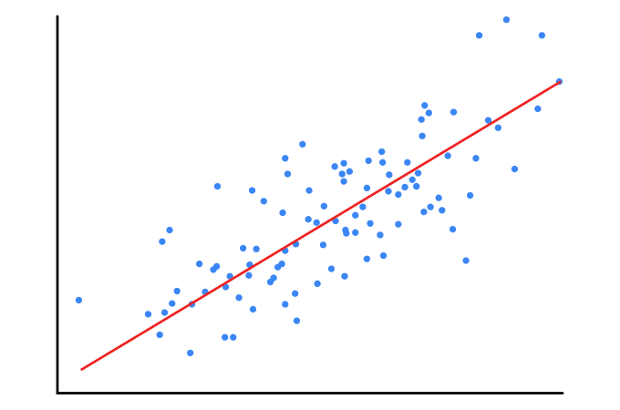

本文主要汇总一些基本且常用的算法和模型，简述原理，并做必要公式推导，用于备忘，而且不定期更新中。

## 1. 线性回归

线性回归（Linear Regression）是利用称为线性回归方程的最小二乘函数对一个或多个自变量和因变量之间关系进行建模的一种回归分析. 

### 1.1 模型

$\hat y $是模型的预测值。
$$
\hat y = Xw
$$

### 1.2 策略

损失函数定义如下，需要最小化该函数。
$$
\begin{align}
J(w) &= \frac 1 {2m}  \sum_{i=1}^m (\hat y_i - y_i)^2    \\
     &= \frac 1 {2m} (\hat  y - y)^\mathrm{T}( \hat  y  - y)      \\
     &= \frac 1 {2m} (Xw - y)^\mathrm{T}(Xw - y)     
\end{align}
$$

### 1.3 算法

#### 1.31方程

$$
w = {(X^\mathrm{T}X)^{-1}}X^\mathrm{T}y
$$

##### 投影

可以把$\hat y$ 看成是$y$ 在$X$向量空间的投影, 而$w$看成$\hat y$在$X$的坐标.  所以$ \hat y  - y $得到的向量应该和$X$垂直. 也就是满足如下公式.

$$
\begin{align}
X^T (\hat y - y) = 0  \\
X^T (Xw - y) = 0  \\ 
w = {(X^\mathrm{T}X)^{-1}}X^\mathrm{T}y  
\end{align}
$$

##### 梯度极值法

$$
\begin{align}
	J(w) &= (Xw-y)^T(Xw-y) \\ 
		 &= (w^TX^T-y^T)(Xw-y) \\ 
		 &= w^TX^TXw - w^TX^Ty - y^TXw + y^Ty \\
		 &= w^TX^TXw - y^TXw - y^TXw + y^Ty \\
		 &= w^TX^TXw - 2y^TXw + y^Ty \\
\end{align}
$$

$J(w)$是个凸函数，最小值在所有偏导为0的地方，

$$
\begin{align}
& \frac{\partial J(w)}{\partial w} = 2X^TXw - 2X^Ty = 0 \\
& w = {(X^\mathrm{T}X)^{-1}}X^\mathrm{T}y  
\end{align}
$$

#### 1.32 梯度下降

$$
\nabla{w} = \frac 1 m X^\mathrm{T}(Xw - y)
$$

推导如下：
$$
\begin{align}
\nabla{w} &= \frac {\partial J(w)} {\partial w} 
\\ &=    \frac {\partial (Xw-y)^T}  {\partial w} \frac {\partial \frac 1 {2m} (Xw - y)^\mathrm{T}(Xw - y)} {\partial (Xw-y)} 
\\ &=   X^T \frac 1 {2m} 2(Xw - y)
\\ &=  \frac 1 {m}X^T(Xw - y)
\end{align}
$$
上面推导主要调用了以下两个公式。
$$
\frac{\partial \mathbf {w}^\mathbf{T}\mathbf {w} }{\partial \mathbf {w} } = 2\mathbf {w} \\
\frac{\partial (\mathbf{A}\mathbf {w})^\mathbf{T} }{\partial \mathbf {w} } = = 
\mathbf{A}^\mathbf{T}
$$

## 2. 逻辑回归 

逻辑回归（Logistic Regression）是一种线性模型，用于二分类，运用非常广泛。

### 2.1 模型

采用sigmoid函数。
$$
h(z) = \frac{1}{1+e^{-z}}
$$

其中$ z = Xw$。

很明显，对于某一个样本$x_i$（是一个行向量），$z_i=x_iw$。$h(z_i)$表示该样本属于第一个类别的概率，$1-h(z_i)$表示该样本属于第二个类别的概率。

### 2.2 策略

损失函数采用交叉熵来定义。
$$
J(w) = \frac 1 m \left(-y^T\log h(z) - (1-y)^T \log (1-h(z))\right)
$$
该函数来自对数极大似然函数，其关键如下。

- 对于单个样本$x_i$，其发生的概率是$h(z_i)^{y_i}(1-h(z_i))^{1-y_i}$

  这个公式挺巧妙的，无论样本是属于第一个类别，还是第二个类别，都能够表示样本发生的概率。

- 对上步的公式，取log，然后取负号，便可以得到损失函数。
  $$
  -y_i\log h(z_i) -  (1-y_i) \log(1-h(z_i))
  $$

### 2.3 算法

采用梯度下降求解参数。
$$
\nabla{w} = \frac 1 m X^\mathrm{T}(h(z) - y)
$$

推导如下。
$$
\begin{align}
\nabla{w} &= \frac {\partial J(w)} {\partial w} 
\\ &=  - \underbrace{\frac {\partial { \frac 1 m  y^T\log h(z)}}  {\partial w}}_{(a)} - \underbrace{\frac {\partial { \frac 1 m  (1-y)^T \log (1-h(z))}}  {\partial w}}_{(b)} 
\end{align} \tag 1
$$
下面来推导上面的$(a)$和$(b)$。首先来看$(a)$。
$$
\begin{align}
\frac {\partial {\frac 1 m  y^T\log h(z)}}  {\partial w} &= 
\frac {\partial z^T} {\partial w} 
\cdot\frac {\partial h(z)^T} {\partial z} 
\cdot\frac {\partial {\log h(z)^T}} {\partial h(z)} 
\cdot\frac {\partial {\frac 1 m  y^T\log h(z)}} {\partial \log h(z)}
\\ &=  X^T \circ  \left ( h(z)^T  (1-h(z))^T \right )  \circ  \frac 1 {h(z)^T} \cdot \frac 1 m y 
\\ &= \frac 1 m X^T \cdot  (1-h(z))y  
\\ &= \frac 1 m X^T (y-h(z)y) 
\end{align}
$$
同理可以计算$(b)$。
$$
\begin{align}
\frac {\partial { \frac 1 m  (1-y)^T \log (1-h(z))}}  {\partial w} &= 
\frac {\partial z^T} {\partial w} 
\cdot\frac {\partial (1-h(z))^T} {\partial z} 
\cdot\frac {\partial {\log (1-h(z))^T}} {\partial (1-h(z))} 
\cdot\frac {\partial {\frac 1 m  (1-y)^T \log (1-h(z))}} {\partial \log (1-h(z))}
\\ &=  X^T \circ  \left (-h(z)^T (1-h(z))^T  \right ) \circ  \frac 1 {(1-h(z))^T}  \cdot  \frac 1 m (1-y )
\\ &= \frac 1 m X^T \cdot h(z) (y-1)
\\ &= \frac 1 m X^T \cdot  (h(z)y-h(z))
\end{align}
$$
把$(a)$和$(b)$带入公式$(1)$，推导完成。
$$
\begin{align}
\nabla{w} &= - \frac 1 m X^T \cdot (y-h(z)y)  - \frac 1 m X^T \cdot  (h(z)y-h(z))
 \\ &=  \frac 1 m X^T (h(z) -y)
\end{align}
$$
不难发现，Logistic Regression其梯度求解和线性回归的高度相似。

上面推导主要用到了sigmoid函数和log函数的求导，详见[常用向量导数公式](https://eipi10.cn/linear-algebra/2019/12/12/common_vector_derivative/#sigmoid%E5%87%BD%E6%95%B0)。

## 3. Softmax回归

Softmax回归（Softmax Regression）也是一种线性模型，它是逻辑回归的推广，用于多分类。

### 3.1 模型

$$
\begin{align}
a_i = h(z_i) =   \frac {e^{z_i}}  {\sum_{k=1}^K e^{z_k}}
\end{align}
$$

其中$x$表示一个样本，$ z = Wx$，且
$$
W = \begin{bmatrix} w_1^T \\ w_2^T \\ \vdots \\ w_K^T \end{bmatrix}
$$
下文中，将用一个样本进行推导，最后将扩展到多样本的情况。

### 3.2 策略

一个样本的损失函数定义如下。
$$
\begin{align}
J(W) = -  \log a^{T} \cdot y 
\end{align}
$$

### 3.3 算法

采用梯度下降求解参数。

查看一个样本$x$，对于$w_i$的梯度，推导如下：
$$
\begin{align}
\nabla{w_i} &= \frac {\partial J(W_i)} {\partial w_i} 
\\ &= \frac {\partial z^T} {\partial w_i} 
\cdot\frac {\partial a^T} {\partial z} 
\cdot\frac {\partial {\log a^T}} {\partial a} 
\cdot\frac {\partial {-  \log a^{T} \cdot y }} {\partial \log a}
\\ &=   \circ \frac 1 {a^T} \cdot (- y)
\end{align}
$$

上面推导主要用到了softmax函数的求导，详见[常用向量导数公式](https://eipi10.cn/linear-algebra/2019/12/12/common_vector_derivative/#softmax函数)。

## 历史

- 2020-10-16：初始创建。包含线性回归，逻辑回归还有Softmax回归。

### 模型

### 策略

### 算法