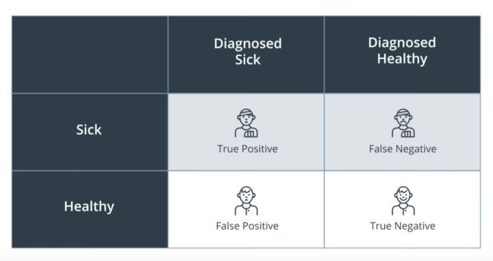

- TP：（真阳性）被**正确**诊断为患病的病人。
- TN：（真阴性）被**正确**诊断为健康的健康人。
- FP：（假阳性）被**错误**诊断为患病的健康人。
- FN：（假阴性）被**错误**诊断为健康的病人。

- 查全率（召回率Recall）= 敏感性(Sensitivity ) =  $$ TPR =  \frac {TP}  {TP+FN} = \frac {TP} {实际阳性} $$。查全率越高，表示漏判阳性的概率越低。

- 特异性（Specificity） = $$ FPR = \frac {TN} {TN+FP}  = \frac {TN} {实际阴性}$$。特异性越高，表示误判阳性的概率越低。

- 查准率 （精确度Precision）= $$ = \frac {TP} {TP+FP} = \frac {TP} {预测阳性}$$。查准率 越高，表示判定阳性的准确度越高。

  