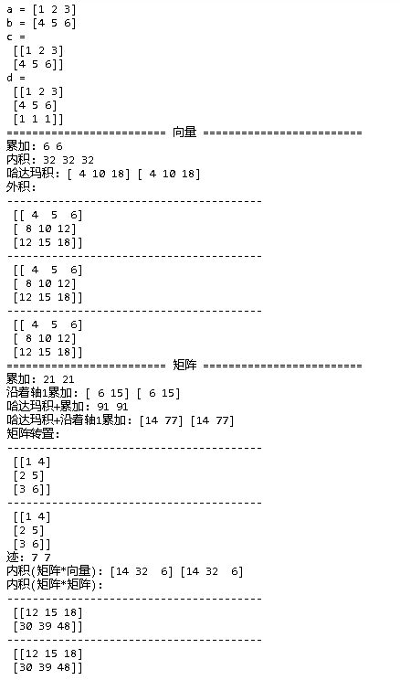
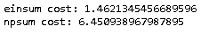
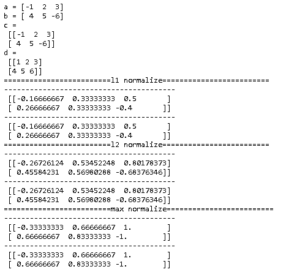

- ## np.einsum

  einsum全称Einstein summation convention（**[爱因斯坦求和约定](https://link.zhihu.com/?target=https%3A//baike.baidu.com/item/%E7%88%B1%E5%9B%A0%E6%96%AF%E5%9D%A6%E6%B1%82%E5%92%8C%E7%BA%A6%E5%AE%9A/2477100%3Ffr%3Daladdin)**），又称为**爱因斯坦标记法**，是爱因斯坦1916年提出的一种标记约定，简单的说就是省去求和式中的求和符号。

  einsum，功能强大，一个函数几乎实现了所有矩阵的操作，不愧一个函数打天下。

  ~~~python
  import numpy as np
  
  a = np.array([1, 2, 3])
  b = np.array([4, 5, 6])
  c = np.vstack((a, b))
  d = np.vstack((c, [1, 1, 1]))
  
  print('a =', a)
  print('b =', b)
  print('c =\n', c)
  print('d =\n', d)
  
  row_sep = "\n"+"-"*40+"\n"
  
  print('='*25, '向量', '='*25)
  print('累加:', np.einsum('i->', a), np.sum(a))        
  print('内积:', np.einsum('i,i', a, b), np.sum(a*b), np.inner(a,b))   
  print('哈达玛积:', np.einsum('i,i->i', a, b), a*b)        
  print('外积:', row_sep, np.einsum('i, j->ij', a, b), row_sep, a[:,np.newaxis]*b, row_sep, np.outer(a, b))           
  
  print('='*25, '矩阵', '='*25)
  print('累加:', np.einsum('ij->', c), np.sum(c))    
  print('沿着轴1累加:', np.einsum('ij->i', c), np.sum(c, axis=1))
  print('哈达玛积+累加:', np.einsum('ij,ij', c, c), np.sum(c*c))    
  print('哈达玛积+沿着轴1累加:', np.einsum('ij,ij->i', c, c), np.sum(c*c, axis=1))  
  print('矩阵转置:', row_sep, np.einsum('ji', c), row_sep, c.T)
  print('迹:', np.einsum('ii', d),  np.trace(d))
  print('内积(矩阵*向量):', np.einsum('ij,j->i', d, a), d.dot(a))   
  print('内积(矩阵*矩阵):', row_sep,np.einsum('ij,jk', c, d), row_sep, c.dot(d))  
  
  ~~~

  

  而且np.einsum性能非常好，碾压np.sum。

  ~~~python
  from timeit import Timer
  import numpy as np
  
  a = np.random.rand(64, 128, 128, 64)
  b = np.random.rand(64, 128, 128, 64)
  
  def einsum():
      temp = np.einsum('ijkl,ijkl->', a, b)
      
  def npsum():
      temp = (a * b).sum()
  
  print("einsum cost:", Timer("einsum()", "from __main__ import einsum").timeit(20))
  print("npsum cost:", Timer("npsum()", "from __main__ import npsum").timeit(20))
  ~~~

  

  ## sklearn.preprocessing.normalize

  对矩阵中每一行进行归一化处理。

  ~~~python
  import numpy as np
  from sklearn import preprocessing
  
  a = np.array([-1, 2, 3])
  b = np.array([4, 5, -6])
  c = np.vstack((a, b))
  d = np.abs(c)
  
  print('a =', a)
  print('b =', b)
  print('c =\n', c)
  print('d =\n', d)
  
  def para_sep(title):
      return '='*25 + title + '='*25
  
  row_sep = "\n"+"-"*40+"\n"
  
  print(para_sep('l1 normalize'), row_sep, preprocessing.normalize(c, norm='l1'), row_sep, c/np.sum(d, axis=1, keepdims=True)) 
  print(para_sep('l2 normalize'), row_sep, preprocessing.normalize(c, norm='l2'), row_sep, c/np.sqrt(np.sum(c*c, axis=1, keepdims=True))) 
  print(para_sep('max normalize'), row_sep, preprocessing.normalize(c, norm='max'), row_sep, c/np.max(d, axis=1, keepdims=True))
  ~~~

  

  ### 参考

  - [一个函数打天下，einsum](https://zhuanlan.zhihu.com/p/71639781)
  - [如何理解和使用NumPy.einsum？](https://zhuanlan.zhihu.com/p/27739282)

  