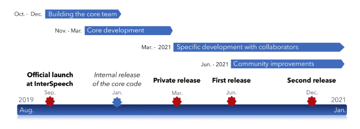

## Resouce

- https://zhuanlan.zhihu.com/p/70246657  DeepSpeech

- https://www.jiqizhixin.com/articles/2019-07-30-9  PyTorch-Kaldi

- [语音识别技术的前世今生](https://zhihu-live.zhimg.com/0af15bfda98f5885ffb509acd470b0fa)

  

## PyTorch-Kaldi

https://github.com/mravanelli/pytorch-kaldi

### Next Version: SpeechBrain

下一个版本是[SpeechBrain](https://speechbrain.github.io/)。下图看起来，第一个Release要2021年6月才发布。

## DeepSpeech

https://github.com/mozilla/DeepSpeech

### Install

#### CPU & GPU

0.6.1版本好像不好用

~~~shell
pip uninstall deepspeech deepspeech-gpu
pip install deepspeech
pip install deepspeech-gpu
~~~

#### Test

~~~shell
# Download pre-trained English model and extract
curl -LO https://github.com/mozilla/DeepSpeech/releases/download/v0.6.1/deepspeech-0.6.1-models.tar.gz
tar xvf deepspeech-0.6.1-models.tar.gz

# Download example audio files
curl -LO https://github.com/mozilla/DeepSpeech/releases/download/v0.6.1/audio-0.6.1.tar.gz
tar xvf audio-0.6.1.tar.gz

# Transcribe an audio file
deepspeech --model deepspeech-0.6.1-models/output_graph.pbmm --scorer deepspeech-0.6.1-models/kenlm.scorer --audio audio/2830-3980-0043.wav

~~~

## MP3 to WAV

~~~
pip install pydub
~~~

~~~python
from os import path
from pydub import AudioSegment

# files                                                                         
src = "transcript.mp3"
dst = "test.wav"

# convert wav to mp3                                                            
sound = AudioSegment.from_mp3(src)
sound.export(dst, format="wav")
~~~

