### 视频内容摘要

- https://www.coursera.org/learn/ai-for-everyone/lecture/9n83j/more-examples-of-what-machine-learning-can-and-cannot-do

  - Source：Coursera上课程[AI For Everyone](https://www.coursera.org/learn/ai-for-everyone/home/welcome)。

  - Topic：

    - What machine learning can and cannot do

      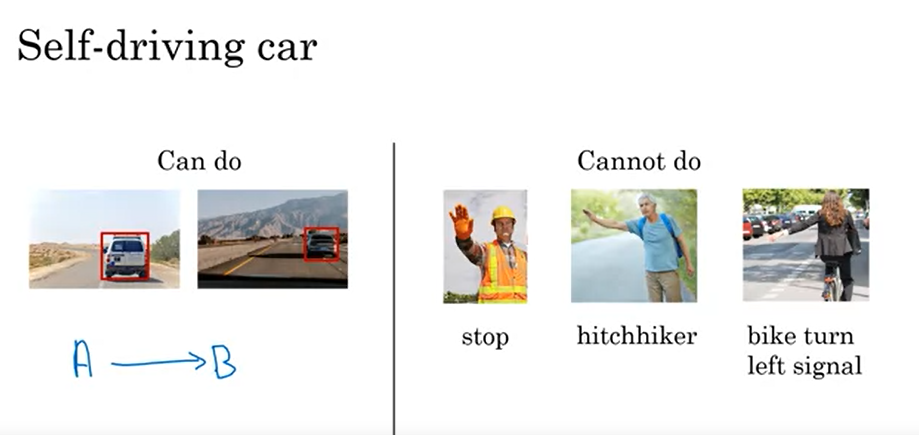

      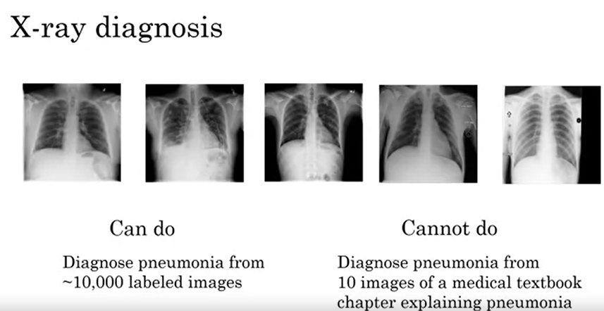

      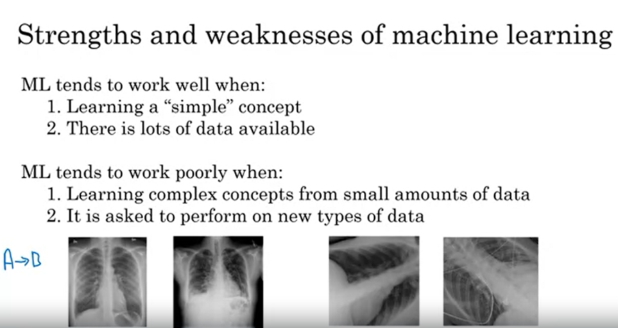

      

      

- https://www.coursera.org/learn/ai-for-everyone/lecture/rv1fW/what-machine-learning-can-and-cannot-do

  - Source：Coursera上课程[AI For Everyone](https://www.coursera.org/learn/ai-for-everyone/home/welcome)。

  - Topic：

    - What machine learning can and cannot do

      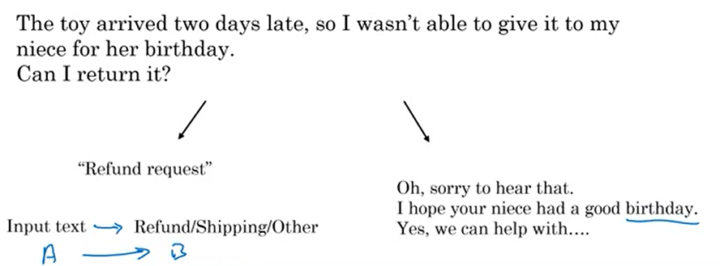

      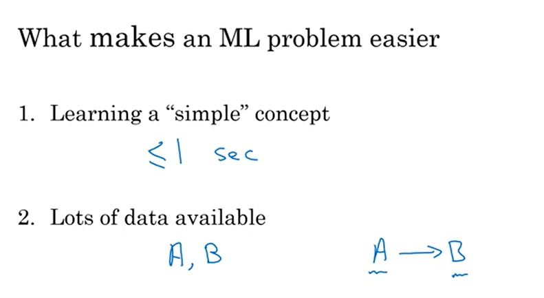

- https://www.coursera.org/learn/ai-for-everyone/lecture/dLSWR/what-is-data

  - Source：Coursera上课程[AI For Everyone](https://www.coursera.org/learn/ai-for-everyone/home/welcome)。

  - Topic：

    - common mis-use of data: 6:21~8:45

      2 Suggestions.

      - Try to get feedback from AI earlier

        Once you have started collecting some data, go ahead and start showing it or feeding it to an AI team. Because often AI team can give feedback to your IT team on what types of data to collect and what types of IT infrastructure to keep on building 

        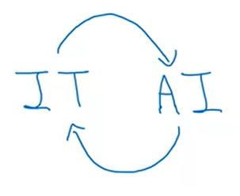

      - Don't throw data at an AI team and assume it will be valuable

    - Data is messy: 8:45~

      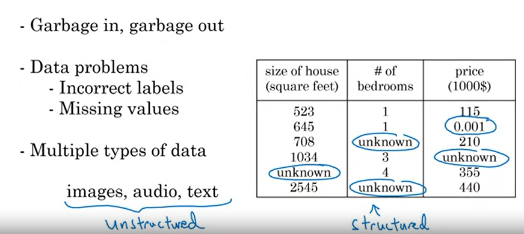

- https://www.coursera.org/learn/ai-for-everyone/lecture/5TPFo/machine-learning

  - Source：Coursera上课程[AI For Everyone](https://www.coursera.org/learn/ai-for-everyone/home/welcome)。

  - Topic：

    - Supervised Learning: 0:00~2:45

      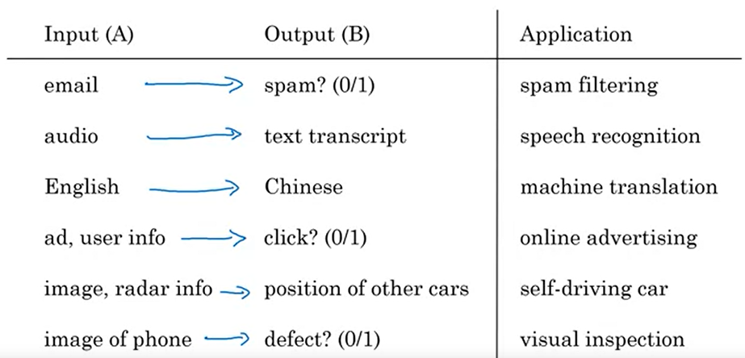

    - Compare Deep Learning with traditional AI： 2:45~

      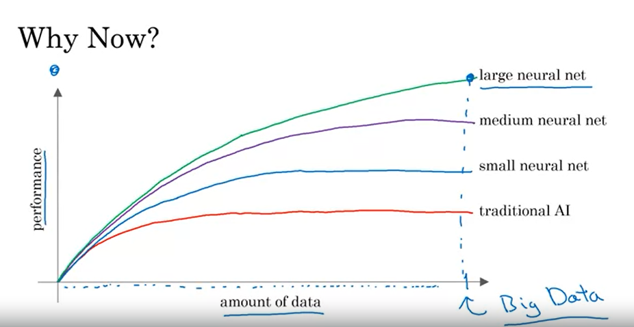

### 网上免费的GPU资源

- google colab - https://colab.research.google.com/

  创建一个notebook，选择gpu，然后运`!nvidia-smi `。一般可以申请到K80，有人说多试几次，可以申请到P100。

  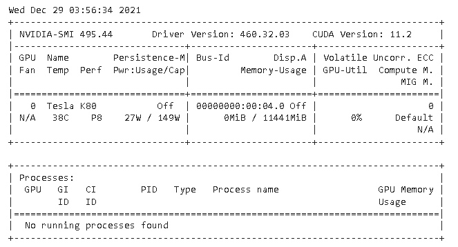

  下图中可以看到P100双精度计算的性能时K80的3倍多。

  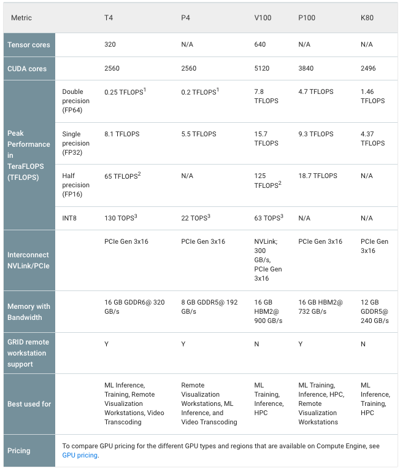

- Kaggle https://www.kaggle.com/

  选择GPU，可以获得Tesla P100-PCIE-16GB，每周可以有36个小时的配额，非常不错。

  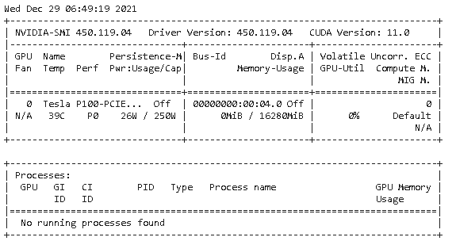

-  AI Studio和飞桨（PaddlePaddle） https://aistudio.baidu.com/

  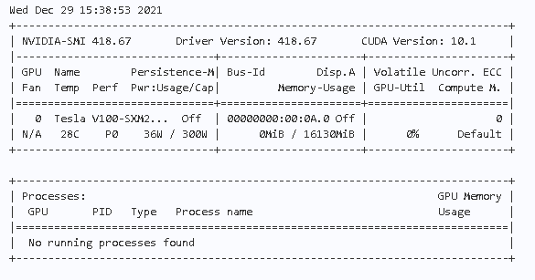

# GPU处理能力（TFLOPS/TOPS）

FLOPS是Floating-point Operations Per Second的缩写，代表每秒所执行的浮点运算次数。现在衡量计算能力的标准是TFLOPS（每秒万亿次浮点运算）

NVIDIA显卡算力表：https://developer.nvidia.com/cuda-gpus#compute

例如： 以GTX680为例， 单核一个时钟周期单精度计算次数为两次，处理核个数 为1536， 主频为1006MHZ，那他的计算能力的峰值P 为：P = 2 × 1536 × 1006MHZ = 3.09TFLOPS，1T为1兆，也就是说，GTX680每秒可以进行超过3兆次的单精度运算。

#### 各种FLOPS的含义

MFLOPS (megaFLOPS)：每秒一百万 (=10^6) 次的浮点运算

GFLOPS (gigaFLOPS) ：每秒十亿 (=10^9) 次的浮点运算

TFLOPS (teraFLOPS) ：每秒一万亿 (=10^12) 次的浮点运算

PFLOPS (petaFLOPS) ：每秒一千万亿 (=10^15) 次的浮点运算

#### 算力单位

TOPS（Tera Operations Per Second）：1TOPS代表处理器每秒钟可进行一万亿次（10^12）操作。

GOPS（Giga Operations Per Second）：1GOPS代表处理器每秒钟可进行一亿次（10^9）操作。

MOPS（Million Operation Per Second）：1MOPS代表处理器每秒钟可进行一百万次（10^6）操作。

在某些情况下，还使用 TOPS/W 来作为评价处理器运算能力的一个性能指标，TOPS/W 用于度量在1W功耗的情况下，处理器能进行多少万亿次操作。

### 显卡天梯

http://cdn.malu.me/gpu/

| 排名 |                  GPU | 得分  |
| ---: | -------------------: | :---- |
|    1 |  GeForce RTX 3080 Ti | 26658 |
|    2 |     GeForce RTX 3090 | 26005 |
|    4 |     GeForce RTX 3080 | 24517 |
|    8 |  GeForce RTX 3070 Ti | 22659 |
|    9 |     GeForce RTX 3070 | 21922 |
|   10 |  GeForce RTX 2080 Ti | 21718 |
|   15 |  GeForce RTX 3060 Ti | 19709 |
|   24 |     GeForce RTX 2080 | 18588 |
|   28 |  GeForce GTX 1080 Ti | 18074 |
|   39 | Tesla V100-SXM2-16GB | 16235 |
|   46 |     GeForce GTX 1080 | 15174 |
|   58 |  GeForce GTX 1070 Ti | 14360 |
|   72 |     GeForce GTX 1070 | 13414 |
|   97 |         Quadro P4000 | 11567 |
|  113 | GeForce GTX 1060 6GB | 10258 |
|  195 | Tesla P100-PCIE-16GB | 7225  |
|  196 |         Quadro T2000 | 7157  |
|  199 |         Quadro P2000 | 6984  |
|  218 |  GeForce GTX 1050 Ti | 6331  |
|  262 |     GeForce GTX 1050 | 5131  |
|  289 |         Quadro P1000 | 4472  |

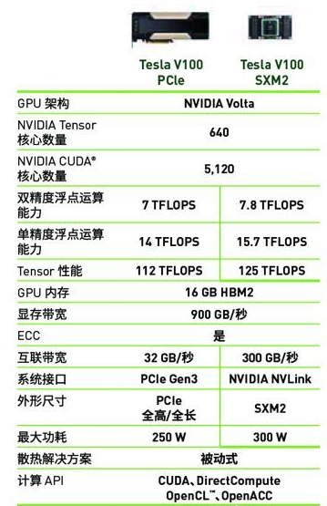

### 增加维度（dimension）的几种方法

有三种方法，以`np.expand_dims`最佳。

~~~python
import numpy as np
a = np.array([[2, 1, 3], [1, 2, 4]])
print(a, a.shape)

print('-'*50)
a1 = a.reshape(a.shape + (1,))
print(a1, a1.shape)

print('-'*50)
a1 = a[..., np.newaxis]
print(a1, a1.shape)

print('-'*50)
a1 = np.expand_dims(a, axis=-1)
print(a1, a1.shape)
~~~

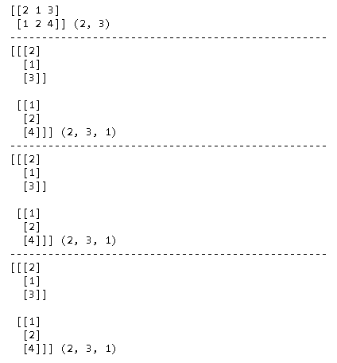

### 多分类

- **OvR（One vs Rest）**，一对剩余的意思，有时候也称它为 OvA（One vs All）

  n 种类型的样本进行分类时，**分别**取一种样本作为一类，将剩余的所有类型的样本看做另一类，这样就形成了 **n 个**二分类问题，使用逻辑回归算法对 n 个数据集训练出 n 个模型，将待预测的样本传入这 n 个模型中，所得概率最高的那个模型对应的样本类型即认为是该预测样本的类型。

  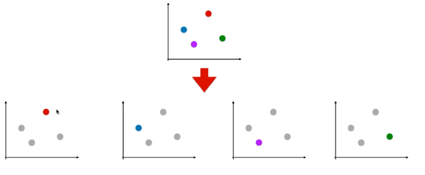

- **OvO（One vs One）**

  n 类样本中，每次挑出 2 种类型，两两结合，一共有 $C_n^2$种二分类情况，使用$C_n^2$ 种模型预测样本类型，有 $C_n^2$个预测结果，种类最多的那种样本类型，就认为是该样本最终的预测类型

  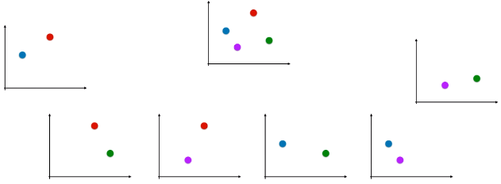

### AI Questions

#### AI For Everyone 

https://www.coursera.org/learn/ai-for-everyone

##### week 1: What is AI?

1. Which of these terms best describes the type of AI used in today’s email spam filters, speech recognition, and other specific applications?

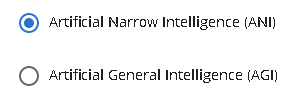

2. What do you call the commonly used AI technology for learning input (A) to output (B) mappings?

   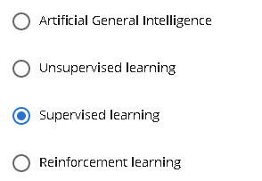

3. You want to use supervised learning to build a speech recognition system. The figure below suggests that in order for a neural network (deep learning) to achieve the best performance, you would ideally use: (Select all that apply)

   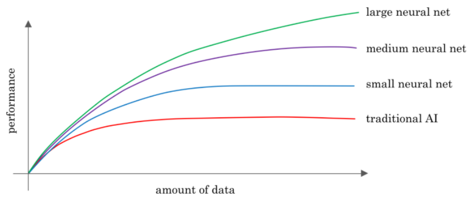

   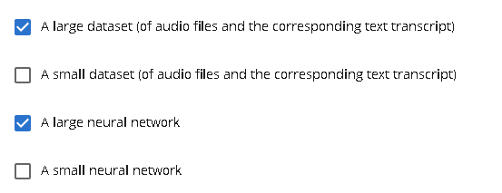

4. The only way to acquire data for a supervised learning algorithm is to manually label it. I.e., given the input A, to ask a human to provide B.

   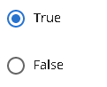

5. Which of these statements regarding data acquisition do you agree with?

   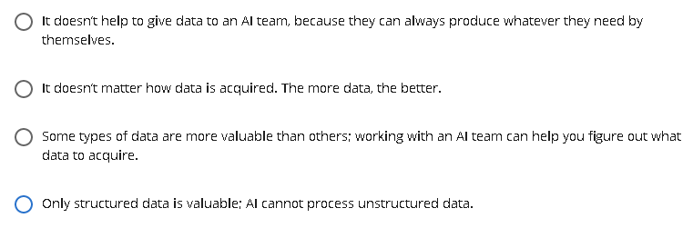

6. You run a company that manufactures scooters. Which of the following are examples of unstructured data? (Select all that apply.)

​		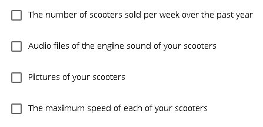

​		BC

7. Suppose you run a website that sells cat food. Which of these might be a good result from a Data Science project? (Select all that apply.)

   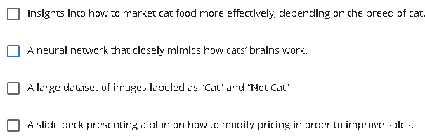

   CD

8. Based on the terminology defined in Video 4, which of the following statements do you agree with? (Select all that apply.)

   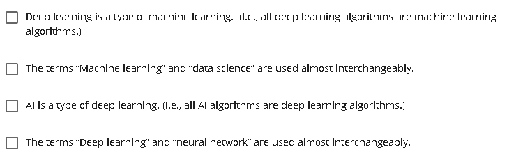

   AD

9. Which of these do AI companies do well?

   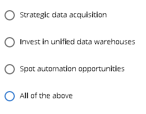

   D

10. Say you want to input a picture of a person’s face (A), and output whether or not they are smiling (B). Because this is a task that most humans can do in less than 1 second, supervised learning can probably learn this A-to-B mapping.

    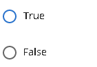

​		A