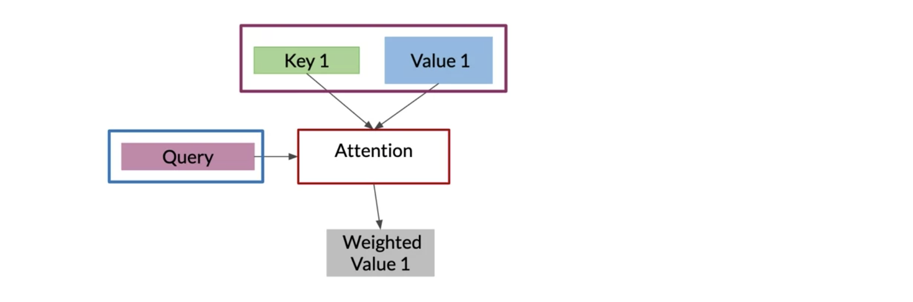
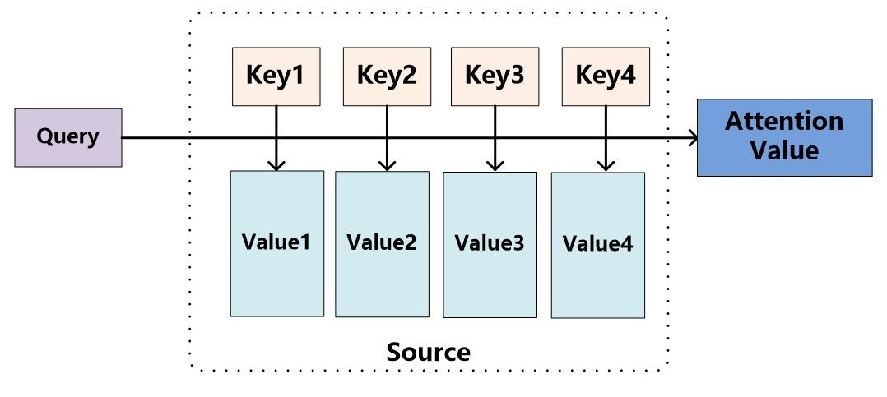
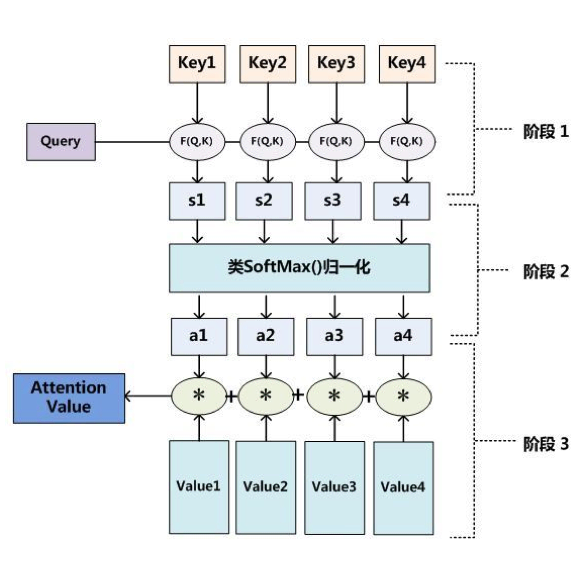
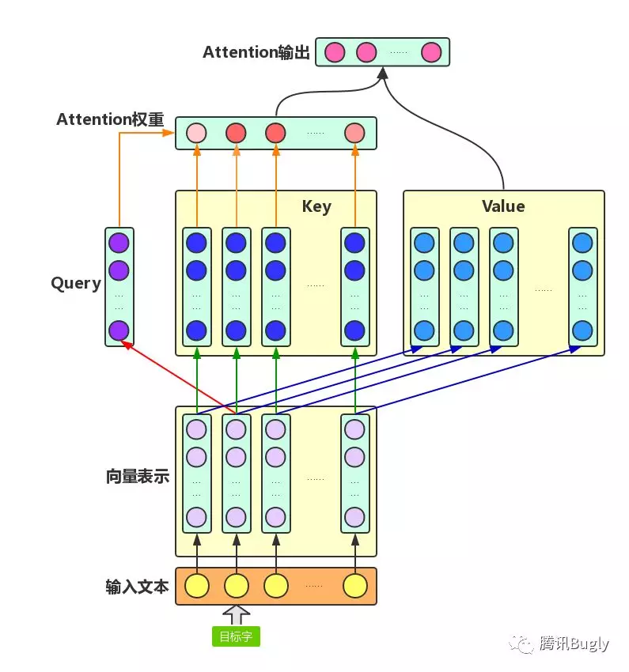
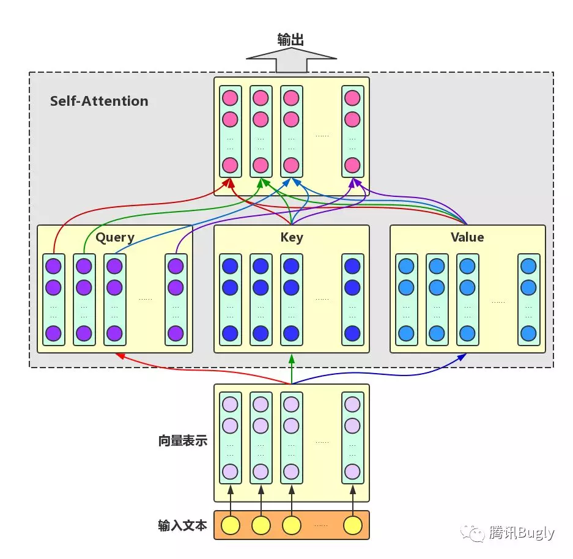
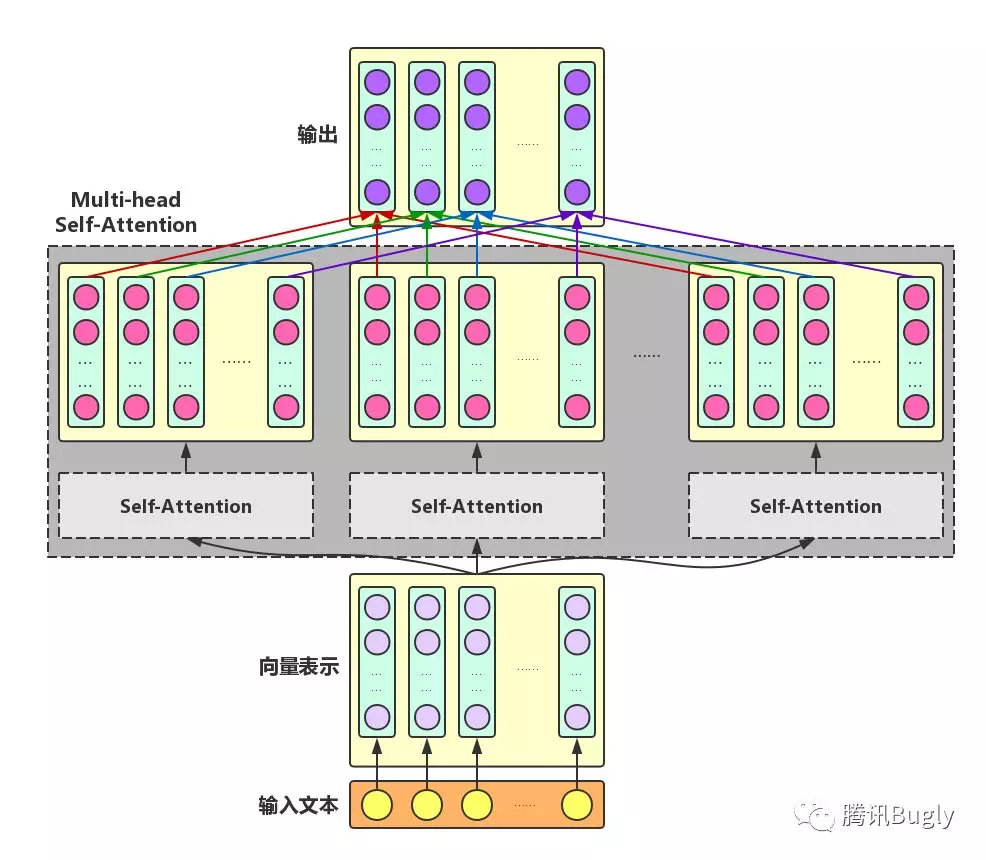
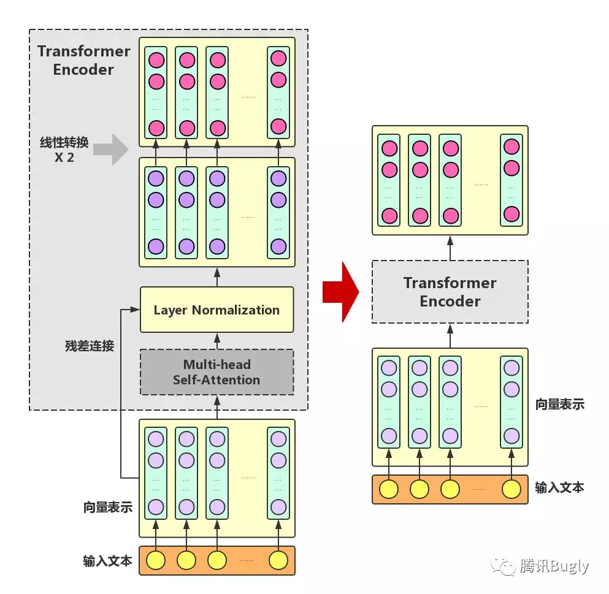
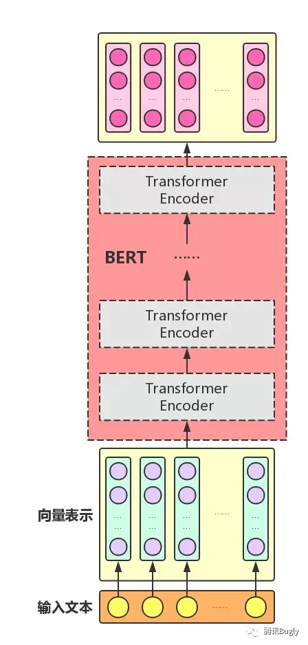

Attention 正在被越来越广泛的得到应用。尤其是 [BERT](https://easyai.tech/ai-definition/bert/) 火爆了之后。Attention 到底有什么特别之处？他的原理和本质是什么？Attention都有哪些类型？本文将详细讲解Attention的方方面面。

## Attention 的本质是什么

Attention（注意力）机制如果浅层的理解，跟它的名字非常匹配。他的核心逻辑就是「**从关注全部到关注重点**」。Attention 机制很像人类看图片的逻辑，当我们看一张图片的时候，我们并没有看清图片的全部内容，而是将注意力集中在了图片的焦点上。大家看一下下面这张图：

我们一定会看清「锦江饭店」4个字，如下图：

但是我相信没人会意识到「锦江饭店」上面还有一串「电话号码」，也不会意识到「喜运来大酒家」，如下图：

所以，当我们看一张图片的时候，其实是这样的：

上面所说的，我们的视觉系统就是一种 Attention机制，**将有限的注意力集中在重点信息上，从而节省资源，快速获得最有效的信息。**

## AI 领域的 Attention 机制

Attention 机制最早是在计算机视觉里应用的，随后在 [NLP](https://easyai.tech/ai-definition/nlp/) 领域也开始应用了，真正发扬光大是在 NLP 领域，因为 2018 年 [BERT](https://easyai.tech/ai-definition/bert/) 和 GPT 的效果出奇的好，进而走红。而 [Transformer](https://easyai.tech/ai-definition/transformer/) 和 Attention 这些核心开始被大家重点关注。

如果用图来表达 Attention 的位置大致是下面的样子：

## Attention 的3大优点

之所以要引入 Attention 机制，主要是3个原因：

1. 参数少

   模型复杂度跟 [CNN](https://easyai.tech/ai-definition/cnn/)、[RNN](https://easyai.tech/ai-definition/rnn/) 相比，复杂度更小，参数也更少。所以对算力的要求也就更小。

2. 速度快

   Attention 解决了 RNN 不能并行计算的问题。Attention机制每一步计算不依赖于上一步的计算结果，因此可以和CNN一样并行处理。

3. 效果好

   在 Attention 机制引入之前，有一个问题大家一直很苦恼：长距离的信息会被弱化，就好像记忆能力弱的人，记不住过去的事情是一样的。

Attention 是挑重点，就算文本比较长，也能从中间抓住重点，不丢失重要的信息。下图红色的预期就是被挑出来的重点。

## Attention 的原理

下面的动图演示了attention 引入 Encoder-Decoder 框架下，完成机器翻译任务的大致流程。

**但是，Attention 并不一定要在 Encoder-Decoder 框架下使用的，他是可以脱离 Encoder-Decoder 框架的。**Attention机制的本质思想如下：

上面还是过于抽象，展开后如下。

将Source中的构成元素想象成是由一系列的<Key,Value>数据对构成，此时给定Target中的某个元素Query，通过计算Query和各个Key的相似性或者相关性，得到每个Key对应Value的权重系数，然后对Value进行加权求和，**即得到了最终的Attention数值**。下面是细节的再展开。

> 对于RNN模型，Key和Value往往都采用隐藏状态序列，也就是说是一样的。

下面使用Q，K， V分别代表Query，Key， Value。其中Q表示一个向量或矩阵，而K，V都为矩阵。

- 阶段1：计算Query和Key之间的相似度。常用如下几种方式来求解相似度。

  - $Sim(Q, K_i) = Q \cdot K_i$

  - $Sim(Q, K_i) = \frac  {Q \cdot K_i} {\lVert  Q  \rVert  \lVert  K_i  \rVert }$

  - $Sim(Q, K_i) = MLP(Q, K_i)$

    使用一个MLP神经网络计算。

- 阶段2：使用Sotfmax来对上面的相似度进行归一化。
  $$
  a_i = Softmax(Sim(Q, K_i))
  $$

- 阶段3：把上步的输出作为权重系数，加权求和得到Attention。
  $$
  Attention(Q, K， V) = \sum a_i \cdot V_i
  $$

汇总上面的公式，整个计算过程表示如下：
$$
Attention(Q, K， V) = Softmax(Sim(Q, K))\cdot V
$$

## Self-Attention

self-attention来自于google文章《attention is all you need》。 一个序列每个字符对其上下文字符的影响作用都不同，每个字对序列的语义信息贡献也不同，可以通过一种机制将原输入序列中字符向量通过加权融合序列中所有字符的语义向量信息来产生新的向量，即增强了原语义信息。

Self-Attention:对于输入文本，我们需要对其中的每个字分别增强语义向量表示，因此，我们分别将每个字作为Query，加权融合文本中所有字的语义信息，得到各个字的增强语义向量，如下图所示。在这种情况下，Query、Key和Value的向量表示均来自于同一输入文本，因此，该Attention机制也叫Self-Attention。

## Multi-head Self-Attention

为了增强Attention的多样性，文章作者进一步利用不同的Self-Attention模块获得文本中每个字在不同语义空间下的增强语义向量，并将每个字的多个增强语义向量进行线性组合，从而获得一个最终的与原始字向量长度相同的增强语义向量，如下图所示。

## Transformer

在Multi-headSelf-Attention的基础上再添加一些“佐料”，就构成了大名鼎鼎的Transformer Encoder。实际上，Transformer模型还包含一个Decoder模块用于生成文本，但由于BERT模型中并未使用到Decoder模块，因此这里对其不作详述。下图展示了Transformer Encoder的内部结构，可以看到，Transformer Encoder在Multi-head Self-Attention之上又添加了三种关键操作：

- 残差连接（ResidualConnection）：将模块的输入与输出直接相加，作为最后的输出。这种操作背后的一个基本考虑是：修改输入比重构整个输出更容易（“锦上添花”比“雪中送炭”容易多了！）。这样一来，可以使网络更容易训练。
- Layer Normalization：对某一层神经网络节点作0均值1方差的标准化。
- 线性转换：对每个字的增强语义向量再做两次线性变换，以增强整个模型的表达能力。这里，变换后的向量与原向量保持长度相同。

可以看到，Transformer Encoder的输入和输出在形式上还是完全相同，因此，Transformer Encoder同样可以表示为将输入文本中各个字的语义向量转换为相同长度的增强语义向量的一个黑盒。

## Bert

把Transformer Encoder模块一层一层的堆叠起来就是大名鼎鼎的bert了

## 参考

- [一文看懂 Attention（本质原理+3大优点+5大类型）](https://medium.com/@pkqiang49/%E4%B8%80%E6%96%87%E7%9C%8B%E6%87%82-attention-%E6%9C%AC%E8%B4%A8%E5%8E%9F%E7%90%86-3%E5%A4%A7%E4%BC%98%E7%82%B9-5%E5%A4%A7%E7%B1%BB%E5%9E%8B-e4fbe4b6d030)
- [Attention Model(注意力模型)](https://zhuanlan.zhihu.com/p/61816483)
- [Bert时代的创新（应用篇）：Bert在NLP各领域的应用进展](https://zhuanlan.zhihu.com/p/68446772)：2019年文章，张俊林分析了Bert对于NLP各个领域的提升作用。其中说到，Bert对于文本分类的提升效果只有3%-6%。
- [美团BERT的探索和实践](https://tech.meituan.com/2019/11/14/nlp-bert-practice.html)
- [attention、self-attention、transformer和bert模型基本原理简述笔记](https://my.oschina.net/u/3851199/blog/3012476)
- [《Attention is All You Need》浅读（简介+代码）](https://kexue.fm/archives/4765) **苏剑林**（苏神）出品
- [Transformer模型详解](https://terrifyzhao.github.io/2019/01/11/Transformer%E6%A8%A1%E5%9E%8B%E8%AF%A6%E8%A7%A3.html)：非常清晰，里面有大量的图。

