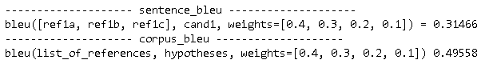
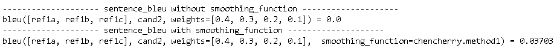
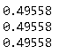

BLEU，全称为Bilingual Evaluation Understudy（双语评估替换），是语言翻译中对翻译效果进行评估的一种指标，用于比较候选语句（即机器翻译的译文，用candidate表示）与多个参考语句（即人工给出的译文，用reference表示）之间的相似程度。BLEU评分是由Kishore Papineni等人在2002年提出的。

本文除了介绍了BLEU的公式，还重点介绍了BLEU的几个实现，这能够帮助大家更好的理解BLEU。

## BLEU公式

BLEU基本原理是统计candidate中的词汇有多少个出现在reference，是一种精度（precision）。公式如下：
$$
B  LEU = BP \times exp\left( \sum_{n=1}^N w_n\log p_n \right)
$$

$$
BP = \begin{equation}  
\left\{  
\begin{array}{lcl}  
 1        &  & if\ l_c>l_r \\  
 e^{(1-l_r/l_c)} &  & if\ l_c
 \leq l_r  
\end{array}  
\right.
\end{equation}
$$

其中：

- $BP$表示惩罚因子（Brevity Penalty）。当候选语句的长度短于参考语句，降低其评分。

- $w_n$表示对于不同n-gram的权重。满足$\sum_{n=1}^N w_n=1$。一般$N$的取值小于等于4。

- $l_r$表示参考语句（**r**eference）的长度，$l_c$表示（机器翻译的）候选语句（**c**andidate）的长度。

  如果有多个参考语句，会把最接近候选语句长度（即$l_c$）的那个参考语句的长度赋值给$l_r$。详见下文`BLEU实践/My BLEU`中的代码。

- $p_n$表示某个n-gram下，candidate中的词汇有多少个出现在reference中。
  $$
  p_{n}=\frac{\sum_{c{\in candidates}}\sum_{w{\in c}}Count_{clip}({w})}{\sum_{c^{'}{\in candidates}}\sum_{{w}^{'}{\in c^{'}}}Count({w}^{'})} \\
  $$

  - $\sum_{{w}^{'}{\in c^{'}}}Count({w}^{'})$ 表示一个candidate中的词汇的个数。整个分母表示为所有candidate（每一个candidate表示一次语句翻译）中词汇的个数。

  - $\sum_{w{\in c}}Count_{clip}({w})$，表示一个candidate中的词汇在reference中出现的次数。整个分子表示所有candidate中的词汇在reference中出现的次数。由于参考答案（reference）往往是多个，所以$$\sum_{w{\in c}}Count_{clip}({w})$$的计算如下，
    $$
    Count_{clip}({w}) = min(Count(w),\ Ref\_Count(w)) \\
    Ref\_Count(w) = max(Ref\_Count_j(w))
    $$
    其中

    - $Count(w)$表示词汇$w$在candidate中出现的次数
    - $Ref\_Count(w)$表示词汇$w$在在reference集合中出现的最大次数
    - $Ref\_Count_j(w)$表示词汇$w$在第$j$个reference中出现的次数

通过BLEU，通常可以用以下的规则来衡量翻译的效果。

| BLEU Score （百分比） | 描述                                                      |
| :-------------------- | :-------------------------------------------------------- |
| < 10                  | Almost useless                                            |
| 10 - 19               | Hard to get the gist                                      |
| 20 - 29               | The gist is clear, but has significant grammatical errors |
| 30 - 40               | Understandable to good translations                       |
| 40 - 50               | High quality translations                                 |
| 50 - 60               | Very high quality, adequate, and fluent translations      |
| > 60                  | Quality often better than human                           |

## BLEU实践

### NLTK

NLTK全称Natural Language Toolkit，自然语言处理工具包，是NLP研究领域常用的一个开源Python库。NLTK有两个函数`sentence_bleu`和`corpus_bleu`，它们实现了BLEU，其中`sentence_bleu`是对单个句子的翻译效果进行评估，而`corpus_bleu`是对语料库（多个句子）的翻译效果进行评估。下面是它们的定义。

~~~python
def sentence_bleu(
    references,
    hypothesis,
    weights=(0.25, 0.25, 0.25, 0.25),
    smoothing_function=None,
    auto_reweigh=False,
)

def corpus_bleu(
    list_of_references,
    hypotheses,
    weights=(0.25, 0.25, 0.25, 0.25),
    smoothing_function=None,
    auto_reweigh=False,
)
~~~

下面是示例代码。

~~~python
import math
from nltk.translate.bleu_score import sentence_bleu, corpus_bleu
from nltk.translate.bleu_score import SmoothingFunction
from collections import Counter

cand1 = ['It’s', 'a', 'guide', 'to', 'action', 'which',
         'ensures', 'that', 'military', 'always',
         'obeys', 'commands', 'of', 'party']
ref1a = ['It', 'is', 'a', 'guide', 'to', 'action', 'that',
         'ensures', 'that', 'the', 'military', 'will', 'forever',
         'heed', 'Party', 'commands']
ref1b = ['It', 'is', 'the', 'guiding', 'principle', 'which',
         'guarantees', 'the', 'military', 'forces', 'always',
         'being', 'under', 'the', 'command', 'of', 'the',
         'Party']
ref1c = ['It', 'is', 'the', 'practical', 'guide', 'for', 'the',
         'army', 'always', 'to', 'heed', 'the', 'directions',
         'of', 'the', 'party']

cand2 = ['he', 'read', 'the', 'book', 'because', 'he', 'was',
        'interested', 'in', 'world']
ref2a = ['he', 'was', 'interested', 'in', 'world', 'history',
         'because', 'he', 'read', 'the', 'book']

print('-'*20, 'sentence_bleu', '-'*20)
weights = [0.4, 0.3, 0.2, 0.1] 
score = sentence_bleu([ref1a, ref1b, ref1c], cand1, weights=weights)
print(f'bleu([ref1a, ref1b, ref1c], cand1, weights={weights}) =', round(score, 5))

print('-'*20, 'corpus_bleu', '-'*20)
list_of_references = [[ref1a, ref1b, ref1c], [ref2a]]
hypotheses = [cand1, cand2]
score = corpus_bleu(list_of_references, hypotheses, weights=weights) 
print(f'bleu(list_of_references, hypotheses, weights={weights})', round(score, 5))
~~~

在上面两个函数中，有一个重要参数`smoothing_function`，它有什么作用呢？要回答这个问题，让我们回看BLEU公式，它可以进行如下推导。
$$
\begin{align}
BLEU &= BP \times exp\left( \sum_{n=1}^N w_n\log p_n \right) \\
&= BP \times \prod\limits_{n=1}^N {p_n}^{w_n}
\end{align}
$$
可以看到，只要有一个$p_n=0$，整个BLEU就会为0，这非常不合理。`smoothing_function`作用在于：当$p_n=0$，对其指定一个值。相关论文见[A Systematic Comparison of Smoothing Techniques for Sentence-Level BLEU](http://acl2014.org/acl2014/W14-33/pdf/W14-3346.pdf)。下面是相关代码。

~~~python
cand1b = ['It', 'is', 'to', 'insure', 'the', 'troops',
          'forever', 'hearing', 'the', 'activity', 'guidebook',
          'that', 'party', 'direct']

print('-'*20, 'sentence_bleu without smoothing_function', '-'*20)
score = sentence_bleu([ref1a, ref1b, ref1c], cand1b, weights=weights)
print(f'bleu([ref1a, ref1b, ref1c], cand2, weights={weights}) =', round(score, 5))

print('-'*20, 'sentence_bleu with smoothing_function', '-'*20)
chencherry = SmoothingFunction()
score = sentence_bleu([ref1a, ref1b, ref1c], cand1b, smoothing_function=chencherry.method1)
print(f'bleu([ref1a, ref1b, ref1c], cand2, weights={weights},  smoothing_function=chencherry.method1) =', round(score, 5))
~~~

可以看到，当指定了`smoothing_function=chencherry.method1`后，BLEU就不是0了。`chencherry.method1`的实现如下。

~~~python
    def method1(self, p_n, *args, **kwargs):
        """
        Smoothing method 1: Add *epsilon* counts to precision with 0 counts.
        """
        return [
            (p_i.numerator + self.epsilon) / p_i.denominator
            if p_i.numerator == 0
            else p_i
            for p_i in p_n
        ]
~~~

NLTK中一共提供了7种`smoothing_function`，详见[nltk bleu_score](https://github.com/nltk/nltk/blob/develop/nltk/translate/bleu_score.py)。

### PyTorch

PyTorch中的torchtext包也实现了BLEU，定义如下。

~~~python
def bleu_score(candidate_corpus, references_corpus, max_n=4, weights=[0.25] * 4)
~~~

默认也是4-gram，只是没有了`smoothing_function`的接口。使用这个函数，同样参数，可以得到上节相同的结果。

~~~python
from torchtext.data.metrics import bleu_score
score = bleu_score([cand1, cand2], [[ref1a, ref1b, ref1c], [ref2a]], weights=weights)
print(round(score, 5))
~~~

> PyTorch中的另外一个包ignite也实现了BLEU，定义如下。
>
> ~~~python
> ignite.metrics.Bleu(ngram=4, smooth='no_smooth', output_transform=<function Bleu.<lambda>>, device=device(type='cpu'))
> ~~~
>
> 这个实现中，加入了`smoothing_function`。只是目前这个包有点bug，安装包`pytorch-ignite`后，找不到`ignite.metrics.Bleu`。

### My BLEU

以下是自己实现的BLEU。

~~~python
def bleu(references_list, candidates, weights=[0.25, 0.25, 0.25, 0.25]):
           
    def to_ngram(sentence, ngram):
        if ngram==1: 
            return sentence
        len_sen = len(sentence) - ngram + 1
        new_sentence = [" ".join(sentence[i:i+ngram]) for i in range(len_sen)]
        return new_sentence
            
    def sentence_bleu_count(references, candidate, ngram):
        def word_bleu_count(w, counter_candidate, counters_reference):
            count_c = counter_candidate[w]
            max_count_r = max([counter_reference[w] for counter_reference in counters_reference])
            return min(count_c, max_count_r)
            
        counter_candidate = Counter(to_ngram(candidate, ngram))
        counters_reference = [Counter(to_ngram(reference, ngram)) for reference in references]
    
        count_r = sum([word_bleu_count(w, counter_candidate, counters_reference)  for w in counter_candidate ])
        count_c = sum(counter_candidate.values())
        
        return count_r, count_c
    
    def get_brevity_penalty():
        '''计算整个语料库的惩罚系数。'''
        sum_len_r = 0
        sum_len_c = 0   
        for references, candidate in zip(references_list, candidates):
            lens_r = [len(reference) for reference in references]
            len_c = len(candidate)  
            # 取最接近候选语句长度的那个参考语句的长度
            closest_len_r = min(lens_r, key=lambda len_r: (abs(len_r - len_c), len_r))
            sum_len_r += closest_len_r
            sum_len_c += len_c       
        if sum_len_r <= sum_len_c:
            return 1
        bp = math.exp(1-sum_len_r/sum_len_c)   
        return bp
        
    p_n = []  
    for i, weight in enumerate(weights):
        count_r = 0
        count_c = 0        
        for references, candidate in zip(references_list, candidates):
            count_r_, count_c_ = sentence_bleu_count(references, candidate, ngram=i+1)            
            count_r += count_r_
            count_c += count_c_
        p_i = count_r/count_c
        p_n.append(p_i)
                
    bp = get_brevity_penalty()
    s = [w_i * math.log(p_i) for w_i, p_i in zip(weights, p_n)]
    score = bp*math.exp(sum(s))
    return score 

weights = [0.4, 0.3, 0.2, 0.1] 
score = bleu([[ref1a, ref1b, ref1c], [ref2a]], [cand1, cand2], weights=weights)
print(round(score, 5))
score = corpus_bleu([[ref1a, ref1b, ref1c], [ref2a]], [cand1, cand2], weights=weights) 
print(round(score, 5))
score = bleu_score([cand1, cand2], [[ref1a, ref1b, ref1c], [ref2a]], weights=weights) 
print(round(score, 5))
~~~

可以看到，三种实现得到了相同的结果。

## 参考

- [BLEU: a Method for Automatic Evaluation of Machine Translation](http://www.aclweb.org/anthology/P02-1040.pdf) ：最初的论文
- [机器翻译评价指标 — BLEU算法](https://www.cnblogs.com/jiangxinyang/p/10523585.html)
- [机器翻译自动评估-BLEU算法详解](https://blog.csdn.net/qq_31584157/article/details/77709454)
- [机器翻译评测——BLEU算法详解 (新增 在线计算BLEU分值)](https://www.cnblogs.com/by-dream/p/7679284.html)
- [A Systematic Comparison of Smoothing Techniques for Sentence-Level BLEU](http://acl2014.org/acl2014/W14-33/pdf/W14-3346.pdf)
- [nltk bleu_score](https://github.com/nltk/nltk/blob/develop/nltk/translate/bleu_score.py)
- [torchtext bleu_score](https://pytorch.org/text/stable/data_metrics.html)
- [ignite BLEU](https://pytorch.org/ignite/master/generated/ignite.metrics.Bleu.html)
- [Understanding the BLEU Score](https://cloud.google.com/translate/automl/docs/evaluate#bleu)
- [Evaluating the Output of Machine Translation Systems](https://www.cs.cmu.edu/~alavie/Presentations/MT-Evaluation-MT-Summit-Tutorial-19Sep11.pdf)

