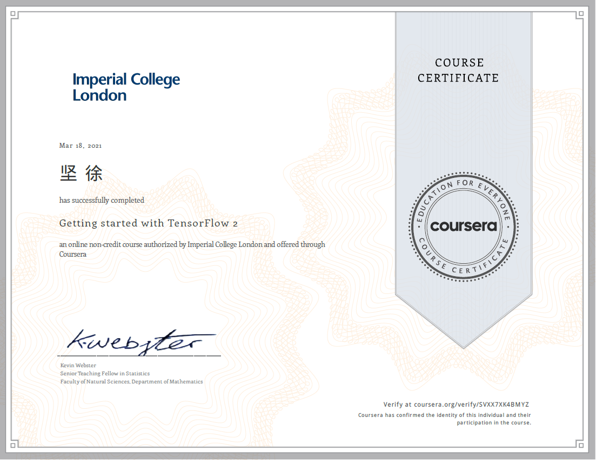
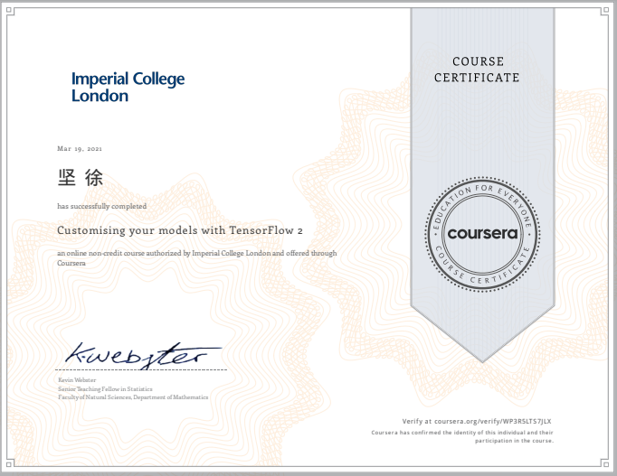

## Coursera Accomplishments

https://www.coursera.org/accomplishments

### [Getting started with TensorFlow 2](https://www.coursera.org/account/accomplishments/records/SVXX7XK4BMYZ)

**March 19, 2021**

**Grade Achieved: 100.00%**

## [Customising your models with TensorFlow 2](https://www.coursera.org/account/accomplishments/certificate/WP3R5LTS7JLX)

**March 19, 2021**

**Grade Achieved: 100.00%**

