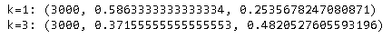

## What is fastText?

fastText is a library for efficient learning of word representations and sentence classification.

相关论文：[Enriching Word Vectors with Subword Information](https://arxiv.org/pdf/1607.04606v2.pdf)

以下示例的运行目录是`/home/grid/eipi10/facebook/fastText`。

## Installation

~~~shell
git clone https://github.com/facebookresearch/fastText.git
cd fastText
# for command line tool :
make  
# for python bindings :
pip install .
~~~

测试命令行的安装。

~~~shell
./fasttext
~~~

- supervised              train a supervised classifier
- quantize                quantize a model to reduce the memory usage
- test                    evaluate a supervised classifier
- predict                 predict most likely labels
- predict-prob            predict most likely labels with probabilities
- skipgram                train a skipgram model
- cbow                    train a cbow model
- print-word-vectors      print word vectors given a trained model
- print-sentence-vectors  print sentence vectors given a trained model
- nn                      query **for** nearest neighbors
- analogies               query **for** analogies

测试python的安装，如果没有报错，说明安装成功。

~~~python
import fasttext
~~~

相关使用帮助可以查看：https://fasttext.cc/docs/en/python-module.html。比如：

~~~python
model.words         # equivalent to model.get_words()
model.labels        # equivalent to model.get_labels()
model['king']       # equivalent to model.get_word_vector('king')
'king' in model     # equivalent to `'king' in model.get_words()`
~~~

## [Text Classification](https://fasttext.cc/docs/en/supervised-tutorial.html)

### 数据

本示例中用到的数据集是stackexchange question about cooking，总共有15404个问题。

> 最早设立的是Stack Overflow，即一个供程序员互相解答编程问题的问答网站，随后我们试图将同样的技术推广到编程之外的领域，比如说烹饪、摄影等等，每个主题的问答站点就都称为StackExchange，合起来也就是StackExchange网络。因此当我们提及StackExchange的时候，通常是指所有这些不同主题的网站的总和，其“祖父”则是Stack Overflow。

~~~shell
mkdir -p data/cooking
cd data/cooking
wget https://dl.fbaipublicfiles.com/fasttext/data/cooking.stackexchange.tar.gz && tar xvzf cooking.stackexchange.tar.gz
~~~

压缩文件解开后，有三个文件。

- readme.txt

- cooking.stackexchange.id: 对应的row id

- cooking.stackexchange.txt： 文本文件

  ~~~shell
  head cooking.stackexchange.txt
  wc cooking.stackexchange.txt
  ~~~

  

  从上面可以看出，一个问题可以属于多个标签。

#### Train和Valid

然后把数据分成Train和Valid两个数据集。

~~~shell
head -n 12404 cooking.stackexchange.txt > cooking.train
tail -n 3000 cooking.stackexchange.txt > cooking.valid
head cooking.valid
~~~

### 分类：命令行

#### 使用原始文本

下面开始训练模型。

~~~shell
../../fasttext supervised -input cooking.train -output model_cooking
~~~

> 运行`../../fasttext supervised`，可以看到所有的参数说明。

接下来就可以进行预测了。下面用交互方式来预测单个文本。

~~~shell
# __label__teflon I left a non-stick pan on the stove for an hour
# __label__roasting __label__peeling __label__chestnuts How to peel chestnuts?
# __label__roasting __label__beets How do I roast beets to easily remove the skins?

../../fasttext predict model_cooking.bin -
~~~

也可以进行top k的预测。

~~~shell
../../fasttext predict model_cooking.bin - 3
~~~

对数据集文件里的所有文本做预测。

~~~shell
../../fasttext predict model_cooking.bin cooking.valid 3
~~~

然后评估模型。

~~~shell
../../fasttext test model_cooking.bin cooking.valid 
~~~

- `P@1`：precision at one 
- `R@1`：recall at one

评估top 3的性能。

~~~shell
../../fasttext test model_cooking.bin cooking.valid 3
~~~

> 下面描述precision和recall的计算逻辑。假设有一段文本，它的情况如下。
>
> - actual labels: equipment, cleaning and knives
> - predicted labels： food-safety, baking, equipment, substitutions, bread
>
> 则：
>
> - precision = 1/5
> - recall = 1/3

#### 使用预处理文本

对数据进行一些预处理，把一些标点符号分离出来（避免和单词混在一起），另外把所所有字母都变成小写。

~~~shell
cat cooking.stackexchange.txt | sed -e "s/\([.\!?,'/()]\)/ \1 /g" | tr "[:upper:]" "[:lower:]" > cooking.preprocessed.txt
head -n 12404 cooking.preprocessed.txt > cooking.train
tail -n 3000 cooking.preprocessed.txt > cooking.valid

head cooking.valid
~~~

下面还是训练模型。

~~~shell
../../fasttext supervised -input cooking.train -output model_cooking
~~~

可以看到单词的数量从14543减少到了8952， 然后评估模型性能。

~~~shell
../../fasttext test model_cooking.bin cooking.valid 
../../fasttext test model_cooking.bin cooking.valid 3
~~~

和之前的结果比，可以看到模型的性能都有一些提高。

#### 增加训练轮次

下面增加训练轮次，默认是5。

~~~shell
../../fasttext supervised -input cooking.train -output model_cooking -epoch 25
~~~

 然后评估模型性能。

~~~shell
../../fasttext test model_cooking.bin cooking.valid 
../../fasttext test model_cooking.bin cooking.valid 3
~~~

和之前的结果比，可以看到模型的性能都有显著提高。

#### 调整学习率

learning rate的范围一般是0.1 - 1.0，默认是0.1。

~~~shell
../../fasttext supervised -input cooking.train -output model_cooking -lr 1.0
~~~

然后评估模型性能。

~~~shell
../../fasttext test model_cooking.bin cooking.valid 
../../fasttext test model_cooking.bin cooking.valid 3
~~~

和之前的结果比，可以看到模型的性能也有了较大的提高。

#### 增加训练轮次+调整学习率

同时增加训练轮次和调整学习率，看看效果如何

~~~shell
../../fasttext supervised -input cooking.train -output model_cooking -epoch 25 -lr 1.0
~~~

然后评估模型性能。

~~~shell
../../fasttext test model_cooking.bin cooking.valid 
../../fasttext test model_cooking.bin cooking.valid 3
~~~

和之前的结果比，可以看到模型的性能也有一些提高。不错！

#### n-gram

默认的n-gram=1，如果采用设置n-gram=2（也就是bi-gram），看看效果如何.

~~~shell
../../fasttext supervised -input cooking.train -output model_cooking -epoch 25 -lr 1.0 -wordNgrams 2
~~~

然后评估模型性能。

~~~shell
../../fasttext test model_cooking.bin cooking.valid 
../../fasttext test model_cooking.bin cooking.valid 3
~~~

和之前的结果比，可以看到模型的性能又有可见提高。

#### 模型优化

总结之前的调优结果，我们可以看到以下几种方式是有效的。

- 数据预处理：标点符号处理，大小写字母处理等
- 增加训练轮次。建议`[5 - 50]`
- 调整学习率。建议 `[0.1 - 1.0]`) 
- 使用ngram。建议 `[1 - 5]`).

#### 训练速度提升

当面对超大数据集，模型的训练速度至关重要，下面一些设置的设定，可以提高训练速度。

- -bucket: 词典里词的最大个数。默认2,000,000。
- -dim: 词向量的size。默认100。
- -loss: 损失函数。可以选择ns, hs, softmax, one-vs-all，默认softmax。选择hs（[hierarchical softmax](https://www.youtube.com/watch?v=B95LTf2rVWM)），性能提升巨大。

下面来比较一下。首先训练原来的模型。

~~~shell
startTime_s=`date +%s` 

../../fasttext supervised -input cooking.train -output model_cooking -epoch 25 -lr 1.0 -wordNgrams 2

endTime_s=`date +%s`
sumTime=$[ $endTime_s - $startTime_s]
echo "elapsed time: $sumTime seconds" 
~~~

然后添加`-bucket 200000 -dim 50`，看看训练速度如何。

~~~shell
startTime_s=`date +%s` 

../../fasttext supervised -input cooking.train -output model_cooking -epoch 25 -lr 1.0 -wordNgrams 2  -bucket 200000 -dim 50

endTime_s=`date +%s`
sumTime=$[ $endTime_s - $startTime_s]
echo "elapsed time: $sumTime seconds"   
~~~

提高了一倍速度，不错，下面再添加`-loss hs`

~~~shell
startTime_s=`date +%s` 

../../fasttext supervised -input cooking.train -output model_cooking -epoch 25 -lr 1.0 -wordNgrams 2  -bucket 200000 -dim 50 -loss hs

endTime_s=`date +%s`
sumTime=$[ $endTime_s - $startTime_s]
echo "elapsed time: $sumTime seconds"   
~~~

速度提升巨大，只要一秒，就能完成训练。接着评估模型性能，有些许降低，但还是不错的。

~~~shell
../../fasttext test model_cooking.bin cooking.valid 
../../fasttext test model_cooking.bin cooking.valid 3
~~~

#### Multi-label 分类

除了使用softmax，或者hierarchical softmax作为损失函数，还可以使用one-vs-all这种方式进行训练

> one-vs-all：n 种类型的样本进行分类时，**分别**取一种样本作为一类，将剩余的所有类型的样本看做另一类，这样就形成了 **n 个**二分类问题，使用逻辑回归算法对 n 个数据集训练出 n 个模型，将待预测的样本传入这 n 个模型中，所得概率最高的那个模型对应的样本类型即认为是该预测样本的类型。

~~~shell
../../fasttext supervised -input cooking.train -output model_cooking -epoch 25 -lr 0.5 -wordNgrams 2  -bucket 200000 -dim 50 -loss one-vs-all
~~~

上面学习率修改到了0.5，否则会报错。

~~~shell
../../fasttext predict-prob model_cooking.bin - -1 0.5
~~~

上面参数说明如下：

- `model_cooking.bin`：模型文件
- `-`：从stdin读入
- `-1`：返回所有类的预测
- `0.5`：概率threshhold大于0.5

输入：*Which baking dish is best to bake a banana bread ?*，得到如下结果。

下面来评估模型。

~~~shell
../../fasttext test model_cooking.bin cooking.valid -1 0.5
~~~

### 分类： python

~~~python
import fasttext
import os
import time

logging.basicConfig(format='%(asctime)s: %(levelname)s: %(message)s')
logging.root.setLevel(level=logging.INFO)

class TaskTime:

    def __init__(self, task_name, show_start=False):
        super().__init__()
        self.show_start = show_start
        self.task_name = task_name
        self.start_time = time.time()

    def elapsed_time(self):
        return time.time()-self.start_time

    def __enter__(self):
        if self.show_start:
            logging.info('start {}'.format(self.task_name))
        return self;

    def __exit__(self, exc_type, exc_value, exc_tb):
        time.sleep(0.5)
        logging.info('finish {} [elapsed time: {:.2f} seconds]'.format(self.task_name, self.elapsed_time()))
~~~

先开始准备数据。

~~~python
base_path = '/tf/eipi10/facebook/fastText/data/cooking'
train_path = os.path.join(base_path, 'cooking.train')
val_path = os.path.join(base_path, 'cooking.valid')
save_path = os.path.join(base_path, 'model_cooking.bin')

!head -n 12404 {base_path}/cooking.stackexchange.txt > {base_path}/cooking.train
!tail -n 3000 {base_path}/cooking.stackexchange.txt > {base_path}/cooking.valid
!head {base_path}/cooking.valid
~~~

#### 使用原始文本

下面开始训练模型。

~~~python
model = fasttext.train_supervised(input=train_path) 
model.save_model(save_path)
model.predict("Which baking dish is best to bake a banana bread ?")
~~~

也可以进行top k的预测。

~~~python
model.predict("Which baking dish is best to bake a banana bread ?", k=3)
~~~

然后评估模型。

~~~python
model.test(val_path)
~~~

上面返回的三个值，分别为样本数量，Precision，Recall。

评估top 3的性能。

~~~python
model.test(val_path, k=3)
~~~

> 下面描述precision和recall的计算逻辑。假设有一段文本，它的情况如下。
>
> - actual labels: equipment, cleaning and knives
> - predicted labels： food-safety, baking, equipment, substitutions, bread
>
> 则：
>
> - precision = 1/5
> - recall = 1/3

#### 使用预处理文本

对数据进行一些预处理，把一些标点符号分离出来（避免和单词混在一起），另外把所所有字母都变成小写。

~~~python
!cat {base_path}/cooking.stackexchange.txt | sed -e "s/\([.\!?,'/()]\)/ \1 /g" | tr "[:upper:]" "[:lower:]" > {base_path}/cooking.preprocessed.txt
!head -n 12404 {base_path}/cooking.preprocessed.txt > {base_path}/cooking.train
!tail -n 3000 {base_path}/cooking.preprocessed.txt > {base_path}/cooking.valid

!head {base_path}/cooking.valid
~~~

下面还是训练模型。

~~~python
model = fasttext.train_supervised(input=train_path) 
print('k=1:', model.test(val_path)) 
print('k=3:', model.test(val_path, k=3))  
~~~

和之前的结果比，可以看到模型的性能都有一些提高。

#### 增加训练轮次

下面增加训练轮次，默认是5。

~~~python
model = fasttext.train_supervised(input=train_path, epoch=25) 
print('k=1:', model.test(val_path)) 
print('k=3:', model.test(val_path, k=3))  
~~~

#### 调整学习率

learning rate的范围一般是0.1 - 1.0，默认是0.1。

~~~python
model = fasttext.train_supervised(input=train_path, lr=1.0) 
print('k=1:', model.test(val_path)) 
print('k=3:', model.test(val_path, k=3)) 
~~~

和之前的结果比，可以看到模型的性能也有了较大的提高。

#### 增加训练轮次+调整学习率

同时增加训练轮次和调整学习率，看看效果如何

~~~python
model = fasttext.train_supervised(input=train_path, epoch=25, lr=1.0) 
print('k=1:', model.test(val_path)) 
print('k=3:', model.test(val_path, k=3)) 
~~~

#### n-gram

默认的n-gram=1，如果采用设置n-gram=2（也就是bi-gram），看看效果如何.

~~~python
model = fasttext.train_supervised(input=train_path, epoch=25, lr=1.0, wordNgrams=2) 
print('k=1:', model.test(val_path)) 
print('k=3:', model.test(val_path, k=3))  
~~~

和之前的结果比，可以看到模型的性能又有可见提高。

#### 模型优化

总结之前的调优结果，我们可以看到以下几种方式是有效的。

- 数据预处理：标点符号处理，大小写字母处理等
- 增加训练轮次。建议`[5 - 50]`
- 调整学习率。建议 `[0.1 - 1.0]`) 
- 使用ngram。建议 `[1 - 5]`).

#### 训练速度提升

当面对超大数据集，模型的训练速度至关重要，下面一些设置的设定，可以提高训练速度。

- -bucket: 词典里词的最大个数。默认2,000,000。
- -dim: 词向量的size。默认100。
- -loss: 损失函数。可以选择ns, hs, softmax, one-vs-all，默认softmax。选择hs（[hierarchical softmax](https://www.youtube.com/watch?v=B95LTf2rVWM)），性能提升巨大。

下面来比较一下。首先训练原来的模型。

~~~python
with TaskTime('training', True) as t:
    model = fasttext.train_supervised(input=train_path, epoch=25, lr=1.0, wordNgrams=2) 
print('k=1:', model.test(val_path)) 
print('k=3:', model.test(val_path, k=3)) 
~~~

然后添加`-bucket 200000 -dim 50`，看看训练速度如何。

~~~python
with TaskTime('training', True) as t:
    model = fasttext.train_supervised(input=train_path, epoch=25, lr=1.0, wordNgrams=2,
                                      bucket=200000, dim=50) 
print('k=1:', model.test(val_path)) 
print('k=3:', model.test(val_path, k=3)) 
~~~

提高了接近一倍速度，不错，下面再添加`-loss hs`

~~~python
with TaskTime('training', True) as t:
    model = fasttext.train_supervised(input=train_path, epoch=25, lr=1.0, wordNgrams=2,
                                      bucket=200000, dim=50, loss='hs') 
print('k=1:', model.test(val_path)) 
print('k=3:', model.test(val_path, k=3))   
~~~

速度提升巨大，只要不到一秒，就能完成训练。接着评估模型性能，有些许降低，但还是不错的。

#### Multi-label 分类

除了使用softmax，或者hierarchical softmax作为损失函数，还可以使用one-vs-all这种方式进行训练

> one-vs-all：n 种类型的样本进行分类时，**分别**取一种样本作为一类，将剩余的所有类型的样本看做另一类，这样就形成了 **n 个**二分类问题，使用逻辑回归算法对 n 个数据集训练出 n 个模型，将待预测的样本传入这 n 个模型中，所得概率最高的那个模型对应的样本类型即认为是该预测样本的类型。

~~~python
with TaskTime('training', True) as t:
    model = fasttext.train_supervised(input=train_path, epoch=25, lr=0.5, wordNgrams=2,
                                      bucket=200000, dim=50, loss='ova') 
print('k=1:', model.test(val_path)) 
print('k=3:', model.test(val_path, k=3)) 
~~~

上面学习率修改到了0.5，否则会报错。

~~~python
model.predict("Which baking dish is best to bake a banana bread ?", k=-1, threshold=0.5)
~~~

上面参数说明如下：

- `k=-1`：返回所有类的预测
- `threshold=0.5`：概率threshhold大于0.5

按照上面的参数，再来评估模型。

~~~python
print('k=1:', model.test(val_path, k=-1, threshold=0.5))  
~~~

## [Word Representations](https://fasttext.cc/docs/en/unsupervised-tutorial.html)

### 数据

数据来自 Wikipedia的文章，原始的下载地址见[enwiki-latest-pages-articles.xml.bz2](https://dumps.wikimedia.org/enwiki/latest/enwiki-latest-pages-articles.xml.bz2)，由于这个文件太大了（超过18G），为了能够更快的进行实验，选用了1G左右的精简版，这个数据集下载自[Matt Mahoney's的网站](http://mattmahoney.net/)。

~~~shell
mkdir -p data/enwik9/data
cd data/enwik9
wget -c http://mattmahoney.net/dc/enwik9.zip -P data
unzip data/enwik9.zip -d data
~~~

原始的wikipedia dump包含许多html/xml数据，接下来使用wikifil.pl的脚本进行数据预处理，把各种格式去掉，只留下纯文本。

~~~shell
perl ../../wikifil.pl data/enwik9 > data/fil9
~~~

下图中，左边为处理前格式，右边为处理后格式。

### 词向量：命令行

#### 基本实现

词向量模型有两种：crow和skipgram。

~~~shell
mkdir result
../../fasttext skipgram -input data/fil9 -output result/fil9_skipgram
../../fasttext cbow -input data/fil9 -output result/fil9_cbow
tree result
~~~

训练完成将生成如下文件：

- fil9_skipgram.bin，fil9_cbow.bin：词向量模型。

- fil9_skipgram.vec，fil9_cbow.vec：词向量文件。

  先看skipgram的词向量文件

  ~~~shell
  head -3 result/fil9_skipgram.vec
  ~~~

  

  从文件第一行，可以看到总共有21836个词，每个词向量的维度是100。再看fil9_crow的词向量文件

  ~~~shell
  head -3 result/fil9_cbow.vec
  ~~~

  

> 文章中提到：skipgram模型比cbow模型在subword information上表现更好（In practice, we observe that skipgram models works better with subword information than cbow. ）。

#### 模型优化

上文中，使用了默认的参数训练模型，但可能并不是最优的，下面将介绍其中的一些关键参数。

- -dim：词向量维度。默认为100。
- -minn和-maxn：subword size的范围，即ngram的范围。默认从3到6。
- -epoch：训练的轮次。默认为5。如果数据集非常大，可以适当减少epoch。
- -thread：线程数量。默认为12。
- -lr：学习率。默认为0.05，建议$[0.01, 1]$。

~~~shell
../../fasttext skipgram -input data/fil9 -output result/fil9 -minn 2 -maxn 4 -dim 50
../../fasttext skipgram -input data/fil9 -output result/fil9 -epoch 1 -lr 0.5
../../fasttext skipgram -input data/fil9 -output result/fil9 -thread 4
~~~

#### 查询词向量

~~~shell
echo "asparagus pidgey yellow" | ../../fasttext print-word-vectors result/fil9.bin
~~~

对于拼写错误的词，依然可以获得词向量。

~~~shell
echo "environment enviroment" | ../../fasttext print-word-vectors result/fil9.bin
~~~

可以看到这两个词之间，还是有一定相似程度的。

#### 最近邻查询（Nearest neighbor queries）

验证词向量的效果的最简单方法是看一看和它最相似（最近）的词。

~~~shell
../../fasttext nn result/fil9.bin
~~~

从上面效果来看，似乎还不错阿。

#### 词类比（Word analogies）

~~~shell
../../fasttext analogies result/fil9.bin
~~~

#### n-grams的重要性

使用subword-level的信息对于构建unknown words的词向量非常的重要。下面将运行两个的模型，一个使用subword信息，一个不使用subword信息

~~~shell
../../fasttext skipgram -input data/fil9 -output result/fil9 -minn 2 -maxn 4 -dim 50
../../fasttext skipgram -input data/fil9 -output result/fil9-none -maxn 0 -dim 50 
~~~

下面使用这两个模型同时查询*gearshift*，这个词在wikipedia中并不存在。可以看到，使用subword信息模型（左图），可以查到很多词汇，大多和*gearshift* 包含大量相同的substring，也能够查到一些差异比较大的词汇（比如：`superspeed`），总体不错。而不使用subword信息的模型（右图），则没有任何有价值的信息。

~~~shell
../../fasttext nn result/fil9-none.bin
~~~

下面再来查询*accomodation*和*accommodation*，其中前面一个词是后面词的错误拼写。可以发现，使用subword信息模型（左图），两个词可以获得非常接近的近似程度，而不使用subword信息的模型（右图），两个词差异非常大，而且*accomodation*返回的很多并不相关的词，表现不是太好。

### 词向量：python

~~~python
import fasttext
import logging
import os
import time

logging.basicConfig(format='%(asctime)s: %(levelname)s: %(message)s', level=logging.INFO)
logging.root.setLevel(level=logging.INFO)

class TaskTime:

    def __init__(self, task_name, show_start=False):
        super().__init__()
        self.show_start = show_start
        self.task_name = task_name
        self.start_time = time.time()

    def elapsed_time(self):
        return time.time()-self.start_time

    def __enter__(self):
        if self.show_start:
            logging.info('start {}'.format(self.task_name))
        return self;

    def __exit__(self, exc_type, exc_value, exc_tb):
        time.sleep(0.5)
        logging.info('finish {} [elapsed time: {:.2f} seconds]'.format(self.task_name, self.elapsed_time()))
~~~

下面是一些基本设定。

~~~python
base_path = '/tf/eipi10/facebook/fastText/data/enwik9'
train_path = os.path.join(base_path, 'data/fil9')
save_path = os.path.join(base_path, 'result/fil9.bin')
~~~

#### 基本实现

词向量模型有两种：crow和skipgram。默认是skipgram。

~~~shell
with TaskTime('training', True) as t:
    model = fasttext.train_unsupervised(input=train_path) 

# 保存后，再加载
model.save_model(save_path)
model = fasttext.load_model("result/fil9.bin")
~~~

训练时间不断，后台cpu（总共20个核，跑满了近19个）使用率接近100%。现在看看里面的词和词向量。

~~~shell
print(len(model.words), model.words[0:10])
print(model.get_word_vector("the"))
~~~

下面训练crow模型。

~~~shell
with TaskTime('training', True) as t:
    model = fasttext.train_unsupervised(input=train_path, model="cbow")
    
print(len(model.words), model.words[0:10])
print(model.get_word_vector("the"))
~~~

crow模型的训练速度还是要快不少。

> 文章中提到：skipgram模型比cbow模型在subword information上表现更好（In practice, we observe that skipgram models works better with subword information than cbow. ）。

#### 模型优化

上文中，使用了默认的参数训练模型，但可能并不是最优的，下面将介绍其中的一些关键参数。

- dim：词向量维度。默认为100。
- minn和maxn：subword size的范围，即ngram的范围。默认从3到6。
- epoch：训练的轮次。默认为5。如果数据集非常大，可以适当减少epoch。
- thread：线程数量。默认为12。
- lr：学习率。默认为0.05，建议$[0.01, 1]$。

~~~python
with TaskTime('training', True) as t:
    model = fasttext.train_unsupervised(input=train_path, minn=2, maxn=4, dim=50, 
                                        epoch=4, lr=0.01, thread=18) 
~~~

经过调参，模型的训练速度提高了接近一倍。

#### 查询词向量

~~~shell
[model.get_word_vector(x) for x in ["asparagus", "pidgey", "yellow"]]
~~~

对于拼写错误的词，依然可以获得词向量。

~~~shell
[model.get_word_vector(x) for x in ["enviroment", "environment"]]
~~~

可以看到这两个词之间，还是有一定相似程度的。

#### 最近邻查询（Nearest neighbor queries）

验证词向量的效果的最简单方法是看一看和它最相似（最近）的词。

~~~shell
print(model.get_nearest_neighbors('enviroment'))
print('-'*50)
print(model.get_nearest_neighbors('love'))
print('-'*50)
print(model.get_nearest_neighbors('money'))
print('-'*50)
print(model.get_nearest_neighbors('asparagus'))
~~~

从上面效果来看，似乎还不错阿。

#### 词类比（Word analogies）

~~~shell
print(model.get_analogies("berlin", "germany", "france"))
print('-'*50)
print(model.get_analogies("psx", "sony", "nintendo"))
~~~

#### n-grams的重要性

使用subword-level的信息对于构建unknown words的词向量非常的重要。下面将运行两个的模型，一个使用subword信息，一个不使用subword信息

~~~python
with TaskTime('training', True) as t:
    model = fasttext.train_unsupervised(input=train_path, maxn=0, dim=50, 
                                        epoch=4, lr=0.01, thread=18)
~~~

训练速度又提高了一倍。下面使用这两个模型同时查询*gearshift*，这个词在wikipedia中并不存在。可以看到，使用subword信息模型，可以查到很多词汇，大多和*gearshift* 包含大量相同的substring，也能够查到一些差异比较大的词汇（比如：superspeed），总体不错。而不使用subword信息的模型，则没有任何有价值的信息。

~~~python
print(model.get_nearest_neighbors('enviroment'))
print('-'*50)
print(model_none.get_nearest_neighbors('enviroment'))
~~~

下面再来查询*accomodation*和*accommodation*，其中前面一个词是后面词的错误拼写。可以发现，使用subword信息模型，两个词可以获得非常接近的近似程度，而不使用subword信息的模型，两个词差异非常大，而且*accomodation*返回的很多并不相关的词，表现不是太好。

~~~python
print(model.get_nearest_neighbors('accomodation'))
print('-'*50)
print(model_none.get_nearest_neighbors('accomodation'))
print('-'*50)
print(model.get_nearest_neighbors('accommodation'))
print('-'*50)
print(model_none.get_nearest_neighbors('accommodation'))
~~~

## Automatic hyperparameter optimization

FastText提供了自动超参数调优的功能。

### 命令行

进入工作目录。相关数据生成参见Text Classification一章。

~~~shell
cd data/cooking
~~~

fastText将通过cooking.valid数据集上f1-score来寻找最佳的超参数。默认运行5分钟（cpu 10核），其中-autotune-duration是搜索的时间，如果没设置，默认是5分钟。

~~~shell
../../fasttext supervised -input cooking.train -output model_cooking -autotune-validation cooking.valid -autotune-duration 600
~~~

在搜索过程中，也可以按Ctrl+C结束，这时候模型会保存截至该时间点的最佳模型。

~~~shell
../../fasttext test model_cooking.bin cooking.valid
~~~

的确比之前的结果（如下所示）优化不少。

#### 限制模型大小

上面虽然取得了不错的结果，但模型竟然超过5G。看来是需要限制一下大小了

~~~shell
ls -lh model_cooking.bin
~~~

fastText可以通过 [quantization](https://fasttext.cc/docs/en/cheatsheet.html#quantization)压缩模型，但压缩任务本实也有超参数（比如：-cutoff`, `-retrain`, `-qnorm`, `-qout`, `-dsu）。这些参数也影响这模型的准确率。幸运的是，fastText自动调优可以在指定的模型大小下，发现最佳的压缩参数。

~~~shell
../../fasttext supervised -input cooking.train -output model_cooking -autotune-validation cooking.valid -autotune-modelsize 2M
~~~

模型大小只有2M。

~~~shell
ls -lh model_cooking.ftz
~~~

模型效果还行。

~~~shell
../../fasttext test model_cooking.ftz cooking.valid
~~~

#### 设置优化metric

- 默认。首先运行一个默认的模型，看看效果如何。

  ~~~shell
  ../../fasttext supervised -input cooking.train -output model_cooking -autotune-validation cooking.valid
  ~~~

  

  ~~~shell
  ../../fasttext test model_cooking.bin cooking.valid
  ~~~

  

  模型效果好像一般。

- 针对某一个便签，比如`__label__baking`进行贴别优化。

    ~~~shell
    ../../fasttext supervised -input cooking.train -output model_cooking_label -autotune-validation cooking.valid -autotune-metric f1:__label__baking
    ~~~

    

    看看模型模型效果，的确一般。

    ~~~shell
    ../../fasttext test model_cooking_label.bin cooking.valid
    ~~~

    

    下面看看`__label__baking`的分类效果。

    ~~~shell
    ../../fasttext test-label model_cooking_label.bin cooking.valid | grep __label__baking
    ~~~

    

    和标准的模型（如下结果）相比，对于`__label__baking`明显进行了优化。

    ~~~shell
    ../../fasttext test-label model_cooking.bin cooking.valid | grep __label__baking
    ~~~

    

- 针对top 2 label来优化

  ~~~shell
  ../../fasttext supervised -input cooking.train -output model_cooking_top2 -autotune-validation cooking.valid -autotune-predictions 2
  ~~~

  

  看看模型模型效果。

  ~~~shell
  ../../fasttext test model_cooking_top2.bin cooking.valid 2
  ~~~

  

  和标准的模型（如下结果）相比，还有又明显提升。但是model_cooking_top2.bin文件非常大，达到了6.1G，而标准模型（model_cooking.bin）只有345M。

  ~~~shell
  ../../fasttext test model_cooking.bin cooking.valid 2
  ~~~

  

- 针对recall = `30%`来优化

  ~~~shell
  ../../fasttext supervised -input cooking.train -output model_cooking_recall -autotune-validation cooking.valid -autotune-metric precisionAtRecall:30
  ~~~

  

  precisionAtRecall表示得到最佳的precision当recall=30%时候。看看模型模型效果。

  ~~~shell
  ../../fasttext test model_cooking_recall.bin cooking.valid
  ~~~

  

  好像效果非常不好，尤其是和标准模型相比。

  ~~~shell
  ../../fasttext test model_cooking.bin cooking.valid
  ~~~

  

- 针对`__label__baking`的recall = `30%`来优化

  ~~~shell
  ../../fasttext supervised -input cooking.train -output model_cooking_label_recall -autotune-validation cooking.valid -autotune-metric precisionAtRecall:30:__label__baking
  ~~~

  

  看看模型模型效果。

  ~~~shell
  ../../fasttext test-label model_cooking_label_recall.bin cooking.valid | grep __label__baking
  ~~~

  

  ~~~shell
  ../../fasttext test-label model_cooking.bin cooking.valid | grep __label__baking
  ~~~

  

  和model_cooking_label.bin相比，model_cooking_label_recall.bin的precision更高。

  ~~~shell
  ../../fasttext test-label model_cooking_label.bin cooking.valid | grep __label__baking
  ~~~

  

  

### python

~~~python
import fasttext
import logging
import os
import time

logging.basicConfig(format='%(asctime)s: %(levelname)s: %(message)s', level=logging.INFO)
logging.root.setLevel(level=logging.INFO)

class TaskTime:

    def __init__(self, task_name, show_start=False):
        super().__init__()
        self.show_start = show_start
        self.task_name = task_name
        self.start_time = time.time()

    def elapsed_time(self):
        return time.time()-self.start_time

    def __enter__(self):
        if self.show_start:
            logging.info('start {}'.format(self.task_name))
        return self;

    def __exit__(self, exc_type, exc_value, exc_tb):
        time.sleep(0.5)
        logging.info('finish {} [elapsed time: {:.2f} seconds]'.format(self.task_name, self.elapsed_time()))
~~~

下面是一些基础路径的设置。相关数据生成参见Text Classification一章。

~~~python
base_path = '/tf/eipi10/facebook/fastText/data/cooking'
train_path = os.path.join(base_path, 'cooking.train')
val_path = os.path.join(base_path, 'cooking.valid')
save_path = os.path.join(base_path, 'model_cooking.bin')
save_ftz_path = os.path.join(base_path, 'model_cooking.ftz')
~~~

fastText将通过cooking.valid数据集上f1-score来寻找最佳的超参数。其中-autotune-duration是搜索的时间，如果没设置，默认是5分钟。

~~~shell
with TaskTime('auto tuning', True) as t:
    model = fasttext.train_supervised(input=train_path, autotuneValidationFile=val_path, autotuneDuration=600)
~~~

下面评估一下模型

~~~shell
print('k=1:', model.test(val_path)) 
print('k=3:', model.test(val_path, k=3))  
~~~

和命令行优化解雇哦不同，比之前的结果（如下所示）还差一些，说明这个自动调优也有不确定性。

#### 限制模型大小

上面虽然取得了不错的结果，但模型竟然接近4G。看来是需要限制一下大小了

~~~python
model.save_model(save_path)
print('model size: {:0.2f} MB'.format(os.stat(save_path).st_size/1024/1024))
~~~

fastText可以通过 [quantization](https://fasttext.cc/docs/en/cheatsheet.html#quantization)压缩模型，但压缩任务本实也有超参数（比如：-cutoff`, `-retrain`, `-qnorm`, `-qout`, `-dsu）。这些参数也影响这模型的准确率。幸运的是，fastText自动调优可以在指定的模型大小下，发现最佳的压缩参数。

~~~shell
with TaskTime('auto tuning', True) as t:
    model = fasttext.train_supervised(input=train_path, autotuneValidationFile=val_path, autotuneModelSize="2M")
print('k=1:', model.test(val_path)) 
print('k=3:', model.test(val_path, k=3)) 

model.save_model(save_ftz_path)
print('model size: {:0.2f} MB'.format(os.stat(save_ftz_path).st_size/1024/1024))
~~~

只是模型size为啥是0.78MB，而不是2MB。

#### 设置优化metric

- 默认。首先运行一个默认的模型，看看效果如何。

  ~~~shell
  with TaskTime('auto tuning', True) as t:
      model = fasttext.train_supervised(input=train_path, autotuneValidationFile=val_path)
  print('k=1:', model.test(val_path)) 
  print('k=3:', model.test(val_path, k=3)) 
  ~~~

  

- 针对某一个便签，比如`__label__baking`进行贴别优化。

  ~~~shell
  with TaskTime('auto tuning', True) as t:
      model_label = fasttext.train_supervised(input=train_path, autotuneValidationFile=val_path, autotuneMetric="f1:__label__baking")
  print('k=1:', model_label.test(val_path)) 
  print('k=3:', model_label.test(val_path, k=3)) 
  ~~~

  

  和命令行不同，python并没有提供test-label来测试每一个label的效果，估计后续版本会改进吧。

- 针对top 2 label来优化

  ~~~shell
  with TaskTime('auto tuning', True) as t:
      model_top2 = fasttext.train_supervised(input=train_path, autotuneValidationFile=val_path, autotunePredictions=2)
  print('k=1:', model_top2.test(val_path)) 
  print('k=3:', model_top2.test(val_path, k=3)) 
  ~~~

  

- 针对recall = `30%`来优化

  ~~~shell
  with TaskTime('auto tuning', True) as t:
      model_recall = fasttext.train_supervised(input=train_path, autotuneValidationFile=val_path, autotuneMetric='precisionAtRecall:30')
  print('k=1:', model.test(model_recall)) 
  print('k=3:', model.test(model_recall, k=3)) 
  ~~~

  

  

- 针对`__label__baking`的recall = `30%`来优化

  ~~~shell
  with TaskTime('auto tuning', True) as t:
      model_recall_label = fasttext.train_supervised(input=train_path, autotuneValidationFile=val_path, autotuneMetric="precisionAtRecall:30:__label__baking")
  print('k=1:', model_recall_label.test(val_path)) 
  print('k=3:', model_recall_label.test(val_path, k=3)) 
  ~~~

  