本文是[Forecasting: Principles and Practice](https://otexts.com/fpp3/index.html)一书的内容的读后总结，其它书籍有：

- 本书的[中文版](https://otexts.com/fppcn/)。是第二版本，而英文版是第三版本。
- [Time Series for Macroeconomics and Finance](https://faculty.chicagobooth.edu/john.cochrane/research/Papers/time_series_book.pdf)
- [应用时间序列分析备课笔记]([http://www.math.pku.edu.cn/teachers/lidf/course/atsa/atsanotes/html/_atsanotes/index.html#%E8%AF%BE%E7%A8%8B%E5%86%85%E5%AE%B9](http://www.math.pku.edu.cn/teachers/lidf/course/atsa/atsanotes/html/_atsanotes/index.html#课程内容))
- [时间序列分析基于R](C:/Users/xu6/Downloads/时间序列分析基于R_王燕编著.pdf)
- [统计笔记](https://guangchuangyu.github.io/statistics_notes/) : 比较简略，不过还不错。

## 0. 前言

- 安装fpp3。

    ~~~R
    install.packages('fpp3')
    ~~~
    
    本书种所有例子和练习都使用`fpp3`。`library(fpp3)`将会加载下面的package。
    
    - [tibble](https://tibble.tidyverse.org/), for tibbles, a modern re-imagining of data frames.
    - [dplyr](https://dplyr.tidyverse.org/), for data manipulation.
    - [tidyr](https://tidyr.tidyverse.org/), to easily tidy data using `spread()` and `gather()`.
    - [lubridate](https://lubridate.tidyverse.org/), for date/times.
    - [ggplot2](https://ggplot2.tidyverse.org/), for data visualisation.
    - [tsibble](https://tsibble.tidyverts.org/), for tsibbles, a time series version of a tibble.
    - [tsibbledata](https://tsibbledata.tidyverts.org/), various time series data sets in the form of tsibbles.
    - [feasts](https://feasts.tidyverts.org/), for features and statistics of time series.
    - [fable](https://fable.tidyverts.org/), for fitting models and producing forecasts.
    
- 第三版的改变

    - 使用`tsibble` 和 `fable`  替换 `forecast` 

    - 紧密整合`tidyverse`包含的一系列包

      ~~~
      install.packages("tidyverse")
      ~~~

      [`tidyverse`](https://github.com/tidyverse/tidyverse)是一系列优秀软件库的合集。包括如下常用的包。
    
      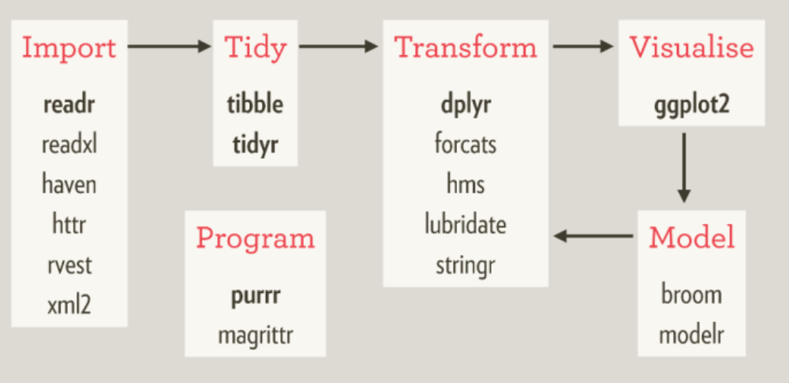
      
      - 数据导入
        - readr：read_csv(); read_tsv(); read_delim(); read_fwf(); read_table(); read_log();
        - readxl：read_xls(); read_xlsx();
        - haven：打开SAS 、SPSS、Stata等外部数据
      - 数据整理
        - tibble: 对data.frame的改进，一种数据格式
        - tidyr:清洗数据 gather(); spread();
      
      - 数据转换
        - dplyr:处理数据 mutate();select(); filter(); summarise();arrange();
        - lubridate：处理时间数据
        - stringr：处理字符串类型
        - forcats：处理因子变量（factors）
      - 数据可视化
        - ggplot2
      - 编程
        - magrittr：管道运算符
        - purr：通过提供一些完整连贯用于函数和向量的工具集，增强R的函数编程。

## 1. 开始

正确的Forcasting就像魔术，而错误的Forcasting似乎更多。下面是一些看起来可笑的预测：

- *I think there is a world market for maybe five computers.* (Chairman of IBM, 1943)

- *Computers in the future may weigh no more than 1.5 tons.* (Popular Mechanics, 1949)

- *There is no reason anyone would want a computer in their home.* (President, DEC, 1977)

  :cold_sweat:三年就被迅速打脸，IBM第一台个人电脑就推出了。

> 对于没有明显周期性的事情，越是长期预测，越不准确。

### 1.1 什么可以被预测（What can be forecast）

可预测性取决于几个因素：

1. 对影响事情发展的因素的了解程度
2. 是否有充分可用的数据
3. 预测是否会影响我们试图预测的事物

比如：预测电力需求可以非常准确。电力需求和以下因素有关：

- 主要因素：温度
- 次要因素：假期，经济情况

这些因素的历史数据可以很容易得到，这意味着我们可以建立一个模型来进行准确的预测。

相反的例子，对于货币汇率的预测，或许仅仅满足第二个条件（汇率本身变化的数据很充分），但我们并不非常清楚影响汇率的因素，而且对汇率的预测对汇率本身有直接的影响。也就是说，如果有一个预测（比如预测汇率会增长）被众人所知，人们就会立即调整他们的价格，而这使得预测被自我验证了（self-fulfilling）。

对于预测，关键的一步是知道什么时候预测是准的，什么时候预测就像投硬币。好的预测可以捕捉真实的模式和关系，而不是重复过去的事件，因为它们将再也不会发生。本书中，我们将学会区分随机波动（random fluctuation）和真实的模式（genuine pattern）。

> 股市的涨跌也是不可预测的。其原因在于，影响股市涨跌的因素（比如：宏观经济，政策，突发事件，庄家）在股市买卖数据中并没有完全体现，这就是技术分析的局限根本所在。没有任何一个人或机构可以掌握完整的数据。
>
> - 时间维度上，股市不可预测。精确预测某个时间的股市表现是不可能的。比如，我们无法预测几天后，股票会涨还是会跌。在超短时间维度上，似乎是可以预测的，比如，预测下一秒，或者下一分钟某个股票涨跌的准确率会很高，但是由于买卖交易的限制（竞价，手续费，延时等），以及你的买卖会干扰实际的价格，实际操作起来也是不可能的（文艺复兴等基金公司或许可以？）。
> - 空间维度上，股市可以预测。比如，某支股票的价格远远高于或低于其实际价值，在某个未来其价格将被修正。而要判断一个股票的价格是否背离了其价值，必须要了解这个公司是如何运作，如何盈利的，它的盈利和哪些因素直接有关系，这些直接因素又收到哪些间接因素的影响。只有了解了这些，才能进行精确的预测。巴菲特的投资理念也是如此。
>
> 由于时间维度上，无法进行精确的预测，而空间维度可以进行预测。这决定了股票投资的策略是：
>
> - 分析：综合大量数据，判断股票在空间维度上的趋势，锁定目标。
> - 等待：监控相关因素，计算事件发生概率。
> - 买入：等到事件发生概率达到买入临界值，进行买入。
> - 等待：监控相关因素，计算事件发生概率。
> - 卖出：等到事件发生概率达到卖出临界值，进行卖出。

### 1.2 预测什么（Determining what to forecast）

在开始，我们要决定应当预测什么。假设预测的是在制造业领域，需要回答以下问题：

1. 预测每个product line还是groups of products?
2. 预测总体销售额，还是每个区域的销售额？
3. 预测是周度，月度，还是年度数据？

### 1.3 预测数据和方法（Forecasting data and methods）

预测方法的选择很大程度依赖于数据，如果数据很难获取，往往采用定性预测（**qualitative forecasting** ）的方法。而要采用定量预测（**Quantitative forecasting** ）需要满足以下两个条件：

1. 过去的数据是足够的
2. 过去的模式在未来仍然会继续延续。

本书只讨论有规律间隔时间（比如：小时，日，周，月，季度，年等）的time series，对于同一不规则间隔的time series不在本书的讨论范围。

#### Time Series预测示例

下图中，显示的澳大利亚1992-2010年啤酒的产量。

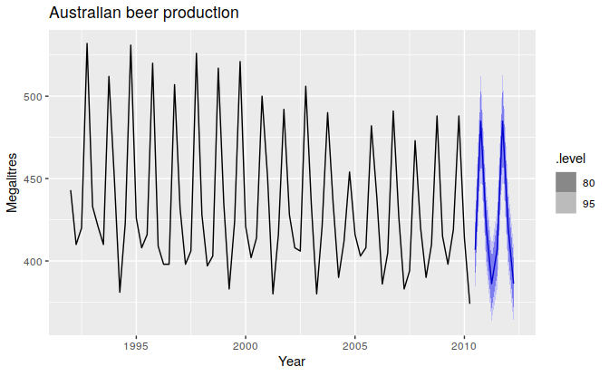

蓝色线是接下来两年的预测。预测已经获取了seasonal 模式。深色阴影显示了80%的预测间隔（意味着未来的值80%的可能性处于这个区域），而浅色阴影显示了95%的预测间隔。

由于上面的预测是最简单的time series预测，因为它仅仅推断了trend和seasonal 模式，而忽略了其它的信息：市场营销，竞争对手活动，经济条件的改变等等。

#### 预测变量（Predictor variables）和time series预测

下面以预测夏季热点地区每个小时电力需求(ED)为例。可以有下面几种模型：

- 预测变量模型：这是一种可解释模型（explanatory model），帮助我们理解哪些因素会影响电力需求。
  $$
  \begin{align*}
    \text{ED} = & f(\text{current temperature, strength of economy, population,}\\
   &  \qquad\text{time of day, day of week, error}).
  \end{align*}
  $$

- time series预测模型
  $$
  \text{ED}_{t+1} = f(\text{ED}_{t}, \text{ED}_{t-1}, \text{ED}_{t-2}, \text{ED}_{t-3},\dots, \text{error})
  $$

- mixed模型：混合前两种模型。
  $$
  \text{ED}_{t+1} = f(\text{ED}_{t}, \text{current temperature, time of day, day of week, error})
  $$

在很多情况下，我们会采用time series预测模型，这是因为：

- 系统无法理解。

  > 我也无法理解

- 很难获得预测变量在未来的值。

  > 比如，预测变量和被预测值之间是同时产生的。

- 只关心未来会发生什么，而不需要知道为什么。

#### 预测任务的基本步骤

1. 问题定义。经常这是预测中最难的一部分。

   - 预测结果如何被使用
   - 谁需要这些预测
   - 如何来收集数据，维护数据。

2. 收集信息。有两类信息

   - 统计数据
   - （数据收集和使用预测的）相关人员的业务知识和经验。

3. 初步探索分析（Preliminary (exploratory) analysis）

   通过可视化技术来展示数据。比如以下问题：

   - 是否有稳定的模式？
   - 是否有明显趋势？
   - 是否是季节性的？
   - 是否有商业周期？
   - 是否有异常数据（需要被专家来解释）？
   - 变量之间是否有强的相关性？

4. 选择和拟合模型。

5. 使用和评估预测模型。

## 2. Times Series图形

###  2.1 `tsibble` objects

详见https://github.com/tidyverts/tsibble。

#### 特性

`tsibble`对象继承了`tidy` data frame(`tibble` objects)。其独有的特性有：

- index：一个时间变量，按照从过去到现在排列

- key： 通过这个key，可以把数据分成多个组。每一组都是一个time series数据。

- key + index 构成数据的唯一键

- 数据之间的间隔（interval）必须是均匀的（Each observational unit should be measured at a common **interval**, if regularly spaced）

  | **Interval** | **Class**                 | Function            |
  | ------------ | ------------------------- | ------------------- |
  | Annual       | `integer`/`double`        | `start:end`         |
  | Quarterly    | `yearquarter`             | `yearquarter()`     |
  | Monthly      | `yearmonth`               | `yearmonth()`       |
  | Weekly       | `yearweek`                | `yearweek()`        |
  | Daily        | `Date`/`difftime`         | `as_date()`,`ymd()` |
  | Subdaily     | `POSIXt`/`difftime`/`hms` | `as_datetime()`     |

#### 创建

~~~R
library(dplyr)
library(tsibble)

show_object_type <- function(X){
    cat('X = \n')
    print(X)
    cat('class(X) =', paste(class(X), collapse=", "), '\n')
    cat('mode(X) =', mode(X), '\n')
    cat('typeof(X) =', typeof(X), '\n')
#    cat('str(X) =\n')
#    str(X)
}

weather <- nycflights13::weather %>% 
  select(origin, time_hour, temp, humid, precip)
weather_tsbl <- as_tsibble(weather, key = origin, index = time_hour)
weather_tsbl
show_object_type(weather_tsbl)

y <- tsibble(Year = 2015:2019, Observation =
             c(123,39,78,52,110), index = Year)
show_object_type(y)
~~~

#### 从文本创建

~~~R
text <- "Month, Observation
2019 Jan, 50
2019 Feb, 23
2019 Mar, 34
2019 Apr, 30
2019 May, 25
"
# 读入tibble
z <- read_csv(text, col_types = "cd")
# 转化为tsibble
z %>%
  mutate(Month= yearmonth(Month)) %>%
  as_tsibble(index = Month)
~~~

返回结果如下：

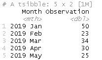

注意，其中[1M]表示time interval时一个月。

#### 读取csv 

~~~R
library(tsibble)
library(dplyr)

prison <- readr::read_csv("https://OTexts.com/fpp3/extrafiles/prison_population.csv")

prison <- prison %>%
  mutate(quarter = yearquarter(date)) %>%
  select(-date) %>%
  as_tsibble(key = c(state, gender, legal, indigenous), index = quarter)

prison
~~~

>如果无法下载数据，请设置代理
>
>~~~R
>Sys.setenv("http_proxy"="http://web-proxy.rose.hp.com:8080") 
>Sys.setenv("https_proxy"="http://web-proxy.rose.hp.com:8080") 
>~~~

#### 缺失数据补齐

可以使用`fill_gaps()`来把缺失数据补齐，避免不规则的interval

~~~
harvest <- tsibble(
  year = c(2010, 2011, 2013, 2011, 2012, 2014),
  fruit = rep(c("kiwi", "cherry"), each = 3),
  kilo = sample(1:10, size = 6),
  key = fruit, index = year
)

harvest
harvest %>%  fill_gaps(kilo = 0L)
~~~

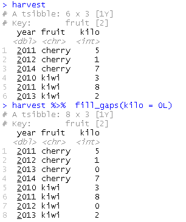

#### index_by() + summarise()

index_by和group_by类似，不同在于index_by仅仅针对index。如果相对index进行分组，必须要使用index_by。

~~~R
library(dplyr)
library(tsibble)
weather <- nycflights13::weather %>% 
  select(origin, time_hour, temp, humid, precip)
weather_tsbl <- as_tsibble(weather, key = origin, index = time_hour)
weather_tsbl

# 处理缺失的数据
full_weather <- weather_tsbl %>%
  fill_gaps(.full=T) 
na_s <- is.na(full_weather$temp) | is.na(full_weather$humid) |
  is.na(full_weather$precip) 
# 查看缺失数据
view(full_weather[na_s,])

# 处理na值
full_weather <- full_weather %>% 
  group_by_key() %>% 
  tidyr::fill(temp, humid, precip, .direction = "down")
full_weather
view(full_weather[na_s,])

# index_by + summarise
full_weather %>%
  index_by(year_month = ~ yearmonth(.)) %>% # monthly aggregates
  summarise(
    avg_temp = mean(temp, na.rm = TRUE),
    ttl_precip = sum(precip, na.rm = TRUE)
  )
~~~

####  difference

计算时间序列中差分。

~~~R
x <- cumsum(cumsum(1:10))
x
difference(x, lag = 1)
difference(x, lag = 2)
difference(x, differences = 1)	# 一阶差分
difference(x, differences = 2)	# 二阶差分
~~~

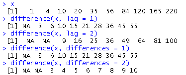

### 2.2 Time plots

下面显示Ansett 航空公司在澳洲最大的两个城市之间每周经济仓乘客量。

~~~R
library(fpp3)
melsyd_economy <- ansett %>%
  filter(Airports == "MEL-SYD", Class=="Economy")
melsyd_economy %>%
  autoplot(Passengers) +
    labs(title = "Ansett economy class passengers", subtitle = "Melbourne-Sydney") +
    xlab("Year")
~~~

`autoplot()`自动产生合适的图形，由于识别到`tisbble`是一个time series，所以产生一个time plot。

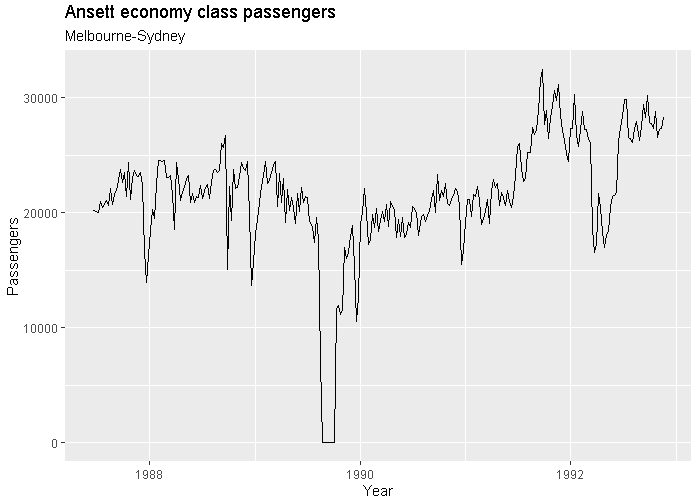

### 2.3 Time series patterns

- 趋势（Trend）

  下图中，很明显有一个长期（long-term）增长的趋势。

  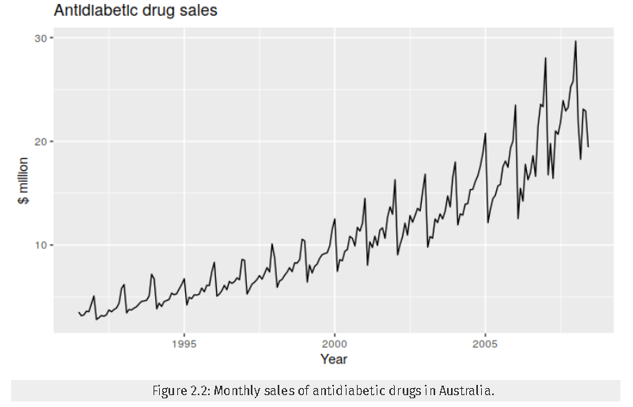

  

- 季节性（Seasonal ）：固定的一段时间。年，季度，月，或者周

  上图中，很明显季度因子是一年。

- 周期性（Cyclic）：数据体现周期性，但这个周期并不是固定的频率。这种数据的波动通常是由于经济条件，所以经常被称之为"商业周期"。这种周期比起季节性的跨度药更大，一般至少两年。

下面以几个time plot来观察数据的特性：

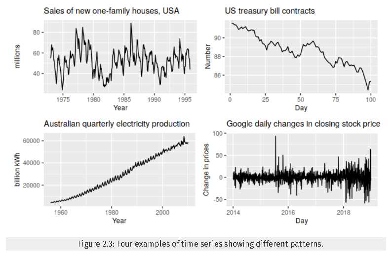

1. 美国新建房屋月度销售数据（The monthly housing sales）
   - Trend: 无
   - Seasonal： Year。一年里有明显的周期
   - Cyclic： 6-10年一个周期。
2. 1981年芝加哥地区美国短期国库券合约（The US treasury bill contracts）连续100天交易数量。
   
   - Trend: 向下
   - Seasonal： 无
   - Cyclic： 无。实际上，如果有更多数据，可能可以发现处于一个周期中。
3. 澳大利亚季度电力产量（The Australian quarterly electricity production）
   - Trend: 向上
   - Seasonal： Year。很明显，波动非常固定，有规律。
   - Cyclic： 无

4. Google公司每日的收盘价（The daily change in the Google closing stock price）

   - Trend: 无
   - Seasonal： 无
   - Cyclic： 无

   呈现随机波动的特点，这种数据是无法预测的。

### 2.4 Seasonal plots

`vic_elec` 包含澳洲Victoria州了半小时电力需求。 下面来观察以下daily pattern, weekly pattern, yearly pattern。

- daily pattern

  ~~~R
  library(fpp3)
  vic_elec %>% gg_season(Demand, period="day") + theme(legend.position = "none")
  ~~~

  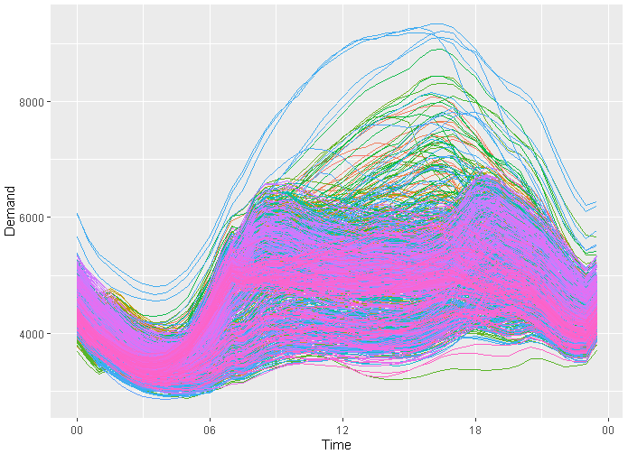

- weekly pattern

  ~~~R
  vic_elec %>% gg_season(Demand, period="week") + theme(legend.position = "none")
  ~~~

  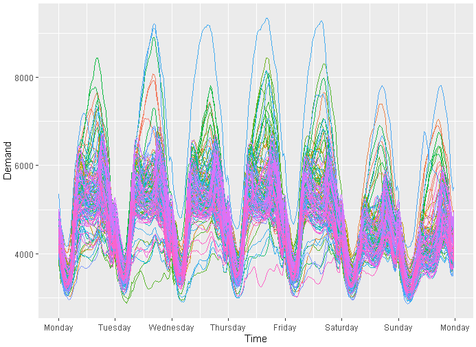

- yearly pattern

  ~~~R
  vic_elec %>% gg_season(Demand, period="year")
  ~~~

  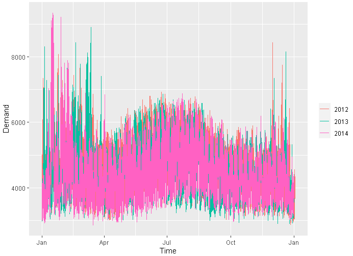

### 2.5 Seasonal subseries plots

#### Example: 澳大利亚人假期旅游（Australian holiday tourism）

~~~R
library(fpp3)
holidays <- tourism %>%
  filter(Purpose == "Holiday") %>%
  group_by(State) %>%
  summarise(Trips = sum(Trips))

holidays
holidays %>% autoplot(Trips) +
  ylab("thousands of trips") + xlab("Year") +
  ggtitle("Australian domestic holiday nights")
~~~

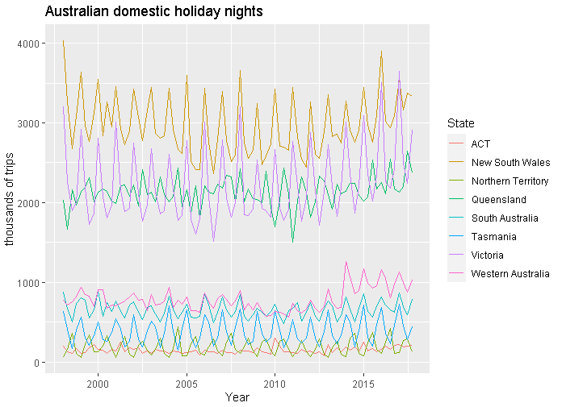

上图中可以看出：

- Trend: 无
- Seasonal： 强烈。但seasonal peak并不一致。
- Cyclic： 无

下面进一步观察seasonal peak。

~~~R
holidays %>% gg_season(Trips) +
  ylab("thousands of trips") +
  ggtitle("Australian domestic holiday nights")
~~~

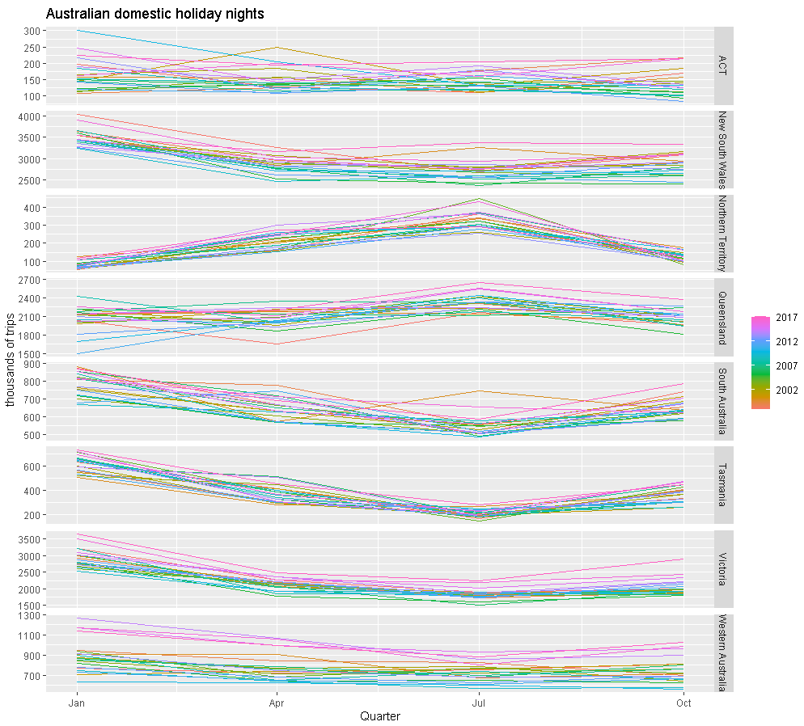

~~~R
holidays %>%
  gg_subseries(Trips) + ylab("thousands of trips") +
  ggtitle("Australian domestic holiday nights")
~~~

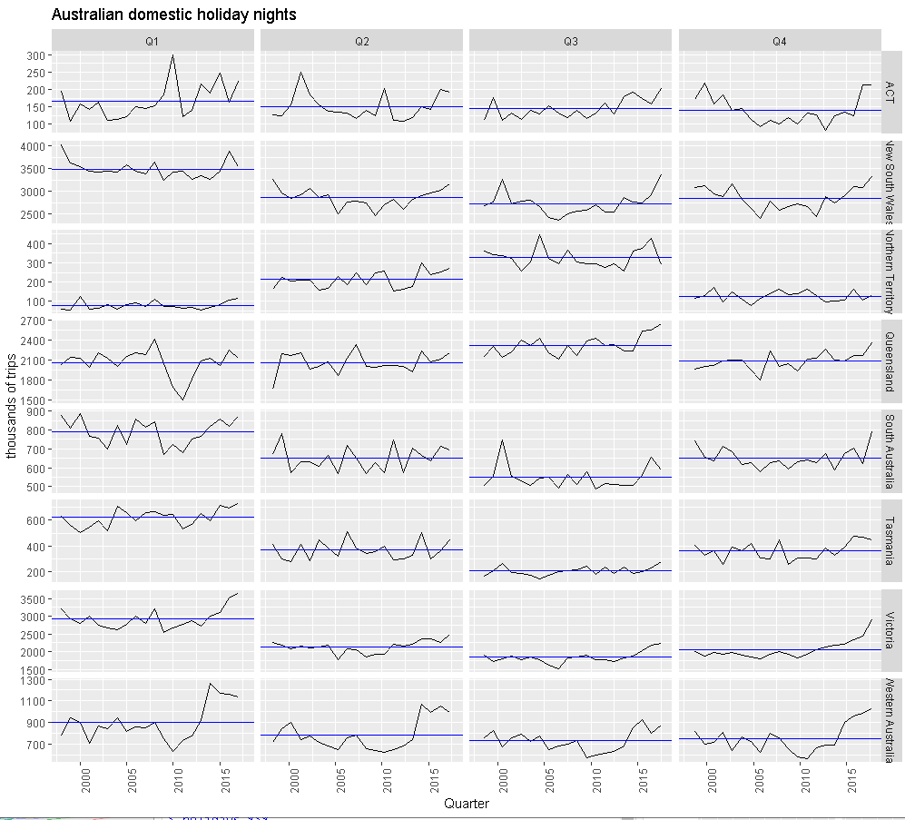

### 2.6 散点图（Scatterplots）

`vic_elec` 包含澳洲Victoria州了半小时电力需求。下面的代码生成散点图，可以分析每四个小时电力需求和平均温度的关系。

~~~R
library(fpp3)
vic_elec %>%
  filter(year(Time) == 2014) %>% 
  index_by(Time1=floor_date(Time,  "4 hour"))  %>% 
  summarise(
    Temperature = mean(Temperature, na.rm = TRUE),
    Demand = sum(Demand, na.rm = TRUE)
  ) %>% 
  ggplot(aes(x = Temperature, y = Demand)) +
    geom_point() +
    ylab("Demand (GW)") + xlab("Temperature (Celsius)")
~~~

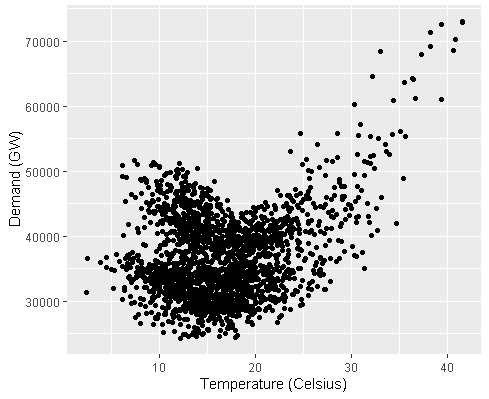

> index_by: tsibble的函数，用于在时间轴上对数据的粒度进行限制。

可以看出：

- 温度越高，电力消耗增加很快。可能是空调的使用
- 温度越低，电力消耗也会增加。主要是暖气的使用。

#### 相关系数（Correlation）

散点图可以让我们对数据相关性，有一个感性的认识，而相关系数可以定量描述了它们的关系。公式如下：
$$
r = \frac{\sum (x_{t} - \bar{x})(y_{t}-\bar{y})}{\sqrt{\sum(x_{t}-\bar{x})^2}\sqrt{\sum(y_{t}-\bar{y})^2}}.
$$
相关系数和散点图的对应关系如下。

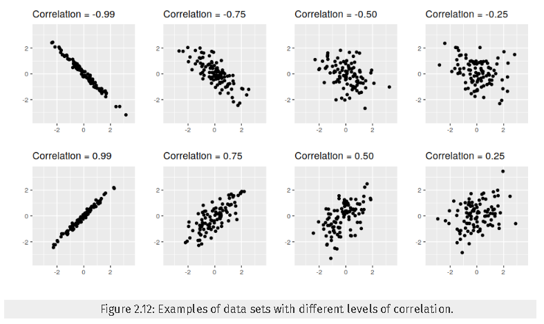

相关系数刻画了变量之间的线性关系，如果变量之间不存在线性关系，可能会有误导。比如上个例子中，Temperature和Demand之间，是有很强的相互关联的（非线性关系），但是它们的相关系数只有0.26。

~~~R
library(fpp3)
cor(vic_elec$Demand, vic_elec$Temperature)
~~~

反过来也是，有些数据相关系数很高，但是其并不一定有线性关系。

~~~R
attach(anscombe)
opar <- par(no.readonly=TRUE)
par(mfrow=c(2,2), mar=c (2,2,2,2))
plot(x1, y1, xlab = "", ylab = "", main = bquote(paste("a. ", italic(r), "= ",.(round(cor(x1, y1),2)))))
abline(3,0.5) 
plot(x2, y2, xlab = "", ylab = "",, main = bquote(paste("b. ", italic(r),  "= ",.(round(cor(x2, y2),2)))))
abline(3,0.5) 
plot(x3, y3, xlab = "", ylab = "",, main = bquote(paste("c. ", italic(r), "= ",.(round(cor(x3, y3),2)))))
abline(3,0.5) 
plot(x4, y4, xlab = "", ylab = "",, main = bquote(paste("d. ", italic(r), "= ",.(round(cor(x4, y4),2)))))
abline(3,0.5) 
par(opar)
detach(anscombe)
~~~

上面代码运行结果如下。四组数据其相关系数都是0.82，但是a，d明显不是线性关系，而c有异常值（实际相关系数更高）。

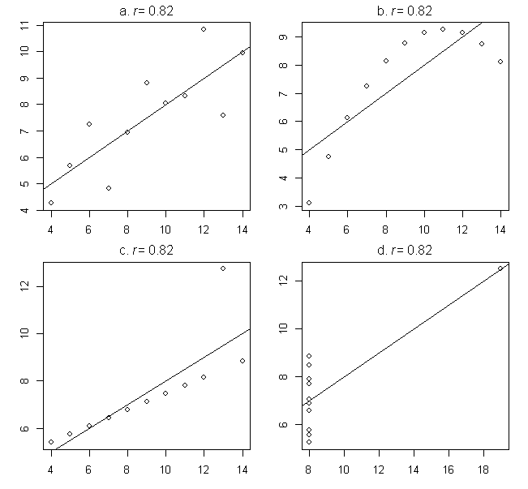

下面是更加有意思的例子，来自[Same Stats, Different Graphs: Generating Datasets with Varied Appearance and Identical Statistics through Simulated Annealing](https://www.autodeskresearch.com/publications/samestats)。

> 相关系数，从几何上可以理解为两个（中心化后）向量的余弦夹角。

#### Scatterplots 矩阵

再次来观察澳大利亚人假期旅游（Australian holiday tourism），首先显示每个州的time plot。

~~~R
library(fpp3)
library(GGally)
visitors <- tourism %>%
  group_by(State) %>%
  summarise(Trips = sum(Trips))
visitors %>%
  ggplot(aes(x = Quarter, y = Trips)) +
    geom_line() +
    facet_grid(vars(State), scales = "free_y") +
    ylab("Number of visitor nights each quarter (millions)")
~~~

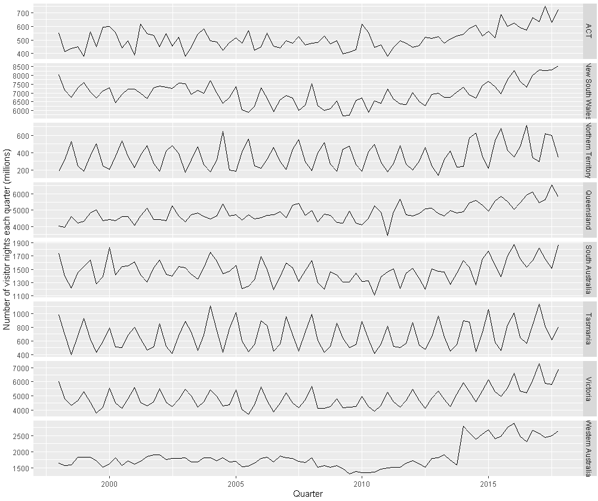

然后显示各个州的数据之间的相关系数矩阵。

~~~R
visitors %>%
  spread(State, Trips) %>%
  GGally::ggpairs(columns = 2:9)
~~~

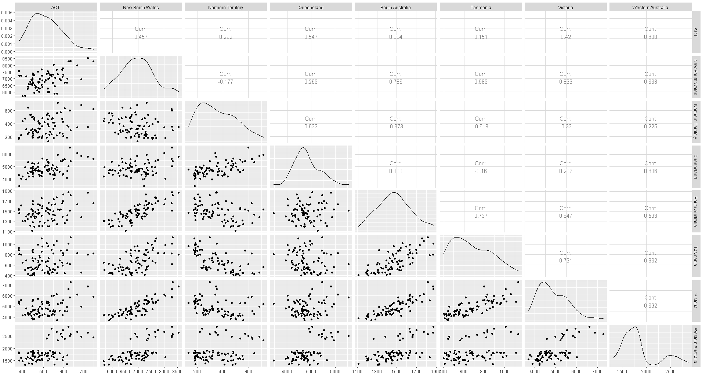

可以发现：

1. 相邻的州其正向相关比较强
2. 南部的州和北部的州呈现负相关。

### 2.7 Lag plots

下面分析澳大利亚季度啤酒产量。

~~~R
library(fpp3)
recent_production <- aus_production %>% filter(year(Quarter) >= 1992)
recent_production %>% autoplot(Beer) + 
  ggtitle("Australian Beer Production")
~~~

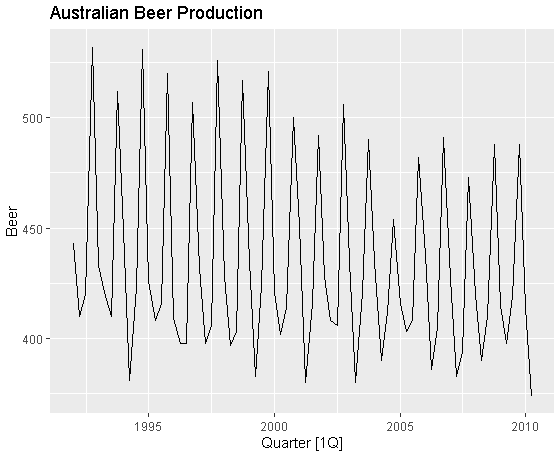

不难看出：

- Trend： 销量逐渐下降
- Seasonality： 明显的周期性
- Cyclicity：无

然后看lag散点图。

~~~R
recent_production %>% gg_lag(Beer, geom="point")
~~~

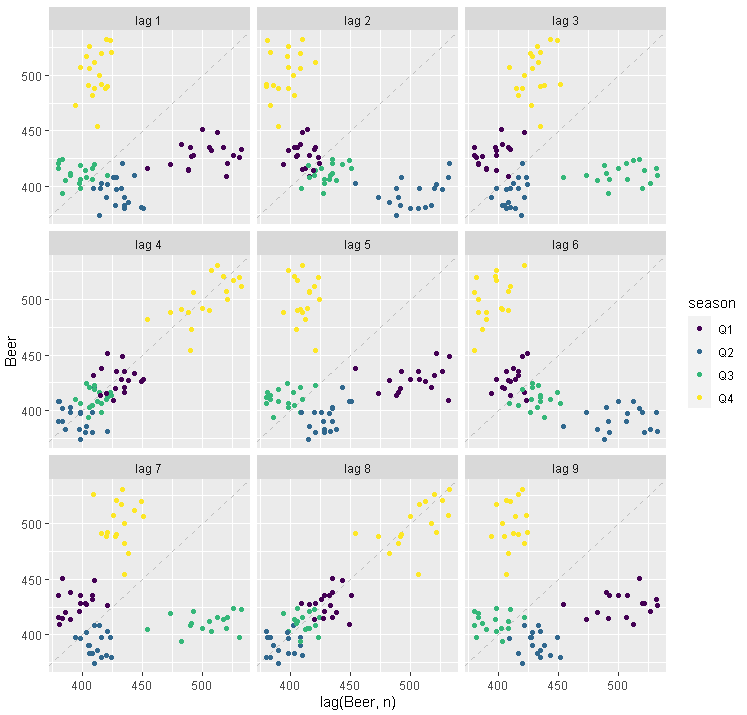

从上面图中可以发现：

- lag 4和lag 8体现了强烈的正相关性。季节性特性明显（周期为4）。
- lag 2和lag 6体现了强烈的负相关性。夏季和冬季的销量正好相反

### 2.8 自相关（Autocorrelation）

上节中，Lag plots可以显示自相关性，同样可以量化这一指标，即计算自相关系数（autocorrelation coefficients）。公式如下：
$$
r_{k} = \frac{\sum\limits_{t=k+1}^T (y_{t}-\bar{y})(y_{t-k}-\bar{y})}
 {\sum\limits_{t=1}^T (y_{t}-\bar{y})^2},
$$
计算自相关系数函数`ACF`

~~~R
recent_production %>% ACF(Beer, lag_max = 9)
~~~

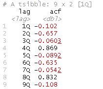

自相关图（ACF plot）

~~~
recent_production %>% ACF(Beer) %>% autoplot()
~~~

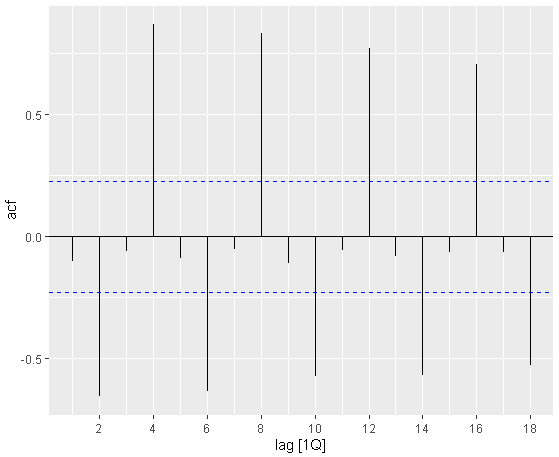

和Lag plots类似，我们可以很容易得到以下结论。

1. r4, r8, r12, r16 有很强的正相关，其中r4是最强的相关性，然后依次降低
2. r2, r6, r10, r14, r18有很强的负相关，其中r2是最强的相关性，然后依次降低
3. 蓝色线用于指示相关性的显著程度。

上面第1，2点，进一步验证了前面观察到的Trend和Seasonality。

### 2.9 白噪音（White noise）

白噪声是一个对所有时间其自相关系数为零的随机过程。也就是说，白噪声表现在任何两个时点的随机变量都不相关，序列中没有任何可以利用的动态规律，因此不能用历史数据对未来进行预测和推断。白噪音数学定义如下：

如果时间序列$\{\epsilon_t, t=1,2,3,...,T\}$满足：

1. $ E(\epsilon_t)=0$
2. $ Var(\epsilon_t)=\sigma^2$
3. 当$k!= 0, 相关系数：Cov(\epsilon_t, \epsilon_{t+k})=0$

则称该序列为白噪声（white noise）。

~~~R
library(fpp3)
set.seed(30)
y <- tsibble(sample = 1:100, wn = rnorm(100), index = sample)
y %>% autoplot(wn) + ggtitle("White noise")
~~~

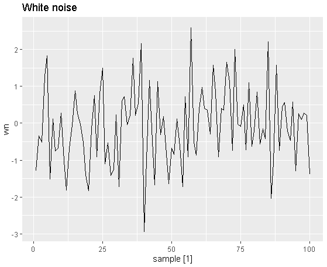

~~~
y %>% ACF(wn) %>% autoplot()
~~~

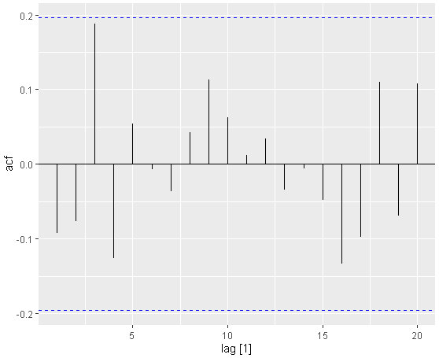

对于平稳的时间序列，理想情形是自相关函数在一定的条件下服从正态分布，当样本量n很大时，相关落在区间$[-\frac {1.96} {\sqrt n}, \frac {1.96} {\sqrt n}]$（书中提到的区间是$[-\frac {2} {\sqrt n}, \frac {2} {\sqrt n}]$）的概率为95%，ACF plot中的两条蓝色虚线就是这个范围。

> 蓝色虚线的计算，或许是这样（好像推不下去了）
> $$
> \begin{align}
> r &= \frac{\sum (x_{t} - \bar{x})(y_{t}-\bar{y})}{\sqrt{\sum(x_{t}-\bar{x})^2}\sqrt{\sum(y_{t}-\bar{y})^2}}  \\
> &= \frac 1 n \sum  \frac {(x_{t} - \bar{x})} {\sqrt{\frac 1 n \sum(x_{t}-\bar{x})^2}} \frac {(y_{t} - \bar{y})} {\sqrt{\frac 1 n \sum(y_{t}-\bar{y})^2}}  \\
> &= \frac 1 n \sum  x_t^{'} y_t^{'}
> \end{align}
> $$
>
> 其中
> $$
> x_t^{'} =  \frac {(x_{t} - \bar{x})} {\sqrt{\frac 1 n \sum(x_{t}-\bar{x})^2}},  y_t^{'} =  \frac {(y_{t} - \bar{y})} {\sqrt{\frac 1 n \sum(y_{t}-\bar{y})^2}}
> $$
> 假设$x, y$都是相互独立的正态分布，则$x^{'},y^{'} $分别服从标准正态分布$\mathcal{N}(0,\,1)$。则认为$r$符合$\mathcal{N}(0,\,\frac 1 n)$分布。（中间过程没法推，好像有漏洞）。

#### Barlett定理

上面自我的推导虽然没有成功，但其描述的就是Barlett定理。其定义如下：

观察期数为 $n$ 的观察序列，若为纯随机序列，则该序列延迟非零期的样本自相关系数$\hat \rho_k$近似服从正态分布$\mathcal{N}(0,\,\frac 1 n)$。95%的置信空间计算方法如下：

~~~R
qnorm(0.975)	# 返回1.959964
qnorm(0.025)	# 返回1.959964
~~~
Python代码如下。

~~~python
from scipy.stats import norm

print(norm.ppf(0.975))  # 计算上限
print(norm.ppf(0.025))  # 计算下限
~~~
上面的结果，说明了1.96的由来。

#### 白噪音的检验

白噪音检查的应用非常广泛，一般来说，对时间序列预测后，需要进行残差（residual）分析，检查残差是否是白噪音。如果残差是白噪音，则说明序列中有用的信息已经被提取完毕了，剩下的全是随机扰动，是无法预测和使用的。如果残差不是白噪声，就说明残差中还有有用的信息，需要修改模型或者进一步提取。

- Box.test()

  Box.test()是对randomness的检验，基于一系列滞后阶数，判断序列总体的相关性或者说随机性是否存在。原假设为序列为白噪音，当p<0.05，拒绝原假设，即序列不是白噪音。

  ~~~R
  set.seed(30)
  y <- tsibble(sample = 1:100, wn = rnorm(100), index = sample)
  Box.test(y$wn, lag=log(length(y$wn)), type='Ljung')
  ~~~

  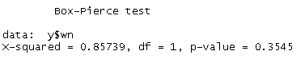

- acf()：检验残差滞后各ACF期是否存在显著的自相关性。

  ~~~R
  y %>% ACF(wn) %>% autoplot()
  ~~~

  

  除去lag(1)，其它lag都在95%置信区间之内。如果95%的lag在95%置信区间内，则认为序列是白噪音。

- pacf()：检验残差滞后各期是否存在显著的偏自相关性。

  ~~~R
  y %>% PACF(wn) %>% autoplot()
  ~~~

  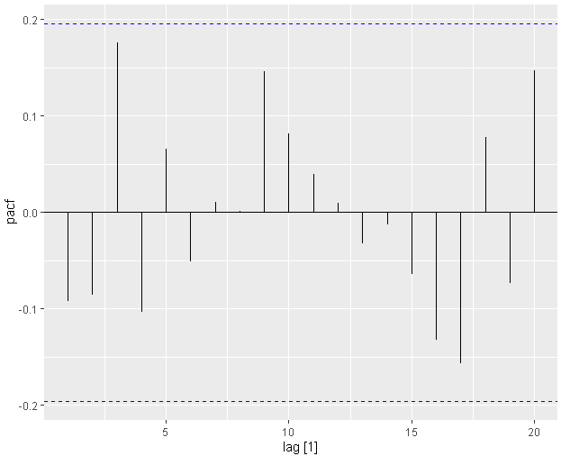

  所有lag都在95%置信区间之内。

- qqnorm()，qqline()：画出qq图，检验序列服从正态分布。

  统计分布的检验有很多种，例如KS检验、卡方检验等，从图形的角度来说，可以用**QQ图**（Quantile-Quantile Plots）来检查数据是否服从某种分布。

  ~~~R
  qqnorm(y$wn)
  qqline(y$wn, col=2, lwd=2)
  ~~~

- Kolmogorov-Smirnov检验和Shapiro - Wilk检验

  - 样本含量3≤n ≤5000 时，Shapiro - Wilk 检验为准
  - 样本含量n >5000 时，Kolmogorov-Smirnov 检验为准

  ~~~R
  ks.test(y$wn，"pnorm", mean=mean(y$wn), sd=sd(y$wn))
  shapiro.test(y$wn)
  ~~~

  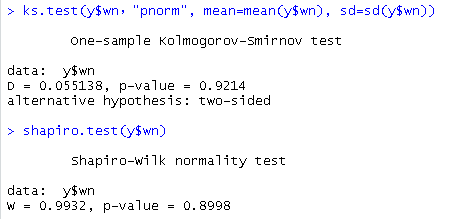

  p值>0.05，不能拒绝该分布是正态分布

## 3. 时间序列分解（Time Series Decomposition）

观察时间序列，可以发现不同的pattern，这能够有助于把时间序列才分成不同的组件。每一个组件都表示了底层运行的pattern。

在2.3一节中，谈到有三种时间序列pattern: 趋势（Trend），季节性（Seasonality）和周期性（Cycle），当分解time series时，通常会把trend和cycle合并成trend-cycle。由此，可以把组件分为三类：

- 趋势-周期（Trend-Cycle） 
- 季节性（Seasonal)
- 其它

### 3.1 转换（Transformation）和调整（Adjustment）

- 日历：比如，可以使用每月平均值来消除每个月的天数的差异。

- 人口（Population）：比如，分析某个地区医院的床位数，就必须要考虑到该地区人口的增长，有时，床位数增加了，但人均的床位数反而下降，这是由于总人口的增速大于床位的增速。所以，使用人均数量往往比总量更加的好。

  ~~~R
  global_economy %>%
    filter(Country == "Australia" | Country == "China" | Country == "United States") %>%
    autoplot(GDP/Population)
  ~~~

  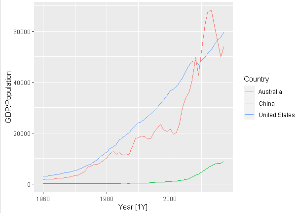

  > 从上面这个图，似乎时美国和澳大利亚人均GDP增加更快，但实际情况时中国的增速更快。原因何在呢？

  - 通货膨胀（Inflation）

    经常会使用CPI（Consumer Price Index）来调整。

    ~~~R
    print_retail <- aus_retail %>%
      filter(Industry == "Newspaper and book retailing") %>%
      group_by(Industry) %>%
      index_by(Year = year(Month)) %>%
      summarise(Turnover = sum(Turnover))
    aus_economy <- global_economy %>%
      filter(Code == "AUS")
    print_retail %>%
      left_join(aus_economy, by = "Year") %>%
      mutate(Adjusted_turnover = Turnover / CPI) %>%
      gather("Type", "Turnover", Turnover, Adjusted_turnover, factor_key = TRUE) %>%
      ggplot(aes(x = Year, y = Turnover)) +
        geom_line() +
        facet_grid(vars(Type), scales = "free_y") +
        xlab("Years") + ylab(NULL) +
        ggtitle("Turnover for the Australian print media industry")
    ~~~

    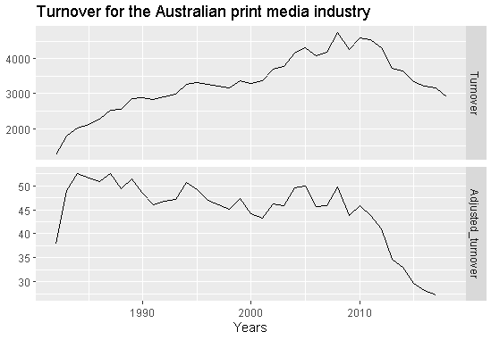

    上图中可以明显看出，如果使用CPI调整，会发现`Newspaper and book retailing`行业从很早开始，已经陷入了衰退。

    > CPI：即居民消费价格指数，是一个反映居民家庭一般所购买的消费品和服务项目价格水平变动情况的宏观经济指标。
    >
    > CPI=（一组固定商品按当期价格计算的价值除以一组固定商品按基期价格计算的价值）×100%。
    >
    > 例如，若1995年某国普通家庭每个月购买一组商品的费用为1000元，而2000年购买这一组商品的费用为1100元，以1995年为基期，那么：
    > $$
    > CPI_{1995}= (1000/1000) = 1 \\ 
    > CPI_{2000}=（1100/1000) = 1.1
    > $$
    > 实际在日常生活中，通常往往关注的是CPI增长，即当期CPI的同比和环比。中国居民的CPI增长是较高的，见[中国 居民消费价格指数（CPI）增长](https://www.ceicdata.com/zh-hans/indicator/china/consumer-price-index-cpi-growth)。

  - 数学（Mathematica）

    - log
      $$
      w_t = \log(y_t) \\
      $$

    - 指数
      $$
      w_{t} = y_{t}^p
      $$

    - Box-Cox变换：把数据转化为正态分布
      $$
      y(\lambda)=
      \left\{
      \begin{aligned}
       & \frac { y^{\lambda}-1} \lambda ,  & \lambda \neq 0 \\
      & ln(y) ,    &  \lambda = 0 \\
      \end{aligned}
      \right.
      $$
      

      详见[Transformations and adjustments](https://otexts.com/fpp3/transformations.html)

      ~~~R
      lambda <- aus_production %>%
        features(Gas, features = guerrero) %>%
        pull(lambda_guerrero)
      
      shapiro.test(aus_production$Gas)	# p-value = 2.873e-10
      
      aus_production <- aus_production %>% 
        mutate(adjust_Gas=box_cox(Gas, lambda))
      aus_production %>% autoplot(adjust_Gas) 
      
      # 调整后，仍然不是正态分布
      shapiro.test(aus_production$adjust_Gas) # p-value = 7.016e-14
      ~~~

      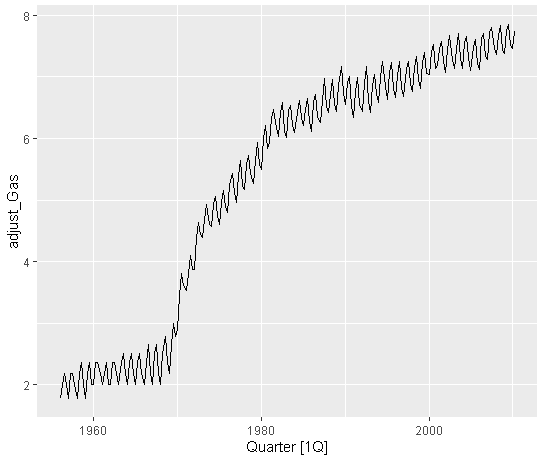

### 3.2 时间序列成分（Time Series Components）

有两种分解的方法：

- additive decompositon：
  $$
  y_{t} = S_{t} + T_{t} + R_t
  $$

- multiplicative decomposition
  $$
  y_{t} = S_{t} \times T_{t} \times R_t
  $$

其中$y_t$是原时间序列，$S_t$是周期（seasonal）分量，$T_t$是趋势（ trend-cycle）分量，$R_t$是余项（remainder ）。

- 当$S_t，T_t，R_t$呈现线性关系时，建议使用additive decompositon

- 当$S_t，T_t，R_t$呈现非线性关系时，建议使用multiplicative decomposition，常用于经济的时间序列。

  通过log可以，把multiplicative 转化成additive 
  $$
  y_{t} = S_{t} \times T_{t} \times R_t \quad\text{is equivalent to}\quad
    \log y_{t} = \log S_{t} + \log T_{t} + \log R_t
  $$
  

下面的例子将使用STL分解的方法来获取各个分量。

#### 美国零售业月度员工数

~~~R
library(fpp3)
us_retail_employment <- us_employment %>%
  filter(year(Month) >= 1990, Title == "Retail Trade") %>%
  select(-Series_ID)
us_retail_employment %>%
  autoplot(Employed) +
  xlab("Year") + ylab("Persons (thousands)") +
  ggtitle("Total employment in US retail")
  
~~~

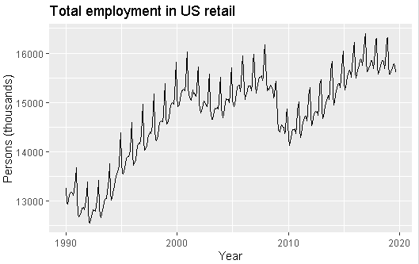

#### STL分解

~~~R
dcmp <- us_retail_employment %>%
  model(STL(Employed))
components(dcmp)
~~~

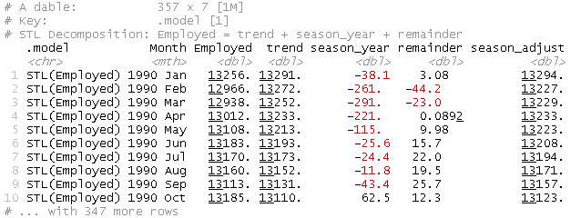

~~~
components(dcmp) %>% autoplot() + xlab("Year")
~~~

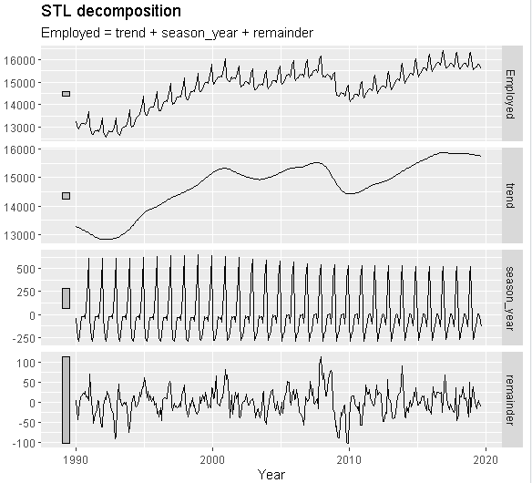

> STL（Seasonal and Trend decomposition using Loess），其中Loess即Lowess（locally weighted scatterplot smoothing）为局部加权回归，是对两维散点图进行平滑的常用方法。在3.7小节有详细分析。

#### Trend分量

即$ T_t $，忽略了周期分量和余项。

~~~R
us_retail_employment %>%
  autoplot(Employed, color='gray') +
  autolayer(components(dcmp), trend, color='red') +
  xlab("Year") + ylab("Persons (thousands)") +
  ggtitle("Total employment in US retail")
~~~

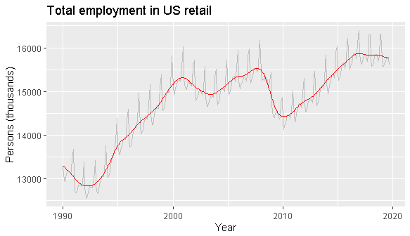

#### Seasonally adjusted data

即$y_{t}-S_{t}$

~~~R
us_retail_employment %>%
  autoplot(Employed, color='gray') +
  autolayer(components(dcmp), season_adjust, color='blue') +
  xlab("Year") + ylab("Persons (thousands)") +
  ggtitle("Total employment in US retail")
~~~

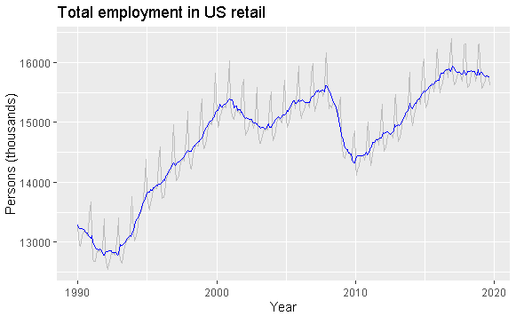

### 3.3 移动平均（Moving Averages）

移动平均是经典的时间序列分解方法之一，它是很多其它分解方法的基础。早在上个世纪20年代，该方法就开始被使用，而在50年代被广泛使用。

#### 移动平均平滑

公式如下：
$$
\begin{equation}
  \hat{T}_{t} = \frac{1}{m} \sum_{j=-k}^k y_{t+j}
\end{equation}
$$
称之为$m$-**MA**，其中$m=2k+1$。在每个一个时间点计算自身及其前后$k$个点的平均。移动平均能够很大程度减少数据的随机性，而保留下Trend-Cycle分量。

~~~R
global_economy %>%
  filter(Country == "China" | Country == "India" | Country == "Vietnam") %>%
  autoplot(Exports) +
  xlab("Year") + ylab("% of GDP") +
  ggtitle("Total China exports")
~~~

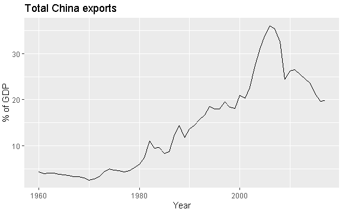

> 上图可以看到，中国的出口占GDP的比重，在2006达到峰值后，快速下降，这说明中国的经济越来越靠内需而不是出口了。如果比较印度，越南，德国，日本，美国，可以发现越南和德国的出口依存度非常高，也就意味着2020年新冠状病毒疫情对这两个国家的影响是异常大的。由于越南的经济是加工出口页为主，需要大量进口，同时大量出口，这造成出口占GDP比重过大。
>
> ~~~R
> global_economy %>%
>   filter(Country %in% c("China", "India", "Vietnam", "Japan", "Germany", "United States")) %>%
>   autoplot(Exports) +
>   xlab("Year") + ylab("% of GDP") +
>   ggtitle("Total China exports")
> ~~~
>
> 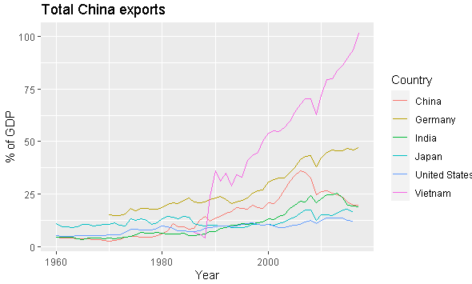

添加中国出口五年平均。

~~~R
china_exports <- global_economy %>%
  filter(Country == "China") %>%
  mutate(
    `5-MA` = slide_dbl(Exports, mean, .size = 5, .align = "center")
  )

china_exports %>%
  autoplot(Exports) +
  autolayer(china_exports, `5-MA`, color='red') +
  xlab("Year") + ylab("Exports (% of GDP)") +
  ggtitle("Total China exports") +
  guides(colour=guide_legend(title="series"))
~~~

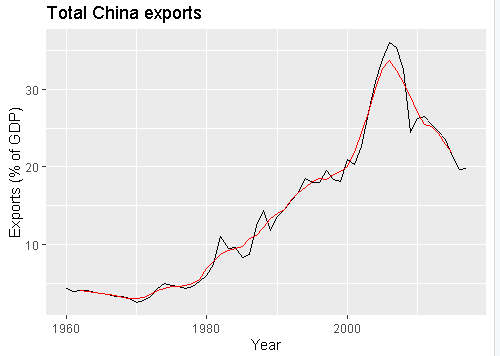

> slide_dbl：滚动窗口。
>
> autolayer()：可以用来添加一条曲线。

#### 移动平均的移动平均

下面计算$2\times4$-MA。
$$
\begin{align*}
  \hat{T}_{t} &= \frac{1}{2}\Big[
    \frac{1}{4} (y_{t-2}+y_{t-1}+y_{t}+y_{t+1}) +
    \frac{1}{4} (y_{t-1}+y_{t}+y_{t+1}+y_{t+2})\Big] \\
             &= \frac{1}{8}y_{t-2}+\frac14y_{t-1} +
             \frac14y_{t}+\frac14y_{t+1}+\frac18y_{t+2}.
\end{align*}
$$

~~~R
china_exports_ma <- global_economy %>%
  filter(Country == "China") %>%
  mutate(
    `4-MA` = slide_dbl(Exports, mean, .size = 4, .align = "cr"),
    `2x4-MA` = slide_dbl(`4-MA`, mean, .size = 2, .align = "cl")
  )

china_exports_ma %>%
  autoplot(Exports, color='gray') +
  autolayer(china_exports_ma, vars(`2x4-MA`), color='red') +
  autolayer(china_exports_ma, vars(`4-MA`), color='blue') +
  xlab("Year") + ylab("Exports (% of GDP)") +
  ggtitle("Total China exports") +
  guides(colour=guide_legend(title="series"))
~~~

> cl : center-left
>
> cr : center-right

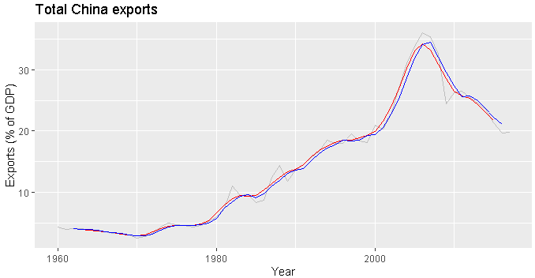

可以发现`2x4-MA`曲线，更加的平滑。

#### 估计seasonal数据的trend-cycle

中心化的移动平均（centred moving averages）最通用的用途是估计seasonal数据的trend-cycle。中心化指的时$y_t$总是处于公式的中心。由此，基本规则是：

- 当seasonality（m）是偶数：采用$2×m$-MA 
- 当seasonality（m）是技术：采用$m$-MA 

~~~R
library(fpp3)
us_retail_employment <- us_employment %>%
  filter(year(Month) >= 1990, Title == "Retail Trade") %>%
  select(-Series_ID)
us_retail_employment_ma <- us_retail_employment %>%
  mutate(
    `6-MA` = slide_dbl(Employed, mean, .size = 6, .align = "cr"),  
    `2x6-MA` = slide_dbl(`6-MA`, mean, .size = 2, .align = "cl"),
    `12-MA` = slide_dbl(Employed, mean, .size = 12, .align = "cr"),
    `2x12-MA` = slide_dbl(`12-MA`, mean, .size = 2, .align = "cl")
  )

dcmp <- us_retail_employment %>%
  model(STL(Employed))

us_retail_employment_ma %>%
  autoplot(Employed, color='gray') +
  autolayer(us_retail_employment_ma, vars(`2x12-MA`), color='red') +
  autolayer(components(dcmp), trend, color='blue') +
  autolayer(us_retail_employment_ma, vars(`2x6-MA`), color='green') +
  xlab("Year") + ylab("Persons (thousands)") +
  ggtitle("Total employment in US retail") +
  guides(colour=guide_legend(title="series"))

~~~

从time plot中可以看出，雇员数量的周期是12个月，所以采用$2×12$-MA （见红线）。上图中，蓝色线是STL分解的趋势线，而绿线是$2×6$-MA 

- 2x12-MA较好的体现了趋势走向。可以发现红色，蓝色线基本重合（虽然，实际上STL的趋势计算的逻辑要复杂得多）。

- 2x6-MA还是体现了很多seasonality的波动。当m<seasonality时，都会呈现这种波动。
  
  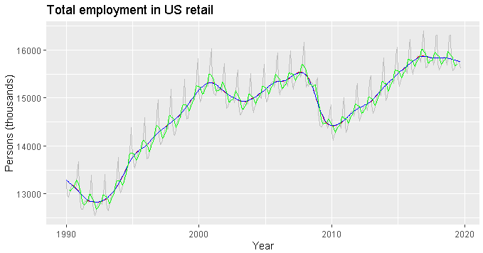

#### 加权移动平均（Weighted  Moving Averages）

公式如下
$$
\hat{T}_t = \sum_{j=-k}^k a_j y_{t+j}
$$

其中$\sum_{j=-k}^{k}a_j=1，a_j=a_{-j}$

上节中，中心化移动平均其实是加权移动平均的一种特例。

### 3.4 经典分解（Classical decomposition）

和移动平均相似，Classical decomposition也是源自上世纪20年代。它相对简单并且是大部分其它分解方法的基础。有两种经典分解方法：

- additive decomposition
- multiplicative decomposition

在Classical decomposition中，假设周期性成分是恒定不变的。

#### 加法分解（Additive decomposition）

步骤如下：

1. 计算trend-cycle 成分$\hat{T}_t$。采用了移动平均来计算。
   - 当seasonality（m）是偶数：采用$2×m$-MA 
   - 当seasonality（m）是技术：采用$m$-MA 
2. 计算去趋势（detrended ）序列：$y_t - \hat{T}_t$
3. 估计周期（seasonal ）成分$\hat{S}_t$：计算每一个season的detrended序列的平均值。比如：某个月度时间序列的周期是12个月，分别计算每一个月的平均值，这样可以获得12个值，这些值构成了$\hat{S}_t$。显然这种方法的计算，会使得所有年度的周期（seasonal ）成分完全相同。
4. 计算余项（remainder component）：$\hat{R}_t = y_t - \hat{T}_t - \hat{S}_t$

下面是上述步骤的示例。

~~~R
library(fpp3)
us_retail_employment <- us_employment %>%
  filter(year(Month) >= 1990, Title == "Retail Trade") %>%
  select(-Series_ID)
us_retail_employment %>%
  model(classical_decomposition(Employed, type = "additive")) %>%
  components() %>%
  autoplot() + xlab("Year") +
  ggtitle("Classical additive decomposition of total US retail employment")
~~~

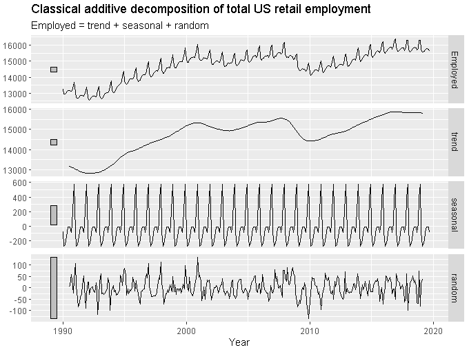

> **question**：经典分解法采用了移动平均来计算trend-cycle，但是m是如何确定的。目前猜想是依次尝试多个m，得到其trend-cycle，然后分析其lag自相关系数，或者比较去趋势后的方差，但究竟是如何进行的呢？

#### 乘法分解（Multiplicativedecomposition）

步骤和加法分解几乎相同。

1. 计算trend-cycle 成分$\hat{T}_t$。
   - 当seasonality（m）是偶数：采用$2×m$-MA 
   - 当seasonality（m）是技术：采用$m$-MA 
2. 计算去趋势（detrended ）序列：$ {y_t} / {\hat{T}_t}$
3. 估计周期（seasonal ）成分$\hat{S}_t$：计算每一个season的detrended序列的平均值。比如：某个月度时间序列的周期是12个月，分别计算每一个月的平均值，这样可以获得12个值，这些值构成了$\hat{S}_t$。显然这种方法的计算，会使得所有年度的周期（seasonal ）成分完全相同。
4. 计算余项（remainder component）：$\hat{R}_{t} = y_t /( \hat{T}_t \hat{S}_t)$

下面是上述步骤的示例。

~~~R
us_retail_employment %>%
  model(classical_decomposition(Employed, type = "multiplicative")) %>%
  components() %>%
  autoplot() + xlab("Year") +
  ggtitle("Classical additive decomposition of total US retail employment")
~~~

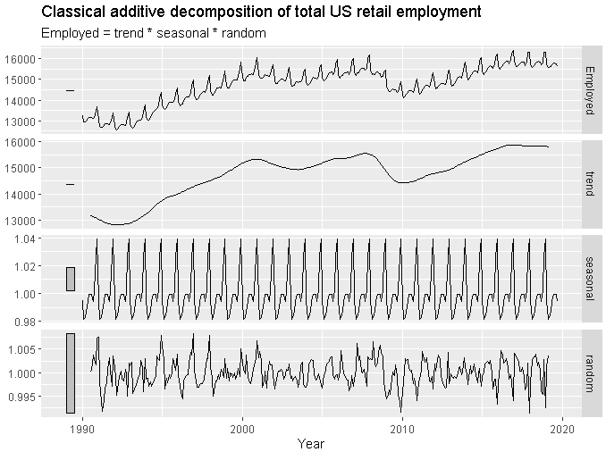

和加法分解相比，两者trend完全相同，而seasonal和random的数据scale不同。

#### 经典分解法的评价

尽管经典分解法仍然被广泛的使用，但是不推荐使用它，这是因为现在有很多更好的方法。经典分解法存在如下问题：

1. 由于移动平均的计算犯法， trend-cycle的开始和结束的几个数据点没有值。例如，若 m=12，则没有前六个或后六个观测的趋势-周期项估计。
2. 估计倾向于过度平滑数据中的快速上升或快速下降。
3. 不同周期中季节项是重复的。对于很多序列来说这是合理的，但是对于更长的时间序列来说这还有待考量。例如，因为空调的普及，用电需求模式会随着时间的变化而变化。具体来说，在很多地方几十年前的时候，各个季节中冬季是用电高峰（用于供暖加热），但是现在夏季的用电需求最大（由于开空调）。经典时间序列分解法无法捕捉这类的季节项随时间变化而变化。

4. 不能够处理序列中的一些异常值。例如，每月的航空客运量可能会受到工业纠纷的影响，使得纠纷时期的客运量与往常十分不同。处理这类异常值，经典时间序列分解法不够robust。

### 3.5 X11分解

另外一个受人欢迎的季度性数据和月度数据的分解算法是 X11分解法，它发明于美国人口普查局和加拿大统计局。

这个方法基于经典分解法，但是增加了许多额外的步骤和特性来克服经典分解法的一些不足。

1. 所有的数据点都可以做trend-cycle估计
2. Seasonal成分可以允许根据时间而缓慢改变
3. 提供一些复杂方法来处理交易日、假期、以及一些已知的影响因素的影响。

以上过程是完全自动的，而且对于时间序列中的异常值和Level Shift很robust。

> Level Shift指时间序列中的某个特殊时期，观测值从一个level快速移动到另一个level，而中间没有过度。比如：股票交易中，前一天收盘价和第二天开盘价之间往往就是Level Shift。

> **question**：X11分解究竟是如何解决经典分解的种种问题的？X11是如何实现的呢？查了一些资料，没有看到比较通俗好理解的方案。
>
> 目前看到[Handbook on Seasonal Adjustment](https://ec.europa.eu/eurostat/documents/3859598/8939616/KS-GQ-18-001-EN-N.pdf)的一些解释，发现Seasonal成分计算中，也采用了移动平均方式来计算，这是Seasonal能够缓慢变化的原因。

下面是示例。

下面介绍X11是如何使用的。

~~~R
library(fpp3)
# install.packages("seasonal") 必须安装
us_retail_employment <- us_employment %>%
  filter(year(Month) >= 1990, Title == "Retail Trade") %>%
  select(-Series_ID)

x11_dcmp <- us_retail_employment %>%
  model(x11 = feasts:::X11(Employed, type = "additive")) %>%
  components()
autoplot(x11_dcmp) + xlab("Year") +
  ggtitle("Additive X11 decomposition of US retail employment in the US")
~~~

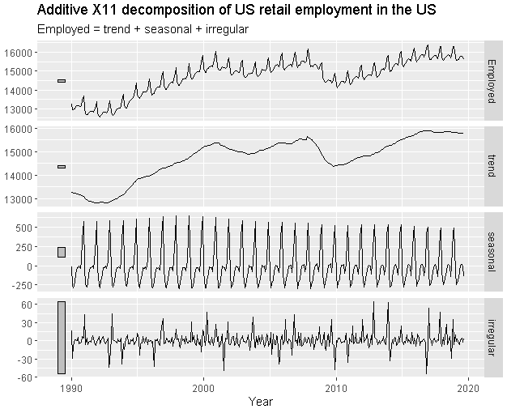

和下面的STL分解和经典分解相比，

- X11的trend-cycle更好的捕捉到了由于2007-2008金融危机造成的骤降。
- 1996年的异常观测值在余项（remainder ）中也更容易看到。

> 为何我还是看不出来。

再看trend-cycle和the seasonally adjusted。

~~~R
x11_dcmp %>%
  ggplot(aes(x = Month)) +
  geom_line(aes(y = Employed, colour = "Data")) +
  geom_line(aes(y = season_adjust, colour = "Seasonally Adjusted")) +
  geom_line(aes(y = trend, colour = "Trend")) +
  xlab("Year") + ylab("Persons (thousands)") +
  ggtitle("Total employment in US retail") +
  scale_colour_manual(values=c("gray","blue","red"),
             breaks=c("Data","Seasonally Adjusted","Trend"))
~~~

> 上面也是画多条曲线的很好例子。

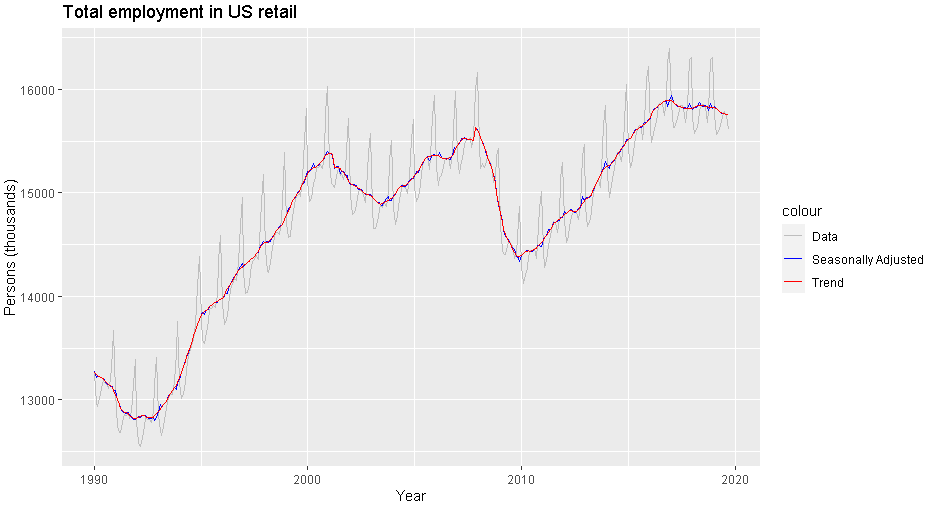

最后来看seasonal成分。

~~~R
x11_dcmp %>%
  gg_subseries(seasonal)
~~~

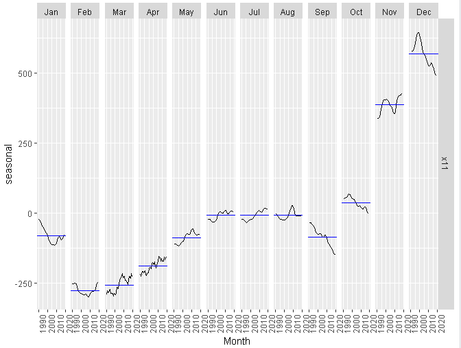

上图中可以看到seasonal成分随之时间的变化，而下面的经典分解，其seamsl

~~~
clc_dcmp <- us_retail_employment %>%
  model(classical_decomposition(Employed, type = "additive")) %>%
  components()
clc_dcmp %>%  gg_subseries(seasonal)
~~~

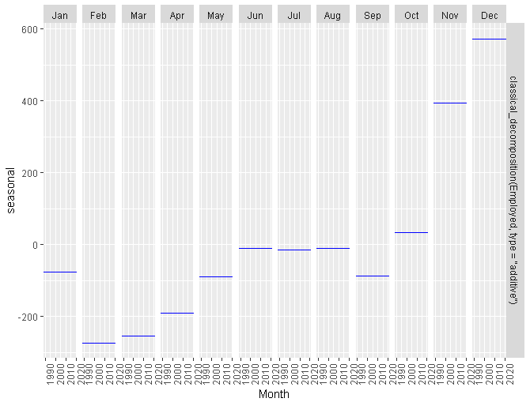

### 3.6 SEATS分解

“SEATS”表示“ ARIMA时间序列的季节提取 （Seasonal Extraction in ARIMA Time Series）” ，其中ARIMA模型第九章中将详细探讨。这个方法是西班牙银行发明的，现在被世界各地的政府机构广泛使用。这个方法仅能分析季度数据和月度数据。因此，其他类型的季节性，如每日数据，或每小时数据，或每周数据，需要其他方法。

~~~R
library(fpp3)
seats_dcmp <- us_retail_employment %>%
  model(seats = feasts:::SEATS(Employed)) %>%
  components()
autoplot(seats_dcmp) + xlab("Year") +
  ggtitle("SEATS decomposition of total US retail employment")
~~~

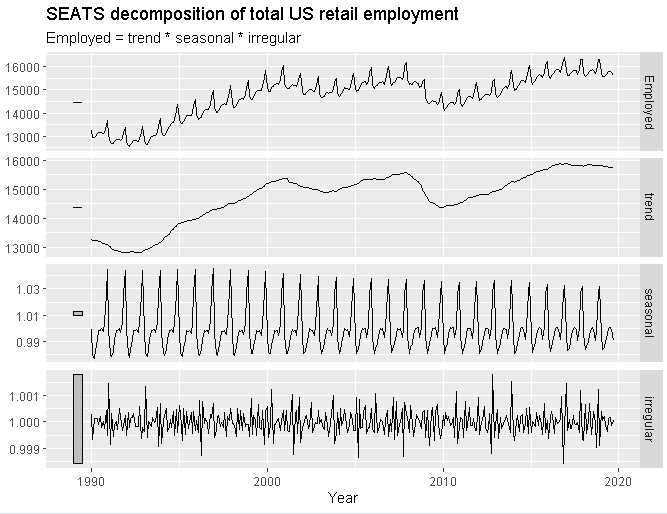结果和X11非常相似。`seasonal` 包有很多选项来处理X11与SEATS。详见[Introduction to Seasonal](http://www.seasonal.website/seasonal.html)。

> 看起来都非常相似啊。

### 3.7 STL分解

STL（Seasonal and Trend decomposition using Loess）是一个非常通用和稳健强硬的分解时间序列的方法，其中Loess是一种估算非线性关系的方法。STL分解法由 Cleveland et al. ([1990](https://otexts.com/fppcn/stl.html#ref-Cleveland1990)) 提出。

相比于经典、SEATS和X-11分解法STL分解法有几点优势：

- 与SEATS和X-11不同的是，STL可以处理任何类型的季节性，不仅仅是月度数据和季度数据。

- Seasonal成分可以随时间变化而变换，并且变化的速率可以由用户掌控。
- trend-cycle成分的平滑程度也可以由用户掌控。
- 可以不受离群点干扰（例如，用户可以指定一个robust 分解）

另一方面，STL也有一些不足之处。具体来讲，它不能自动地处理交易日或是其他有变动的日子，并且只提供了处理加法分解的方式。

~~~R
us_retail_employment %>%
  model(STL(Employed ~ trend(window=7) + season(window='periodic'),
    robust = TRUE)) %>%
  components() %>%
  autoplot()
~~~

为了得到乘法分解，可以首先对数据取对数，然后对各成分进行反向变换。Box-Cox变换可以实现这种加法和乘法变换的统一，公式如下：
$$
y(\lambda)=
\left\{
\begin{aligned}
 & \frac { y^{\lambda}-1} \lambda ,  & \lambda \neq 0 \\
& ln(y) ,    &  \lambda = 0 \\
\end{aligned}
\right.
$$

- $0<\lambda<1$：介于加法分解和乘法分解之间
- $\lambda=0$：对应于乘法分解
- $\lambda=1$：等价于加法分解

下面来看一个例子。

~~~R
library(fpp3)
# install.packages("seasonal") 必须安装
us_retail_employment <- us_employment %>%
  filter(year(Month) >= 1990, Title == "Retail Trade") %>% select(-Series_ID)

dcmp <- us_retail_employment %>%
  model(STL(Employed))

dcmp1<- us_retail_employment %>%
  model(STL(Employed ~ trend(window=7) + season(window='periodic'),
    robust = TRUE)) 
~~~

下面来看参数的不同，对STL分解的影响。

~~~R
dcmp1 %>%
  components() %>%
  autoplot()
  
dcmp2 <- us_retail_employment %>%
  model(STL(Employed ~ trend(window=7) ,
    robust = TRUE)) 
    
dcmp2 %>%
  components() %>%
  autoplot()
~~~

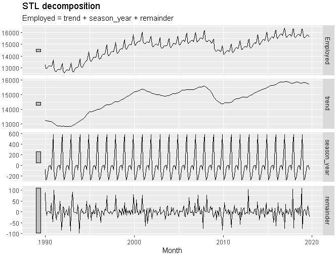

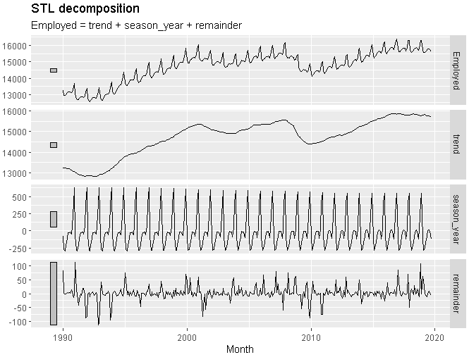

可以发现上面两个图中，第一幅图中seasonal成分是完全重复的，这是由于`season(window='periodic')`决定的。

使用STL时要选择的两个主要参数是trend-cycle window(`trend(window = ?)`) 和seasonal window(`season(window = ?)`)。这些参数控制了trend-cycle项和seasonal项的变化速度，它们的值越小允许变化的速度越快。在估计trend-cycle和seasonal得到window的时候都需要是奇数，并且所用的数据年份应是连续的。设定seasonal window是无限的等价于设定`season(window='periodic')`

默认情况下，`STL()` 函数提供了一方便的自动STL分解，其中`season(window=13)`，而treand window也是根据seasonal  period自动选择的，对于月底数据的默认设定是`trend(window=21)`。它一般情况下平衡了seasonality过拟合与允许其随时间缓慢变化。但是与其他自动化过程一样，对于某些时间序列默认设置还是需要调整的。

下图中，比较了默认的STL（红线）和设置了更短窗口的（`trend(window=7)`）的STL（蓝线）的trend-cycle成分。可以发现红线过于严格（rigid）。对于默认STL，2008年全球金融危机造成了reminder中的波谷，而更短窗口的的STL改善了这一点。

> 也就是更短的周期，使得trend-cycle更能反映短期的波动。这样可以改善reminder项。

~~~R
us_retail_employment %>%
  autoplot(Employed, color='gray') +
  autolayer(components(dcmp), trend, color='red') +
  autolayer(components(dcmp1), trend, color='blue') +
  xlab("Year") + ylab("Persons (thousands)") +
  ggtitle("Total employment in US retail")
~~~

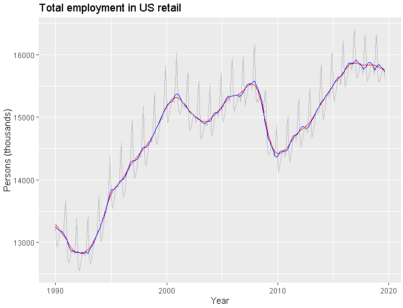

~~~R
dcmp %>%
  components() %>%
  autoplot()

dcmp1 %>%
  components() %>%
  autoplot()
~~~

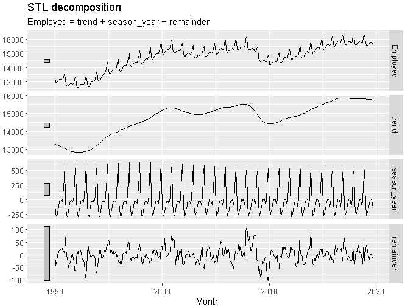

#### STL原理

