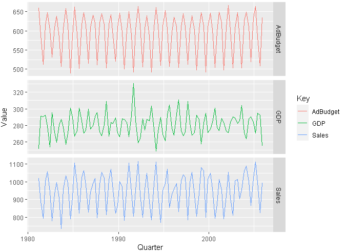
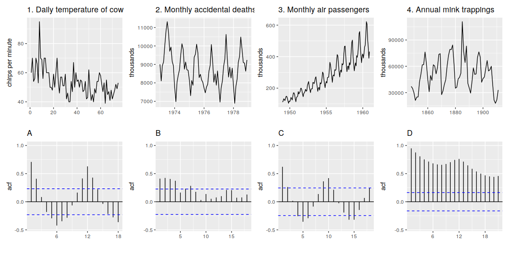
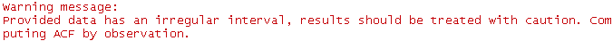
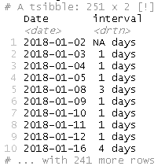
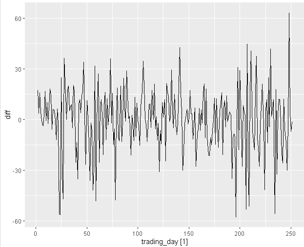
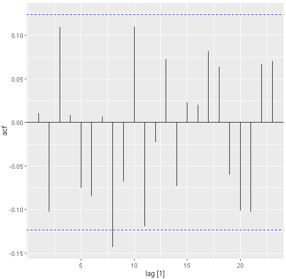
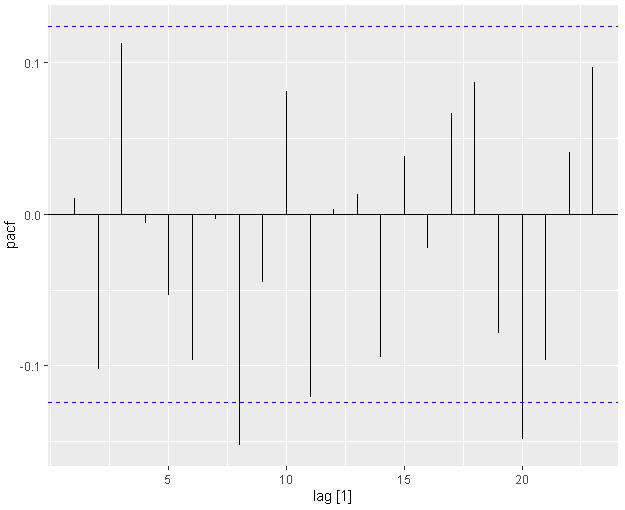
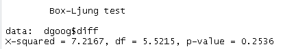
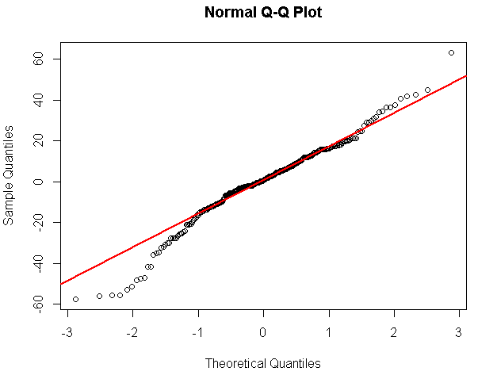
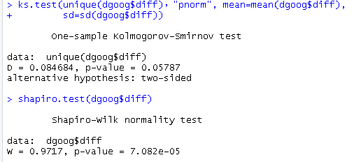

## Chapter 1

1. For cases 3 and 4 in Section [1.5](https://otexts.com/fpp3/case-studies.html#case-studies), list the possible predictor variables that might be useful, assuming that the relevant data are available.

   Answer:

   - Case 3: forecast vehicle re-sale values

     - 车辆
       - 品牌
       - 型号
       - 维修次数
       - 外观，内饰新旧
       - 同型号新车价格

     - 经济
       -  汽车行业指数

   - Case 4: 预测每周国内主要航线的乘客数量

     - 季节
     - 学校假期
     - 比赛
     - 广告
     - 竞争兜售行为
     - 航空业罢工
     - 折扣

2. For case 3 in Section [1.5](https://otexts.com/fpp3/case-studies.html#case-studies), describe the five steps of forecasting in the context of this project.

   略

## Chapter 2

1. Download the file `tute1.csv` from [the book website](http://otexts.com/fpp3/extrafiles/tute1.csv), open it in Excel (or some other spreadsheet application), and review its contents. You should find four columns of information. Columns B through D each contain a quarterly series, labelled Sales, AdBudget and GDP. Sales contains the quarterly sales for a small company over the period 1981-2005. AdBudget is the advertising budget and GDP is the gross domestic product. All series have been adjusted for inflation.

   a. You can read the data into R with the following script:

   ~~~R
   library(fpp3)
   Sys.setenv("http_proxy"="http://web-proxy.rose.hp.com:8080") 
   Sys.setenv("https_proxy"="http://web-proxy.rose.hp.com:8080")
   
   tute1 <- readr::read_csv("http://otexts.com/fpp3/extrafiles/tute1.csv")
   View(tute1)
   ~~~

   b. Convert the data to time series

   ~~~R
   mytimeseries <- tute1 %>%
     mutate(Quarter = yearmonth(Quarter)) %>%
     as_tsibble(index = Quarter)
   ~~~

   c. Construct time series plots of each of the three series

   ~~~R
   mytimeseries %>%
     pivot_longer(-Quarter, names_to="Key", values_to="Value") %>%
     ggplot(aes(x = Quarter, y = Value, colour = Key)) +
       geom_line() +
       facet_grid(vars(Key), scales = "free_y")
   ~~~

   1. pivot_longer: 来自包tidyr，列转行
   2. facet_grid: 把每组数据生成到独立的坐标轴

   

2. Create time plots of the following four time series: `Bricks` from `aus_production`, `Lynx` from `pelt`, `Close` from `gafa_stock`, `Demand` from `vic_elec`.

   - Use `?` (or `help()`) to find out about the data in each series.

     - aus_production: 1956-2010年澳洲主要商品季度产量。
       - 啤酒（Beer）:	Beer production in 兆升（megalitres）.
       - 烟草（Tobacco）:	Tobacco and cigarette production in 吨（tonnes）.
       - 砖块（Bricks）:	Clay brick production in millions of bricks.
       - 水泥（Cement）:	Portland cement production in 千吨（thousands of tonnes）.
       - 电力（Electricity）:	Electricity production in 千兆瓦（gigawatt hours）.
       - 汽油（Gas）:	Gas production in 兆焦耳（petajoules）.
     - pelt：1845-1935年哈德逊湾公司北美野兔和加拿大山猫皮毛的年度交易数量
       - Hare:	The number of Snowshoe Hare pelts traded.
       - Lynx:	The number of Canadian Lynx pelts traded.
     - gafa_stock：2014-2018年Google，Amazon，Facebook和Apple的每日股票交易价格
       - Open:	The opening price for the stock.
       - High:	The stock's highest trading price.
       - Low:	The stock's lowest trading price.
       - Close:	The closing price for the stock.
       - Adj_Close:	The adjusted closing price for the stock.
       - Volume:	The amount of stock traded.
     - vic_elec：2012-2014年澳大利亚维多利亚州每半个小时的电力需求
       - Demand:	Total electricity demand in 兆瓦（MW）.
       - Temperature:	Temperature of  墨尔本（Melbourne） (BOM site 086071).
       - Holiday:	Indicator for if that day is a public holiday.

   - For the last plot, modify the axis labels and title.

     ~~~R
     aus_production %>%   
       autoplot(Bricks) +
       labs(title = "澳洲主要商品季度产量") +
       xlab("季度")
     
     # 显示两个变量(线图)在一个图中
     pelt %>%   
       ggplot() +
       geom_line(aes(x = Year, y = Lynx, color = "red")) +
       geom_line(aes(x = Year, y = Hare, color = "blue")) +
       scale_color_discrete(name = "动物", labels  = c("Lynx", "Hare")) + 
       labs(title = "皮毛的年度交易数量"， color = 'Y series') +
       xlab("年")
     
     gafa_stock %>%   
       autoplot(Close) +
       labs(title = "股票交易价格") +
       xlab("日")
     
     # 1. 只显示2014年数据
     # 2. 把数据粒度从每半小时变成每天
     vic_elec %>%     
       filter(year(Time)==2014) %>% 
       index_by(Time1=as_date(Time))  %>% 
       summarise(
         Demand = sum(Demand, na.rm = TRUE)
       ) %>% 
       autoplot(Demand) +
       labs(title = "电力需求") +
       xlab("日")
     ~~~

3. Monthly Australian retail data is provided in `aus_retail`. Select one of the time series as follows (but choose your own seed value):

   ```
   set.seed(12345678)
   myseries <- aus_retail %>%
    filter(`Series ID` == sample(aus_retail$`Series ID`,1))
   ```

   Explore your chosen retail time series using the following functions:

   ```
   autoplot()`, `gg_season()`, `gg_subseries()`, `gg_lag()`, `ACF() %>% autoplot()
   ```

   Can you spot any seasonality, cyclicity and trend? What do you learn about the series?

   ~~~R
   set.seed(123456789)
   myseries <- aus_retail %>%
     filter(`Series ID` == sample(aus_retail$`Series ID`,1))
   
   myseries %>% autoplot(Turnover)	# 每个月的零售数据
   myseries %>% 
     index_by(Year=year(Month)) %>%
     summarise(
       Turnover = sum(Turnover, na.rm = TRUE)
     ) %>%   
     autoplot(Turnover)	# 每年的零售数据
   myseries %>% gg_season(Turnover, period="year") # 每年进行比较
   myseries %>%  
     filter(`State` == "Tasmania") %>%  
     gg_subseries(Turnover) 
   myseries %>% 
     gg_lag(Turnover, geom="point")
   myseries %>% ACF(Turnover) %>% autoplot()
   ~~~

   - trend: 总体消费逐年增长，单在2011年消费骤降，2013年恢复上涨
   - seasonality: 每年一个周期。12月份波峰，1月份波谷。
   - cyclicity： 不明显，如果有更多数据，可能可以看出经济周期来（由于2011年的骤降）

4. The following time plots and ACF plots correspond to four different time series. Your task is to match each time plot in the first row with one of the ACF plots in the second row.

   

   1-> B。

   - Trendy：缓慢下降的趋势，则ACF应该呈现逐渐递减的趋势
   - Seasonalityy：没有明显的周期，则其ACF不会呈现规律波动情况。
   - Cyclicity： 无，则其ACF不会呈现长期的波动。

   2 -> A。

   - Trendy：无
   - Seasonalityy：明显的周期，其周期为12 months，则其ACF因该呈现规律的波动特性。
   - Cyclicity： 无。

   3 -> D。

   - Trendy：单边趋势，则ACF应该呈现逐渐递减的趋势
   - Seasonalityy：明显的周期，其周期为12 months，则其ACF应该呈现规律的波动特性。
   - Cyclicity： 无。

   4 -> C。Time Plot呈现明显的circlality特性，

   - Trendy：无，
   - Seasonalityy：无
   - Cyclicity：从周期上看是5年左右，不稳定，则其ACF应该呈现长期的波动。

5. 如下：

   - Use the following code to compute the daily changes in Google closing stock prices.

     ```R
     dgoog <- gafa_stock %>%
       filter(Symbol == "GOOG", year(Date) >= 2018) %>%
       mutate(trading_day = row_number()) %>%
       update_tsibble(index = trading_day, regular = TRUE) %>%
       mutate(diff = difference(Close))
     dgoog <- dgoog[-1,]
     ```

   - Why was it necessary to re-index the tsibble?

     ~~~R
     dgoog <- gafa_stock %>%
       filter(Symbol == "GOOG", year(Date) >= 2018) %>%
       mutate(trading_day = row_number()) %>%
       mutate(diff = difference(Close))
     dgoog %>%  mutate(interval = difference(Date))
     ~~~

     需要的，否则得到运行`dgoog[-1,] %>% ACF(diff) %>% autoplot()`,得到如下警告信息。

     

     其原因在于：由于周末和假期不进行股票交易，会照成时间的间隔并不均匀。

     ~~~
dgoog %>% select() %>%  mutate(interval = difference(Date)) 
     ~~~
     
     

   - Plot these differences and their ACF.

     ~~~R
   dgoog %>% autoplot(diff) 
     dgoog %>% ACF(diff) %>% autoplot()
     dgoog %>% PACF(diff) %>% autoplot()
     ~~~
   

  

  

  

   - Do the changes in the stock prices look like white noise?
   
     是的。从ACF可以看出，除了一个自相关系数，其它都在95%的置信区间之内。除了ACF，PACF，下面是其它的一些验证白噪音的方法。
     
     ~~~R
     Box.test(dgoog$diff, lag=log(length(dgoog$diff)), type='Ljung')
     qqnorm(dgoog$diff)
     qqline(dgoog$diff, col=2, lwd=2)
     ks.test(unique(dgoog$diff)，"pnorm", mean=mean(dgoog$diff), 
             sd=sd(dgoog$diff))
     shapiro.test(dgoog$diff)
     ~~~
     
     
     
     
     
     
     
     可以得出以下结论

     - 从box.test, ACF和PACF来看，不存在显著的自相关性。
     - 从QQ图和ks.test上来看，diff不是白噪音。


