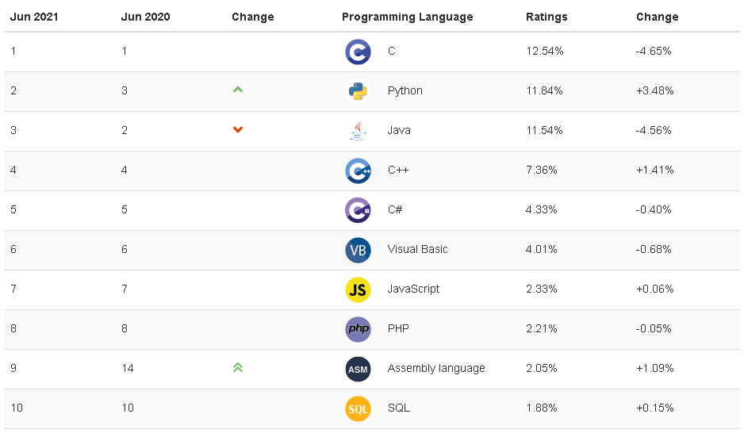

<!-- Scoped style -->

#   How to Study Machine Learning

June 2021

---

## Agenda

- What's Machine Learning
- Why is Python So Popular
- What's Deep Learning 
- Samples of Deep Learning
- My Tool List

---

## What's Machine Learning

---

### [What's Machine Learning](https://www.youtube.com/watch?v=-DEL6SVRPw0)

- [Arthur Samuel](https://en.wikipedia.org/wiki/Arthur_Samuel) (1959): The field of study that gives computers the ability to learn without being explicitly programmed.

- [Tom M. Mitchell](https://en.wikipedia.org/wiki/Tom_M._Mitchell) (1998) : A computer program is said to learn from experience *E* with respect to some class of tasks *T* and performance measure *P* if its performance at tasks in *T*, as measured by *P*,  improves with experience *E*.  

---

### Your First Machine Learning Course

[Machine Learning | Coursera](https://www.coursera.org/learn/machine-learning) by Andrew Ng.

> Suggestion:  re-implement the codes with Python because the programming language in the course is MATLAB. 

---

### Mathematics for Machine Learning

In order to understand the algorithms better, we should have some math knowledge. 

- [Linear Algebra](https://www.khanacademy.org/math/linear-algebra)
- [Multivariable Calculus](https://www.khanacademy.org/math/multivariable-calculus)
- [Statistics](https://www.khanacademy.org/math/ap-statistics)

Book: [Mathematics for Machine Learning](https://mml-book.github.io/book/mml-book.pdf)

Course: [Mathematics for Machine Learning | Coursera](https://www.coursera.org/specializations/mathematics-machine-learning)

---

## Why is Python So Popular

---

Python is the **most popular language** in the future.  

see [Stack Overflow Trends](https://insights.stackoverflow.com/trends?tags=python%2Cjavascript%2Cjava%2Cc%23%2Cphp%2Cc%2B%2B&utm_source=so-owned&utm_medium=blog&utm_campaign=gen-blog&utm_content=blog-link&utm_term=incredible-growth-python&_ga=2.29031547.671743710.1623737614-727023010.1623737614).

---

see [TIOBE Index](https://www.tiobe.com/tiobe-index/).

---

### Study Python

- Books or Tutorials
  - [Python Tutorial](https://docs.python.org/3/tutorial/)
  - [Dive Into Python 3](https://diveintopython3.problemsolving.io/)

- Courses
  - [Python for Everybody Specialization](https://www.coursera.org/specializations/python)
  - [Introduction to Data Science in Python](https://www.coursera.org/learn/python-data-analysis#syllabus)

---

| **C#**                                                 | **Python**                                                   |
| ------------------------------------------------------ | ------------------------------------------------------------ |
| OOP                                                    | OOP + **Procedural**                                         |
| Statically typed                                       | **Dynamic** type-casting                                     |
| More organized and consistent syntax and format.       | **Simple, easy to read and code**, doesn’t contain too many  symbols or formats. |
| Faster and offers better performance                   | Compared to C#, the  performance is **slightly lacking.**    |
| Multi-threading is quite easy using the .NET framework | Because of Global Interpreter Lock, multithreading **requires  multiple processes.** |

---

## 

 <!-- Scoped style -->

## What's Deep Learning 

---

### [What Is Deep Learning?](https://www.youtube.com/watch?v=6M5VXKLf4D4)

- a subset of machine learning

- `Deep` : refers to the use of multiple **neural layers** in the network

- always use GPU to train models.
- more data,  better model

---

### Study Deep Learning

- Book
  - [Hands-On Machine Learning with Scikit-Learn, Keras, and TensorFlow](https://www.amazon.com/Hands-Machine-Learning-Scikit-Learn-TensorFlow/dp/1492032646/ref=sr_1_2?dchild=1&keywords=deep+learning&qid=1623730438&sr=8-2)
  - [Deep Learning (Adaptive Computation and Machine Learning series)](https://www.amazon.com/Deep-Learning-Adaptive-Computation-Machine/dp/0262035618/ref=sr_1_1?dchild=1&keywords=deep+learning&qid=1623730438&sr=8-1)

- Course
  - [Deep Learning Specialization | Coursera](https://www.coursera.org/specializations/deep-learning)
  - [TensorFlow 2 for Deep Learning | Coursera](https://www.coursera.org/specializations/tensorflow2-deeplearning)
  - [Natural Language Processing Specialization | Coursera](https://www.coursera.org/specializations/natural-language-processing)

---

## Samples of Deep Learning

it's a great way to study deep learning through samples.

---

### [Image Completion](https://web.archive.org/web/20191016060740/http://iizuka.cs.tsukuba.ac.jp/projects/completion/en/) 

[DEMO](https://web.archive.org/web/20191016060740im_/http://iizuka.cs.tsukuba.ac.jp/projects/completion/data/completion_sig2017.mp4)

---

### YOLO

You only look once (YOLO) is a state-of-the-art, real-time object detection system.

 [YOLOv3 - Demo](https://www.youtube.com/watch?v=MPU2HistivI)

---

### MuseNet

MuseNet, a deep neural network that can generate 4-minute musical compositions with 10 different instruments.

[Prompt: First 5 notes of Chopin Op. 10, No. 9](https://soundcloud.com/openai_audio/chopin-f-minor-etude)

---

## My Tool List

---

- IDE: [PyCharm](https://www.jetbrains.com/pycharm/)
- Interactive Programming: [Jupyter Notebook](https://jupyter.org/)

- Data Visualization: [Dash Overview (plotly.com)](https://plotly.com/dash/)
- Course: [Coursera](https://www.coursera.org/)
- Write Blog: [Github Pages](https://pages.github.com/)

<!--

[Dash (plotly.host)](https://dash-gallery.plotly.host/dash-video-detection/)

-->

---

<!-- 
_paginate: false
_footer: ''
-->

 **Thank You  :smile:**

