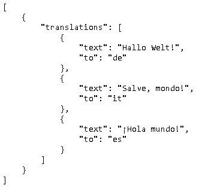
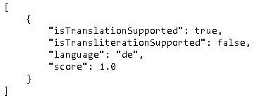
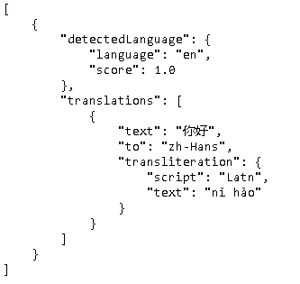
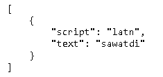

## [Quickstart: Get started with Translator](https://docs.microsoft.com/en-us/azure/cognitive-services/translator/quickstart-translator?tabs=csharp)

### Prerequisites

- Azure subscription - [Create one for free](https://azure.microsoft.com/free/cognitive-services/)

  需要注册信用卡信息。

- 在Azure portal 网站， [create a Translator resource](https://ms.portal.azure.com/#create/Microsoft.CognitiveServicesTextTranslation)

  https://portal.azure.com/#@eipi10qq.onmicrosoft.com/resource/subscriptions/5afe04dc-cba4-42ca-9cd2-22d00767e501/resourceGroups/trials/providers/Microsoft.CognitiveServices/accounts/eipi10-translator/quickstart

### Headers

通过REST调用Translator服务。

| Headers                  | Description                                                  |
| :----------------------- | :----------------------------------------------------------- |
| Authentication header(s) | *Required request header*. `Ocp-Apim-Subscription-Key`  *Required request header if using a Cognitive Services Resource. Optional if using a Translator Resource.*. `Ocp-Apim-Subscription-Region`  See [available options for authentication](https://docs.microsoft.com/en-us/azure/cognitive-services/translator/reference/v3-0-reference#authentication). |
| Content-Type             | *Required request header*. Specifies the content type of the payload. Accepted value is `application/json; charset=UTF-8`. |
| Content-Length           | *Required request header*. The length of the request body.   |
| X-ClientTraceId          | *Optional*. A client-generated GUID to uniquely identify the request. You can omit this header if you include the trace ID in the query string using a query parameter named `ClientTraceId`. |

下面设定这些header的值和基本设置。

~~~python
import requests, uuid, json

# Add your subscription key and endpoint
subscription_key = "eafe5d0acb6d46e2aca0932edcd5a201"
endpoint = "https://api.cognitive.microsofttranslator.com"

# Add your location, also known as region. The default is global.
# This is required if using a Cognitive Services resource.
location = "eastus"

headers = {
    'Ocp-Apim-Subscription-Key': subscription_key,
    'Ocp-Apim-Subscription-Region': location,
    'Content-type': 'application/json',
    'X-ClientTraceId': str(uuid.uuid4())
}
~~~

### Translate text

需要指定subscription_key和endpoint.

~~~python
path = '/translate'
constructed_url = endpoint + path

params = {
    'api-version': '3.0',
    'from': 'en',
    'to': ['de', 'it', 'es']
}

# You can pass more than one object in body.
body = [{
    'text': 'Hello World!'
}]

request = requests.post(constructed_url, params=params, headers=headers, json=body)
response = request.json()

print(json.dumps(response, sort_keys=True, ensure_ascii=False, indent=4, separators=(',', ': ')))
~~~

### Detect language

#### Detect source language during translation

~~~python
path = '/translate'
constructed_url = endpoint + path

params = {
    'api-version': '3.0',
    'to': ['de', 'it', 'es']
}

# You can pass more than one object in body.
body = [{
    'text': 'Hello World!'
}]

request = requests.post(constructed_url, params=params, headers=headers, json=body)
response = request.json()

print(json.dumps(response, sort_keys=True, ensure_ascii=False, indent=4, separators=(',', ': ')))
~~~

#### Detect source language without translation

~~~python
path = '/detect'
constructed_url = endpoint + path

params = {
    'api-version': '3.0'
}
constructed_url = endpoint + path

headers = {
    'Ocp-Apim-Subscription-Key': subscription_key,
    'Ocp-Apim-Subscription-Region': location,
    'Content-type': 'application/json',
    'X-ClientTraceId': str(uuid.uuid4())
}

# You can pass more than one object in body.
body = [{
    'text': 'Ich würde wirklich gern Ihr Auto um den Block fahren ein paar Mal.'
}]

request = requests.post(constructed_url, params=params, headers=headers, json=body)
response = request.json()

print(json.dumps(response, sort_keys=True, ensure_ascii=False, indent=4, separators=(',', ': ')))
~~~

### Transliterate text

Transliteration是把单词或短语

#### Transliterate during translation

~~~python
path = '/translate'
constructed_url = endpoint + path

params = {
    'api-version': '3.0',
    'to': 'zh',
    'toScript': 'latn'
}
constructed_url = endpoint + path

headers = {
    'Ocp-Apim-Subscription-Key': subscription_key,
    'Ocp-Apim-Subscription-Region': location,
    'Content-type': 'application/json',
    'X-ClientTraceId': str(uuid.uuid4())
}

# You can pass more than one object in body.
body = [{
    'text': 'Hello'
}]
request = requests.post(constructed_url, params=params, headers=headers, json=body)
response = request.json()

print(json.dumps(response, sort_keys=True, ensure_ascii=False, indent=4, separators=(',', ': ')))
~~~

#### Transliterate without translation

~~~python
path = '/transliterate'
constructed_url = endpoint + path

params = {
    'api-version': '3.0',
    'language': 'th',
    'fromScript': 'thai',
    'toScript': 'latn'
}
constructed_url = endpoint + path

headers = {
    'Ocp-Apim-Subscription-Key': subscription_key,
    'Ocp-Apim-Subscription-Region': location,
    'Content-type': 'application/json',
    'X-ClientTraceId': str(uuid.uuid4())
}

# You can pass more than one object in body.
body = [{
    'text': 'สวัสดี'
}]

request = requests.post(constructed_url, params=params, headers=headers, json=body)
response = request.json()

print(json.dumps(response, sort_keys=True, indent=4, separators=(',', ': ')))
~~~

