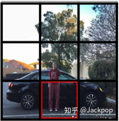

对象检测（Object  Detection）是一项非常基础的计算机视觉任务，图像分割、物体追踪、关键点检测等通常都要依赖于目标检测。

在计算机视觉中，图像分类、目标检测和图像分割都属于最基础、也是目前发展最为迅速的3个领域，我们可以看一下这几个任务之间的区别。

- 图像分类：输入图像往往仅包含一个物体，目的是判断每张图像是什么物体，是图像级别的任务，相对简单，发展也最快。
- 目标检测：输入图像中往往有很多物体，目的是判断出物体出现的位置与类别，是计算机视觉中非常核心的一个任务。 ·

- 图像分割：输入与物体检测类似，但是要判断出每一个像素属于哪一个类别，属于像素级的分类。图像分割与物体检测任务之间有很多联系，模型也可以相互借鉴。

### 算法大全

### 利用卷积层实现滑动窗口

上图可以看出，第二行图片尺寸大一些，造成最终输出的尺寸是$2\times 2$ ，但其左上角的值，依然等价于第一行图片的计算结果。基于这个思想，可以一次性的对图片进行卷积操作，其最终输出，对应原图的相应区域。

### SPP

SPP全称Spatial Pyramid Pooling。

### NMS

NMS全称Non-Maximum Suppression，其本质是搜索局部极大值，抑制非极大值元素。大致算法流程为：

1. 对所有预测框的置信度降序排序
2. 选出置信度最高的预测框，确认其为正确预测，并计算他与其他预测框的IOU
3. 根据2中计算的IOU去除重叠度高的，IOU>threshold就删除
4. 剩下的预测框返回第1步，直到没有剩下的为止

NMS一次处理一个类别，如果有N个类别，就需要执行N次。相关实现代码（来自Fast-RCNN）如下：

~~~python
# --------------------------------------------------------
# Fast R-CNN
# Copyright (c) 2015 Microsoft
# Licensed under The MIT License [see LICENSE for details]
# Written by Ross Girshick
# --------------------------------------------------------

import numpy as np

def py_cpu_nms(dets, thresh):
    """Pure Python NMS baseline."""
    x1 = dets[:, 0]
    y1 = dets[:, 1]
    x2 = dets[:, 2]
    y2 = dets[:, 3]
    scores = dets[:, 4]

    areas = (x2 - x1 + 1) * (y2 - y1 + 1)
    order = scores.argsort()[::-1]  #[::-1]表示降序排序，输出为其对应序号

    keep = []                     #需要保留的bounding box
    while order.size > 0:
        i = order[0]              #取置信度最大的（即第一个）框
        keep.append(i)            #将其作为保留的框
        
        #以下计算置信度最大的框（order[0]）与其它所有的框（order[1:]，即第二到最后一个）框的IOU，以下都是以向量形式表示和计算
        xx1 = np.maximum(x1[i], x1[order[1:]]) #计算xmin的max,即overlap的xmin
        yy1 = np.maximum(y1[i], y1[order[1:]]) #计算ymin的max,即overlap的ymin
        xx2 = np.minimum(x2[i], x2[order[1:]]) #计算xmax的min,即overlap的xmax
        yy2 = np.minimum(y2[i], y2[order[1:]]) #计算ymax的min,即overlap的ymax

        w = np.maximum(0.0, xx2 - xx1 + 1)      #计算overlap的width
        h = np.maximum(0.0, yy2 - yy1 + 1)      #计算overlap的hight
        inter = w * h                           #计算overlap的面积
        ovr = inter / (areas[i] + areas[order[1:]] - inter) #计算并，-inter是因为交集部分加了两次。

        inds = np.where(ovr <= thresh)[0]          #本轮，order仅保留IOU不大于阈值的下标
        order = order[inds + 1]                    #删除IOU大于阈值的框

    return keep
~~~

### 锚框（Anchor Box）

Anchor Box是学习目标检测过程中最重要且最难理解的一个概念。这个概念最初是在Faster R-CNN中提出，此后在SSD、YOLOv2、YOLOv3等优秀的目标识别模型中得到了广泛的应用。Anchor Box是在图像上预设好的不同大小，不同长宽比的参照框。

#### 为什么提出anchor box？

滑动窗口是原始的目标检测方法，给定一个固定尺寸的窗口，根据设定的步伐，一步一步的从左至右、从上至下滑动，把每个窗口输入到卷积神经网络中进行预测和分类，这样做有两个缺点:

- 一个窗口只能检测一个目标
- 无法解决多尺度问题。由于窗口尺寸固定，因此不适合形变较大的物体

- 计算量巨大。

常用的Anchor Box定义如下：

- Faster R-CNN 定义三组纵横比`ratio = [0.5,1,2]`和三种尺度`scale = [8,16,32]`，可以组合处9种不同的形状和大小的边框。
- YOLO V2 V3 则不是使用预设的纵横比和尺度的组合，而是使用`k-means`聚类的方法，从训练集中学习得到不同的Anchor
- SSD 固定设置了5种不同的纵横比`ratio=[1,2,3,1/2,1/3]`,由于使用了多尺度的特征，对于每种尺度只有一个固定的`scale`

### IoU

IoU全称Intersection Over Union，它其实就是Jaccard系数。一般使用IoU来衡量锚框（Anchor Box）和真实边界框（Ground-Truth  Bounding Box）之间的相似度。

#### anchor box的尺寸该怎么选择？

目前anchor box的选择主要有三种方式：

- 人为经验选取
- k-means聚类
- 作为超参数进行学习

## 参考

- [锚框：Anchor box综述](https://zhuanlan.zhihu.com/p/63024247)

- [利用卷积层实现滑动窗口](https://bbs.huaweicloud.com/blogs/244192)

- [目标检测 1 ： 目标检测中的Anchor详解](https://www.cnblogs.com/wangguchangqing/p/12012508.html)：非常的详尽

- [一文读懂目标检测：R-CNN、Fast R-CNN、Faster R-CNN、YOLO、SSD](https://www.huaweicloud.com/articles/5e10b26261c8ed2f831aa9d8aa829fd2.html)

- [YOLO系列算法精讲：从yolov1至yolov4的进阶之路](https://ai-wx.blog.csdn.net/article/details/107509243)：非常牛

- [9.4. 锚框](https://zh.d2l.ai/chapter_computer-vision/anchor.html)

  
