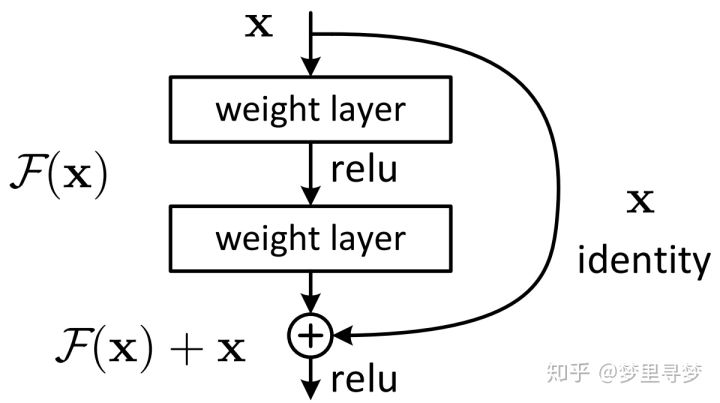

## 引言

2015年时，还在MSRA的何恺明祭出了ResNet这个“必杀技”，在ISLVRC和COCO上“横扫”了所有的对手，可以说是顶级高手用必杀技进行了一场杀戮。除了取得了辉煌的成绩之外，更重要的意义是启发了对神经网络的更多的思考。可以说深度残差网络（Deep residual network, ResNet）的提出是CNN图像史上的一件里程碑事件。

ResNet的作者何恺明获得了CVPR2016最佳论文奖。那么ResNet为什么会如此优异的表现呢？其实ResNet是解决了深度CNN模型难训练的问题，我们知道2014年的VGG才19层，而15年的ResNet多达152层，这在网络深度完全不是一个量级上，所以如果是第一眼看到这个层数的话，肯定会觉得ResNet是靠深度取胜。事实当然是这样，但是ResNet还有架构上的trick，这才使得网络的深度发挥出作用，这个trick就是残差学习（Residual learning）。接下来我们将详细分析ResNet的原理。

## 为什么会提出ResNet残差网络呢？

VGG网络试着探寻了一下深度学习网络的深度究竟可以深到何种程度还可以持续提高分类的准确率。对于传统的深度学习网络，我们普遍认为网络深度越深（参数越多）非线性的表达能力越强，该网络所能学习到的东西就越多。

我们凭借这一基本规则，经典的CNN网络从LetNet-5（5层）和AlexNet（8层）发展到VGGNet(16-19)，再到后来GoogleNet（22层）。根据VGGNet的实验结果可知，在某种程度上网络的深度对模型的性能至关重要，当增加网络层数后，网络可以进行更加复杂的特征模式的提取，所以当模型更深时理论上可以取得更好的结果。

**但是更深的网络其性能一定会更好吗？**我们后来发现传统的CNN网络结构随着层数加深到一定程度之后，越深的网络反而效果更差，过深的网络竟然使分类的准确率下降了（相比于较浅的CNN而言）。比较结果见下图。

**为什么CNN网络层数增加分类的准确率却下降了呢？**

上图中可以看出，56层的网络比20层网络在训练数据上的损失还要大，这不是过拟合。我们把这种问题称之为网络退化问题（Degradation problem）。

何恺明举了一个例子：考虑一个训练好的网络结构，如果加深层数的时候，不是单纯的堆叠更多的层，而是堆上去一层使得堆叠后的输出和堆叠前的输出相同，也就是恒等映射/单位映射（identity mapping），然后再继续训练。这种情况下，按理说训练得到的结果不应该更差，因为在训练开始之前已经将加层之前的水平作为初始了，然而实验结果结果表明在网络层数达到一定的深度之后，结果会变差，这就是退化问题。这里至少说明传统的多层网络结构的非线性表达很难去表示恒等映射（identity mapping），或者说你不得不承认目前的训练方法或许有点问题，才使得深层网络很难去找到一个好的参数去表示恒等映射（identity mapping）。

## 参考

- [深度残差网络—ResNet总结](https://www.cnblogs.com/xiaoboge/p/10539884.html)
- [为什么ResNet和DenseNet可以这么深？一文详解残差块为何有助于解决梯度弥散问题](https://zhuanlan.zhihu.com/p/28124810)