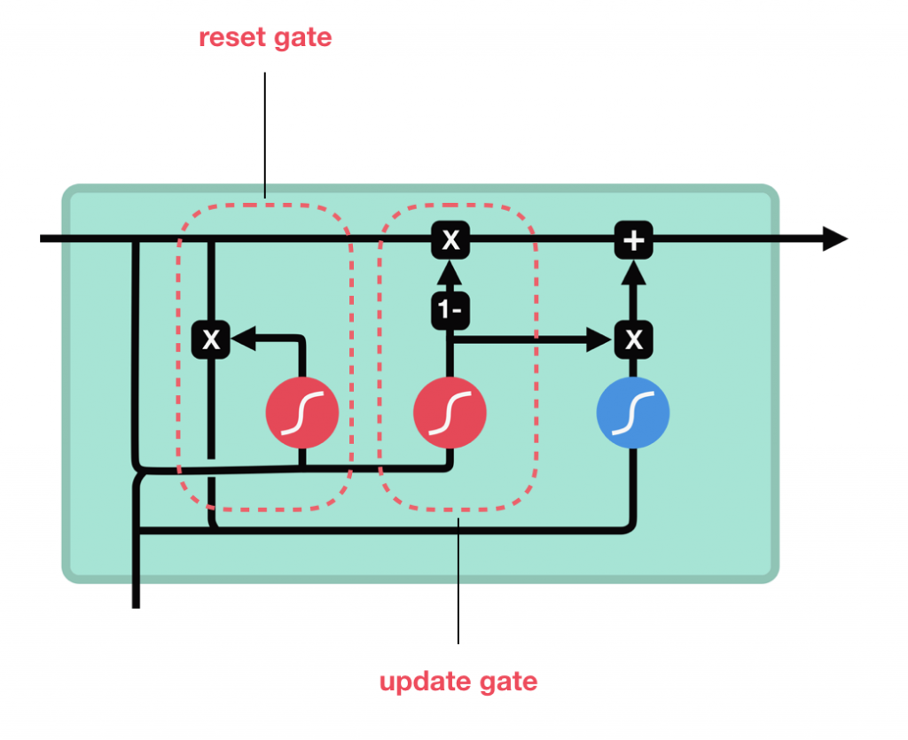

## SimpleRNN

#### 总参数数量

shape(h)× [shape(h)+shape(x)] + shape(h) 

### 参数

- units：输出维度
- activation：激活函数，为预定义的激活函数名（参考[激活函数](https://keras-cn.readthedocs.io/en/latest/other/activations)）
- use_bias: 布尔值，是否使用偏置项
- kernel_initializer：权值初始化方法，为预定义初始化方法名的字符串，或用于初始化权重的初始化器。参考[initializers](https://keras-cn.readthedocs.io/en/latest/other/initializations)
- recurrent_initializer：循环核的初始化方法，为预定义初始化方法名的字符串，或用于初始化权重的初始化器。参考[initializers](https://keras-cn.readthedocs.io/en/latest/other/initializations)
- bias_initializer：权值初始化方法，为预定义初始化方法名的字符串，或用于初始化权重的初始化器。参考[initializers](https://keras-cn.readthedocs.io/en/latest/other/initializations)
- kernel_regularizer：施加在权重上的正则项，为[Regularizer](https://keras-cn.readthedocs.io/en/latest/other/regularizers)对象
- bias_regularizer：施加在偏置向量上的正则项，为[Regularizer](https://keras-cn.readthedocs.io/en/latest/other/regularizers)对象
- recurrent_regularizer：施加在循环核上的正则项，为[Regularizer](https://keras-cn.readthedocs.io/en/latest/other/regularizers)对象
- activity_regularizer：施加在输出上的正则项，为[Regularizer](https://keras-cn.readthedocs.io/en/latest/other/regularizers)对象
- kernel_constraints：施加在权重上的约束项，为[Constraints](https://keras-cn.readthedocs.io/en/latest/other/constraints)对象
- recurrent_constraints：施加在循环核上的约束项，为[Constraints](https://keras-cn.readthedocs.io/en/latest/other/constraints)对象
- bias_constraints：施加在偏置上的约束项，为[Constraints](https://keras-cn.readthedocs.io/en/latest/other/constraints)对象
- dropout：0~1之间的浮点数，控制输入线性变换的神经元断开比例
- recurrent_dropout：0~1之间的浮点数，控制循环状态的线性变换的神经元断开比例
- 其他参数参考Recurrent的说明

## LSTM

Long Short-Term Memory（长短期记忆网络）L的核心概念是Cell States和各种Gates。Cell State在整个序列的处理过程中都携带相关的信息，即使较早时刻的信息也可以很好的保留，从而降低了短期记忆问题的影响。从图中可以看到有两条线，一条是Hidden State （$h_t$），一条是Cell State（$c_t$）。

**LSTM 是个奇葩**：它的状态是 (c, h) 这样一个 pair，其中 c 用于存储一些信息，而 h 用于上层输出。这里 (c, h) 分离的直觉，我称之为**信息隐匿**：

- 让 c 在一条高速公路上行进（相邻时间步的 c 只有加性更新，没有非线性变换）有利于保持信息在跨越多个时间步后仍然清晰可辨。
- 又因为模型当前的输出可能并不需要它记住的所有历史信息，而是只跟其中一部分信息有关，所以 h 用于把 c 中和当前输出相关的部分提取出来。

### Forget Gate

Forget Gate决定哪些信息需要丢弃，哪些信息需要保留。它合并前一个Hidden State和当前的Input信息，然后输入Sigmoid激活函数，输出(0,1)之间的数值。输出值接近0的信息需要被遗忘，输出值接近1的信息需要被保留。

### Input Gate

Input Gate首先将前一个Hidden State和当前Input合并起来，送入Sigmoid函数，输出(0,1)之间的值，0表示信息不重要，1表示信息重要。Hidden State和Input的输入同时也被送入Tanh函数，输出(-1, 1)之间的数值。

Sigmoid的输出和Tanh的输出相乘，决定哪些Tanh的输出信息需要保留，哪些输出信息需要丢弃。

### Cell State: 将过去与现在的记忆进行合并

前一个Cell State的输出，首先与Forget Gate的输出相乘，选择性的遗忘不重要的信息，再与Input Gate的输出相加，从而实现将当前的Input信息添加到Cell State中，输出新的Cell State。

### Output Gate

Output Gate用于输出Hidden State。Output Gate首先将前一个Hidden State和当前Input送入Sigmoid函数，然后与新的Cell State通过Tanh函数的输出相乘，决定Hidden State要将哪些信息携带到下一个Time Step。

### 参数计算

~~~python
from tensorflow.keras.models import Sequential
from tensorflow.keras.layers import Embedding, LSTM

model = Sequential([Embedding(500, 16, input_length=128), 
                    LSTM(32)])
model.summary()
~~~

### 参数

- units：输出维度
- activation：激活函数，为预定义的激活函数名（参考[激活函数](https://keras-cn.readthedocs.io/en/latest/other/activations)）
- recurrent_activation: 为循环步施加的激活函数（参考[激活函数](https://keras-cn.readthedocs.io/en/latest/other/activations)）
- use_bias: 布尔值，是否使用偏置项
- kernel_initializer：权值初始化方法，为预定义初始化方法名的字符串，或用于初始化权重的初始化器。参考[initializers](https://keras-cn.readthedocs.io/en/latest/other/initializations)
- recurrent_initializer：循环核的初始化方法，为预定义初始化方法名的字符串，或用于初始化权重的初始化器。参考[initializers](https://keras-cn.readthedocs.io/en/latest/other/initializations)
- bias_initializer：权值初始化方法，为预定义初始化方法名的字符串，或用于初始化权重的初始化器。参考[initializers](https://keras-cn.readthedocs.io/en/latest/other/initializations)
- kernel_regularizer：施加在权重上的正则项，为[Regularizer](https://keras-cn.readthedocs.io/en/latest/other/regularizers)对象
- bias_regularizer：施加在偏置向量上的正则项，为[Regularizer](https://keras-cn.readthedocs.io/en/latest/other/regularizers)对象
- recurrent_regularizer：施加在循环核上的正则项，为[Regularizer](https://keras-cn.readthedocs.io/en/latest/other/regularizers)对象
- activity_regularizer：施加在输出上的正则项，为[Regularizer](https://keras-cn.readthedocs.io/en/latest/other/regularizers)对象
- kernel_constraints：施加在权重上的约束项，为[Constraints](https://keras-cn.readthedocs.io/en/latest/other/constraints)对象
- recurrent_constraints：施加在循环核上的约束项，为[Constraints](https://keras-cn.readthedocs.io/en/latest/other/constraints)对象
- bias_constraints：施加在偏置上的约束项，为[Constraints](https://keras-cn.readthedocs.io/en/latest/other/constraints)对象
- dropout：0~1之间的浮点数，控制输入线性变换的神经元断开比例
- recurrent_dropout：0~1之间的浮点数，控制循环状态的线性变换的神经元断开比例
- 其他参数参考Recurrent的说明

## GRU

**GRU全称**为Gated Recurrent Unit，它是LSTM的简化版变种，就目前的实验来看，**GRU**在性能上几乎与LSTM持平，但是在资源消耗方面会小一些。 更新门用于控制前一时刻的状态信息被带入到当前状态中的程度，更新门的值越大说明前一时刻的状态信息带入越多。

GRU与LSTM非常相似，但它去除了Cell State，使用Hidden State来传递信息。GRU只有两个Gates: Reset Gate和Update Gate。

上图不够直接明白，再来一张台湾大学李宏毅教学视频中的讲解

其中$x^t$和$h^{t−1}$是GRU的输入，$y^t$和$h^t$是GRU的输出。

如上图所示，r是Reset Gate，z为Update Gate。
$$
h^{t-1^{\prime}}=h^{t-1} \odot r
$$

再将${h^{t−1}}^{'}$与$x^t$进行拼接，送入Tanh激活函数得到$h^{'}$。

最后进行**记忆更新**的步骤：
$$
h^{t}=(1-z) \odot h^{t-1}+z \odot h^{\prime}
$$
Update Gate: z的范围为0~1，它的值越接近1，代表记忆数据越多；它的值越接近0，则代表遗忘的越多。

## Stacked LSTM

 在TensorFlow的RNN层中，需要设置return_sequences=True。

### 参数

- units：输出维度
- activation：激活函数，为预定义的激活函数名（参考[激活函数](https://keras-cn.readthedocs.io/en/latest/other/activations)）
- use_bias: 布尔值，是否使用偏置项
- kernel_initializer：权值初始化方法，为预定义初始化方法名的字符串，或用于初始化权重的初始化器。参考[initializers](https://keras-cn.readthedocs.io/en/latest/other/initializations)
- recurrent_initializer：循环核的初始化方法，为预定义初始化方法名的字符串，或用于初始化权重的初始化器。参考[initializers](https://keras-cn.readthedocs.io/en/latest/other/initializations)
- bias_initializer：权值初始化方法，为预定义初始化方法名的字符串，或用于初始化权重的初始化器。参考[initializers](https://keras-cn.readthedocs.io/en/latest/other/initializations)
- kernel_regularizer：施加在权重上的正则项，为[Regularizer](https://keras-cn.readthedocs.io/en/latest/other/regularizers)对象
- bias_regularizer：施加在偏置向量上的正则项，为[Regularizer](https://keras-cn.readthedocs.io/en/latest/other/regularizers)对象
- recurrent_regularizer：施加在循环核上的正则项，为[Regularizer](https://keras-cn.readthedocs.io/en/latest/other/regularizers)对象
- activity_regularizer：施加在输出上的正则项，为[Regularizer](https://keras-cn.readthedocs.io/en/latest/other/regularizers)对象
- kernel_constraints：施加在权重上的约束项，为[Constraints](https://keras-cn.readthedocs.io/en/latest/other/constraints)对象
- recurrent_constraints：施加在循环核上的约束项，为[Constraints](https://keras-cn.readthedocs.io/en/latest/other/constraints)对象
- bias_constraints：施加在偏置上的约束项，为[Constraints](https://keras-cn.readthedocs.io/en/latest/other/constraints)对象
- dropout：0~1之间的浮点数，控制输入线性变换的神经元断开比例
- recurrent_dropout：0~1之间的浮点数，控制循环状态的线性变换的神经元断开比例
- 其他参数参考Recurrent的说明

## Stateful RNN

有状态的RNN能够在训练中维护跨批次的有状态信息，即当前批次的训练数据计算的状态值，可以用作下一批次训练数据的初始隐藏状态。stateful代表除了每个样本内的时间步内传递，而且每个样本之间会有信息(c,h)传递。

- 优点：更小的网络，或者更少的训练时间

- 缺点：需要数据batchsize来训练网络，并在每个训练epoch后重置状态，

实现步骤：

1. 必须将batch_size参数显式的传递给模型的第一层
2. 在RNN层中设置stateful=True
3. 在调用fit()时指定shuffle=False，打乱样本之后，sequence之间就没有依懒性了。
4. 训练完一个epoch后，要重置状态
   - 使用 model.reset_states()来重置模型中所有层的状态。
   - 使用layer.reset_states()来重置指定有状态 RNN 层的状态

有两种方式：

- LSTM(hidden_size, stateful=True, batch_input_shape=(batch_size, timestep, input_dim))

- LSTM(hidden_size, stateful=True, input_shape=(data[1], data[2]), batch_size)

## 参数和output计算

使用tensorflow中的定义。

### Embedding

~~~python
def get_output_shape(output_dim, input_length=None)
    if input_length is None:
        output_shape = (None, None, output_dim)   
    else:
        output_shape = (None, input_length, output_dim)     
    return output_shape 

def get_weight_number(input_dim, output_dim)
	return input_dim * output_dim
~~~

- *input_length*：序列长度（sequence_length）。
- *output_dim*：词向量的长度（word_vector_length）。

- *input_dim*：词表的个数+1。

> 为何*input_dim*等于$  \mathbf {maximum\_integer\_index + 1}$。

### SimpleRNN 

~~~python
def get_output_shape(units, return_sequence, sequence_length=None)
    if return_sequence:
        if sequence_length is None:
            output_shape = (None, None, units)   
        else:
            output_shape = (None, sequence_length, units)     
    else:
        output_shape = (None, units) 
    return output_shape

def get_weight_number(units, input_length)
	return units * (input_length + units + 1)
~~~

- *units*：RNN的Hidden State的长度。
- *return_sequence*：是否返回Hidden State序列。如果为True，即Stacked RNN。
- *sequence_length*：序列的长度。

对于SimpleRNN，LSTM， GRU通用的计算公式为：
$$
\mathbf {num_params= g ×[ h（h + i）+ h ]}
$$

- g：gate的数量。SimpleRNN为1，GRU为3，LSTM为4。
- h：Hidden State的长度。
- i：输入向量的长度，往往是词向量的长度（word_vector_length）

### LSTM

~~~python
def get_output_shape(units, return_sequence, batch_size, sequence_length=None)
    # 同RNN

def get_weight_number(units, input_length)
        return 4 * units * (input_length + units + 1)
~~~

- 参数个数是RNN的4倍。

### GRU

~~~python
def get_output_shape(units, return_sequence, sequence_length=None)
    # 同RNN

def get_weight_number(units, input_length, reset_after=True)
	if reset_after:
    	weight_number = 3 * units * (input_length + units + 2)  
    else:
        weight_number = 3 * units * (input_length + units + 1)
	return weight_number
~~~

- reset_after。默认为true。其计算逻辑，参考[calculating the number of parameters of a GRU layer (Keras)](https://stackoverflow.com/questions/57318930/calculating-the-number-of-parameters-of-a-gru-layer-keras)。

###  Bidirectional

~~~python
def get_output_shape(origin_shape, merge_mode='concat')
    if merge_mode=='concat':
        output_shape = origin_shape*2
    else: # 'sum', 'mul', 'concat', 'ave', None}
        output_shape = origin_shape
    return output_shape

def get_weight_number(orign_number)
    return 2*orign_number
~~~

- *origin_shape*：原始layer的输出shape。
- *orign_number*：原始layer的参数个数。

### Stateful

Stateful RNN， LSTM or GRU。

~~~python
def get_output_shape(origin_shape, batch_size)
    return [batch_size] + origin_shape[1:]

def get_weight_number(orign_number)
	return orign_number	
~~~

和RNN的output_shape相比，第一个维度由None替换为batch_size。

上述相关验证代码如下。

~~~python
import numpy as np
import tensorflow as tf
from  tensorflow.keras.layers import Embedding, SimpleRNN, LSTM, GRU, Bidirectional

def get_weights_count(layer):
    return np.sum([np.prod(weight.shape) for weight in layer.weights])

def show_info(output_shape, weight_number):
    print('     output.shape =', output_shape)
    print('     weight_number =', weight_number)
    
        

print('='*50 +'\n' + 'Embedding(input_dim=1001, output_dim=16)')
model = tf.keras.Sequential([
   Embedding(input_dim=1001, output_dim=16)
])
show_info(model.layers[0].output.shape, get_weights_count(model.layers[0]))

print('='*50+'\n' + 'Embedding(input_dim=1001, output_dim=16, input_length=100)')
model = tf.keras.Sequential([
    Embedding(input_dim=1001, output_dim=16, input_length=100)
])
show_info(model.layers[0].output.shape, get_weights_count(model.layers[0]))

print('='*50+'\n' + 'SimpleRNN(units=32)')
model = tf.keras.Sequential([
    Embedding(input_dim=1001, output_dim=16),
    SimpleRNN(units=32),
])
show_info(model.layers[1].output.shape, get_weights_count(model.layers[1]))

print('='*50+'\n' + 'SimpleRNN(units=32, return_sequences=True)')
model = tf.keras.Sequential([
    Embedding(input_dim=1001,  output_dim=16),
    SimpleRNN(units=32, return_sequences=True),
])
show_info(model.layers[1].output.shape, get_weights_count(model.layers[1]))

print('='*50+'\n' + 'SimpleRNN(units=32, return_sequences=True) with sequence_length=100')
model = tf.keras.Sequential([
    Embedding(input_dim=1001, output_dim=16, input_length=100),
    SimpleRNN(units=32, return_sequences=True),
])
show_info(model.layers[1].output.shape, get_weights_count(model.layers[1]))

print('='*50+'\n' + 'Bidirectional(layer= SimpleRNN(units=32), merge_mode="concat")')
model = tf.keras.Sequential([
    Embedding(input_dim=1001, output_dim=16),
    Bidirectional(layer= SimpleRNN(units=32), merge_mode="concat")
])
show_info(model.layers[1].output.shape, get_weights_count(model.layers[1]))

print('='*50+'\n' + 'LSTM(units=32)')
model = tf.keras.Sequential([
    Embedding(input_dim=1001, output_dim=16),
    LSTM(units=32),
])
show_info(model.layers[1].output.shape, get_weights_count(model.layers[1]))

print('='*50+'\n' + 'GRU(units=32)')
model = tf.keras.Sequential([
    Embedding(input_dim=1001, output_dim=16),
    GRU(units=32),
])
show_info(model.layers[1].output.shape, get_weights_count(model.layers[1]))

print('='*50+'\n' + 'GRU(units=32, reset_after=False)')
model = tf.keras.Sequential([
    Embedding(input_dim=1001, output_dim=16),
    GRU(units=32, reset_after=False),
])
show_info(model.layers[1].output.shape, get_weights_count(model.layers[1]))

print('='*50+'\n' + 'LSTM(units=32, stateful=True, batch_input_shape=(4, 100, 16))')
model = tf.keras.Sequential([
    LSTM(units=32, stateful=True, batch_input_shape=(4, None, 16)),
])
show_info(model.layers[0].output.shape, get_weights_count(model.layers[0]))

print('='*50+'\n' + 'LSTM(units=32, return_sequences=True, stateful=True, batch_input_shape=(4, None, 16))')
model = tf.keras.Sequential([
    LSTM(units=32, return_sequences=True, stateful=True, batch_input_shape=(4, None, 16)),
])
show_info(model.layers[0].output.shape, get_weights_count(model.layers[0]))

print('='*50+'\n' + 'LSTM(units=32, return_sequences=True, stateful=True, batch_input_shape=(4, 100, 16)),')
model = tf.keras.Sequential([
    LSTM(units=32, return_sequences=True, stateful=True, batch_input_shape=(4, 100, 16)),
])
show_info(model.layers[0].output.shape, get_weights_count(model.layers[0]))
~~~

## return_sequences和return_state详解

下面讲解RNN中return_sequences和return_state的作用。下面以LSTM为例。

### LSTM

再来看一看单个LSTM cell的输入输出情况。

从上图可以看出，单个LSTM cell其实有2个输出的，一个是$h_t$，一个是$c_t$。这里的$h_t$称为hidden state，$c_t$称为cell state。

Keras中的`return_sequences`和`return_state`，分别和h(t)和c(t)相关。下面来进行一些实验，看看它们的作用。

#### 实验一： 默认输出

首先准备模型的基本结构和数据。

~~~python
import numpy as np
import tensorflow as tf

from tensorflow.keras import models, layers, initializers

physical_devices = tf.config.experimental.list_physical_devices('GPU')
for device in physical_devices:
    tf.config.experimental.set_memory_growth(device, True)

def get_model(rnn_layer):
    inputs = layers.Input(shape=(3, 4))
    x = rnn_layer(inputs)
    model = models.Model(inputs=inputs, outputs=x)
    return model

def predict(rnn_layer, data):
    outputs = get_model(rnn_layer).predict(data)
    print('-'*40, type(rnn_layer).__name__, '-'*40)
    if isinstance(outputs, list):  
        for output in outputs:
            print(output, output.shape)
    else:
        print(outputs, outputs.shape)
    
np.random.seed(2021)
data = np.random.rand(1, 3, 4)
print(data) 
~~~

上面代码创建一个输入序列，这个序列有一个样本，样本中有3个向量（也就是RNN中的timestep），每个向量的维度是4。

下面看一看模型默认的输出。为了能够得到稳定的输出结果，下面设置了初始化函数。

~~~python
rnn_layer = layers.LSTM(units=2, 
                        kernel_initializer = initializers.RandomNormal(seed=2021),
                        recurrent_initializer = initializers.RandomNormal(seed=2021)
                       )
predict(rnn_layer, data)

rnn_layer = layers.GRU(units=2, 
                        kernel_initializer = initializers.RandomNormal(seed=2021),
                        recurrent_initializer = initializers.RandomNormal(seed=2021)
                       )
predict(rnn_layer, data)
~~~

上面的输出是最后一个timestep的，即$h_t$。

#### 实验二：return_sequences=True

~~~python
rnn_layer = layers.LSTM(units=2, 
                        kernel_initializer = initializers.RandomNormal(seed=2021),
                        recurrent_initializer = initializers.RandomNormal(seed=2021)
                       )
predict(rnn_layer, data)

rnn_layer = layers.GRU(units=2, 
                        kernel_initializer = initializers.RandomNormal(seed=2021),
                        recurrent_initializer = initializers.RandomNormal(seed=2021)
                       )
predict(rnn_layer, data)
~~~

输出了一个array，长度为timestep，即$\begin{bmatrix} h_1 & h_2 & \cdots &  h_t\end{bmatrix}$。

#### 实验三：return_state=True

~~~python
rnn_layer = layers.LSTM(units=2, 
                        kernel_initializer = initializers.RandomNormal(seed=2021),
                        recurrent_initializer = initializers.RandomNormal(seed=2021),
                        return_state=True)
predict(rnn_layer, data)

rnn_layer = layers.GRU(units=2, 
                       kernel_initializer = initializers.RandomNormal(seed=2021),
                       recurrent_initializer = initializers.RandomNormal(seed=2021),
                       return_state=True)
predict(rnn_layer, data)
~~~

输出是一个列表list，分别表示

- 最后一个time step的hidden state，即$h_t$ 。
- 最后一个time step的hidden state，即$h_t$ 。和上面相同
- 最后一个time step的cell state，即$c_t$。注意GRU没有cell state。

如果RNN的layer是SimpleRNN或者GRU，由于它们没有cell state，所以设置return_state是无效的。

#### 实验四：return_sequences=True且return_state=True

~~~python
rnn_layer = layers.LSTM(units=2, 
                        kernel_initializer = initializers.RandomNormal(seed=2021),
                        recurrent_initializer = initializers.RandomNormal(seed=2021),
                        return_sequences=True,
                        return_state=True)
predict(rnn_layer, data)

rnn_layer = layers.GRU(units=2, 
                       kernel_initializer = initializers.RandomNormal(seed=2021),
                       recurrent_initializer = initializers.RandomNormal(seed=2021),
                       return_sequences=True,
                       return_state=True)
predict(rnn_layer, data)
~~~

输出是一个列表list，分别表示

- 所有timestep的hidden state，即$\begin{bmatrix} h_1 & h_2 & \cdots &  h_t\end{bmatrix}$。
- 最后一个time step的hidden state，即$h_t$ 。
- 最后一个time step的cell state，即$c_t$。注意GRU没有cell state。

## 参考

- [一份详细的LSTM和GRU图解](http://www.atyun.com/30234.html)

- [RNN、lstm、gru详解](https://www.cnblogs.com/AntonioSu/p/8798960.html)：解释的非常清楚。

- [动图详解LSTM和GRU](http://www.banbeichadexiaojiubei.com/index.php/2020/06/26/%E5%8A%A8%E5%9B%BE%E8%AF%A6%E8%A7%A3lstm%E5%92%8Cgru/)

- [LSTM模型详解](https://blog.csdn.net/hust_tsb/article/details/79485268)

- [门控循环单元（GRU）](https://zh.d2l.ai/chapter_recurrent-neural-networks/gru.html):讲解的很清楚，就是图很难看。

- [Keras中的LSTM](https://www.jianshu.com/p/3edff278f021)

- [从RNN到BERT](https://www.cnblogs.com/wkang/p/13397636.html)  

- [LSTM 的奇葩设计](https://zhuanlan.zhihu.com/p/34500721)

- [Keras实现RNN模型](https://www.cnblogs.com/LXP-Never/p/10940123.html)

- [Keras中return_sequences和return_state有什么用？](https://zhuanlan.zhihu.com/p/85910281)

  

