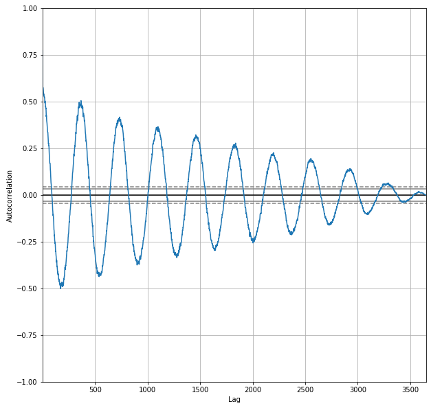

## 0. 理论


### ACF（自相关系数）

$$
r_k=\rho_{y_t,y_{t-k}}=\dfrac{cov(y_t,y_{t-k})}{\sqrt{var(y_t)var(y_{t-k})}}
$$

计算公式是：
$$
r_k=\dfrac{\sum\limits_{t=1}^{n-k}(Y_t-\bar Y)(Y_{t+k}-\bar Y)}{\sum\limits_{t=1}^n(Y_t-\bar Y)^2}
$$

### PACF（偏自相关系数）

$Y_t$在给定$Y_{t-1},Y_{t-2},…Y_{t-k+1}$的条件下，$Y_t$和$Y_{t-k}$之间的条件相关：
$$
\rho_{y_t,y_{t-k}\mid y_{t-1},…,y_{t-k+1}}=\dfrac{E(y_t-E y_t)E(y_{t-k}-E y_{t-k})}{E(y_{t-k}-E y_{t-k})^2}
$$
计算方法：
$$
\left\{ \begin{array}{ccc}
\rho_1=\phi_{k1}\rho_0+\phi_{k2}\rho_1+...+\phi_{kk}\rho_{k-1}\\
\rho_2=\phi_{k1}\rho_1+\phi_{k2}\rho_0+...+\phi_{kk}\rho_{k-2}\\
 \vdots \\
\rho_k=\phi_{k1}\rho_{k-1}+\phi_{k2}\rho_{k-2}+...+\phi_{kk}\rho_0\\
\end{array}\right.
$$

其中，$\phi$就是偏自相关系数，$\rho$是已经计算得到的自相关系数


### Barlett定理

观察期数为 $n$ 的观察序列，若为纯随机序列，则：
$$
\hat \rho_k \sim \mathcal{N}(0,\,\frac 1 n)
$$
$\hat \rho_k$表示$lag=k$的自相关系数。

### Quenouille定理

观察期数为 $n$ 的观察序列，若为纯随机序列，则：
$$
\hat\phi_{kk} \sim \mathcal{N}(0,\,\frac 1 n)
$$
$$\hat\phi_{kk}$$表示偏自相关系数。

> 还需要详细解释.

### Q 统计量

为了对序列的自相关系数进行推断，Box 和 Pierce 提出了 Portmanteau 统计量。
$$
\begin{equation} 
 Q(m) = n \sum_{k=1}^m \hat{\rho}_k^2 \tag{1} 
\end{equation} \sim \chi^2(m)
$$
由于 $$ \hat \rho_k \sim \mathcal{N}(0,\,\frac 1 n) $$，可以得到$$  \frac {\hat \rho_k} {\sqrt n} \sim \mathcal{N}(0,\, 1)  $$，然后根据卡方分布的定义，可以得到上面的公式。

其零假设和备择假设分别为：
$$
\begin{align} 
&H_0: \rho_1 = \rho_2 = \cdots = \rho_m = 0 \\ 
&H_1: \rho_i \neq 0 
\end{align}
$$
当$ Q(m)>\chi_{\alpha}^2 $时，拒绝零假设，即认为序列中存在某些自相关，这里$\chi_{\alpha}^2$为自由度为 $m$ 的 $\chi^2$ 分布的 $100(1−\alpha)$分位数。

~~~R
set.seed(30)
y <- tsibble(sample = 1:100, wn = rnorm(100), index = sample)
Box.test(y$wn, lag=log(length(y$wn)), type='Box-Pierce')
~~~

### Ljung-Box Q 统计量

当样本数量较少的时候，Q统计量误差较大，为了改进这一点，Ljung 和 Box 提出了 Ljung-Box Q 统计量
$$
LBQ(m) =n(n+2)\sum_{k=1}^m\frac{\hat{\rho}_k^2}{n-k} \sim  \chi^2(m)
$$
通常取 $m=\ln {(n)}$。

~~~R
set.seed(30)
y <- tsibble(sample = 1:100, wn = rnorm(100), index = sample)
Box.test(y$wn, lag=log(length(y$wn)), type='Ljung')
~~~

### R: Box.test()

R语言stats包里面的一个方法，用于计算Box-Pierce或 Ljung-Box Test。Box.test()是对randomness的检验，基于一系列滞后阶数，判断序列总体的相关性或者说随机性是否存在。原假设为序列为白噪音，当p<0.05，拒绝原假设，即序列不是白噪音。下面是参数列表：

- x: a numeric vector or univariate time series.

- lag: the statistic will be based on lag autocorrelation coefficients.

- type: test to be performed: partial matching is used.
  - Box-Pierce
  - Ljung-Box

- fitdf: number of degrees of freedom to be subtracted if x is a series of residuals.

代码参见上两节`Q 统计量`和`Ljung-Box Q 统计量`。


## 1. 数据

### 下载数据

里面包含了实验所需数据。

- 澳大利亚城市墨尔本与1981年-1990年间日最低气温(通3650个观测值)  

    ~~~shell
    work_path=data
    rm -rf $work_path/daily-min-temperatures.csv
    wget https://raw.githubusercontent.com/jbrownlee/Datasets/master/daily-min-temperatures.csv -P $work_path
    ~~~

- 1959年California每天出生的女婴数量 
  
    ```shell
    work_path=data
    rm -rf $work_path/daily-total-female-births.csv
    wget https://raw.githubusercontent.com/jbrownlee/Datasets/master/daily-total-female-births.csv -P $work_path
    ```
    
- Monthly shampoo sales dataset

  ~~~shell
  work_path=data
  rm -rf $work_path/shampoo.csv
  wget https://raw.githubusercontent.com/jbrownlee/Datasets/master/shampoo.csv -P $work_path
  ~~~

### 加载数据

~~~python
import pandas as pd
import matplotlib.pyplot as plt
plt.rcParams["figure.figsize"]=10,10

series = pd.read_csv('data/daily-min-temperatures.csv', 
                  header=0, index_col=0, parse_dates=True, squeeze=True)
print(series.describe())
print('-'*50)
print(series.head(10))
~~~

## 2.  Exploratory Data Analysis (EDA)

本节参见 [Time Series Data Visualization with Python](https://machinelearningmastery.com/time-series-data-visualization-with-python/)

### 2.1 Line Plot

~~~python
series.plot()
plt.show()
~~~


~~~python
# 使用dashed line显示
series.plot(style='k.')
plt.show()
~~~


显示每一年的line plot

~~~shell
groups = series.groupby(pd.Grouper(freq='A'))
years = pd.DataFrame()
for name, group in groups:
    years[name.year] = group.values        

years.plot(subplots=True, legend=False)
[ax.legend(loc=4) for ax in plt.gcf().axes]
plt.tight_layout()
plt.show()
~~~


### 2.2 Histogram and Density Plots

~~~python
import numpy as np
from scipy.stats import gaussian_kde

density = gaussian_kde(series)
xs = np.linspace(0, 30, 200)

plt.hist(series, bins=25, weights=np.ones(len(series)) / len(series))
plt.plot(xs, density(xs))
plt.show()
~~~


其中KDE（核密度估计）参见[scipy.stats.gaussian_kde](https://docs.scipy.org/doc/scipy/reference/generated/scipy.stats.gaussian_kde.html)。

### 2.3 箱线图 Box and Whisker Plots（Boxplot）

~~~
years.boxplot()
plt.show()
~~~


查看1988年每个月的Boxplot， 可以看到一年四季的气候变化。

~~~python
one_year = series['1988']
groups = one_year.groupby(pd.Grouper(freq='M'))
months = pd.concat([pd.DataFrame(x[1].values) for x in groups], axis=1)
months = pd.DataFrame(months)
months.columns = range(1,13)
months.boxplot()
plt.show()
~~~


### 2.4 Heat Maps

横坐标是天，纵坐标是年。

~~~python
plt.matshow(years.T, interpolation=None, aspect='auto')
plt.show()
~~~


显示每个月的热力图

~~~
plt.matshow(months, interpolation=None, aspect='auto')
plt.show()
~~~


### 2.5 Lag Scatter Plots

时间序列模型假定一个observation和Previous observation有关系。Previous observation称之为lags。

~~~
pd.plotting.lag_plot(series)
plt.show()
~~~


查看当前observation和往前9天observation的相互关系。

~~~python
values = pd.DataFrame(series.values)
lags = 9
columns = [values]

for i in range(1,(lags + 1)):
    columns.append(values.shift(i))
dataframe = pd.concat(columns, axis=1)
columns = ['t']

for i in range(1,(lags + 1)):
    columns.append('t-' + str(i))
dataframe.columns = columns


plt.figure(1)

for i in range(1,(lags + 1)):
    ax = plt.subplot(330 + i)
    ax.set_title('t-' + str(i) + " vs t" )
    plt.scatter(x=dataframe['t-'+str(i)].values, y=dataframe['t'].values)
plt.show()
~~~


上图中，可以很明显可以看出t和t-1的相关程度就高。下面的相关系数也进一步反应了这个关系。

~~~python
display(dataframe.corr())
~~~


### 2.6 Autocorrelation Plots

下面来看**自相关Plot**。其实和前面相关系数矩阵相类似，只是以图形的方式显示了出来。

~~~python
pd.plotting.autocorrelation_plot(series)
plt.show()
~~~



可以看到相关性，呈现了一个增幅缩小的波形，其中波峰，表示往年同期的相关系数，而波谷，表示冬天和夏天气候，春天和秋天有强烈的负相关关系。

## 3. Make Baseline Predictions for Time Series 

本节参见 [Make Baseline Predictions for Time Series Forecasting](https://machinelearningmastery.com/persistence-time-series-forecasting-with-python/)

### 3.1 Forecast Performance Baseline： Persistence Algorithm

构建一个基准模型，然后这个模型来衡量其他模型的优劣。这个基准模型有以下特性。

- 简单：需要很少的训练
- 快速：很快完成计算
- 可重复：结果是稳定的，可以重复。

Time series使用Persistence Algorithm来构建基准模型，然后这个模型来衡量其他模型的优劣。Persistence Algorithm直接使用 previous time step (t-1)来预测 the next time step (t+1)。

#### 数据

~~~python
import pandas as pd
import matplotlib.pyplot as plt
plt.rcParams["figure.figsize"]=10,10

def parser(x):
    return pd.datetime.strptime('190'+x, '%Y-%m')
 
series = pd.read_csv('data/shampoo.csv', header=0, parse_dates=[0], 
                     index_col=0, squeeze=True, date_parser=parser)
series.plot()
plt.show()
~~~


#### 模型

persistence model 的构建包含五步：

1. 把univariate dataset变成一个supervised learning问题。
2. 建立train，test数据集
3. 定义persistence model 
4. 进行forecast，并建立一个基准的performance
5. Review模型，打印结果。

程序如下

~~~python
# 1. Define the Supervised Learning Problem
values = pd.DataFrame(series.values)
dataframe = pd.concat([values.shift(1), values], axis=1)
dataframe.columns = ['t-1', 't+1']
print(dataframe.head(5))

# 2. split into train and test sets
X = dataframe.values
train_size = int(len(X) * 0.66)
train, test = X[1:train_size], X[train_size:]
train_X, train_y = train[:,0], train[:,1]
test_X, test_y = test[:,0], test[:,1]

# 3. define persistence algorithm
def model_persistence(x):
	return x

# 4. compute Mean Squared Error (MSE)
# walk-forward validation
predictions = list()
for x in test_X:
	yhat = model_persistence(x)
	predictions.append(yhat)
test_score = mean_squared_error(test_y, predictions)
print('Test MSE: %.3f' % test_score)

# 5. plot predictions and expected results
plt.plot(train_y)
plt.plot([None for i in train_y] + [x for x in test_y])
plt.plot([None for i in train_y] + [x for x in predictions])
plt.show()
~~~


## 4. [Autoregression Models for Time Series Forecasting With Python](https://machinelearningmastery.com/autoregression-models-time-series-forecasting-python/)

本节参见[Autoregression Models for Time Series Forecasting With Python](https://machinelearningmastery.com/autoregression-models-time-series-forecasting-python/)

自相关（autocorrelation）：指变量和其之前时间窗口的值之间相关性。从第2章的分析来看，对于daily-min-temperatures.csv数据集，温度呈现了明显的自相关性。


代码如下：

~~~
import pandas as pd
import matplotlib.pyplot as plt
plt.rcParams["figure.figsize"]=10,10

series = pd.read_csv('data/daily-min-temperatures.csv', 
                  header=0, index_col=0, parse_dates=True, squeeze=True)
pd.plotting.autocorrelation_plot(series)
plt.show()
~~~

上面是pandas提供的autocorrelation plot，statsmodels包也提供了另外一个版本。

~~~
from statsmodels.graphics.tsaplots import plot_acf

plot_acf(series, lags=31)
plt.show()
~~~


## 参考

- [【ARIMA】理论与实现](https://www.guofei.site/2017/07/10/arima.html)：这篇文章总结的不错
- [Convert a Time Series to a Supervised Learning Problem](https://machinelearningmastery.com/convert-time-series-supervised-learning-problem-python/) : 把时间序列数据转化为supervised learning问题，里面由大量代码
- [Time Series Data Visualization with Python](https://machinelearningmastery.com/time-series-data-visualization-with-python/)
- [A Tour Through the Visualization Zoo](https://homes.cs.washington.edu/~jheer//files/zoo/) : 这里有很多酷炫的图，虽然是2010年的文章。
- [Make Baseline Predictions for Time Series Forecasting](https://machinelearningmastery.com/persistence-time-series-forecasting-with-python/)
- [Autoregression Models for Time Series Forecasting With Python](https://machinelearningmastery.com/autoregression-models-time-series-forecasting-python/)
- [标点符](https://www.biaodianfu.com/)： 一个个人博客网站，里面有很多非常好的文章。
  - [时间序列预测初学者指南（Python）](https://www.biaodianfu.com/time-series-forecasting-codes-python.html)
  - [时间序列建模完整教程（R语言）](https://www.biaodianfu.com/complete-tutorial-time-series-modeling.html)
  - [如何确定ARIMA模型中参数p、d、q](https://www.biaodianfu.com/arima-p-d-q.html)
  - [采用时间序列预测股价变化](https://www.biaodianfu.com/arima-finance.html)
- Book: [Time Series for Macroeconomics and Finance](http://econ.lse.ac.uk/staff/wdenhaan/teach/cochrane.pdf) : 据知乎说，非常好
- Book: [Forecasting: Principles and Practice](https://otexts.com/fpp3/index.html) : 亚马逊评分很高，在线书籍，也有配套的课程
  - https://learn.datacamp.com/


## [Time Series Forecasting as Supervised Learning](https://machinelearningmastery.com/time-series-forecasting-supervised-learning/)

### Supervised Learning

Supervised learning is where you have input variables (**X**) and an output variable (**y**) and you use an algorithm to learn the mapping function from the input to the output.
$$
\mathbf Y =f(\mathbf  X)
$$
There are 2 types of supervised learning.

- **Classification**: A classification problem is when the output variable is a category, such as “*red*” and “*blue*” or “*disease*” and “*no disease*.”
- **Regression**: A regression problem is when the output variable is a real value, such as “*dollars*” or “*weight*.” 

**Time series**:   

- **Univariate Time Series**: These are datasets where only a single variable is observed at each time, such as temperature each hour.
- **Multivariate Time Series**: These are datasets where two or more variables are observed at each time.

**Sliding window** is the way to restructure a time series dataset as a supervised learning problem.

详见：

https://machinelearningmastery.com/convert-time-series-supervised-learning-problem-python/


## ARIMA模型原理

ARIMA (Auto Regressive Integrated Moving Average) 可以用来对时间序列进行预测，常被用于需求预测和规划中。

## 书籍推荐

时间序列预测领域最值得一读的书目。在该技术的应用方面，目前 R 语言是霸主。

- [Time Series Analysis: Forecasting and Control](https://www.amazon.cn/dp/1118675029/ref=sr_1_1?s=books&ie=UTF8&qid=1485000270&sr=1-1&keywords=Time+Series+Analysis%3A+Forecasting+and+Control)
- [Practical Time Series Forecasting with R: A Hands-On Guide](https://www.amazon.cn/dp/0991576632/ref=sr_1_1?s=books&ie=UTF8&qid=1485000302&sr=1-1&keywords=Practical+Time+Series+Forecasting+with+R%3A+A+Hands-On+Guide)
- [Introduction to Time Series and Forecasting](https://www.amazon.cn/dp/3319298526/ref=sr_1_1?s=books&ie=UTF8&qid=1485000310&sr=1-1&keywords=Introduction+to+Time+Series+and+Forecasting)
- [Forecasting: principles and practice](https://www.amazon.cn/dp/0987507109/ref=sr_1_1?s=books&ie=UTF8&qid=1485000356&sr=1-1&keywords=Forecasting%3A+principles+and+practice)

该类别的入门首选是：Forecasting: principles and practice.


该类别的首选教材是：Time Series Analysis: Forecasting and Control.

