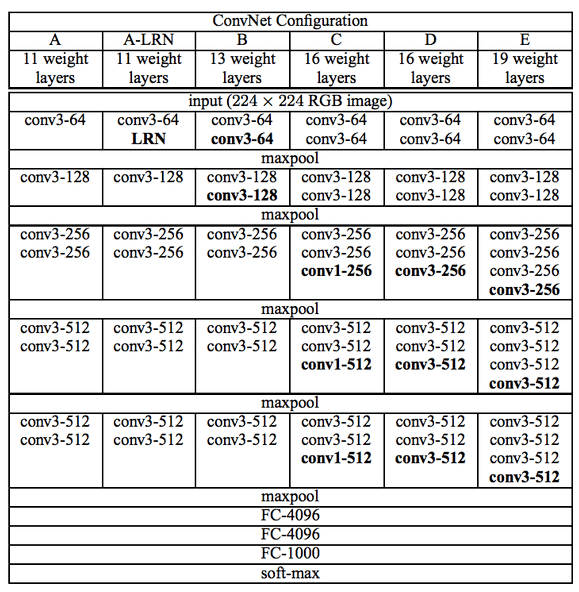

上图是各个版本的VGG的结构。VGG是牛津大学研发的一系列的卷积神经网络的简称。

D列和E列是VGG16和VGG19。VGG19是有19层，VGG16是有16层，多出的三层都是卷基层，具体是多在什么地方的可以看上面的表。

VGG16模型比VGG19更轻量化，VGG19的表现其实和VGG16略好一点，它们其实几乎差不多，所以牛津的研究员就停止在VGG19层了，不再增加更多层数了。

~~~python
from tensorflow.keras.applications import VGG19
vgg19 = VGG19()
vgg19.summary()
~~~

