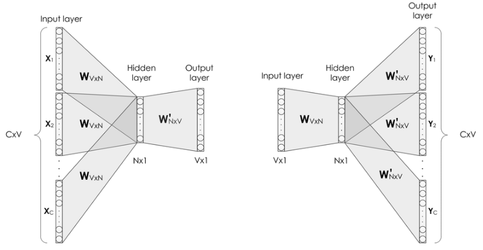

词向量模型（word2vec）一般有两种实现方式：CBOW（**c**ontinuous-**b**ag-**o**f-**w**ords）和Skipgram。

- CBOW：通过给定上下文（context），来预测target word。

  

  上例中，8个上下文词是输入，而"Learning"是输出。

- Skipgram：和CBOW相反，Skipgram是给定target word来预测上下文（context）。

  这时，"Learning"是输入，而8个上下文词变成了输出。

更形象的展示如下，下面左图为CBOW的结构图，右图为Skipgram的结构图。

在skip-gram当中，每个词都要收到周围的词的影响，每个词在作为中心词的时候，都要进行K次的预测、调整。因此， 当数据量较少，或者词为生僻词出现次数较少时， 这种多次的调整会使得词向量相对的更加准确。因为尽管cbow从另外一个角度来说，某个词也是会受到多次周围词的影响（多次将其包含在内的窗口移动），进行词向量的跳帧，但是他的调整是跟周围的词一起调整的，grad的值会平均分到该词上， 相当于该生僻词没有收到专门的训练，它只是沾了周围词的光而已。

## 过程推导

首先从简化版开始，假设输入和输出只有一个词。

上图参数说明如下：

- $V$：表示词汇表长度
- $N$：表示神经元个数（也就是词向量的维度）
- $W \in R^{V \times N}$：输入层到隐层的权重矩阵, 其实就是词向量矩阵,其中每一行代表一个词的词向量。
- $W^{'} \in R^{N \times V}$：隐层到输出层的权重矩阵, 其中每一列也可以看作额外的一种词向量。
- $$x = \begin{bmatrix} x_1 \\  x_2 \\ \vdots \\ x_k \\ \vdots \\ x_V \end{bmatrix}$$ 和$$ y = \begin{bmatrix} y_1 \\  y_2 \\ \vdots  \\ y_j \\ \vdots \\ y_V \end{bmatrix} $$都是one-hot向量。

下面来计算隐藏层（没有激活函数）。
$$
h = W^T \cdot x
$$
由于$x$是one-hot向量，假设第$k$个位置是1，则$h$相当于从$W$取出第$k$行。

然后来计算输出层，这一层会使用softmax激活函数。
$$
\begin{align}
z = (W^{'})^T \cdot h  \\
y_i =  
\frac {e^{z_j}}  {\sum_{k=1}^V e^{z_k}} \\
\end{align}
$$
其中$$z = \begin{bmatrix} z_1 \\ z_2 \\ \vdots \\ z_j \\ \vdots \\ z_V\end{bmatrix}$$

|          | CBOW | Skipgram |
| -------- | ---- | -------- |
| 预测次数 |      |          |
|          |      |          |
|          |      |          |

#### Hierarchical SoftMax

#### Negative Sampling

## 参考

- [word2vec原理(一) CBOW与Skip-Gram模型基础](https://lonepatient.top/2019/01/18/Pytorch-word2vec.html#word2vec%E7%90%86%E8%AE%BA)
- [基于PyTorch实现word2vec模型](https://lonepatient.top/2019/01/18/Pytorch-word2vec.html)