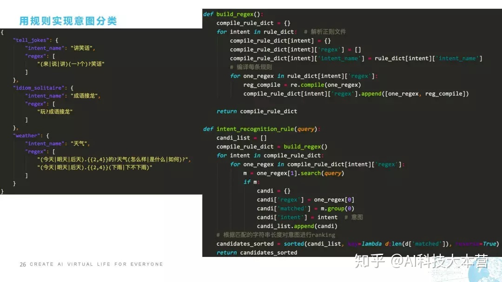
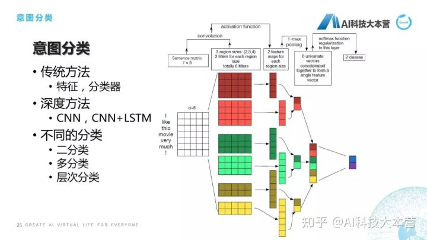

## 平台和工具

- Facebook开源会话机器人的平台 [http://parl.ai](https://link.zhihu.com/?target=http%3A//parl.ai/)

## 文章摘要

### [聊天机器人资源合集：项目，语聊，论文，教程](https://gitee.com/fendouai/Awesome-Chatbot)

- ParlAI

  A framework for training and evaluating AI models on a variety of openly available dialog datasets.

  https://github.com/facebookresearch/ParlAI

- stanford-tensorflow-tutorials

  A neural chatbot using sequence to sequence model with attentional decoder.

  https://github.com/chiphuyen/stanford-tensorflow-tutorials/tree/master/assignments/chatbot

- DeepQA

  My tensorflow implementation of "A neural conversational model", a Deep learning based chatbot

  https://github.com/Conchylicultor/DeepQA

- neuralconvo

  Neural conversational model in Torch

  https://github.com/macournoyer/neuralconvo

### [十个Chatbot框架](https://www.jianshu.com/p/16ea4fa7ea1b)

- Artificial Intelligence Markup Language
   网址：http://www.alicebot.org/
   机构/作者：Dr. Richard S. Wallace
   流行程度：283,000
   简介：这是一个自定义的AI语言，是XML语言的扩展，支持语言规约，开源了解析器，支持主流的所有编程语言。

- opendial
   网址：http://www.opendial-toolkit.net/
   机构/作者：Lison, P.
   流行程度：147,000
   简介：有较好的澄清机制，基于规则的系统，没有太多的机器学习和深度学习技术，在参数调节部分用到了机器学习技术。

- api.ai
   网址：https://api.ai/
   机构/作者：Google
   流行程度：24,600,000
   简介：Google收购的一家AI公司，和wit.ai类似。提供了一个AI的框架，可以自己定义模板，参数，多轮对话，很方便的就可以定义一个自己的特定任务的聊天机器人。

- wit.ai
   网址：https://wit.ai
   机构/作者：Facebook
   流行程度：351,000,000
   简介：是所有框架中最流程的一个，有非常好的二次开放库，duckling.wit.ai是非常好的时间识别库。wit.ai并不开源的，但是二次库很多事开源的，详见github上面的二次开发库。

- Language Understanding Intelligent Service (LUIS)
   网址：https://www.luis.ai/
   机构/作者：Microsoft
   流行程度：8,020,000
   简介：和wit.ai，api.ai类似，是微软在这方面的一个产品。

- Microsoft Bot Framework
   网址：https://dev.botframework.com/
   机构/作者：Microsoft
   流行程度：532,000
   简介：这是一个应用层的框架，里面用到的技术是luis.ai和微软的其他人工智能技术。

- Messenger Platform
   网址：https://developers.facebook.com/docs/messenger-platform
   机构/作者：Facebook
   流行程度：22,700,000
   简介：和Micros Bot Framework 是同类东西。他可以方便用户配置自己的机器人。例如某用户在网络上卖自己的商品，如果咨询太多的话，需要很多客服人员，它可以方便的配置一个客服机器人。

- ChatterBot
   网址：https://github.com/gunthercox/ChatterBot
   机构/作者：Gunther Cox
   流行程度：206,000
   简介：这是一个闲聊系统，Python语言，基于检索方式，不适用于基于任务的对话系统。

- ChatScript
   网址：http://chatscript.sourceforge.net/
   机构/作者：Suzette
   流行程度：448,000
   简介：系统是开源的，但是维护到2013年就不更新了。

- viv
   网址：http://viv.ai/
   机构/作者：Siri之父，三星收购
   流行程度：61,200,000
   简介：准确来说，其不算是一个框架，没有开源，也还没有产品出来。据其作者宣城，其特点是，采用了计算机动态自动编程技术，不用再硬编码了。

### [如何让聊天机器人懂情感](https://zhuanlan.zhihu.com/p/26667855)

朱小燕、黄民烈老师团队近期发布的论文「 Emotional Chatting Machine: Emotional Conversation Generation with Internal and External Memory」（作者：周昊、黄民烈、张天扬、朱小燕、刘兵）首次将情感因素引入了基于深度学习的生成式对话系统，提出了基于记忆网络的情感对话系统 Emotional Chatting Machine (ECM) ，在传统的 Sequence to Sequence 模型的基础上，ECM 使用了静态的情感向量嵌入表示，动态的情感状态记忆网络和情感词外部记忆的机制，使得 ECM 可以根据用户的输入以及指定情感分类输出相应情感的回复语句。实验表明，ECM 可以在语言和情感两个维度上生成恰当的回复，并且通过人工实验验证了人们偏好于引入了情感因素的对话系统。

### [聊天机器人落地及进阶实战 | 公开课速记](https://zhuanlan.zhihu.com/p/64495532)

2019-05-02

#### 聊天机器人概述

各位同学可能跟我一样，凡是有这个聊天机器人产品，我们大概用了1、2天，在新鲜感过去之后，就发现这个东西再也不会开了，或者再也不会跟它聊天了。

聊天机器人产品为什么做得这么差？我作为一个从业者还是很宽容的，因为我知道聊天机器人的边界在什么地方，所以我在问聊天机器人产品的时候就在想：这个聊天机器人产品可能这个地方技术有问题，所以我不去问或者尽量避免去问它。但是普通的用户对聊天机器人产品是没有那么宽容的，我花了那么多钱买这个聊天机器人音箱，我希望的是可以跟我自然对话的机器人，但是这个达不到之后，他就会埋怨开发者。

微软亚洲研究院副院长周明老师曾经说过，语言智能是人工智能皇冠上的明珠，如果我们把这个美女当作我们所有的技术的话，人工智能就是她头上的这顶皇冠，而语言智能就是皇冠上的这颗明珠。什么意思？**自然语言处理本身就是非常难的事！**

这么难，还是要做，为什么要做呢？

微软在2016年就提出这样一个口号，叫“对话即平台”，它认为语言是人类交互最自然的方式，从远古时代开始，人类就用语言进行狩猎时的互相协作、互相呼应，在自己丰收时，在村子里跟大家八卦八卦，促进大家的友谊，所以语言是人类最自然的一种交互方式。但是受限于硬件和软件，我们之前跟电脑基本上是用键盘和鼠标进行交互的，所以我们现在深度学习、大数据、GPU的硬件提升之后，可以直接使用语言跟机器进行交互了

#### 聊天机器人生态技术体系

三个大的生态体系：

- 产品

  亚马逊Echo，苹果siri。可以分为两大类方向

  - 被动交互：我问它答，我跟它说一句，它跟我说一句
  - 主动交互

   

- 平台：产品一定要有一个载体去进行承载，这个载体就叫做聊天机器人的平台

  微信、LINE、MSN

- 框架

  - 国内：ruyi、UNIT
  - 国外：Alexa、LUIS、Wit

#### 快速上手

- http://ruyi.ai/

- [Baidu UNIT](http://unit.baidu.com)

  百度的UNIT现在做得很好，我们去看一下这个百度UNIT怎么用的，网址是[http://unit.baidu.com](https://link.zhihu.com/?target=http%3A//unit.baidu.com)，这个很漂亮，鼠标移动过去有一些很炫的效果。

任务型对话就是为了满足特定的任务指标，比如订票、订咖啡、订餐。在任务型对话里，一般会牵扯槽位提取和填充，槽位就是在这个任务里所需要的这些关键信息。

- 订咖啡
  - 地点
  - 店名
  - 口味
  - 类型

对话管理分为两部分:

- DST：对话状态跟踪

  DST所做的事情就是跟踪它的状态，并且看一下有没有上下文，可能他在上文里直接说“我想喝美式”，这就不需要再去猜测用户口味了，如果我们发现这个上下文是没有的话，我就需要去猜测他的口味到底是什么，这里我直接写了，它可能根据用户之前点的咖啡的偏好，我直接排了个序，美式第一，拿铁第二，摩卡第三。这时它就需要做一个决策了，这时是要反问用户喝什么口味呢？还是直接给用户回复一句话，帮他点一个默认的咖啡呢？这里就需要跟产品的设定来进行回复。

- DPO：对话策略优化

  我们不希望聊天机器人在功能型对话中有太多的多轮交互，我们希望一句话就能够理会我什么意思。就跟皇帝和太监一样，皇帝一个眼神，这个太监就知道马上要做什么事情，这个是最棒的。但是聊天机器人没有那么聪明，我们尽可能的让产品设计得比较聪明。那怎么设计？比如这句话就是设计场景，我们知道用户最喜欢喝美式，这句话可能就说“那我点你最爱喝的大杯美式可以吗？”这一方面询问了用户的口味，另一方面又节省了对话轮数，这是任务型对话的处理流程。

#### 三种不同形态的实现

- 检索式机器人

  在一个很大的语料库里去搜索，搜索这里面哪一句话跟我现在问的问句是最接近的，然后把最近这句话的回复直接回复给用户。

  这个问题只出现在单轮对话中。

  

  检索的方式有：

  - 基于文本相似度

    算法有：

    - 编辑距离（Kevebshtein Distance）
    - TF-IDF
    - BM25

    相似度算法一般是用到字符串匹配，我们知道字符串匹配的速度一般非常慢，但是我们可以借助相似度的检索引擎提升它的搜索效率。

    - ElasticSearch

      缺点：

      - 词语不同，但语义相近。比如：你好漂亮”、“我觉得你很好看”
      - 否定词。比如“我喜欢你”和“我不喜欢你”

    - HNSW： https://github.com/nmslib/hnswlib

  - 基于语义相似度

    

  - 基于深度学习

    微软小冰团队在2016年提出一个方法，它不仅考虑词级别的，还考虑句子级别的相似度。什么意思呢？简单解释一下，我们这里有4个句子：u(1)、u(n-1)、u(n)、r，中间还有很多句子，我们假定它是4个句子，它现在想算u跟r相似度，怎么算呢？它会把每个词做个嵌入，也就是做向量化，然后把这个词跟r的这个词直接做点乘，也就是得到M2这个矩阵，得到这个矩阵之后通过对句子做GRU，它最后得到的隐状态我们做一下余弦相似度计算，得到的是M1这个矩阵，所以M1和M2这两个矩阵分别代表词和句层面的相似度，再往后就是通过CNN，还有一个GRU，最后得到一个Score。

    

  - 基于生成式的深度学习方法、

    华为做的一篇论文，他们当时做的是怎样通过一句话直接生成它最后的这个回复，就是通过x(1)到x(t)，直接生成y(1)到y(t)，他们提出三种不同的方法。有一个是直接从这个隐状态得到它的context，还有一种方法是里面加了attention，采用加权的方式利用这个attention来得到最后的句子，还有一个是有一个contextAttention，还有一个词层面的Attention，它们称之为是local和global这两个Attention生成的回复。

#### 架构设计

NLU -> 意图解析 -> DM -> 任务对话 -> 问答 -> NLG

##### 自然语言理解（NLU）

##### 意图解析

- 用规则方法实现

  用规则方法实现意图分类是非常准确的，但是它缺点在于我们要对每一个句子都进行规则的覆盖，而且当规则实在是太多的时候模型就会变得非常难维护

  

- 传统方法： SVM，决策树

- 深度学习方法：CNN， CNN+LSTM

神药**FastText**，对意图分类的效果是非常明显的，而且它由于是基于字符子串的，所以它的性能也非常高，它不仅速度快，性能也非常高，所以在2018年我们笑称fastText是“包治百病的神药”，这个神药对工程界的分类起到非常大的促进作用。

##### 对话管理（DM）

DM是对对话进行控制，很多情况下是对多轮对话进行控制。我这里举了个典型的多轮对话，这里举的例子是天气，我这里列了1、2、3，是用户在前三轮所说的一些话，

比如说用户第一句说“上海上周日下雨了吗？”它的对话时间是3月21号的8点，它的意图是天气，地点是上海，时间是2019年3月17号，因为它是上周日下雨了么。我们抽取这些信息之后，就会给它回复一个3月17号的上海天气是什么样子，它下雨了没有。

用户第二句话问的是“上海今天的天气如何”，所以它最后的回复是3月21号的上海天气。

第三句话用户说了一个不相干的，用户觉得好像今天天气很差，怎么办呢，他说了一句“明天就不要出门了吧”，这个时候我们开始说重点的了。

重点就是用户当在第四句话时说“那明天呢，怎么办？”。我们看一下它的处理流程，“那明天呢”这句话进入了意图分析之后，我们发现这句话的正常意图分值是非常低的，也就是说它不像是个正常的意图，在意图判断时我们已经加载了上下文，也就是说它上文的日志，这时我们用分类器模型判断或者用一些规则，判断它可能是属于某个多轮意图。这个多轮意图是属于哪一个呢？我们就要去找这个窗口，这里面有两个窗口，一个叫时间窗口，一个叫轮数窗口，比如轮数窗口我们这里设定的是3轮，3轮内的内容都会抓取，时间窗口是5分钟，5分钟内的数据都会抓取，这些数据都抓取之后，我们判断它确实是天气意图下面的一句话。这句话有了之后我们填充槽位，“那明天呢”我们判断他是在问天气，那这个天气的槽位信息是什么？明天是时间信息，那地点是哪里？地点我们直接沿用上一轮他问这个天气的地点的槽位信息。所以最后我们的槽位信息其实是“上海”是地点，时间是“3月22号”，就是明天上海的天气是怎么样的。这里面用状态机，然后去决定我们接下来要做什么样的操作，这里会经过DST的步骤。同时，我们在回复之后也把这些日志加入到日志的log数据库里去，最后会返回一个对话，这是DM的操作流程。

##### 特定任务

	##### 问答模块

简单跟大家说一下基于模块的问答方式，还有更多的，比如基于语义解析超出了本次课程的范围。那基于模板怎么做？比如用户问了“你喜欢看海贼王吗？”这句话用模板的处理方式就是先去匹配这个模板库，它会在模板库里去匹配这句话跟谁是最相近的。匹配完之后我们会有一个动漫字典，它是属于海贼王，海贼王属于娱乐类的动漫的类型，所以最后给一个相应的回复语句。

##### 自然语言生成（NLG）

也就是说我们机器人在回复时，不可能让它只是回复我们查到的答案。以天气为例，天气最后的结果一般是气温，还有天气的状况。所以我不可能直接回复用户说“多云，10度、15度”，我肯定要回复非常自然的句子。它的做法是这样子的：比如我们对于整个NLG在天气回复里是这样设计的，它的Answer包括四个部分，第一个部分叫“今天的天气是什么”，第二个部分叫“最低气温是什么”，第三个部分叫“最高气温是什么”，第四个部分叫“个性化的回复语料”。我们可以看到，当我们有这样一个slots_info的时候，我们有“多云，10-15”度时，我们就直接可以把这4个信息拼成一句话，这句话可能是“今天的天气是多云，最低气温是10度，最高气温15度，天气有点凉哦，主人穿件薄外套吧”，这就是自然语言生成，我们利用槽位填充来做的模块的具体实现，其实也算一段伪代码。

##### 总结

- **NLU**，我们用Jieba分词、哈工大的LTP；
- **意图解析**我们可以用FastText或者Bert；
- **DM**我们用Python自己去写；
- **任务对话**我们用规则去实现；
- **功能模块**我们用现成的；
- **问答模块**我们用模板
- **闲聊模块**我们是用基于检索的方法
- **NLG**我们用配置的方法去做

这样就可以非常简单的去实现一个聊天机器人。今天的主要部分就讲到这些。

### [三两下实现NLP训练和预测，这四个框架你要知道](https://zhuanlan.zhihu.com/p/80276970)

2019-08-29

- Tensor2Tensor

  一个基于 TensorFlow 的较为综合性的库，既包括一些CV 和 NLP 的基本模型，如 LSTM，CNN等，也提供一些稍微高级一点的模型，如各式各样的 GAN 和 Transformer 。对 NLP 的各项任务支持得都比较全面，很方便容易上手。

  T2T 是Google 非官方提供的仓库，是社区广大爱好者共同努力建设的简单入门型框架，底层封装TF，能满足大部分CV 和 NLP的任务，很多主流成熟的模型也已经都有实现。直接继承或实现一些框架内预设的接口，就可以完成很多任务。入门起来非常友好，并且文档更新也较为及时。认真阅读文档（或阅读报错信息）就可以了解并使用该框架，方便许多非大幅创新模型的复现。

  Tensor2Tensor 涵盖比较全面，但是只支持 TensorFlow。

- AllenNLP

  AllenNLP 是一个基于 PyTorch 的 **NLP 研究库**，可为开发者提供语言任务中的各种业内最佳训练模型。官网提供了一个很好的入门教程[2]，能够让初学者在 30 分钟内就了解 AllenNLP 的使用方法。

  AllenNLP 最大的优点在于简化了数据预处理、训练和预测的过程。代码改起来也很灵活，但是一些工具目前官方还没有实现，需要自己写。

- OpenNMT

  OpenNMT[6] 是一个开源的神经机器翻译（neural machine translation）项目，采用目前普遍使用的编码器-解码器（encoder-decoder）结构，因此，也可以用来完成文本摘要、回复生成等其他文本生成任务。目前，该项目已经开发出 PyTorch、TensorFlow 两个版本，用户可以按需选取。

  如果是比较传统的编码器-解码器结构下文本生成任务，使用 OpenNMT 能节省很多时间。但是如果是结构比较新颖的模型，使用 OpenNMT 搭建模型依旧是一个不小的挑战。

- ParlAI

   ParlAI 是 Facebook 公司开发出的一个专注于**对话领域**在很多对话任务上分享，训练和评估对话模型的平台[8]。这个平台可以用于训练和测试对话模型，在很多数据集上进行多任务训练，并且集成了 Amazon Mechanical Turk，以便数据收集和人工评估。

  ParlAI 内部封装了很多对话任务，方便使用者快速复现相关的 baseline 模型。但由于代码封装性太强和其特殊的模式，使用 ParlAI 从头搭建自己的模型具有一定的挑战性。

### [Facebook: 会话机器人最新进展](https://zhuanlan.zhihu.com/p/77259204) 

2020-08-02

开放领域会话机器人的五大挑战：一致性、回复的具体性、情感性、知识引入能力、多模态理解。

- 一致性

  会话机器人的回复不能够自相矛盾，下面给出一个例子:

  

  左边的是机器人的回复，第一条回复表示有两只猫，第二条回复却表示自己没有宠物，这样自相矛盾的信息会让会话体验变差。Facebook在论文《**Dialogue Natural Language Inference**》提出了一个新的模型，大大提升了会话机器人的回复一致性，自相矛盾的回复减少了3倍。

- 回复的具体性

  很多会话机器人容易产生“没用”的通用回复，例如：我没听懂您说的话，哈哈，哦哦等等。为改善用户体验，有很多研究人员开展会话机器人回复具体程度方面的研究，比如《**What makes a good conversation? How controllable attributes affect human judgments**》。下面给出一个实例：

  

  当人类问机器人：你是做什么工作的？机器人可以回答的很粗略，也可以回答的非常具体。哪种方式更好一些呢？请看下图：

  

  图中横轴是机器人回复的具体程度，纵轴是会话机器人的回复吸引力评价。图中黄色的线条是人类会话的吸引力水平，白色的线条是会话机器人加入了具体程度控制的吸引力水平。我们可以看到**机器人的回复并非越具体越好。**另外一方面，做好主动提问和回复之间的平衡，或者控制机器人回复的重复程度，都很大程度地影响会话机器人的吸引力。

- 情感性

  会话机器人的另一大挑战：识别情感并作出适当的反馈。华盛顿大学的学者们在论文《[Towards Empathetic Open-domain Conversation Models: a New Benchmark and Dataset](https://link.zhihu.com/?target=https%3A//arxiv.org/abs/1811.00207)》中给出了一个数据集，包含了情感标签，用于衡量会话机器人的情感表达能力。Facebook的研究人员也发现，使用该数据进行fine-tune后，会话机器人在三个模型上的情感表达能力平均提升了0.95分（评分范围为：1-5分），很给力。

  

- 知识引入能力

  人们在会话过程中通常会谈天说地（引入外部知识），现有的聊天机器人目前很难利用好已有的外部知识。现有的seq2seq模型很难记录历史会话信息，也很难融入外部知识。百度在今年举办的《会话机器人》比赛中，尝试将知识三元组引入会话。Facebook的科学家们也尝试将wikipedia中的知识融入到会话中，发表了论文《**Wizard of Wikipedia: Knowledge-Powered Conversational agents**》。

  

  论文提出了transformer memory网络的概念，效果提升显著：吸引力方面提升了26%.

- 多模态理解

  未来的聊天机器人的输入是多方面的，包括语音、图像、文字等。近年来，随着image caption的发展，可以通过图片的理解与用户进行交互。比如论文《Engaging Image Captioning via Personality》，机器人会生成不同态度的image caption。比如，侦测到用户也比较开心时，机器人的回复可以是：“好漂亮的烟花啊！从没见过这么漂亮的烟花。”, 机器人也可以选择“不耐烦”的回复：“烟花虽然好看，但好吵啊”。这些极具个性的回复，能够提升用户的体验。实验表明，与人写的caption相比，用户会更加喜欢个性化生成的caption。

  Facebook搭建了一套[会话产品](https://link.zhihu.com/?target=https%3A//ai.facebook.com/micro_site/url/%3Fclick_creative_path%5B0%5D%3Dlink%26click_creative_path%5B1%5D%3Dsection%26click_from_context_menu%3Dtrue%26country%3DUS%26destination%3Dhttps%3A%2F%2Fwww.facebook.com%2FBeat-The-Bot-212188996195556%2F%26event_type%3Dclick%26last_nav_impression_id%3D0gghtA2bK8UHvhV8X%26max_percent_page_viewed%3D89%26max_viewport_height_px%3D969%26max_viewport_width_px%3D1324%26orig_request_uri%3Dhttps%3A%2F%2Fai.facebook.com%2Fblog%2Fadvances-in-conversational-ai%2F%26primary_cmsid%3D889479724724240%26primary_content_locale%3Den_US%26region%3Dnoam%26scrolled%3Dtrue%26session_id%3D169E0NRugoIrEGus4%26site%3Dfb_ai%26extra_data%5Bcreative_detail%5D%3Dsection%26extra_data%5Bcreate_type%5D%3Dsection%26extra_data%5Bcreate_type_detail%5D%3Dsection)，用于收集用户数据。每个用户登陆后，可以输入一句话，机器人和另一个真人用户都会进行回复。通过该产品，facebook收集了大量的语料信息。如何使用这些现成的语料不断迭代会话模型呢？Facebook提出了一个self-feeding架构，如下图所示：

  

  self-feeding会话机器人回复人类用户后，会评估每一次人类用户的满意程度。当用户不满意时，self-feeding会话机器人会收集用户反馈，并构建一个模型用于预测用户的满意度。self-feeding会话机器人会根据满意度，给出一个还不错的回复。使用了该方法后，回复的准确率提升了31%.

  Facebook致力于解决**开放领域会话机器人**的**五大挑战**：**一致性、回复的具体性、情感性、知识引入能力、多模态理解。**Facebook也开源了开放领域会话机器人的平台 [http://parl.ai](https://link.zhihu.com/?target=http%3A//parl.ai/)，供大家尝试。

##### 