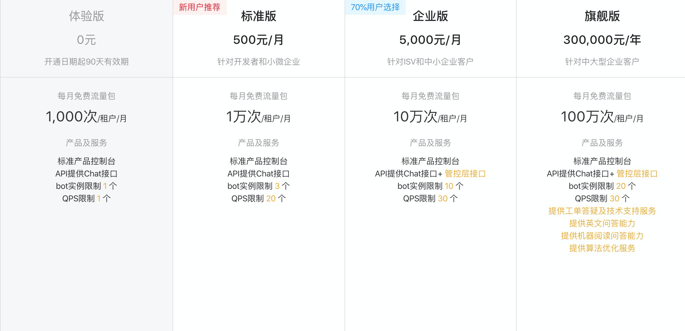

## [云小蜜](https://help.aliyun.com/product/59495.html?spm=a2c4g.11186623.3.1.6ce53097WN3IDq)介绍

云小蜜（Intelligent Service Robot）是一款基于自然语言处理（NLP）和人工智能（AI）技术，面向开发者提供智能会话能力的云服务。开发者可以使用云小蜜创建会话机器人，为机器人配置知识库以实现智能问答，使用对话工厂配置意图实现多轮对话与自助服务（如订单查询、物流跟踪、自助退货等），并将机器人部署在不同终端上（如网站、移动APP、智能硬件等）

### 定价

## 文章摘要

### [阿里小蜜新一代智能对话开发平台技术解析](https://mp.weixin.qq.com/s?__biz=MzU1NTMyOTI4Mw==&mid=2247494321&idx=1&sn=7f58bafd7f1962e17f3162ef0917c431&chksm=fbd758ddcca0d1cb19c452c40697c816f788d29b90af4f703a0fc776897f80b087d0a3bc885a&scene=27#wechat_redirect)

“新一代智能对话开发平台”（Dialog Studio），中文名叫对话工厂，是小蜜家族中的一个做多轮任务型对话开发产品，目标是以平台的方式赋能更多开发者，让所有的对话者能创造自己的多轮对话机器人。

