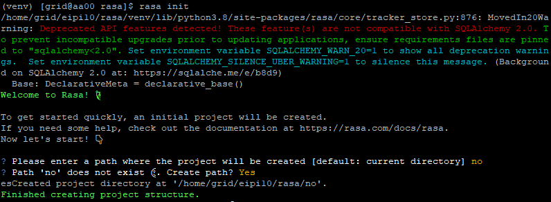
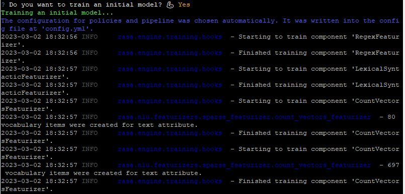

# [介绍](https://rasa.com/docs/rasa/)

Rasa是一个自动文本和语音对话的开源机器学习框架。

三大产品：

- Rasa Open Source

- Rasa Pro

  Rasa Pro is a conversational AI framework powered by Rasa Open Source, and includes additional features, APIs, and services that serve enterprise specific needs around **security, observability, and scale**.

  需要花钱。

-  [Rasa X/Enterprise](https://rasa.com/docs/rasa-enterprise)

  It is our **low-code user interface** that supports conversational AI Teams reviewing and improving AI Assistants at scale. It must be used with Rasa Pro. 

## 架构

- Rasa NLU ：

  提供了提取用户意图和词槽的功能。利用规则、机器学习，统计学习，深度学习等方法，对一条人类语言进行文本分析，分析得到的主要结果为意图intent以及实体entity信息。

- Rasa Core

  通过NLU的分析得到的意图和实体信息，进行槽位填充，然后结合前几轮对话的状态，根据某种策略（策略可以是人工规则，或者机器学习，深度学习，强化学习训练得到的策略模型），决定应当如何对当前用户的对话进行回应。

当一条用户的表达到达chatbot时，由NLU对封装后的Message进行文本分析，得到意图和实体信息，然后由对话管理核心模块接受原始的用户消息和NLU的分析结果，根据一些策略，生成某个回复。

## 产品

- Rasa Open Source

- Rasa X

  用于对话驱动开发（Conversation-Driven Development）的工具，适用该工具可以聆听用户见解改善AI助手。 对话驱动开发（CDD）即聆听用户并使用这些见解来改善AI助手的过程。 这是聊天机器人开发的总体最佳实践方法。

- Rasa Action Server

  运行自定义的actions

- Rasa Enterprise

  是一个整合了Rasa Open Source, Rasa X以及其它的一些特性的平台。

# 安装

## 本地安装

### [环境设置](https://rasa.com/docs/rasa/installation/environment-set-up)

#### Python环境安装

~~~shell
python3 --version
pip3 --version
~~~

- ubuntu

  ~~~shell
  sudo apt update
  sudo apt install python3-dev python3-pip
  ~~~

- centos

  ~~~shell
  sudo yum update -y
  sudo yum install python3-devel python3-pip
  ~~~

#### 虚拟环境安装

~~~shell
cd /home/grid/eipi10/rasa
python3 -m venv ./venv
source ./venv/bin/activate
~~~

退出虚拟环境

~~~shell
deactivate
~~~

#### 安装 Rasa Open Source

~~~shell
pip3 install -U pip
pip3 install rasa
~~~

##### 其他依赖

- 安装spaCy依赖

  ~~~shell
  pip3 install rasa[spacy]
  python3 -m spacy download en_core_web_md
  ~~~

- 安装 MITIE

  [MITIE](https://github.com/mit-nlp/MITIE)是在[dlib](http://dlib.net/)机器学习库之上开发的NLP工具包，支持分布式词嵌入和结构化SVM。提供英语，西班牙语，德语的预训练[语言模型](https://so.csdn.net/so/search?q=语言模型&spm=1001.2101.3001.7020)。MITIT核心代码使用C++编写，支持Python，R，Java,C,MATLAB的集成。

  ~~~shell
  pip3 install git+https://github.com/mit-nlp/MITIE.git
  pip3 install rasa[mitie]
  ~~~

#### 初始化

~~~
rasa init 
~~~

训练模型

## [Docker](https://rasa.com/docs/rasa-x/installation-and-setup/install/docker-compose)

参见https://rasa.com/docs/rasa/docker/building-in-docker/

- 创建项目

  ~~~shell
  mkdir ~/eipi10/rasa
  cd ~/eipi10/rasa
  docker run -it -d --name rash -v $(pwd):/app rasa/rasa:3.4.4-full init --no-prompt
  
  # 检查创建的内容。
  ls -l
  ~~~

- 和上面创建的Assistant聊天

  ~~~shell
  docker run -it -v $(pwd):/app rasa/rasa:3.4.4-full shell 
  ~~~

# 构建 Assistants

## [命令行](https://rasa.com/docs/rasa/command-line-interface)

### Cheat Sheet

| 命令                  | 作用说明                                                     |
| --------------------- | ------------------------------------------------------------ |
| rasa init             | 使用示例训练数据，操作和配置文件创建新项目                   |
| rasa train            | 使用你的NLU数据和故事训练模型，在`./model`中保存训练的模型   |
| rasa interactive      | 启动交互式学习会话，通过聊天创建新的训练数据                 |
| rasa shell            | 加载已训练的模型，并让你在命令行上与助手交谈                 |
| rasa run              | 使用已训练的的模型启动Rasa服务。有关详细信息，请参阅[运行服务](https://rasachatbot.com/3_Command_Line_Interface/)文档 |
| rasa run actions      | 使用Rasa SDK启动操作服务                                     |
| rasa visualize        | 可视化故事                                                   |
| rasa test             | 使用你的测试NLU数据和故事测试已训练的Rasa模型                |
| rasa data split nlu   | 根据指定的百分比执行NLU数据的拆分                            |
| rasa data convert nlu | 在不同格式之间转换NLU训练数据                                |
| rasa data migrate     | Migrates 2.0 domain to 3.0 format.                           |
| rasa data validate    | Checks the domain, NLU and conversation data for inconsistencies. |
| rasa export           | Exports conversations from a tracker store to an event broker. |
| rasa evaluate markers | Extracts markers from an existing tracker store.             |
| rasa -h               | 帮助                                                         |

### 日志级别

标准的Python日志级别如下：

| Level      | Numeric value |
| :--------- | :------------ |
| `CRITICAL` | 50            |
| `ERROR`    | 40            |
| `WARNING`  | 30            |
| `INFO`     | 20            |
| `DEBUG`    | 10            |
| `NOTSET`   | 0             |

下面一个rasa日志设置示例：

~~~shell
LOG_LEVEL_LIBRARIES=ERROR LOG_LEVEL_MATPLOTLIB=WARNING LOG_LEVEL_KAFKA=DEBUG rasa shell --debug
~~~

以上命令将产生如下结果：

- messages with `DEBUG` level and higher by default (due to `--debug`)
- messages with `WARNING` level and higher for Matplotlib
- messages with `DEBUG` level and higher for kafka
- messages with `ERROR` level and higher for other libraries not configured