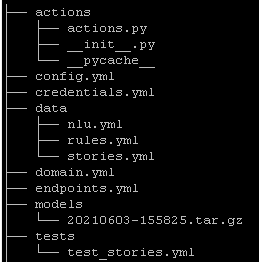

## 介绍

Rasa是一个自动文本和语音对话的开源机器学习框架。

### 架构

- Rasa NLU ：

  提供了提取用户意图和词槽的功能。利用规则、机器学习，统计学习，深度学习等方法，对一条人类语言进行文本分析，分析得到的主要结果为意图intent以及实体entity信息。

- Rasa Core

  通过NLU的分析得到的意图和实体信息，进行槽位填充，然后结合前几轮对话的状态，根据某种策略（策略可以是人工规则，或者机器学习，深度学习，强化学习训练得到的策略模型），决定应当如何对当前用户的对话进行回应。

当一条用户的表达到达chatbot时，由NLU对封装后的Message进行文本分析，得到意图和实体信息，然后由对话管理核心模块接受原始的用户消息和NLU的分析结果，根据一些策略，生成某个回复。

### 产品

- Rasa Open Source

- Rasa X

  用于对话驱动开发（Conversation-Driven Development）的工具，适用该工具可以聆听用户见解改善AI助手。 对话驱动开发（CDD）即聆听用户并使用这些见解来改善AI助手的过程。 这是聊天机器人开发的总体最佳实践方法。

- Rasa Action Server

  运行自定义的actions

- Rasa Enterprise

  是一个整合了Rasa Open Source, Rasa X以及其它的一些特性的平台。

## 安装

### Local

#### Rasa

~~~shell
python3 -m venv ./venv
source ./venv/bin/activate

# 对于rasa 2.6来说，要求的tensorflow版本是2.3.*
pip install tensorflow-gpu==2.3.2  
pip install rasa
deactivate 
~~~

安装tensorflow，对于rasa 2.6来说，它

~~~shell

~~~

#### Rasa X

安装了Rasa X，默认也安装了Rasa

~~~shell
python3 -m venv ./venv
source ./venv/bin/activate
pip install rasa-x --extra-index-url https://pypi.rasa.com/simple
rasa x   
~~~

然后打开http://localhost:5002

### [Docker](https://rasa.com/docs/rasa-x/installation-and-setup/install/docker-compose)

#### Rasa

参见https://rasa.com/docs/rasa/docker/building-in-docker/

- 创建项目

  ~~~shell
  mkdir ~/eipi10/rasa
  cd ~/eipi10/rasa
  docker run -it -d --name rash -v $(pwd):/app rasa/rasa:2.6.3-full init --no-prompt
  
  # 检查创建的内容。
  ls -l
  ~~~

- 和上面床架你的Assistant聊天

  ~~~shell
  docker run -it -v $(pwd):/app rasa/rasa:2.6.3-full shell 
  ~~~

  

#### Rasa X

- Docker Compose Install Script

  ~~~shell
  curl -sSL -o install.sh https://storage.googleapis.com/rasa-x-releases/0.40.1/install.sh
  sudo bash ./install.sh
  cd /etc/rasa
  sudo docker-compose up -d
  
  # create admin password
  sudo python3 rasa_x_commands.py create --update admin me <PASSWORD>
  ~~~

- Docker Compose Manual Install

  详见https://rasa.com/docs/rasa-x/installation-and-setup/install/docker-compose#docker-compose-manual-install

## 教程

### 创建新的项目

~~~shell
rasa init --no-prompt
~~~

`rasa init`命令创建rasa项目所需的所有文件，并根据一些示例数据训练一个简单的机器人。如果你省略了`——no-prompt`参数，将会询问你一些关于项目设置的问题。创建的内容如下。

## 命令行

详见https://rasachatbot.com/3_Command_Line_Interface/

| 命令                  | 作用说明                                                     |
| --------------------- | ------------------------------------------------------------ |
| rasa init             | 使用示例训练数据，操作和配置文件创建新项目                   |
| rasa train            | 使用你的NLU数据和故事训练模型，在`./model`中保存训练的模型   |
| rasa interactive      | 启动交互式学习会话，通过聊天创建新的训练数据                 |
| rasa shell            | 加载已训练的模型，并让你在命令行上与助手交谈                 |
| rasa run              | 使用已训练的的模型启动Rasa服务。有关详细信息，请参阅[运行服务](https://rasachatbot.com/3_Command_Line_Interface/)文档 |
| rasa run actions      | 使用Rasa SDK启动操作服务                                     |
| rasa visualize        | 可视化故事                                                   |
| rasa test             | 使用你的测试NLU数据和故事测试已训练的Rasa模型                |
| rasa data split nlu   | 根据指定的百分比执行NLU数据的拆分                            |
| rasa data convert nlu | 在不同格式之间转换NLU训练数据                                |
| rasa x                | 在本地启动Rasa X                                             |
| rasa -h               | 显示所有可用命令                                             |

## 资源

- [Rasa 聊天机器人中文官方文档](https://rasachatbot.com/)
