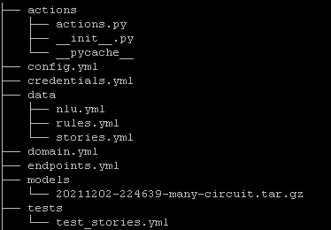

# Building Assistants

## Local Installation

### Rasa 

~~~shell
cd ~/eipi10/xuxiangwen.github.io/_notes/05-ai/30-chatbot/rasa/app
if [ ! -d "./venv" ];then
	echo build the environment
    python3 -m venv ./venv
    echo source ./venv/bin/activate
    source ./venv/bin/activate
    pip3 install --upgrade pip
	pip3 install rasa
	
	# Creates a new project with example training data, actions, and config files.
	rasa init
else
    echo source ./venv/bin/activate
	source ./venv/bin/activate
fi
~~~

`rasa init`将会创建如下目录结构。

#### 额外依赖

~~~shell
pip3 install rasa[full]

pip3 install rasa[spacy]
python3 -m spacy download en_core_web_md

pip3 install git+https://github.com/mit-nlp/MITIE.git
pip3 install rasa[mitie]
~~~

## Cheat Sheet

| Command                 | Effect                                                       |
| :---------------------- | :----------------------------------------------------------- |
| `rasa init`             | Creates a new project with example training data, actions, and config files. |
| `rasa train`            | Trains a model using your NLU data and stories, saves trained model in `./models`. |
| `rasa interactive`      | Starts an interactive learning session to create new training data by chatting to your assistant. |
| `rasa shell`            | Loads your trained model and lets you talk to your assistant on the command line. |
| `rasa run`              | Starts a server with your trained model.                     |
| `rasa run actions`      | Starts an action server using the Rasa SDK.                  |
| `rasa visualize`        | Generates a visual representation of your stories.           |
| `rasa test`             | Tests a trained Rasa model on any files starting with `test_`. |
| `rasa data split nlu`   | Performs a 80/20 split of your NLU training data.            |
| `rasa data convert`     | Converts training data between different formats.            |
| `rasa data migrate`     | Migrates 2.0 domain to 3.0 format.                           |
| `rasa data validate`    | Checks the domain, NLU and conversation data for inconsistencies. |
| `rasa export`           | Exports conversations from a tracker store to an event broker. |
| `rasa evaluate markers` | Extracts markers from an existing tracker store.             |
| `rasa x`                | Launches Rasa X in local mode.                               |
| `rasa -h`               | Shows all available commands.                                |
