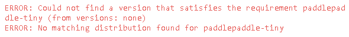
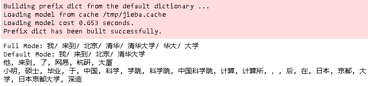
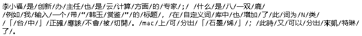
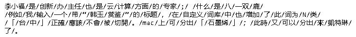
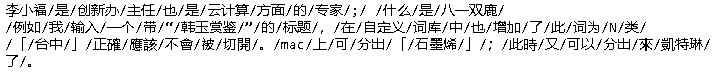
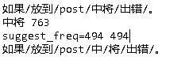
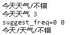
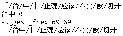
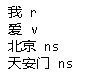

# jieba介绍

https://github.com/fxsjy/jieba

“结巴”中文分词：做最好的 Python 中文分词组件。

## 特点

- 支持四种分词模式：

  - 精确模式，试图将句子最精确地切开，适合文本分析；

  - 全模式，把句子中所有的可以成词的词语都扫描出来, 速度非常快，但是不能解决歧义；

  - 搜索引擎模式，在精确模式的基础上，对长词再次切分，提高召回率，适合用于搜索引擎分词。

  - paddle模式，利用PaddlePaddle深度学习框架，训练序列标注（双向GRU）网络模型实现分词。同时支持词性标注。paddle模式使用需安装paddlepaddle-tiny，`pip install paddlepaddle-tiny==1.6.1`。目前paddle模式支持jieba v0.40及以上版本。jieba v0.40以下版本，请升级jieba，`pip install jieba --upgrade` 。[PaddlePaddle官网](https://www.paddlepaddle.org.cn/)

    > 目前paddlepaddle-tiny已经没有更新了。
    >
    > 

- 支持繁体分词

- 支持自定义词典

- MIT 授权协议

## 算法

- 基于前缀词典实现高效的词图扫描，生成句子中汉字所有可能成词情况所构成的有向无环图 (DAG)
- 采用了动态规划查找最大概率路径, 找出基于词频的最大切分组合
- 对于未登录词，采用了基于汉字成词能力的 HMM 模型，使用了 Viterbi 算法

## 主要功能

### 分词

~~~python
# encoding=utf-8
import jieba

# jieba.enable_paddle()# 启动paddle模式。 0.40版之后开始支持，早期版本不支持
# strs=["我来到北京清华大学","乒乓球拍卖完了","中国科学技术大学"]
# for str in strs:
#     seg_list = jieba.cut(str,use_paddle=True) # 使用paddle模式
#     print("Paddle Mode: " + '/'.join(list(seg_list)))

seg_list = jieba.cut("我来到北京清华大学", cut_all=True)
print("Full Mode: " + "/ ".join(seg_list))  # 全模式

seg_list = jieba.cut("我来到北京清华大学", cut_all=False)
print("Default Mode: " + "/ ".join(seg_list))  # 精确模式

seg_list = jieba.cut("他来到了网易杭研大厦")  # 默认是精确模式
print(", ".join(seg_list))

seg_list = jieba.cut_for_search("小明硕士毕业于中国科学院计算所，后在日本京都大学深造")  # 搜索引擎模式
print(", ".join(seg_list))
~~~

### 添加自定义词典

示例代码如下：

~~~python
#encoding=utf-8
from __future__ import print_function, unicode_literals
import sys
sys.path.append("../")
import jieba

test_sent = (
"李小福是创新办主任也是云计算方面的专家; 什么是八一双鹿\n"
"例如我输入一个带“韩玉赏鉴”的标题，在自定义词库中也增加了此词为N类\n"
"「台中」正確應該不會被切開。mac上可分出「石墨烯」；此時又可以分出來凱特琳了。"
)
print(test_sent) 
~~~

默认的分词。

~~~python
words = jieba.cut(test_sent)
print('/'.join(words))
~~~

#### add_word和del_word

可以看到**石墨烯**， **凱特琳**都被额外分词了。而**自定义词**得分词也不对。对于这种情况，解决方法是添加或删除自定义词。

~~~
jieba.add_word('石墨烯')
jieba.add_word('凱特琳')
jieba.del_word('自定义词')

words = jieba.cut(test_sent)
print('/'.join(words))
~~~

#### load_userdict

可以看到，韩玉赏鉴，创新办，台中等词还是不能正确分词。这一次，我们采用`jieba.load_userdict()`来添加自定义词库。

首先我们需要创建一个词库文件。文件格式：

~~~
云计算 5
李小福 2 nr
创新办 3 i
easy_install 3 eng
好用 300
韩玉赏鉴 3 nz
八一双鹿 3 nz
台中
凱特琳 nz
Edu Trust认证 2000
~~~

一个词占一行；每一行分三部分：词语、词频（可省略）、词性（可省略），用空格隔开，顺序不可颠倒。`file_name` 若为路径或二进制方式打开的文件，则文件必须为 UTF-8 编码。

~~~python
jieba.load_userdict("jieba_userdict.txt")

words = jieba.cut(test_sent)
print('/'.join(words))
~~~

#### suggest_freq

使用 `suggest_freq(segment, tune=True)` 可调节单个词语的词频，使其能（或不能）被分出来。下面是几个例子。

~~~python
def suggest_freq_test(sent, seg, hmm=False):
    word = ''.join(seg)

    print('/'.join(jieba.cut(sent, HMM=hmm)))
    print(f'{word} {jieba.get_FREQ(word)}') 

    suggest_freq = jieba.suggest_freq(seg, True)
    print(f'suggest_freq={suggest_freq} {jieba.get_FREQ(word)}')
    print('/'.join(jieba.cut(sent, HMM=hmm)))
    
suggest_freq_test('如果放到post中将出错。', ('中', '将'))
~~~

~~~python
suggest_freq_test('今天天气不错', ('今天', '天气'))
~~~

~~~python
jieba.del_word('台中') 
suggest_freq_test('「台中」正确应该不会被切开', '台中') 
~~~

### 词性标注

~~~python
import jieba.posseg as pseg
result = words = pseg.cut("我爱北京天安门")

for w in result:
    print(f'{w.word} {w.flag}')
~~~

| 标签 | 含义     | 标签 | 含义     | 标签 | 含义     | 标签 | 含义     |
| ---- | -------- | ---- | -------- | ---- | -------- | ---- | -------- |
| n    | 普通名词 | f    | 方位名词 | s    | 处所名词 | t    | 时间     |
| nr   | 人名     | ns   | 地名     | nt   | 机构名   | nw   | 作品名   |
| nz   | 其他专名 | v    | 普通动词 | vd   | 动副词   | vn   | 名动词   |
| a    | 形容词   | ad   | 副形词   | an   | 名形词   | d    | 副词     |
| m    | 数量词   | q    | 量词     | r    | 代词     | p    | 介词     |
| c    | 连词     | u    | 助词     | xc   | 其他虚词 | w    | 标点符号 |
| PER  | 人名     | LOC  | 地名     | ORG  | 机构名   | TIME | 时间     |

### 关键词提取

#### 基于 TF-IDF 算法的关键词抽取

参加 https://github.com/fxsjy/jieba#%E5%9F%BA%E4%BA%8E-tf-idf-%E7%AE%97%E6%B3%95%E7%9A%84%E5%85%B3%E9%94%AE%E8%AF%8D%E6%8A%BD%E5%8F%96

#### 基于 TextRank 算法的关键词抽取

参见 https://github.com/fxsjy/jieba#%E5%9F%BA%E4%BA%8E-textrank-%E7%AE%97%E6%B3%95%E7%9A%84%E5%85%B3%E9%94%AE%E8%AF%8D%E6%8A%BD%E5%8F%96

### 并行分词

### Tokenize：返回词语在原文的起止位置

### ChineseAnalyzer for Whoosh 搜索引擎

### 命令行分词