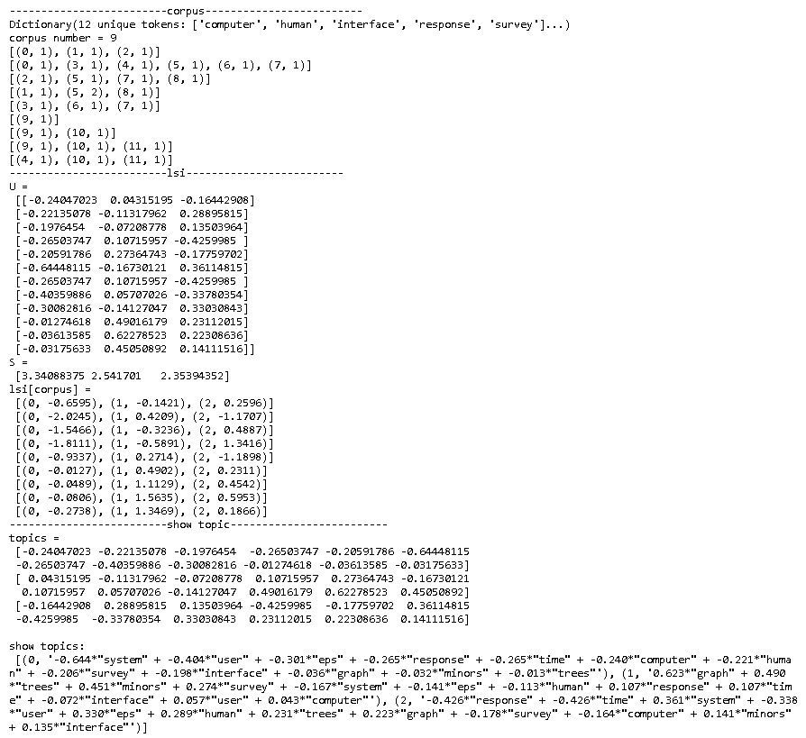

在文本挖掘中，主题模型是非常普遍的，LSI算法是被广泛运用的算法之一，它的全称是[Latent Semantic Indexing(或 Latent Semantic Analysis )](https://en.wikipedia.org/wiki/Latent_semantic_analysis#Latent_semantic_indexing)。 它采用[奇异值分解](https://zh.wikipedia.org/zh-hans/%E5%A5%87%E5%BC%82%E5%80%BC%E5%88%86%E8%A7%A3)（Singular Value Decomposition）对文档矩阵进行分解，然后保留一部分（Top n）奇异值和其对应的奇异向量。和奇异值分解的目的相同，LSI往往也用于去除文本中的噪音。公式如下：
$$
A_{m \times n}=U_{m \times m}S_{m \times n}V^\mathrm {T}_{n \times n}
$$
A是Term-Document文档矩阵（行是Term，列是Document）。

实际计算中，我们会选取$k$个奇异值（$k < m, k < n$），这时公式变成：
$$
A_{m \times k}^*=U_{m \times k}S_{k \times k}V^\mathrm {T}_{k \times k}
$$

- $U_{m \times k}$ 每个列向量可以看成是一个主题（topic），每个主题有不同的Term分布，而且这些主题相互独立（垂直）
- 对于一个新的文档$a$，$U_{m \times k}^\mathrm {T}a$可以理解为$a$在$U_{m \times k}$列向量（主题）上的投影，根据投影的大小，可以看出$a$更有可能属于哪个主题。

### LsiModel

[Gensim](https://radimrehurek.com/gensim/)里面实现了LSI算法，下面是使用gensim.models.LsiModel示例代码。

~~~python
from gensim.test.utils import common_corpus, common_dictionary
from gensim.models import LsiModel

# 使用Gensim包里的语料和字典
print('-'*25, "corpus", '-'*25, sep="") 
print(common_dictionary)
corpus = common_corpus[0:9]
print("corpus number =", len(corpus))
for doc in corpus:
    print([(i, round(w,4)) for i, w in doc])

# 构建LSI模型    
print('-'*25, "lsi", '-'*25, sep="")  
model = LsiModel(corpus, id2word=common_dictionary, num_topics=3)  # train model

print("U =\n", model.projection.u)
print("S =\n", model.projection.s)
print("lsi[corpus] =")
for doc in model[corpus]:
    print("", [(i, round(w,4)) for i, w in doc])

print('-'*25, "show topic", '-'*25, sep="")    
topics = model.get_topics()
print("topics =")
for topic in topics: 
    print("", topic)
print("\nshow topics:")    
print("", model.show_topics(3, num_words=12))
~~~

上面topics的结果中，每一行就是$U$的每个列向量。

### 和奇异值分解比较

如前文所述，LSI采用了奇异值分解。下面的代码比较了奇异值分解和LSI，便于我们理解LSI中具体Feature的意义。

~~~python
import gensim
import numpy as np
from gensim import corpora
from gensim import models

A = np.array([[1,2,3], [2,0,2]])
print("A =\n", A)

print('-'*25,  "奇异值分解", '-'*25, sep='')
U, S, VT = np.linalg.svd(A, full_matrices=False) 
print("U =\n", U)
print("S =\n", S)
print("VT = \n", VT)

# A在U为基所对应的矩阵。即A中每个列向量在以U为基中对应的向量（坐标）
UTA = U.T @ A
print("U.T @ A =\n", UTA)

print('-'*25,  "LSI", '-'*25, sep='')
corpus = gensim.matutils.Dense2Corpus(A)
lsi = models.LsiModel(corpus)

print("U =\n", lsi.projection.u)
print("S =\n", lsi.projection.s)

vt =  (lsi.projection.u.T @ A) / lsi.projection.s.reshape(len(lsi.projection.s),1)
print("VT =\n", vt)

# lsi[corpus] 等价U.T @ A
new_a = gensim.matutils.corpus2dense(lsi[corpus], num_terms=len(lsi.projection.s))
print("lsi[corpus] =\n", new_a)

~~~

需要注意：

- LSI分解出的向量，和奇异值分解出的向量有时方向相反。
- *lsi[corpus]* 等价$U^TA$，可以看成$A$变换到以$U$为基的对应矩阵，即$A$中每个列向量在以$U$为基中对应的向量（坐标）。