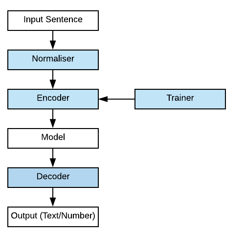
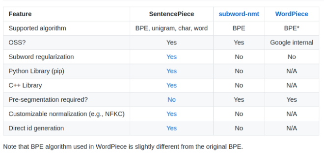

SentencePiece是一个google开源的词切分工具包。它被广泛用于多个NLP模型，比如T5, Reformer, XLNet, Albert等。本文将从原理和实践两方法来介绍SentencePiece。

## 原理

### 特性

词切分方法有很大，大体上可以分为如下几类。

- 字符粒度（Char-Level）
- 词粒度（Word-Level）
- 子词粒度（Subword-Level）

Subword-Level很好的平衡前两种方法的优缺点。SentencePiece是Subword的一种，它有如下特点。

- 纯数据驱动：

  SentencePiece 从句子中训练了tokenization 和 detokenization 模型。我们不需要对数据做任何预处理。

- language independent ： 适用于多种语言

- 实现了两种subword 分词算法。

  - byte-pair-encoding (BPE)
  - unigram language model

- 快速而且轻量化。能达到每秒50K句子的处理熟读，内存只需要6MB

- NFKC-based normalization

  SentencePiece 实现了NFKC-based text normalization。*NFKC*是unicode文本标准编码之一。

### BPE

SentencePiece实现了BPE（byte-pair-encoding ），下面举例来说明一下。

BPE的大概训练过程：首先将词分成一个一个的字符，然后在词的范围内统计字符对出现的次数，每次将次数最多的字符对保存起来，直到循环次数结束。下面来模拟一下BPE算法。

假设原始词表如下：

{'l o w e r ': 2, 'n e w e s t ': 6, 'w i d e s t ': 3, 'l o w ': 5}

其中的key是词表的单词拆分层字母，再加代表结尾，value代表词出现的频率。

下面我们每一步在整张词表中找出频率最高相邻序列，并把它合并，依次循环。

```
原始词表 {'l o w e r </w>': 2, 'n e w e s t </w>': 6, 'w i d e s t </w>': 3, 'l o w </w>': 5}
出现最频繁的序列 ('s', 't') 9
合并最频繁的序列后的词表 {'n e w e st </w>': 6, 'l o w e r </w>': 2, 'w i d e st </w>': 3, 'l o w </w>': 5}
出现最频繁的序列 ('e', 'st') 9
合并最频繁的序列后的词表 {'l o w e r </w>': 2, 'l o w </w>': 5, 'w i d est </w>': 3, 'n e w est </w>': 6}
出现最频繁的序列 ('est', '</w>') 9
合并最频繁的序列后的词表 {'w i d est</w>': 3, 'l o w e r </w>': 2, 'n e w est</w>': 6, 'l o w </w>': 5}
出现最频繁的序列 ('l', 'o') 7
合并最频繁的序列后的词表 {'w i d est</w>': 3, 'lo w e r </w>': 2, 'n e w est</w>': 6, 'lo w </w>': 5}
出现最频繁的序列 ('lo', 'w') 7
合并最频繁的序列后的词表 {'w i d est</w>': 3, 'low e r </w>': 2, 'n e w est</w>': 6, 'low </w>': 5}
出现最频繁的序列 ('n', 'e') 6
合并最频繁的序列后的词表 {'w i d est</w>': 3, 'low e r </w>': 2, 'ne w est</w>': 6, 'low </w>': 5}
出现最频繁的序列 ('w', 'est</w>') 6
合并最频繁的序列后的词表 {'w i d est</w>': 3, 'low e r </w>': 2, 'ne west</w>': 6, 'low </w>': 5}
出现最频繁的序列 ('ne', 'west</w>') 6
合并最频繁的序列后的词表 {'w i d est</w>': 3, 'low e r </w>': 2, 'newest</w>': 6, 'low </w>': 5}
出现最频繁的序列 ('low', '</w>') 5
合并最频繁的序列后的词表 {'w i d est</w>': 3, 'low e r </w>': 2, 'newest</w>': 6, 'low</w>': 5}
出现最频繁的序列 ('i', 'd') 3
合并最频繁的序列后的词表 {'w id est</w>': 3, 'newest</w>': 6, 'low</w>': 5, 'low e r </w>': 2}
```

这样我们通过BPE得到了更加合适的词表了，这个词表可能会出现一些不是单词的组合，但是这个本身是有意义的一种形式，加速NLP的学习，提升不同词之间的语义的区分度。

## 实践

### 参见[sentencepiece_python_module_example.ipynb](http://15.15.166.35:18888/notebooks/eipi10/xuxiangwen.github.io/_notes/05-ai/20-ml/sentencepiece_python_module_example.ipynb)。


## 其它

### 组件

SentencePiece有四个组件：



- Normaliser

  把文本转化为采用NFKC方式的Unicode编码方式。

- Trainer

  使用某一种算法（比如:BPE）基于sub-word建立词表。

- Encoder和Decoder

  可以用如下公式表示。

  Decode(Encode(Normalized(text))) = Normalized(text)

  实际转化过程中，往往会有一点信息丢失的情况，但这些信息往往无足轻重。

### 比较

SentencePiece比较其它的sub-word generators。



### 

## 参考

- [Understanding SentencePiece](https://jacky2wong.medium.com/understanding-sentencepiece-under-standing-sentence-piece-ac8da59f6b08)
- [一文读懂BERT中的WordPiece](https://www.cnblogs.com/huangyc/p/10223075.html)
- [NLP三大Subword模型详解：BPE、WordPiece、ULM](https://zhuanlan.zhihu.com/p/198964217)

