spaCy是一个免费，开源，强大的NLP工具。

## [Installation](https://spacy.io/usage#quickstart)

~~~shell
pip install -U pip setuptools wheel
pip install -U spacy

# 加载模型
python -m spacy download en_core_web_sm
python -m spacy download en_core_web_md
python -m spacy download zh_core_web_sm
python -m spacy download zh_core_web_md
python -m spacy download en_core_web_trf

# 支持GPU
pip install -U spacy[cuda112]  
~~~

检查GPU支持

~~~python
import spacy
spacy.prefer_gpu()
~~~

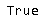

## [Models & Languages](https://spacy.io/usage/models)

支持多种语言。加载已经训练好的模型。

~~~python
import spacy
from spacy import displacy
from spacy.tokens import Doc
from spacy.vocab import Vocab

spacy.prefer_gpu()
nlp = spacy.load("en_core_web_sm")
doc = nlp("This is a sentence.")
~~~

以下内容，参见https://spacy.io/models/en

- [en_core_web_sm](https://spacy.io/models/en#en_core_web_sm) ： 12MB

  包含：tok2vec, tagger, parser, senter, ner, attribute_ruler, lemmatizer。不包含词向量。

- [en_core_web_md](https://spacy.io/models/en#en_core_web_md)： 43 MB

  包含：tok2vec, tagger, parser, senter, ner, attribute_ruler, lemmatizer。 词向量：685k keys, 20k unique vectors (300 dimensions)。

- [en_core_web_lg](https://spacy.io/models/en#en_core_web_lg)： 741 MB

  包含：tok2vec, tagger, parser, senter, ner, attribute_ruler, lemmatizer。 词向量：685k keys, 685k unique vectors (300 dimensions)

- [en_core_web_trf](https://spacy.io/models/en#en_core_web_trf)：438 MB

  包含：transformer, tagger, parser, ner, attribute_ruler, lemmatizer。不包含词向量

以上几个模型的性能指标。

|           |                                                     | en_core_web_sm | en_core_web_md | en_core_web_lg | en_core_web_trf |
| --------- | --------------------------------------------------- | -------------- | -------------- | -------------- | --------------- |
| TOKEN_ACC | Tokenization                                        | 1              | 1              | 1              | 1               |
| TAG_ACC   | Part-of-speech tags (fine grained tags,  Token.tag) | 0.97           | 0.97           | 0.97           | 0.98            |
| DEP_UAS   | Unlabelled dependencies                             | 0.92           | 0.92           | 0.92           | 0.95            |
| DEP_LAS   | Labelled dependencies                               | 0.9            | 0.9            | 0.9            | 0.94            |
| ENTS_P    | Named entities (precision)                          | 0.85           | 0.85           | 0.85           | 0.9             |
| ENTS_R    | Named entities (recall)                             | 0.85           | 0.85           | 0.85           | 0.9             |
| ENTS_F    | Named entities (F-score)                            | 0.85           | 0.85           | 0.85           | 0.9             |
| SENTS_P   | Sentence segmentation (precision)                   | 0.9            | 0.9            | 0.9            | 0.95            |
| SENTS_R   | Sentence segmentation (recall)                      | 0.88           | 0.88           | 0.88           | 0.86            |
| SENTS_F   | Sentence segmentation (F-score)                     | 0.89           | 0.89           | 0.89           | 0.91            |

看起来transform性能最好，其它模型都差不多。

## spaCy 101: Everything you need to know

### Linguistic annotations

### [Tokenization](https://spacy.io/usage/spacy-101#annotations-token)

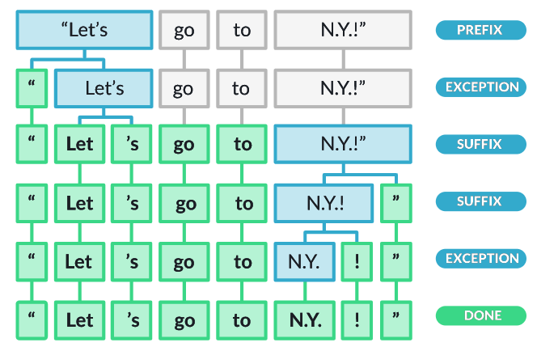

- pos_: 粗粒度的POS（Coarse-grained part-of-speech from the [Universal POS tag set](https://universaldependencies.org/docs/u/pos/).）

  Alphabetical listing

  - [ADJ](https://universaldependencies.org/docs/u/pos/ADJ.html): adjective，形容词的

  - [ADP](https://universaldependencies.org/docs/u/pos/ADP.html): adposition，介词

  - [ADV](https://universaldependencies.org/docs/u/pos/ADV.html): adverb，副词

  - [AUX](https://universaldependencies.org/docs/u/pos/AUX_.html): auxiliary verb，助动词

  - [CONJ](https://universaldependencies.org/docs/u/pos/CONJ.html): coordinating conjunction，并列连接词

    for, and, nor, but, or, yet, so

  - [DET](https://universaldependencies.org/docs/u/pos/DET.html): determiner

  - [INTJ](https://universaldependencies.org/docs/u/pos/INTJ.html): interjection

  - [NOUN](https://universaldependencies.org/docs/u/pos/NOUN.html): noun

  - [NUM](https://universaldependencies.org/docs/u/pos/NUM.html): numeral

  - [PART](https://universaldependencies.org/docs/u/pos/PART.html): particle，小品词

  - [PRON](https://universaldependencies.org/docs/u/pos/PRON.html): pronoun，代词

  - [PROPN](https://universaldependencies.org/docs/u/pos/PROPN.html): proper noun

  - [PUNCT](https://universaldependencies.org/docs/u/pos/PUNCT.html): punctuation

  - [SCONJ](https://universaldependencies.org/docs/u/pos/SCONJ.html): subordinating conjunction

  - [SYM](https://universaldependencies.org/docs/u/pos/SYM.html): symbol

  - [VERB](https://universaldependencies.org/docs/u/pos/VERB.html): verb

  - [X](https://universaldependencies.org/docs/u/pos/X.html): other

- dep_: 语法依赖关系（Syntactic dependency relation）.

~~~python
doc = nlp("Apple isn't looking at buying U.K. startup for $1 billion")
for token in doc:
    print(token.text, token.pos_, token.dep_)
~~~

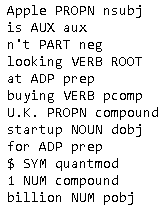

需要注意的是:

- U.K. 是作为一个token
- isn't被分成了两个token：is和n't

### [Part-of-speech tags and dependencies ](https://spacy.io/usage/spacy-101#annotations-pos-deps)

显示更多信息。

~~~python
for token in doc:
    print(token.text, token.lemma_, token.pos_, token.tag_, token.dep_,
            token.shape_, token.is_alpha, token.is_stop)
~~~

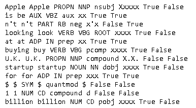

~~~python
displacy.render(doc, style="dep")
~~~

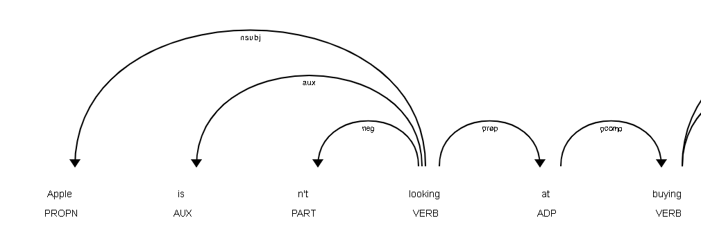

### [Named Entities ](https://spacy.io/usage/spacy-101#annotations-ner)

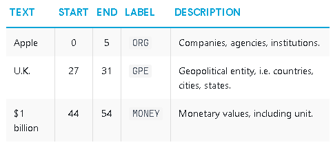

~~~python
for ent in doc.ents:
    print(ent.text, ent.start_char, ent.end_char, ent.label_)
displacy.render(doc, style="ent")
~~~

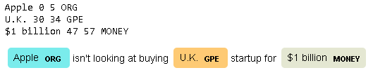

### [Word vectors and similarity](https://spacy.io/usage/spacy-101#vectors-similarity)

en_core_web_sm模型并不包含洗箱量

~~~python
spacy.prefer_gpu()
nlp = spacy.load("en_core_web_md")
tokens = nlp("dog cat banana afskfsd")

for token in tokens:
    print(token.text, token.has_vector, token.vector_norm, token.is_oov)
~~~

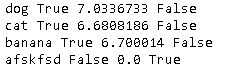

document的vector是所有token的平均值，这意味token的顺序被忽略了

~~~python
tokens.vector
~~~

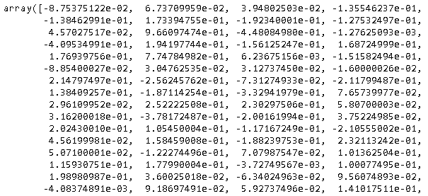

比较相似性

~~~python
doc1 = nlp("I like salty fries and hamburgers.")
doc2 = nlp("Fast food tastes very good.")

# Similarity of two documents
print(doc1, "<->", doc2, doc1.similarity(doc2))
# Similarity of tokens and spans
french_fries = doc1[2:4]
burgers = doc1[5]
print(french_fries, "<->", burgers, french_fries.similarity(burgers))
~~~

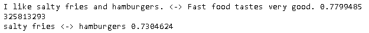

可以看到，相似性采用了余弦相似性。

~~~python
from scipy.spatial import distance

sim = 1 - distance.cosine(doc1.vector.get(), 
                          doc2.vector.get())
print(doc1, "<->", doc2, sim.round(7))
                          
sim = 1 - distance.cosine(french_fries.vector.get(), 
                          burgers.vector.get())
print(french_fries, "<->", burgers, sim.round(7))
~~~

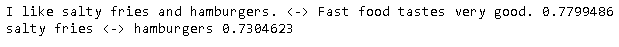

### Pipelines

spaCy中的处理流程如下。

| NAME           | COMPONENT                                                    | CREATES                                                   | DESCRIPTION                                      |
| -------------- | ------------------------------------------------------------ | --------------------------------------------------------- | ------------------------------------------------ |
| **tokenizer**  | [`Tokenizer`](https://spacy.io/api/tokenizer)                | `Doc`                                                     | Segment text into tokens.                        |
| **tagger**     | [`Tagger`](https://spacy.io/api/tagger)                      | `Token.tag`                                               | Assign part-of-speech tags.                      |
| **parser**     | [`DependencyParser`](https://spacy.io/api/dependencyparser)  | `Token.head`, `Token.dep`, `Doc.sents`, `Doc.noun_chunks` | Assign dependency labels.                        |
| **ner**        | [`EntityRecognizer`](https://spacy.io/api/entityrecognizer)  | `Doc.ents`, `Token.ent_iob`, `Token.ent_type`             | Detect and label named entities.                 |
| **lemmatizer** | [`Lemmatizer`](https://spacy.io/api/lemmatizer)              | `Token.lemma`                                             | Assign base forms.                               |
| **textcat**    | [`TextCategorizer`](https://spacy.io/api/textcategorizer)    | `Doc.cats`                                                | Assign document labels.                          |
| **custom**     | [custom components](https://spacy.io/usage/processing-pipelines#custom-components) | `Doc._.xxx`, `Token._.xxx`, `Span._.xxx`                  | Assign custom attributes, methods or properties. |

### Architecture

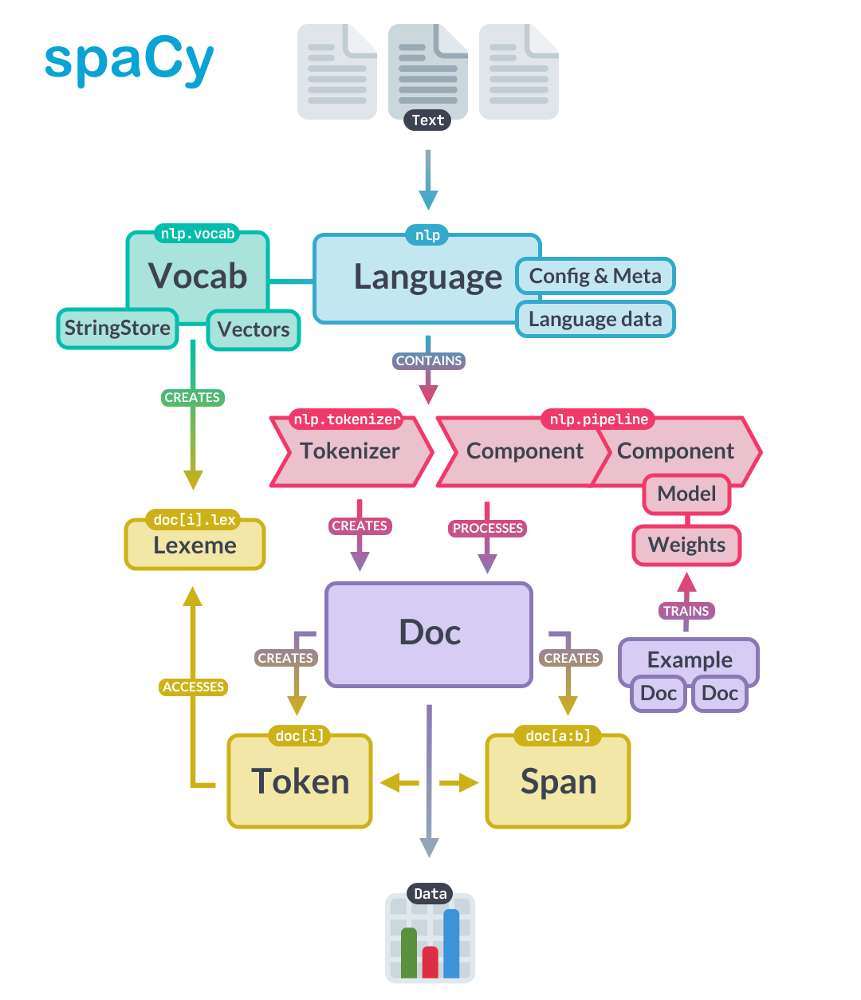

### [Vocab, hashes and lexemes](https://spacy.io/usage/spacy-101#vocab)

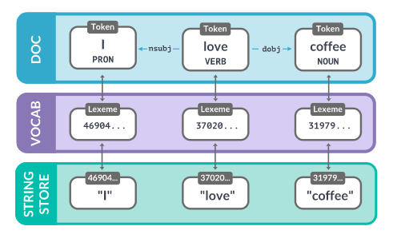

~~~python
doc = nlp("I love coffee")
print(doc.vocab.strings["coffee"])  # 3197928453018144401
print(doc.vocab.strings[3197928453018144401])  # 'coffee'
~~~

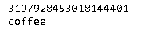

~~~python
doc = nlp("I love coffee")
for word in doc:
    lexeme = doc.vocab[word.text]
    print(lexeme.text, lexeme.orth, lexeme.shape_, lexeme.prefix_, lexeme.suffix_,
            lexeme.is_alpha, lexeme.is_digit, lexeme.is_title, lexeme.lang_)
~~~

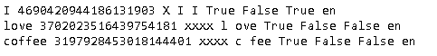

~~~python
doc = nlp("I love coffee")  # Original Doc
print(doc.vocab.strings["coffee"])  # 3197928453018144401
print(doc.vocab.strings[3197928453018144401])  # 'coffee' 👍

empty_doc = Doc(Vocab())  # New Doc with empty Vocab
# empty_doc.vocab.strings[3197928453018144401] will raise an error :(

empty_doc.vocab.strings.add("coffee")  # Add "coffee" and generate hash
print(empty_doc.vocab.strings[3197928453018144401])  # 'coffee' 👍

new_doc = Doc(doc.vocab)  # Create new doc with first doc's vocab
print(new_doc.vocab.strings[3197928453018144401])  # 'coffee' 👍
~~~

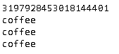

### [Serialization](https://spacy.io/usage/spacy-101#serialization)

| METHOD       | RETURNS | EXAMPLE                  |
| ------------ | ------- | ------------------------ |
| `to_bytes`   | bytes   | `data = nlp.to_bytes()`  |
| `from_bytes` | object  | `nlp.from_bytes(data)`   |
| `to_disk`    | -       | `nlp.to_disk("/path")`   |
| `from_disk`  | object  | `nlp.from_disk("/path")` |

### [Training](https://spacy.io/usage/spacy-101#training)

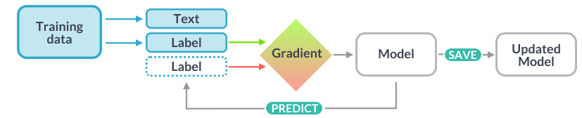

所有的训练参数可以在`config.cfg` 中配置

