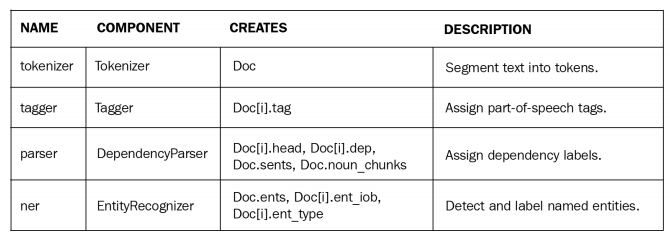
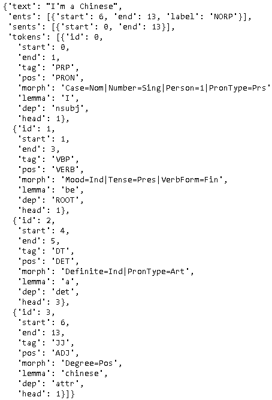
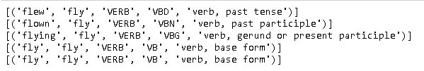
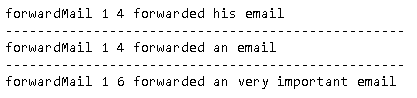
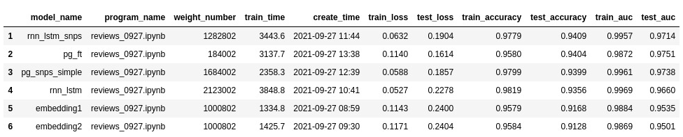

# 

- Python软件包


- spaCy的Github开源地址

  https://github.com/explosion/spaCy

- 代码地址：

  [Mastering-spaCy](https:// github.com/PacktPublishing/Mastering-spaCy)

- [25-match](..\..\..\25-match) 书中所有的图片

  https://static.packt-cdn.com/downloads/9781800563353_ColorImages.pdf

- 查看spaCy的安装信息

  ~~~shell
  python3 -m spacy -info
  ~~~

  


# 了解spaCY

## spaCy vs. NLTK vs. CoreNLP


## Visualization with displaCy

### Getting started with displaCy

在线可视化：[explosion.ai/demos/displacy](https://explosion.ai/demos/displacy?text=%E4%BB%8A%E5%A4%A9%E5%A4%A9%E6%B0%94%E4%B8%8D%E9%94%99%EF%BC%8C%E6%88%91%E4%BB%AC%E4%B8%8B%E5%8D%88%E6%B2%A1%E6%9C%89%E8%AF%BE&model=zh_core_web_sm&cpu=1&cph=1)


### Entity visualizer

https://explosion.ai/demos/displacy-ent/


### Visualizing within Python

可视化依赖关系。

~~~python
import spacy
from spacy import displacy
nlp = spacy.load('en_core_web_md')
doc = nlp('I own a ginger cat.')
displacy.serve(doc, style='dep', port=6010)
~~~


打开浏览器`http://[jupyter notebook ip]:6010/`可以如上看到结果。

也可以可视化实体。

~~~python
import spacy
from spacy import displacy
nlp = spacy.load('en_core_web_md')
doc= nlp('Bill Gates is the CEO of Microsoft.')
displacy.serve(doc, style='ent', port=6010)
~~~


上面的功能也可以在jupyter notebook中执行，只需要函数修改成render。

~~~python
import spacy
from spacy import displacy
nlp = spacy.load('en_core_web_md')
doc= nlp('Bill Gates is the CEO of Microsoft.')
displacy.render(doc, style='dep')
~~~

最后，还可以把上面的结果输出到图片。

~~~python
import spacy
from spacy import displacy
from pathlib import Path
nlp = spacy.load('en_core_web_md')
doc = nlp('I''m a butterfly.')
svg = displacy.render(doc, style='dep', jupyter=False)
          
file_name = 'butterfly.svg'
file_path = './output/' + file_name
output_path = Path (file_path)
output_path.open('w', encoding='utf-8').write(svg) 
~~~

> SVG 是一种基于 XML 语法的图像格式，全称是可缩放矢量图（Scalable Vector Graphics）。其他图像格式都是基于像素处理的，SVG 则是属于对图像的形状描述，所以它本质上是文本文件，体积较小，且不管放大多少倍都不会失真。

## Online Demo

https://explosion.ai/software#demos


# spaCy核心操作

## spaCy概览

### spaCy的pipeline




| NAME           | COMPONENT                                                    | CREATES                                                   | DESCRIPTION                                      |
| -------------- | ------------------------------------------------------------ | --------------------------------------------------------- | ------------------------------------------------ |
| **tokenizer**  | [`Tokenizer`](https://spacy.io/api/tokenizer)                | `Doc`                                                     | Segment text into tokens.                        |
| **tagger**     | [`Tagger`](https://spacy.io/api/tagger)                      | `Token.tag`                                               | Assign part-of-speech tags.                      |
| **parser**     | [`DependencyParser`](https://spacy.io/api/dependencyparser)  | `Token.head`, `Token.dep`, `Doc.sents`, `Doc.noun_chunks` | Assign dependency labels.                        |
| **ner**        | [`EntityRecognizer`](https://spacy.io/api/entityrecognizer)  | `Doc.ents`, `Token.ent_iob`, `Token.ent_type`             | Detect and label named entities.                 |
| **lemmatizer** | [`Lemmatizer`](https://spacy.io/api/lemmatizer)              | `Token.lemma`                                             | Assign base forms.                               |
| **textcat**    | [`TextCategorizer`](https://spacy.io/api/textcategorizer)    | `Doc.cats`                                                | Assign document labels.                          |
| **custom**     | [custom components](https://spacy.io/usage/processing-pipelines#custom-components) | `Doc._.xxx`, `Token._.xxx`, `Span._.xxx`                  | Assign custom attributes, methods or properties. |

### spaCy架构

spaCy架构图如下。


## 标记化（tokenization）

~~~python
import spacy
nlp = spacy.load("en_core_web_md")
doc = nlp("Im ordering Rm2-0866-000cn, can-0866-000cn, K0q14-60001-bulk To my hfpu. ")
print([token.text for token in doc])
~~~


可以注意到：

- Let's被拆分成了Let和's两个token。
- 对于长的字符串，也被拆分成多个token。

tokenization并不依赖于统计模型，而是基于各个语言的一些规则。Tokenizer exceptions中定义了一些异常的规则。比如 {ORTH: "n't", NORM: "not"}。


详见: https://github.com/explosion/spaCy/blob/master/spacy/lang/en/tokenizer_exceptions.py


### 自定义tokenzier

~~~python
import spacy
from spacy.symbols import ORTH
nlp = spacy.load("en_core_web_md")
doc = nlp("lemme that")
print([w.text for w in doc])

special_case = [{ORTH: "lem"}, {ORTH: "me"}]
nlp.tokenizer.add_special_case("lemme", special_case)
print([w.text for w in nlp("lemme that")])
~~~


### Debugging the tokenizer

可以通过nlp.tokenizer.explain来理解tokenization。

~~~python
import spacy
nlp = spacy.load("en_core_web_md")
text = "Let's go!"
doc = nlp(text)
tok_exp = nlp.tokenizer.explain(text)
for t in tok_exp:
    print(t[1], "\t", t[0])
~~~


### 句子拆分

句子拆分（Sentence segmentation）把文本才分成句子。

~~~python
import spacy
nlp = spacy.load("en_core_web_md")
text = "I flied to N.Y yesterday. It was around 5 pm."
doc = nlp(text)
for sent in doc.sents:
    print(sent.text)
~~~


句子拆分比tokenization更加的复杂。spaCy使用dependency parser来进行句子拆分，这是spaCy独特的特性。

## 词形还原（lemmatization）

### Lemmatization介绍 

词形还原（lemmatization）获取原词（lemma）的过程。一个lemma是一个token的基础形式。

~~~python
import spacy
nlp = spacy.load("en_core_web_md")
doc = nlp("I went there for working and worked for 3 years.")
for token in doc:
    print(token.text, token.lemma_)
~~~


同样也可以自定义lemmatization

~~~python
import spacy
from spacy.symbols import ORTH, NORM
nlp = spacy.load('en_core_web_md')

special_case = [{ORTH: 'Angeltown', NORM: 'Los Angeles'}]
nlp.tokenizer.add_special_case(u'Angeltown', special_case)

doc = nlp(u'I am flying to Angeltown')
for token in doc:
    print(token.text, token.norm_, token.lemma_)
~~~


> 在spaCy中似乎用NORM替换了LEMMA，书中的代码如下，但会报错。
>
> ~~~python
> import spacy
> from spacy.symbols import ORTH, LEMMA
> nlp = spacy.load('en_core_web_md')
> 
> special_case = [{ORTH: 'Angeltown', LEMMA: 'Los Angeles'}]
> nlp.tokenizer.add_special_case(u'Angeltown', special_case)
> 
> doc = nlp(u'I am flying to Angeltown')
> for token in doc:
>     print(token.text, token.lemma_)
> ~~~
>
> 

### lemmatization vs. stemming

lemma代表原词，指word的基础形式，而stem是代表word含义的最小部分，它往往并不是一个valid的word。

| Word         | Lemma        | Stem     |
| ------------ | ------------ | -------- |
| university   | university   | univers  |
| universe     | universe     | univer   |
| universal    | universal    | univers  |
| universities | university   | universi |
| universes    | universe     | univers  |
| improvement  | improvement  | improv   |
| improvements | improvements | improv   |
| improves     | improve      | improv   |

上面的例子可以看出，一个stem可以映射到多个lemma，一个lemma可以映射到多个word。

Lemmatization一般通过字典查找来获取原词，而Stemming算法往往通过获取前缀或者后最来获取stem，有些粗糙。英文常见的stemming算法有Porter和Lancaster，相关demo参见[NLTK's demo](https://text-processing.com/demo/stem/)。


## spaCy container objects

### [Doc](https://spacy.io/api/doc)

可以通过to_json输出，方便查看Doc里面的内容

~~~
import spacy
from spacy.symbols import ORTH, LEMMA
nlp = spacy.load('en_core_web_md')

doc = nlp("I'm a Chinese")
doc.to_json()
~~~



### [Token](https://spacy.io/api/token)

~~~python
import spacy 
import utils

nlp = spacy.load("en_core_web_md")
doc = nlp("I'm a Chinese. However, you are a Japanese. DCBA")

df_token = utils.tokens_to_df(doc, is_display=False) 
df_token.index = list(df_token.text)
df_token.pop('text')
df_token.T
~~~


- text_with_ws: 指包含空格的text
- is_stop: 是否是stop_words。默认的英文stopwords定义在https://github.com/explosion/spaCy/blob/master/spacy/lang/en/stop_words.py

### [Span](https://spacy.io/api/span)

Span表示文本的一部份，可以看成是一个小的Doc对象。

~~~python
import spacy

nlp = spacy.load('en_core_web_sm')
doc = nlp("You went there after you saw me")
span = doc[2:-1]
print(type(span), span)

sub_span1 = span[2:4]
print(type(sub_span1), sub_span1)

sub_span2 = span.char_span(0, 2)   # 不能工作，不知道啥元婴
print(type(sub_span2), sub_span2)
~~~


Span可以转化为Doc。

~~~python
doc1 = span.as_doc()
print(type(doc1), doc1)
~~~


# 语言特征（Linguistic Features）

## 词性标注（POS tagging）

POS tagging即part-of-speech tagging，指为分词后的每个单词标注一个正确的词性的过程。

spaCY中使用的词性如下：

| 词性缩写                                                     | 词性                     | 说明       | 示例                               |
| ------------------------------------------------------------ | ------------------------ | ---------- | ---------------------------------- |
| [ADJ](https://universaldependencies.org/docs/u/pos/ADJ.html) | adjective                | 形容词的   | big, old, good, first, useful      |
| [ADP](https://universaldependencies.org/docs/u/pos/ADP.html) | adposition/preposition   | 介词       | in, to, on, during                 |
| [ADV](https://universaldependencies.org/docs/u/pos/ADV.html) | adverb                   | 副词       | very, tomorrow, down, where, there |
| [AUX](https://universaldependencies.org/docs/u/pos/AUX_.html) | auxiliaryverb            | 助动词     | is, has, will, should              |
| [CONJ](https://universaldependencies.org/docs/u/pos/CONJ.html) | conjunction              | 连接词     | for,and,nor,but,or,yet,so          |
| CCONJ                                                        | coordinating conjunction | 对等连接词 | for,and,nor,but,or,yet,so          |
| [DET](https://universaldependencies.org/docs/u/pos/DET.html) | determiner               | 限定词     | a, an, the                         |
| [INTJ](https://universaldependencies.org/docs/u/pos/INTJ.html) | interjection             | 感叹词     | psst, ouch, bravo, hello           |
| [NOUN](https://universaldependencies.org/docs/u/pos/NOUN.html) | noun                     | 名词       | girl, boy, sky, man                |
| [NUM](https://universaldependencies.org/docs/u/pos/NUM.html) | numeral                  | 数词       | 1, 2021, one, ninty-six, IV, MMXIV |
| [PART](https://universaldependencies.org/docs/u/pos/PART.html) | particle                 | 小品词     | 's, not                            |
| [PRON](https://universaldependencies.org/docs/u/pos/PRON.html) | pronoun                  | 代词       | I， him，you, myself, somebody     |
| [PROPN](https://universaldependencies.org/docs/u/pos/PROPN.html) | proper noun              | 专有名词   | Mary, John, London, WTO, NASA      |
| [PUNCT](https://universaldependencies.org/docs/u/pos/PUNCT.html) | punctuation              | 标点符号   | .,!                                |
| [SCONJ](https://universaldependencies.org/docs/u/pos/SCONJ.html) | subordinatingconjunction | 从属连词   | although, because等                |
| [SYM](https://universaldependencies.org/docs/u/pos/SYM.html) | symbol                   | 符号       |                                    |
| [VERB](https://universaldependencies.org/docs/u/pos/VERB.html) | verb                     | 动词       |                                    |
| [X](https://universaldependencies.org/docs/u/pos/X.html)     | other                    | 其它       |                                    |

关于POS的更多定义，可以参见[Part of Speech Overview](http://partofspeech.org/)和[The Eight Parts of Speech](http://www.butte.edu/departments/cas/tipsheets/grammar/parts_of_speech.html)

spaC也提供了`pos_`和`tag_`来进行词性标注。其中前者更加的基础，后者是扩展，种类更多。

~~~python
import spacy
import utils

nlp = spacy.load('en_core_web_md')
doc = nlp("My friend will fly to New York fast and she is staying there for 3 days.")
properties = ['text', 'pos_', 'tag_', 
              ('pos_explain', utils.token_explain('pos_')),
              ('tag_explain', utils.token_explain('tag_')),
             ]
df_token = utils.tokens_to_df(doc, properties=properties) 
df_token
~~~


~~~python
doc = nlp("My cat will fish for a fish tomorrow in a fishy way.")
df_token = utils.tokens_to_df(doc, properties=properties) 
df_token
~~~


可以看到fish的词性在不同位置是不同的。如果要把上面的句子翻译成其它语言，不同的词性可能带来不同的翻译，比如：在西班牙语中，fish的名词和动词对应的是不同的单词。

~~~
I will fish/VB tomorrow.  ->  Pescaré/V mañana.
I eat fish/NN.  -> Como pescado/N.
~~~

### 词义消歧（WSD）

WSD，全称word-sense disambiguation，指多义词的识别。在我们的自然语言中，多义词广泛存在。人类可以根据上下文，精确的理解这种差异性，而这对机器学习来说，是很大的挑战。以苹果这个词为例，可以是苹果公司也可以指吃的苹果，要根据不同语境下来判断。

在很多情况下，词性标注可以用于识别多义词的准确含义。比如对于Beat，不同词性下，意义也有所不同。

 - Beat—to strike violently (verb (V))
 - Beat—to defeat someone else in a game or a competition (V)
 - Beat—rhythm in music or poetry (N)
 - Beat—bird wing movement (N)
 - Beat—completely exhausted (adjective (ADJ))

但是，词性很多时候提供太多帮助，比如：

- Bass—seabass, fish (noun (N))
- Bass—lowest male voice (N)
- Bass—male singer with lowest voice range (N)

### 动词时态（Verb tense and aspect）

下面的例子中，有五个句子。

~~~tex
I flew to Rome.
I have flown to Rome.
I'm flying to Rome.
I need to fly to Rome.
I will fly to Rome.
~~~

这些句子中，可能只有后面三个语句有ticket booking的的意图，前面两个往往意味着客户的投诉或者服务的问题。想象一下，上面句子的下文，可能是这样的。

~~~
I flew to Rome 3 days ago. I still didn't get the bill, please send it ASAP.
I have flown to Rome this morning and forgot my laptop on the airplane. Can you please connect me to lost and found?
I'm flying to Rome next week. Can you check flight availability?
I need to fly to Rome. Can you check flights on next Tuesday?
I will fly to Rome next week. Can you check the flights? 
~~~

使用spaCy中的词性标注，可以帮助机器识别用户的意图。

- 过去式或者完成式，意味着很可能是客户投诉。
- 进行时或降来时，意味着很可能是想查询航班或者订票。

~~~python
import spacy

nlp = spacy.load('en_core_web_md')
texts = ['I flew to Rome', 
         'I have flown to Rome.',
         'I''m flying to Rome.', 
         'I need to fly to Rome.',
         'I will fly to Rome.']

for doc in nlp.pipe(texts):
    print([(w.text, w.lemma_, w.pos_, w.tag_, spacy.explain(w.tag_)) for w in doc if w.lemma_=='fly'])
~~~



- verb, past tense： 动词过去式
- verb, past participle：动词过去分词
- verb, gerund or present participle： 动词的动名词或现在分词
- verb, base form： 动词原形

### 数字，符号和标点符号

词性标注能够准确识别数字，符号和标点

~~~python
import spacy
import utils

nlp = spacy.load('en_core_web_md')
properties = ['text', 'pos_', 'tag_', 
              ('pos_explain', utils.token_explain('pos_')),
              ('tag_explain', utils.token_explain('tag_')),
             ]
doc = nlp("He earned $5.5 million in 2020 and paid %35 tax.")
df_token = utils.tokens_to_df(doc, properties=properties) 
df_token
~~~


## 依赖解析（dependency parsing）


依赖解析（dependency parsing）分析一个句子的语法结构并找出相关的词以及它们之间的依存关系。依存关系是一个中心词与其从属之间的二元非对称关系，一个句子的中心词通常是动词（Verb），所有其他词要么依赖于中心词，要么通过依赖路径与它关联。

依赖解析对于NLU也非常有用，比如，对于下面的两个句子。

- I forwarded you the email. -> forwarded email
- You forwarded me the email. -> forwarded email

如果去除停用词，它们剩下的语句完全相同，然而它们的含义差别很大。spaCy可以获取词语之间的关系，以便更加深入地理解语义。

~~~python
import spacy

nlp = spacy.load('en_core_web_md')
texts = ['I forwarded you the email.', 
         'You forwarded me the email.']

for doc in nlp.pipe(texts):
    spacy.displacy.render(doc, style='dep') 
~~~


从上图可以看到，依存结构是加标签的有向图，箭头从中心词指向从属，具体来说，箭头是从head（syntactic parent）指向child（dependent），每个Token只有一个Head。

~~~python
def children(token):
    return ', '.join([child.text for child in token.children])

def ancestors(token):
    return ', '.join([ancestor.text for ancestor in token.ancestors])


for doc in nlp.pipe(texts):
    print('='*95)
    utils.tokens_to_sheet(doc, properties=[('text', 15), ('head', 15), ('dep_', 15), (('children', children), 30), (('ancestors', ancestors), 30)])
~~~


可以看到两个句子的中心词（ROOT）都是forwarded。

所有依赖label描述如下。其中标注*的是常用的。

|      | Dep       | explain                                      | description                                      |
| ---- | :-------- | -------------------------------------------- | ------------------------------------------------ |
|      | acl       | clausal modifier of noun (adjectival clause) |                                                  |
|      | acomp     | adjectival complement                        | 形容词的补充                                     |
|      | advcl     | adverbial clause modifier                    | 状语从句修饰词                                   |
|      | advmod    | adverbial modifier                           | 状语                                             |
|      | agent     | agent                                        | 代理，一般有by的时候会出现这个                   |
| *    | amod      | adjectival modifier                          | 形容词修饰语                                     |
|      | appos     | appositional modifier                        | 同位词                                           |
|      | attr      | attribute                                    | 属性                                             |
| *    | aux       | auxiliary                                    | 非主要动词和助词，如BE,HAVE SHOULD/COULD等到     |
|      | auxpass   | auxiliary (passive)                          | 被动词                                           |
|      | case      | case marking                                 |                                                  |
|      | cc        | coordinating conjunction                     | 并列关系，一般取第一个词                         |
|      | ccomp     | clausal complement                           | 从句补充                                         |
| *    | compound  | compound                                     | 名词复合。比如： the **phone** book              |
|      | conj      | conjunct                                     | 连接两个并列的词。                               |
|      | cop       | copula                                       | 系动词                                           |
|      | csubj     | clausal subject                              | 子句的主题                                       |
|      | csubjpass | clausal subject (passive)                    | 子句的主题（被动）                               |
| *    | dative    | dative                                       | 间接宾语                                         |
|      | dep       | unclassified dependent                       | 依赖关系                                         |
| *    | det       | determiner                                   | 限定词，如冠词等                                 |
| *    | dobj      | direct object                                | 直接宾语                                         |
|      | expl      | expletive                                    |                                                  |
|      | intj      | interjection                                 |                                                  |
|      | mark      | marker                                       | 主要出现在有“that” or “whether”“because”, “when” |
|      | meta      | meta modifer                                 |                                                  |
|      | neg       | negation modifier                            | 否定词                                           |
|      | npadvmod  | noun phrase as an adverbial modifier         | 名词短语作状语修饰语                             |
| *    | nsubj     | nominal subject                              | 名词主语                                         |
| *    | nsubjpass | nominal subject (passive)                    | 被动的名词主语                                   |
| *    | nummod    | numeric modifier                             | 数值修饰                                         |
|      | oprd      | object predicate                             | 对象谓词                                         |
|      | parataxis | parataxis                                    | 并列                                             |
|      | pcomp     | complement of preposition                    | 介词补充                                         |
|      | pobj      | object of preposition                        | 介词宾语                                         |
| *    | poss      | Possession modifier                          | 拥有修辞词，比如**my** book, **your** room       |
|      | preconj   | Pre-correlative conjunction                  |                                                  |
|      | predet    | Pre-determiner                               |                                                  |
|      | prep      | prepositional modifier                       | 介词                                             |
|      | prt       | particle                                     | 小品词                                           |
|      | punct     | punctuation                                  | 标点符号                                         |
|      | quantmod  | Modifier of quantifier                       |                                                  |
|      | relcl     | relative clause modifier                     |                                                  |
| *    | root      | root                                         | 中心词                                           |
|      | xcomp     | open clausal complement                      |                                                  |

上文的翻译部分参考[语法分析标注](https://gist.github.com/guodong000/2ad6b546eaff95f185b67608b1782656)。

下面再来分析几个例子。

~~~python
import spacy

def parse_dependency(text):
    nlp = spacy.load('en_core_web_md')
    doc = nlp(text)    

    properties = [('text', 15), ('tag_', 15), ('head', 15), ('dep_', 15)]
    utils.tokens_to_sheet(doc, properties=properties)
        
    # 由于图片太大，使用render，（jupyter中）会出现滚动条，所以使用serve
    # 打开http://[jupyter notebook ip]:6010/
    spacy.displacy.serve(doc, style='dep', port=6010) 
    #spacy.displacy.render(doc, style='dep') 

parse_dependency('We are trying to understand the difference.') 
~~~


需要注意的是：

- trying -> understand: xcomp

~~~python
parse_dependency('Queen Katherine, who was the mother of Mary Tudor, died at 1536.') 
~~~


需要注意的是：

- Katherine -> was: relcl。Katherine在从句中被提到，所以是relative clause modifier关系。

两个非常在线demo:

- https://explosion.ai/demos/displacy

  

- https://huggingface.co/spaces/spacy/pipeline-visualizer： 无所不包。

  

## 命名实体识别（NER）

NER全称Name Entity Recognition，是指识别文本中具有特定意义的实体，主要包括人名、地名、机构名、专有名词等。常见的四个类别如下。

| Type | Description                    |
| ---- | ------------------------------ |
| PER  | 人名                           |
| LOC  | 地名                           |
| ORG  | 组织或机构                     |
| MISC | 杂项。比如：事件，国家，产品等 |

在spaCy中有个更多的实体，列表如下。


当前state-of-the-art的NER模型是LSTM或者LSTM+CRM。

> 是不是这本书写的时候有点早，目前spaCy应该使用时transform模型啊。

下面看看spaCy中NER。

~~~python
import spacy
import utils

nlp = spacy.load('en_core_web_md')
properties = ['text', 'pos_', 'tag_', 'ent_type_',
              ('ent_type_explain', utils.token_explain('ent_type_')),
             ]
doc = nlp("Albert Einstein was born in Ulm on 1879. He studied electronical engineering at ETH Zurich.")
df_token = utils.tokens_to_df(doc, properties=properties)
~~~


三个非常好的在线demo

- https://explosion.ai/demos/displacy-ent

  

- https://huggingface.co/spaces/spacy/pipeline-visualizer： 无所不包。

  

- https://prodi.gy/demo：除了命令实体，还有很多DEMO。

  非常强大，只是不是免费的。

  

## 合并和拆分Tokens

### 合并

~~~python
import spacy
import utils

nlp = spacy.load('en_core_web_md')
properties = ['text', 'pos_', 'tag_', 'ent_type_',
              ('ent_type_explain', utils.token_explain('ent_type_')),
             ]
doc = nlp("She lived in New Hampshire.")

print('-'*50)
properties = ['text', 'lemma_', 'i', 'ent_type_', 'pos_', 'tag_', 'dep_']
df_token = utils.tokens_to_df(doc, properties=properties)
spacy.displacy.render(doc, style='dep')

with doc.retokenize() as retokenizer:
    retokenizer.merge(doc[3:5], attrs={"LEMMA":"new hampshire"})

print('-'*50)
df_token = utils.tokens_to_df(doc, properties=properties)
spacy.displacy.render(doc, style='dep')
~~~


### 拆分

~~~python
import spacy
import utils

nlp = spacy.load('en_core_web_md')
properties = ['text', 'pos_', 'tag_', 'ent_type_',
              ('ent_type_explain', utils.token_explain('ent_type_')),
             ]
doc = nlp("She lived in NewHampshire.")

print('-'*50)
properties = ['text', 'lemma_', 'i', 'ent_type_', 'pos_', 'tag_', 'dep_']
df_token = utils.tokens_to_df(doc, properties=properties)
spacy.displacy.render(doc, style='dep')

with doc.retokenize() as retokenizer:
    heads = [(doc[3], 1), doc[2]]
    attrs = {"TAG":["NNP", "NNP"], "DEP":["compound", "pobj"]}
    retokenizer.split(doc[3], ["New", "Hampshire"], heads=heads, attrs=attrs)

print('-'*50)
df_token = utils.tokens_to_df(doc, properties=properties)
spacy.displacy.render(doc, style='dep')
~~~


# Rule-Based Matching

## Token-based matching

### Matcher

首先看基本的示例。

~~~python
import spacy
from spacy.matcher import Matcher

nlp = spacy.load("en_core_web_md")
doc = nlp("Good morning, I want to reserve a ticket. I will then say good evening!")
matcher = Matcher(nlp.vocab)

pattern1 = [{"LOWER": "good"}, {"LOWER": "morning"}, {"IS_PUNCT": True}]
matcher.add("morningGreeting",  [pattern1])
pattern2 = [{"LOWER": "good"}, {"LOWER": "evening"}, {"IS_PUNCT": True}]
matcher.add("eveningGreeting",  [pattern2])
matches = matcher(doc)

for match_id, start, end in matches:
    pattern_name = nlp.vocab.strings[match_id]
    m_span = doc[start:end]  
    print(pattern_name, start, end, m_span.text)
~~~


可以使用Token的任何属性查询，比如ENT_TYPE

~~~python
import spacy
from spacy.matcher import Matcher

def show_matches(nlp, doc, matches):
    for match_id, start, end in matches:
        pattern_name = nlp.vocab.strings[match_id]
        m_span = doc[start:end]  
        print(pattern_name, start, end, m_span.text)    

nlp = spacy.load("en_core_web_md")
doc = nlp("Today German chancellor Angela Merkel met with the US president.")

pattern = [{"ENT_TYPE": "PERSON", "OP": "+"}, {"POS" : "VERB"}]
matcher = Matcher(nlp.vocab)
matcher.add("personEnt",  [pattern])

show_matches(nlp, doc, matcher(doc))
~~~


### 一些扩展

Matcher支持一些扩展，比如：

- in， not in
- ==, >=, <=, >, <

~~~python
matcher = Matcher(nlp.vocab)
pattern1 = [{"LOWER": "good"}, {"LOWER": {"IN": ["morning", "evening"]}}, {"IS_PUNCT": True}]
matcher.add("greetings", [pattern1])
pattern2 = [{"LENGTH": {">=" : 7}}]
matcher.add("longWords",  [pattern2])
matches = matcher(doc)

for match_id, start, end in matches:
    pattern_name = nlp.vocab.strings[match_id]
    m_span = doc[start:end]  
    print(pattern_name, start, end, m_span.text)
~~~


### 类正则表达式

Matcher支持一些类似正则表达式的语法。

| OP   | DESCRIPTION   |
| ---- | ------------- |
| !    | 不存在        |
| ?    | 出现0或1次    |
| +    | 出现1次或多次 |
| *    | 出现0次或多次 |

~~~python
import spacy
from spacy.matcher import Matcher

def show_matches(nlp, doc, matches):
    for match_id, start, end in matches:
        pattern_name = nlp.vocab.strings[match_id]
        m_span = doc[start:end]  
        print(pattern_name, start, end, m_span.text)    

nlp = spacy.load("en_core_web_md")
doc1 = nlp("Barack Obama visited France.")
doc2 = nlp("Barack Hussein Obama visited France.")

pattern = [{"LOWER": "barack"},
           {"LOWER": "hussein", "OP": "?"},
           {"LOWER": "obama"}]
matcher = Matcher(nlp.vocab)
matcher.add("obamaNames",  [pattern])

show_matches(nlp, doc1, matcher(doc1))
print('-'*50)
show_matches(nlp, doc2, matcher(doc2))
~~~


稍微复杂一点的例子。

~~~python
import spacy
from spacy.matcher import Matcher

def show_matches(nlp, doc, matches):
    for match_id, start, end in matches:
        pattern_name = nlp.vocab.strings[match_id]
        m_span = doc[start:end]  
        print(pattern_name, start, end, m_span.text)    

nlp = spacy.load("en_core_web_md")
doc1 = nlp("Hello hello hello, how are you?")
doc2 = nlp("Hello, how are you?")
doc3 = nlp("How are you?")

matcher = Matcher(nlp.vocab)
pattern = [{"LOWER": {"IN": ["hello", "hi", "hallo"]}, "OP":"+"}, 
           {"IS_PUNCT": True}]
matcher.add("greetings",  [pattern])

show_matches(nlp, doc1, matcher(doc1))
print('-'*50)
show_matches(nlp, doc2, matcher(doc2))
print('-'*50)
show_matches(nlp, doc3, matcher(doc3))
~~~


最后 ，Matcher的pattern中如果添加{}，表示接受任意一个token。

~~~python
import spacy
from spacy.matcher import Matcher

def show_matches(nlp, doc, matches):
    for match_id, start, end in matches:
        pattern_name = nlp.vocab.strings[match_id]
        m_span = doc[start:end]  
        print(pattern_name, start, end, m_span.text)    

nlp = spacy.load("en_core_web_md")
doc = nlp("My name is Alice and his name was Elliot.")

matcher = Matcher(nlp.vocab)
pattern = [{"LOWER": "name"},{"LEMMA": "be"},{}]
matcher.add("pickName", [pattern])

show_matches(nlp, doc, matcher(doc))
~~~


{"OP":"*"} 表示匹配任意个token，代码如下。

~~~python
import spacy
from spacy.matcher import Matcher

def show_matches(nlp, doc, matches):
    for match_id, start, end in matches:
        pattern_name = nlp.vocab.strings[match_id]
        m_span = doc[start:end]  
        print(pattern_name, start, end, m_span.text)    

nlp = spacy.load("en_core_web_md")
doc1 = nlp("I forwarded his email to you.")
doc2 = nlp("I forwarded an email to you.")
doc3 = nlp("I forwarded an very important email to you.")

matcher = Matcher(nlp.vocab)
pattern = [{"LEMMA": "forward"}, {"OP":"*"}, {"LOWER": "email"}]
matcher.add("forwardMail",  [pattern])

show_matches(nlp, doc1, matcher(doc1))
print('-'*50)
show_matches(nlp, doc2, matcher(doc2))
print('-'*50)
show_matches(nlp, doc3, matcher(doc3))
~~~



### 正则表达式

~~~python
import spacy
from spacy.matcher import Matcher

def show_matches(nlp, doc, matches):
    for match_id, start, end in matches:
        pattern_name = nlp.vocab.strings[match_id]
        m_span = doc[start:end]  
        print(pattern_name, start, end, m_span.text)    

nlp = spacy.load("en_core_web_md")
doc1 = nlp("I travelled by bus.")
doc2 = nlp("She traveled by bike.")

matcher = Matcher(nlp.vocab)
pattern = [{"POS": "PRON"},
           {"TEXT": {"REGEX": "[Tt]ravell?ed"}}]
matcher.add("travel",  [pattern])

show_matches(nlp, doc1, matcher(doc1))
print('-'*50)
show_matches(nlp, doc2, matcher(doc2))
~~~


上面的正则表达式作用的范围是token，如果希望在doc全局范围正则表达式查找，可以参考如下实例。

~~~python
import spacy
import re

nlp = spacy.load("en_core_web_sm")
doc = nlp("The United States of America (USA) are commonly known as the United States (U.S. or US) or America.")

expression = r"[Uu](nited|\.?) ?[Ss](tates|\.?)"
for match in re.finditer(expression, doc.text):
    start, end = match.span()
    span = doc.char_span(start, end)
    # This is a Span object or None if match doesn't map to valid token sequence
    if span is not None:
        print("Found match:", start, end, span.text)
~~~


### 在线工具

一个非常好的regex在线网站https://regex101.com/


需要注意的是，上面网站上返回的match是5个，而python正则表达式中是4个，这有些奇怪。

spaCy也提供了一个非常酷的工具。https://explosion.ai/demos/matcher


> 需要特别关注的是

## PhraseMatcher

把要查询的短语放到PhraseMatcher中。

~~~python
import spacy
from spacy.matcher import PhraseMatcher

def show_matches(nlp, doc, matches):
    for match_id, start, end in matches:
        pattern_name = nlp.vocab.strings[match_id]
        m_span = doc[start:end]  
        print(pattern_name, start, end, m_span.text)    

nlp = spacy.load("en_core_web_md")
doc = nlp("3 EU leaders met in Berlin. German chancellor Angela Merkel first welcomed the US president Donald Trump. The following day Alexis Tsipras joined them in Brandenburg.")

matcher = PhraseMatcher(nlp.vocab)
terms = ["Angela Merkel", "Donald Trump", "Alexis Tsipras"]
patterns = list(nlp.pipe(terms))
# patterns = [nlp.make_doc(term) for term in terms]
matcher.add("politiciansList",  patterns)

show_matches(nlp, doc, matcher(doc))
~~~


接下来的例子是忽略大小写。

~~~python
import spacy
from spacy.matcher import PhraseMatcher

def show_matches(nlp, doc, matches):
    for match_id, start, end in matches:
        pattern_name = nlp.vocab.strings[match_id]
        m_span = doc[start:end]  
        print(pattern_name, start, end, m_span.text)    

nlp = spacy.load("en_core_web_md")
doc = nlp("During the last decade, derivatives market became an asset class of their own and influenced the financial landscape strongly.")
matcher = PhraseMatcher(nlp.vocab, attr="LOWER")
terms = ["Asset", "Investment", "Derivatives",
         "Demand",  "Market"]
patterns = list(nlp.pipe(terms))
# patterns = [nlp.make_doc(term) for term in terms]
matcher.add("financeTerms",  patterns)

show_matches(nlp, doc, matcher(doc))
~~~


最后一个例子，使用shape进行匹配。

~~~python
import spacy
import utils 
from spacy.matcher import PhraseMatcher

def show_matches(nlp, doc, matches):
    for match_id, start, end in matches:
        pattern_name = nlp.vocab.strings[match_id]
        m_span = doc[start:end]  
        print(pattern_name, start, end, m_span.text)    

nlp = spacy.load("en_core_web_md")
doc = nlp("This log contains the following IP addresses: 192.1.1.2 and 192.21.1.1 and 192.160.1.1 .")
matcher = PhraseMatcher(nlp.vocab, attr="SHAPE")
terms = ["127.0.0.0", "127.256.0.0"]
patterns = list(nlp.pipe(terms))
# patterns = [nlp.make_doc(term) for term in terms] 
matcher.add("IPNums",  patterns)

show_matches(nlp, doc, matcher(doc))
~~~


需要注意的是，192.21.1.1没有匹配，原因在于第二个数，只有两位。

## EntityRuler

使用EntityRuler可以扩充Entity。比如：增加chime（微软华人协会）作为一个ORG。

~~~python
import spacy

nlp = spacy.load("en_core_web_md")
doc = nlp("I have an acccount with chime since 2017")
print(doc.ents)

patterns = [{"label": "ORG", "pattern": [{"LOWER": "chime"}]}]
ruler = nlp.add_pipe("entity_ruler")
ruler.add_patterns(patterns)

doc = nlp("I have an acccount with chime since 2017")
print(doc.ents)
~~~


## 合并models和matchers

下面看几个例子，把模型和Matcher合并起来使用。

### 抽取IBAN和account numbers

IBAN（International Bank Account Number），指国际银行帐户号码，是由欧洲银行标准委员会（ European Committee for Banking Standards，简称 ECBS）按照其标准制定的一个银行帐户号码。IBAN的编号规定包括国别代码＋银行代码＋地区＋账户人账号＋校验码。


~~~python
import spacy
from spacy.matcher import Matcher

def show_matches(nlp, doc, matches):
    for match_id, start, end in matches:
        pattern_name = nlp.vocab.strings[match_id]
        m_span = doc[start:end]  
        print(pattern_name, start, end, m_span.text)    

nlp = spacy.load("en_core_web_md")
doc1 = nlp("My IBAN number is BE71 0961 2345 6769, please send the money there. My account number is 8921273.")
doc2 = nlp("My IBAN number is FR76 3000 6000 0112 3456 7890 189, please send the money there. My account num is 3239212.")

pattern1 = [{"SHAPE": "XXdd"}, {"TEXT": {"REGEX": "\d{1,4}"}, "OP":"+"}]
pattern2 = [{"LOWER": "account"}, 
            {"LOWER": {"IN": ["num", "number"]}}, {}, 
            {"IS_DIGIT": True}]
matcher = Matcher(nlp.vocab)
matcher.add("ibanNum",  [pattern1])
matcher.add("accountNum",  [pattern2])

show_matches(nlp, doc1, matcher(doc1))
print('-'*50)
show_matches(nlp, doc2, matcher(doc2))
~~~


### 抽取电话号码

~~~python
import spacy
from spacy.matcher import Matcher

def show_matches(nlp, doc, matches):
    for match_id, start, end in matches:
        pattern_name = nlp.vocab.strings[match_id]
        m_span = doc[start:end]  
        print(pattern_name, start, end, m_span.text)    

nlp = spacy.load("en_core_web_md")
doc1 = nlp("You can call my office on +1 (221) 102-2423 or email me directly.")
doc2 = nlp("You can call me on (221) 102 2423 or text me.")

pattern = [{"TEXT": "+1", "OP": "?"}, {"TEXT": "("},
           {"SHAPE": "ddd"}, {"TEXT": ")"},
           {"SHAPE": "ddd"}, {"TEXT": "-", "OP": "?"},
           {"SHAPE": "dddd"}]
matcher = Matcher(nlp.vocab)
matcher.add("ibanNum",  [pattern])

show_matches(nlp, doc1, matcher(doc1))
print('-'*50)
show_matches(nlp, doc2, matcher(doc2))
~~~


### 抽取mentions

~~~python
import spacy
from spacy.matcher import Matcher

def show_matches(nlp, doc, matches):
    for match_id, start, end in matches:
        pattern_name = nlp.vocab.strings[match_id]
        m_span = doc[start:end]  
        print(pattern_name, start, end, m_span.text)    

nlp = spacy.load("en_core_web_md")
texts = ['KFC is very generous with the portions.', 
         'Mcdonald''s is horrible, we waited for mins for a table.', 
         'Quanjude is terribly expensive, stay away!', 
         'RestaurantB is pretty amazing, we recommend.']
docs = nlp.pipe(texts)

pattern = [{"ENT_TYPE": "ORG"}, {"LEMMA": "be"}, {"POS": "ADV", "OP": "*"}, {"POS": "ADJ"}]
matcher = Matcher(nlp.vocab)
matcher.add("mentions",  [pattern])

for doc in docs:
    print('-'*50)
    print([ent for ent in doc.ents])
    show_matches(nlp, doc, matcher(doc))
~~~


### 抽取标签（Hashtag）和表情符号（emoji）

~~~python
import spacy
from spacy.matcher import Matcher

def show_matches(nlp, doc, matches):
    for match_id, start, end in matches:
        pattern_name = nlp.vocab.strings[match_id]
        m_span = doc[start:end]  
        print(pattern_name, start, end, m_span.text)    

nlp = spacy.load("en_core_web_md")
texts = ["Start working out now #WeekendShred", 
         " I love China 😍",
         " I never buy Zara 😭"
        ]
docs = nlp.pipe(texts)

pattern1 = [{"TEXT": "#"}, {"IS_ASCII": True}]
matcher = Matcher(nlp.vocab)
matcher.add("hashTag",  [pattern1])

pos_emoji = ["😀", "😃", "😄", " 😁", "😁", "😍"]  
neg_emoji = ["🥺", "😢", "😭", " 😟", "😩", "😪"]
pos_patterns = [[{"ORTH": emoji}] for emoji in pos_emoji]
neg_patterns = [[{"ORTH": emoji}] for emoji in neg_emoji]
matcher.add("posEmoji", pos_patterns)
matcher.add("negEmoji", neg_patterns)

for doc in docs:
    print('-'*50)
    show_matches(nlp, doc, matcher(doc))
~~~


### 合并linguistic features和named entities

找出爱因斯坦的居住地址。采用的技术有：

- name entities
- dependency parsing
- lemmatization

~~~python
import spacy
from spacy.matcher import Matcher  

nlp = spacy.load("en_core_web_md")
texts = ["Einstein lived in Zurich."]
docs = nlp.pipe(texts)
doc = list(docs)[0]
print([(ent.text, ent.label_) for ent in doc.ents])
spacy.displacy.render(doc, style='dep')

person_ents = [ent for ent in doc.ents if ent.label_ == "PERSON"]
for person_ent in person_ents:
    #We use head of the entity's last token
    head = person_ent[-1].head  
    if head.lemma_ == "live":
        preps = [token for token in head.children if token.dep_ == "prep"]
        for prep in preps:         
            places = [token for token in prep.children if token.ent_type_ == "GPE"]   
            # Verb is in past or present tense
            print({'person': person_ent, 'city': places,'past': head.tag_ == "VBD"})
~~~


# Working with Word Vectors and Semantic Similarity

## 理解词向量

常用的词向量有：

- word2vec：https://code.google.com/archive/p/word2vec/

  > 似乎好久没有更新了

- Glove： https://nlp.stanford.edu/projects/glove/

- fastText: https://fasttext.cc/docs/en/english-vectors.html

> 有空可以再学习系统一下[Gensim](https://radimrehurek.com/gensim)。里面整合了WordsVector， FastText， LSI， LDA等算法。

## 词向量（word vectors）

spacy中的很多预训练（pretrained ）模型包含了word vectors。以英文为例。

- [en_core_web_sm](https://spacy.io/models/en#en_core_web_sm) ： 12MB

  包含：tok2vec, tagger, parser, senter, ner, attribute_ruler, lemmatizer。**不包含词向量。**

- [en_core_web_md](https://spacy.io/models/en#en_core_web_md)： 43 MB

  包含：tok2vec, tagger, parser, senter, ner, attribute_ruler, lemmatizer。 **词向量：685k keys, 20k unique vectors (300 dimensions)。**

- [en_core_web_lg](https://spacy.io/models/en#en_core_web_lg)： 741 MB

  包含：tok2vec, tagger, parser, senter, ner, attribute_ruler, lemmatizer。 **词向量：685k keys, 685k unique vectors (300 dimensions)**

- [en_core_web_trf](https://spacy.io/models/en#en_core_web_trf)：438 MB

  包含：transformer, tagger, parser, ner, attribute_ruler, lemmatizer。**不包含词向量**

需要注意的，对于OOV（out-of-vocabulary）的词汇，没有对应的词向量。

~~~python
import spacy 
import utils

nlp = spacy.load("en_core_web_md")
doc = nlp("You went there afskfsd.")

df_token = utils.tokens_to_df(doc, properties=['text', 'is_oov', 'has_vector'])
~~~


## 相似度（Similarity）

默认的相似度函数（Similarity）是余弦相似度。

~~~python
import spacy 
import utils

nlp = spacy.load("en_core_web_md")

doc1 = nlp("I visited England.")
doc2 = nlp("I went to London.")
print('doc similarity: {}'.format(doc1.similarity(doc2)))
print('span similarity: {}'.format(doc1[1:3].similarity(doc2[1:4])))
print('token similarity: {}'.format(doc1[2].similarity(doc2[3])))
~~~


下面使用PCA降维到2维度，这样可以方便查看多个word之间的相似度。

~~~python
import matplotlib.pyplot as plt
import numpy as np
import spacy
from sklearn.decomposition import PCA

nlp = spacy.load("en_core_web_md")
vocab = nlp("""cat dog tiger elephant bird monkey lion cheetah
burger pizza food cheese wine salad noodles macaroni fruit
vegetable""")
            
words = [word.text for word in vocab]
vecs = np.vstack([word.vector for word in vocab if word.has_vector])

pca = PCA(n_components=2)
vecs_transformed = pca.fit_transform(vecs)

plt.figure(figsize=(20,15))
plt.scatter(vecs_transformed[:,0], vecs_transformed[:,1])
for word, coord in zip(words, vecs_transformed):
    x,y = coord
    plt.text(x,y,word, size=15)
plt.show()
~~~


## third-party词向量

下面下载fastText的词向量。

~~~python
!curl -L https://dl.fbaipublicfiles.com/fasttext/vectors-english/wiki-news-300d-1M-subword.vec.zip --output ./data/wiki-news-300d-1M-subword.vec.zip
# wget https://dl.fbaipublicfiles.com/fasttext/vectors-english/wiki-news-300d-1M-subword.vec.zip -P ./data
unzip data/wiki-news-300d-1M-subword.vec.zip -d data
~~~


将词向量导入到spaCy中。

~~~python
!python -m spacy init vectors en data/wiki-news-300d-1M-subword.vec ./output/en_subwords_wiki_lg --name en_subwords_wiki_lg
~~~

加载模型，注意该模型是一个空模型。

~~~python
import spacy
nlp = spacy.load("en_core_web_md")
print(f'en_core_web_md pipe_names={nlp.pipe_names}')

nlp = spacy.load("output/en_subwords_wiki_lg")  
print(f'en_subwords_wiki_lg pipe_names={nlp.pipe_names}')

doc1 = nlp("I visited England.")
doc2 = nlp("I went to London.")

print('doc similarity: {}'.format(doc1.similarity(doc2)))
print('span similarity: {}'.format(doc1[1:3].similarity(doc2[1:4])))
print('token similarity: {}'.format(doc1[2].similarity(doc2[3])))
~~~


## 相似度比较的技巧

首先看例子。

~~~python
import spacy
nlp = spacy.load("en_core_web_md")

sentences = nlp("I purchased a science fiction book last week. "
                "I loved everything related to this fragrance: light, floral and feminine... "
                "I loved everything related to this wine: light, floral and feminine... "
                "I purchased a bottle of wine. "
                "I purchased some wine. "
                "I purchased some water. "
                "I purchased some chicken. "
               )
key = nlp("perfume")
for sent in sentences.sents:
    print(sent.similarity(key), sent)
~~~


- perfume和第二个句子最为相似。而关键词语是fragrance
- perfume和第四个句子相似度也比较高。其关键词汇是bottle和wine。

### 比较名词短语

要比较文档的相似性，可以获取各自的关键的word，然后计算之间的相似性，这是一种提高准确率的有效办法。下面的例子中，仅仅比较名词短语，来计算相似度。

~~~python
for sent in sentences.sents:
    nchunks = [nchunk.text for nchunk in sent.noun_chunks]
    nchunk_doc = nlp(" ".join(nchunks))
    print(nchunk_doc.similarity(key), sent)
~~~


非常明显，第二句话的相似度提高很多。

再来看一个例子。很明显，第一个句子和第二个句子相关程度比较高（都是有关于搜索引擎的），但是输出的结果有明显错误：第一个句子和第三个句子的相似度非常高。

~~~python
import spacy
import pandas as pd 
from IPython.display import display

def compare1(docs):
    length = len(docs)
    columns = list(range(length))
    df_sim = pd.DataFrame(columns = columns,
                          index = columns)   
    for i in range(length):
        doc1 = docs[i]
        for j in range(i, length):
            doc2 = docs[j]
            sim = round(doc1.similarity(doc2), 4)
            df_sim.loc[j, i] = sim
            df_sim.loc[i, j] = sim
    
    display(df_sim)

nlp = spacy.load("en_core_web_md")
texts = ["Google Search, often referred as Google, is the most popular search engine nowadays. It answers a huge volume of queries everyday.",
         "Microsoft Bing is another popular search engine. Microsoft is known by its star product Microsoft Windows, a popular operating system sold over the world.",
         "The Dead Sea is the lowest lake in the world, located in the Jordan Valley of Israel. It is also the saltiest lake in the world."]
docs = list(nlp.pipe(texts))
compare1(docs)
~~~


如果采用上一节提取名词短语的方法，第一句和第三句降低了很多，这点很不错。

~~~python
def compare2(docs):
    length = len(docs)
    columns = list(range(length))
    df_sim = pd.DataFrame(columns = columns,
                          index = columns) 
    new_docs = []
    for doc in docs:
        nchunks = [nchunk.text for nchunk in doc.noun_chunks]
        nchunk_doc = nlp(" ".join(nchunks))
        new_docs.append(nchunk_doc)
    
    docs = new_docs
    for i in range(length):
        doc1 = docs[i]
        for j in range(i, length):
            doc2 = docs[j]
            sim = round(doc1.similarity(doc2), 4)
            df_sim.loc[j, i] = sim
            df_sim.loc[i, j] = sim
    
    display(df_sim)
    
compare2(docs)
~~~


### 比较命令实体

下面一种方法，采用比较命名实体相似度。效果也不错。

~~~python
def compare3(docs):
    length = len(docs)
    columns = list(range(length))
    df_sim = pd.DataFrame(columns = columns,
                          index = columns) 
    new_docs = []
    for doc in docs:
        ents = [ent.text for ent in doc.ents]
        ents_doc = nlp(" ".join(ents))
        new_docs.append(ents_doc)
    
    
    docs = new_docs
    for i in range(length):
        doc1 = docs[i]
        for j in range(i, length):
            doc2 = docs[j]
            sim = round(doc1.similarity(doc2), 4)
            df_sim.loc[j, i] = sim
            df_sim.loc[i, j] = sim
    
    display(df_sim)
    
compare3(docs)
~~~


### 去除停用词和标点符号

最后一种方法是去除停用词（stop words）和标点符号。看起来效果最好。

~~~python
def compare4(docs):
    length = len(docs)
    columns = list(range(length))
    df_sim = pd.DataFrame(columns = columns,
                          index = columns) 
    new_docs = []
    for doc in docs:
        tokens = [token.text for token in doc if not token.is_stop and not token.is_punct]
        new_doc = nlp(" ".join(tokens))
#         print(new_doc) 
        new_docs.append(new_doc)
        
    docs = new_docs
    for i in range(length):
        doc1 = docs[i]
        for j in range(i, length):
            doc2 = docs[j]
            sim = round(doc1.similarity(doc2), 4)
            df_sim.loc[j, i] = sim
            df_sim.loc[i, j] = sim
    
    display(df_sim)
    
compare4(docs)
~~~


# 综合:  语义解析（Semantic Parsing）

综合运用前几节所学来分析Airline Travel Information System (ATIS），一个知名的航空订票系统数据集。

本章内容见[ATIS_dataset_exploration](http://15.15.166.35:18888/notebooks/eipi10/xuxiangwen.github.io/_notes/05-ai/45-nlp/spacy/mastering_spacy/chapter06_ATIS_dataset_exploration.ipynb)。

```{.python .input  n=43}
import spacy 
import pandas as pd 
import utils

from collections import Counter 
from IPython.display import display
from spacy.matcher import Matcher

# auto load the changes of referenced codes
%load_ext autoreload
%autoreload 2

# ebablbe auto-completion
%config Completer.use_jedi = False
```

```{.json .output n=43}
[
 {
  "name": "stdout",
  "output_type": "stream",
  "text": "The autoreload extension is already loaded. To reload it, use:\n  %reload_ext autoreload\n"
 }
]
```

## 获取ATIS数据

```{.python .input  n=7}
df_atis = pd.read_csv("./Chapter06/data/atis_intents.csv", header=None)
df_atis.columns = ['intent', 'text']
```

```{.python .input  n=35}
print('-'*50)
print(len(df_atis))

print('-'*50)
display(df_atis.head(5))

print('-'*50)
display(df_atis.describe().T)

print('-'*50)
df_atis.intent.unique()

print('-'*50)
df_atis.info()
```


查看数据内容。可以看到：

- 第一个用户说想定某个时间，从某地到某地ide航班？
- 第二个用户同第一个用户
- 第三个用户想问航班的到达时间。
- 第三根用户想问从某地到某地最便宜的机票。
- 第五个用户问从某地到某地低于1000美元的航班。

```{.python .input  n=13}
print(*list(df_atis.head().text), sep='\n')
```


查看意图的分布。

```{.python .input  n=36}
df_grouped = df_atis.groupby(['intent']).size()
df_grouped
```


在atis_abbreviation这种意图中，用户询问关于各种缩写的含义。

```{.python .input  n=24}
df_filter = df_atis.loc[(df_atis.intent=='atis_abbreviation')]
print(*list(df_filter.sample(10).text), sep='\n')
```


## 抽取命名实体

需要注意的是，在书中使用如下代码获取文本，代码如下。我们实际采用读取df_atis的text列来获取文本。

~~~shell
!awk -F ',' '{print $2}' ./Chapter06/data/atis_intents.csv  > .Chapter06/data/atis_utterances.txt
~~~

然后读取数据。

```{.python .input  n=27}
nlp = spacy.load("en_core_web_md") 

corpus = open("Chapter06/data/atis_utterances.txt", "r").read().split("\n") 

all_ent_labels = [] 
for sentence in corpus: 
    doc = nlp(sentence.strip()) 
    ents = doc.ents 
    all_ent_labels += [ent.label_ for ent in ents] 

c = Counter(all_ent_labels) 
print(c) 
```


上面的代码运行起来有些慢。采用如下代码快好几倍。

```{.python .input  n=39}
texts = list(df_atis.text)
texts = [text.strip() for text in texts]
docs = nlp.pipe(texts)

all_ent_labels = [] 
for doc in docs: 
    ents = doc.ents 
    all_ent_labels += [ent.label_ for ent in ents] 

c = Counter(all_ent_labels) 
print(c) 
```


### 使用Matcher来抽取
抽取的内容如下。

```{.python .input  n=63}
def show_matches(nlp, doc, matches):
    for match_id, start, end in matches:
        pattern_name = nlp.vocab.strings[match_id]
        m_span = doc[start:end]  
        print(pattern_name, start, end, m_span.text)  
        
# 起始地址
matcher = Matcher(nlp.vocab)
pattern = [{"POS": "ADP"}, {"ENT_TYPE": "GPE"}]
matcher.add("prepositionLocation", [pattern])

# 航班信息
pattern = [{"ENT_TYPE": "ORG", "OP": "+"}]
matcher.add("AirlineName", [pattern])

# 日期和时间
pattern = [{"ENT_TYPE":  {"IN": ["DATE", "TIME"]}}]
matcher.add("Datetime", [pattern])

# 缩写abbreviation
pattern1 = [{"TEXT": {"REGEX": "\w{1,2}\d{1,2}"}}]
pattern2 = [{"SHAPE": { "IN": ["x", "xx"]}}, {"SHAPE": {"IN": ["d", "dd"]}}]
pattern3 = [{"TEXT": {"IN": ["class", "code", "abbrev", "abbreviation"]}}, {"SHAPE": { "IN": ["x", "xx"]}}]
pattern4 = [{"POS": "NOUN", "SHAPE": { "IN": ["x", "xx"]}}]
matcher.add("abbrevEntities", [pattern1, pattern2, pattern3, pattern4])

texts = ["show me flights from denver to boston on tuesday",
         "i'm looking for a flight that goes from ontario to westchester and stops in chicago",
         "what flights arrive in chicago on sunday on continental",
         "yes i'd like a flight from long beach to st. louis by way of dallas",
         "what are the evening flights flying out of dalas",
         "what is the earliest united airlines flight flying from denver",
         'what does restriction ap 57 mean',
         'what does the abbreviation co mean',
         'what does fare code qo mean',
         'what is the abbreviation d10',
         'what does code y mean',
         'what does the fare code f and fn mean',
         'what is booking class c']
docs = nlp.pipe(texts)

for doc in docs:
    print('-'*50)
    spacy.displacy.render(doc, style='ent')
#     print([(ent.text, ent.label_) for ent in doc.ents])
    matches = matcher(doc)
    show_matches(nlp, doc, matches)
```


### 使用dependency trees来抽取

*I want to fly to Munich tomorrow.*

对于上面的语句，上节的抽取方法可以抽取到destination city，但是如果是下面的语句，就无能为了。

*I'm going to a conference in Munich. I need an air ticket.*
*My sister's wedding will be held in Munich. I'd like to book a flight*
*I want to book a flight to my conference without stopping at Berlin.*

本节将尝试使用dependency trees来解析他们之间的关系。

```{.python .input  n=67}
texts = ["I'm going to a conference in Munich. I need an air ticket.",
         "My sister's wedding will be held in Munich. I'd like to book a flight",
         "I want to book a flight to my conference without stopping at Berlin."]

def reach_parent(source_token, dest_token):
    source_token = source_token.head
    while source_token != dest_token:
        if source_token.head == source_token:
            return None
        source_token = source_token.head
    return source_token

doc = nlp("I'm going to a conference in Munich.")
source_token = reach_parent(doc[-2], doc[3])
print(doc[-2], doc[3], source_token)
```


## 使用dependency relations来识别intent
### 语言学入门（Linguistic primer）

ATIS数据中包含了多个意图（intent），比如：

- book a flight
- purchase a meal on their already booked flight
- cancel their flight

可以发现这些意图可以表示为：动词（verb） + 对象（object）。在本节中将使用这个规则，将抽取：
- 及物动词/非及物动词（transitive/intransitive verbs）
- 直接宾语/间接宾语（direct/indirect objects）

下面是首先来理解及物动词/非及物动词。

- 及物动词
    ~~~
    I bought flowers.
    He loved his cat.
    He borrowed my book.
    ~~~

- 非及物动词
    ~~~
    Yesterday I slept for 8 hours.
    The cat ran towards me.
    When I went out, the sun was shining.
    Her cat died 3 days ago.
    ~~~

再来看直接宾语/间接宾语。

- 直接宾语
    ~~~
    I bought flowers.  I bought what? - flowers
    He loved his cat.  He loved who?  - his cat
    He borrowed my book. He borrowed what? - my book
    ~~~

- 间接宾语
    ~~~
    He gave me his book.  He gave his book to whom?  - me
    He gave his book to me. He gave his book to whom? -me
    ~~~

下面代码将展示直接宾语和间接宾语。更多相关知识，可以参见这本书[Linguistic Fundamentals for Natural Language Processing: 100 Essentials from Morphology and Syntax](https://dl.acm.org/doi/book/10.5555/2534456)。

- 直接宾语： 用dobj表示。
- 间接宾语： 用dative表示。

```{.python .input  n=69}
doc = nlp("He gave me his book.")
spacy.displacy.render(doc, style='dep')

doc = nlp("He gave his book to me. ")
spacy.displacy.render(doc, style='dep')
```


### 抽取及物动词和直接宾语

通过抽取transitive verbs和direct objects，我们可以识别用户意图（intent）。比如:

```{.python .input  n=72}
doc = nlp("find a flight from washington to sf")
spacy.displacy.render(doc, style='dep')
for token in doc:
    if token.dep_ == "dobj":
        print(token.head.text + token.text.capitalize())
```


### 使用conjunction relation抽取多个意图

有些用户场景，覆盖了多个用户意图。比如：

show all flights and fares from denver to san francisco

使用token.conjuncts可以返回coordinated tokens。这样我们不难发现用户的意图是showFlights和showFares.

```{.python .input  n=75}
doc = nlp("show all flights and fares from denver to san francisco")
spacy.displacy.render(doc, style='dep')
for token in doc:
    if token.dep_ == "dobj":
        dobj = token.text
        conj = [t.text for t in token.conjuncts]
        verb = token.head
print(verb, dobj, conj)
```


### 使用同义词列表识别意图

使用同义词列表来认识意图。

```{.python .input  n=91}
doc = nlp("i want to make a reservation for a flight")
spacy.displacy.render(doc, style='dep')

dObj =None
tVerb = None

# Extract the direct object and its transitive verb
for token in doc:
    if token.dep_ == "dobj":
        dObj = token
        tVerb = token.head 

print(f'dObj: {dObj}')
print(f'tVerb: {tVerb}')
        
# Extract the helper verb
intentVerb = None
verbList = ["want", "like", "need", "order"]
if tVerb.text in verbList:
    intentVerb = tVerb
else:
    if tVerb.head.dep_ == "ROOT":
        intentVerb = tVerb.head
        
# Extract the object of the intent
intentObj = None
objList = ["flight", "meal", "booking"]
if dObj.text in objList:
    intentObj = dObj
else:
    for child in tVerb.children:
        if child.dep_ == "prep":
            intentObj = list(child.children)[0]
            break
        elif child.dep_ == "compound":
            intentObj = child
            break
            
print(intentVerb.text + intentObj.text.capitalize())            
```


## 语法的相似性

一般来说，有两种方式来识别语法的相似性。

- 使用同义词字典（synonyms dictionary）
- 使用基于词向量的语义相似度

本节将尝试这两种方法。

### 使用同义词字典

```{.python .input  n=102}

verbSynsets = {
    "show": ["list"],
    "book": ["make a reservation", "buy", "reserve"]
} 

objSynsets = {
    "meal": ["food"],
    "plane": ["aircraft", "airplane"]
}    


def get_vert_object(doc):
    for token in doc:
        if token.dep_ == "dobj":
            obj = token.lemma_
            verb = token.head.lemma_
            break    
    return verb, obj

def synonym_replace(verb, obj, 
                    verbSynsets=verbSynsets, 
                    objSynsets=objSynsets):
    for key, synonyms in verbSynsets.items():
        if verb in synonyms:
            verb = key
            break
                
    for key, synonyms in objSynsets.items():
        if obj in synonyms:
            obj = key
            break                
        
    return verb, obj
    


doc1 = nlp("show me all aircrafts that cp uses")
doc2 = nlp("list all meals on my flight")

verb1, obj1 = get_vert_object(doc1)
verb2, obj2 = get_vert_object(doc2)

print(verb1+obj1.capitalize())
print(verb2+obj2.capitalize())

synonym_verb1, synonym_obj1 = synonym_replace(verb1, obj1)
synonym_verb2, synonym_obj2 = synonym_replace(verb2, obj2)

print('-'*50)
print(verb1+obj1.capitalize())
print(verb2+obj2.capitalize())
```


### 使用词向量

从下面的相似度，结果可以认定，这两个语句是统一场景的可能性非常低。

```{.python .input  n=108}
def get_vert_object(doc):
    for token in doc:
        if token.dep_ == "dobj":
            obj = token
            verb = token.head
            break    
    return verb, obj

verb1, obj1 = get_vert_object(doc1)
verb2, obj2 = get_vert_object(doc2)

print(obj1.similarity(obj2))
print(verb1.similarity(verb2))
```

```{.json .output n=108}
[
 {
  "name": "stdout",
  "output_type": "stream",
  "text": "0.15025872\n0.33161193\n"
 }
]
```

## 总结

把上面所有的内容整合在一起。

```{.python .input  n=117}
matcher = Matcher(nlp.vocab)

doc = nlp("show me flights from denver to philadelphia on tuesday")
ents = doc.ents
print(f'ents = {ents}')

# 介词 + 地点
print('-'*50)
pattern = [{"POS": "ADP"}, {"ENT_TYPE": "GPE"}]
matcher.add("prepositionLocation", [pattern])
matches = matcher(doc)
show_matches(nlp, doc, matches)

# 直接宾语
print('-'*50)
for token in doc:
    if token.dep_ == "dobj":
        print(token.head.lemma_ + token.lemma_.capitalize())
```


# 自定义sPacy模型

## 数据准备

在数据准备阶段，要考虑我们是否要自定义模型，这需要回答两个问题。

- 现有模型是否包含了所有要识别的entitiy或label

  如果大部分已经有了，只是缺少1-2个，或许我们可以使用前文所述的一些方法完成识别，这样就不需要自定义模型。如果大部分缺少，很明显，需要自定义模型。

- 现有模型的性能是否足够好？

  在现有模型中，识别的准确率足够呢？如果不够准确，则需要自定义模型。

自定义模型的步骤如下：

- 收集数据

- 标记（Annotate）数据

- 决定使用现有模型进行训练，还是完全重新训练一个新模型。

  一般来说，如果所有的entitiy或者label在现有模型中已经有了，一般考虑重现有模型进行训练。

## 标记（Annotate）数据

### 使用Prodigy标记数据

打开https://prodi.gy/demo，可以看到演示。可以通过点击和拖拉设定Entity或者Label。


### 使用Brat标记数据

打开https://brat.nlplab.org/examples.html。Brat可以产生json文件。


> 网站中的多个demo打不开，难道是过时了吗？

> 还有一些开源工具也可以用来标记数据。比如：[Labeling Studio](https://labelstud.io/)。

### spaCy训练数据格式

spaCy 2.0支持json格式。示例如下

~~~
[
  ('I will visit you in Munich.', {'entities': [(20, 26, 'GPE')]}),
  ("I'm going to Victoria's house.", {'entities': [(13, 23, 'PERSON'), (24, 29, 'GPE')]}),
  ('I go there.', {'entities': []})
]
~~~

spaCy 3.0中需要把上诉json格式转化为Example。

~~~python
import spacy
from spacy.training import Example

def json_to_example(data, nlp):  
    examples = []
    for text, annotations in data:    
        doc = nlp.make_doc(text)
        example = Example.from_dict(doc, annotations)            
        examples.append(example)
    return examples
        
nlp = spacy.load("en_core_web_md")  

training_data = [
  ('I will visit you in Munich.', {'entities': [(20, 26, 'GPE')]}),
  ("I'm going to Victoria's house.", {'entities': [(13, 23, 'PERSON'), (24, 29, 'GPE')]}),
  ('I go there.', {'entities': []})
]

traing_examples = json_to_example(training_data, nlp)
print(traing_examples[0], type(traing_examples[0]))
~~~


Example中包含了两个doc：predicted和reference。

~~~python
def show_example(example):
    attributes = [
     'alignment',
     'predicted',
     'reference',
     'text',
     'x',
     'y'
    ]
    for attribute in attributes:
        print('-'*25, attribute, '-'*25)
        value = getattr(example, attribute)
        print(value)
        
show_example(traing_examples[0])
~~~


## 模型训练和评估

### 数据和模型准备

~~~python
import json
import spacy
import random
from spacy.training import Example
from spacy.scorer import Scorer
from sklearn.model_selection import train_test_split

def get_model():
    nlp = spacy.blank("en")
    print(f'nlp.pipe_names={nlp.pipe_names}')

    ner = nlp.add_pipe("ner")
    print(f'nlp.pipe_names={nlp.pipe_names}')
    print(f'nlp.meta={nlp.meta}')

    # 病菌, 身体状况, 药品
    labels = ['Pathogen', 'MedicalCondition', 'Medicine']
    for ent in labels:
        ner.add_label(ent)
    print(f'ner.labels={ner.labels}')   
    return nlp

print('-'*25, '创建初始模型', '-'*25)
nlp = get_model()
options = {'colors': {'Pathogen':"#56D7C4", 
                      'MedicalCondition':"#92E0AA", 
                      'Medicine':"lightgreen"} 
          }

print('-'*25, '数据准备', '-'*25)
with open("data/corona.json") as f:
    data = json.loads(f.read())

data_ = []

for (text, annot) in data:
    new_anno = []
    for st, end, label in annot["entities"]:
        new_anno.append((st, end, label))
    data_.append((text, {"entities": new_anno}))

print(data_[0])

# 生成训练和测试数据
print('-'*25, '生成训练和测试数据', '-'*25)
examples = []
for text, annots in data_:    
    examples.append(Example.from_dict(nlp.make_doc(text), annots))
    
train_examples, test_examples = train_test_split(examples,  
                                                 test_size=0.2, 
                                                 random_state=202109)

print(f'len(examples)={len(examples)}')  
print(f'len(train_examples)={len(train_examples)}')
print(f'len(test_examples)={len(test_examples)}')
~~~


### 训练

~~~python
def get_scores(nlp, examples):
    scores = nlp.evaluate(examples)
    # 以下代码，效果完全相同
    # scorer = Scorer()
    # predicted_examples = [Example(nlp(example.predicted.text), example.reference)  
    #                       for example in examples]        
    # scores = scorer.score(predicted_examples)
    
    auc = round(scores['cats_score'], 3)
    p = round(scores['cats_macro_p'], 3)
    r = round(scores['cats_macro_r'], 3)
    f1 = round(scores['cats_macro_f'], 3)
    return auc, p, r, f1

def get_score_text(scores):
    return f'auc:{scores[0]:>5}, p:{scores[1]:>5}, r:{scores[2]:>5}, f:{scores[3]:>5})'

def train(nlp, textcat, train_examples, test_examples, epochs, best_model_path):
    textcat.initialize(lambda: train_examples, nlp=nlp)
    with nlp.select_pipes(enable="textcat_multilabel"):  
        optimizer = nlp.resume_training()
        best_auc = None    
        for itn in range(epochs):
            losses = {}        
            random.shuffle(train_examples)
            for batch in spacy.util.minibatch(train_examples, size=8):
                nlp.update(batch, losses=losses) 

            train_scores = get_scores(nlp, train_examples)
            test_scores = get_scores(nlp, test_examples)
            auc = test_scores[0]

            loss = losses['textcat_multilabel']    
            print((f"{itn+1:>2}/{epochs} "  
                   f"train=(loss:{round(loss, 3):>5}, {get_score_text(train_scores)}"
                   f" test=({get_score_text(test_scores)}"))
            if best_auc is None or auc > best_auc:
                best_auc = auc        
                nlp.to_disk(best_model_path)

print('-'*25, '训练', '-'*25)
# ! mkdir output/first_classification                
best_model_path='output/first_classification/best'                
train(nlp, textcat, train_examples, test_examples, epochs=10, best_model_path=best_model_path)
~~~


### 评估和预测

由于训练数据非常少（只有16条），所以模型效果不佳，过拟合严重。

~~~python
nlp = spacy.load(best_model_path)
# 等价于下面这条语句
# nlp = get_model().from_disk(best_model_path)

train_scores = get_scores(nlp, train_examples)
test_scores = get_scores(nlp, test_examples)

print(f"train=(p:{train_scores[0]:>5}, r:{train_scores[1]:>5}, f:{train_scores[2]:>5})")
print(f" test=(p:{test_scores[0]:>5}, r:{test_scores[1]:>5}, f:{test_scores[2]:>5})")
~~~


接下来看看模型的预测结果。

~~~python
def show_results(nlp, texts):
    docs = list(nlp.pipe(texts))
    for doc in docs:
        print('-'*80)
        spacy.displacy.render(doc, style='ent', options=options)

texts = [
    "One of the bacterial diseases with the highest disease burden is tuberculosis, caused by Mycobacterium tuberculosis bacteria, which kills about 2 million people a year.",
    "Pathogenic bacteria contribute to other globally important diseases, such as pneumonia, which can be caused by bacteria such as Streptococcus and Pseudomonas, and foodborne illnesses, which can be caused by bacteria such as Shigella, Campylobacter, and Salmonella. Pathogenic bacteria also cause infections such as tetanus, typhoid fever, diphtheria, syphilis, and leprosy. Pathogenic bacteria are also the cause of high infant mortality rates in developing countries."
]   
   
show_results(nlp1, texts) 
~~~


最后检查以下test_examples中的预测结果。可以看到模型预测的误差还是很大的。

~~~python
for example in test_examples[0:1]:
    print('='*80)
    doc = nlp(example.predicted.text)
    if len(doc.ents)>0:
        print('-'*30, 'predicted', '-'*30)
        spacy.displacy.render(doc, style='ent', options=options)
        print('-'*30, 'reference', '-'*30)
        spacy.displacy.render(example.reference, style='ent', options=options)            
    else:
        print(doc.text)
~~~


# 文本分类


使用[TextCategorizer](https://spacy.io/api/textcategorizer)组件来进行文本分类。TextCategorizer可以分为两大类：

- TextCategorizer：一个样本仅仅属于一个label。详见[textcat.py](https://github.com/explosion/spaCy/blob/master/spacy/pipeline/textcat.py)

  ~~~python
  from spacy.pipeline.textcat import DEFAULT_SINGLE_TEXTCAT_MODEL
  config = {
     "threshold": 0.5,  
     "model": DEFAULT_SINGLE_TEXTCAT_MODEL
  }
  nlp = spacy.blank("en")
  textcat = nlp.add_pipe("textcat", config=config)
  textcat
  ~~~

  

- MultiLabel_TextCategorizer：一个样本属于一个或多个label。继承自TextCategorizer。详见[textcat_multilabel.py](https://github.com/explosion/spaCy/blob/master/spacy/pipeline/textcat_multilabel.py)

  ~~~python
  from spacy.pipeline.textcat_multilabel import DEFAULT_MULTI_TEXTCAT_MODEL
  config = {
     "threshold": 0.5,
     "model": DEFAULT_MULTI_TEXTCAT_MODEL
  }
  nlp = spacy.blank("en")
  textcat = nlp.add_pipe("textcat_multilabel", config=config)
  textcat
  ~~~

  

## 情感分类 - spaCy

情感分类（Sentiment Classification）是一种二元分类（binary classification）。详见[reviews_spacy_0927](http://15.15.175.163:18888/notebooks/eipi10/xuxiangwen.github.io/_notes/05-ai/45-nlp/spacy/mastering_spacy/reviews_spacy_0927.ipynb)。

### 数据和模型准备

数据中来自[Amazon Fine Food Reviews dataset](https://www.kaggle.com/snap/amazon-fine-food-reviews)。

~~~python
import pandas as pd
import matplotlib.pyplot as plt
import numpy as np 
import spacy
import random

from IPython.core.display import display
from spacy.training import Example
from spacy.pipeline.textcat_multilabel import DEFAULT_MULTI_TEXTCAT_MODEL
from sklearn.model_selection import train_test_split

reviews_df=pd.read_csv('data/Reviews.csv')
print(reviews_df.shape)
display(reviews_df.head(5))

# 评分分布
ax=reviews_df.Score.value_counts().plot(kind='bar', colormap='Paired')
plt.show()
~~~


下面进行数据清理。

~~~python
reviews_df = reviews_df[['Text','Score']].dropna()
print(reviews_df.shape)
display(reviews_df.head(5))

# 评分分布
ax=reviews_df.Score.value_counts().plot(kind='bar', colormap='Paired')
plt.show()
~~~


可以看到数据是非常不均衡的，下面把评分归为两大类。

~~~python
reviews_df.loc[reviews_df.Score<=3, 'Score']=0
reviews_df.loc[reviews_df.Score>3, 'Score']=1
display(reviews_df.head(5))

ax=reviews_df.Score.value_counts().plot(kind='bar',
colormap='Paired')
plt.show()
~~~


加下来，初始化模型，然后生成训练测试数据。

~~~python
print('-'*25, '创建初始模型', '-'*25)
spacy.prefer_gpu()  # 这句代码必须在load之前调用
nlp = spacy.load("en_core_web_md")
config = {
    "threshold": 0.5,
    "model": DEFAULT_MULTI_TEXTCAT_MODEL
}
textcat = nlp.add_pipe("textcat_multilabel", config=config)
textcat.add_label("POS")
textcat.add_label("NEG")


print('-'*25, '生成训练测试数据', '-'*25)
examples = []
for index, row in reviews_df.iterrows():
    text = row["Text"]
    rating = row["Score"]
    label = {"POS": True, "NEG": False} if rating == 1 else {"NEG": True, "POS": False}
    examples.append(Example.from_dict(nlp.make_doc(text), {"cats": label})) 
    
print(f'len(examples)={len(examples)}')
    
train_examples, test_examples = train_test_split(examples,  
                                                 test_size=0.2, 
                                                 random_state=202109)    
print(f'len(train_examples)={len(train_examples)}')
print(f'len(test_examples)={len(test_examples)}')
~~~


### 训练

~~~python
def get_scores(nlp, examples, metrics=['cats_macro_auc', 'cats_macro_p', 'cats_macro_r', 'cats_macro_f']):
    scores = nlp.evaluate(examples)
    # 以下代码，效果完全相同
    # scorer = Scorer()
    # predicted_examples = [Example(nlp(example.predicted.text), example.reference)  
    #                       for example in examples]        
    # scores = scorer.score(predicted_examples)
    if isinstance(metrics[0], tuple):
        metrics = [metric for metric, _ in metrics]     
    scores = {metric:value  for metric, value in scores.items() if metric in metrics}
    return scores

def get_score_text(metrics=['cats_macro_auc', 'cats_macro_p', 'cats_macro_r', 'cats_macro_f']):    
    def get_text(scores):
        score_texts = [f'{display}:{round(scores[metric], 3):>5}' for metric, display in metrics]
        return ', '.join(score_texts) 
    
    if isinstance(metrics[0], str):
        metrics = [(metric, metric) for metric in metrics] 
    return get_text

def train(nlp, textcat, train_examples, test_examples, epochs, best_model_path, 
          metrics, best_metric, dropout=0.0, ):
    textcat.initialize(lambda: train_examples, nlp=nlp)
    score_text_fun = get_score_text(metrics)

    with nlp.select_pipes(enable="textcat_multilabel"):  
        optimizer = nlp.resume_training()
        best_metric_value = None    
        for itn in range(epochs):
            losses = {}        
            random.shuffle(train_examples)
            for batch in spacy.util.minibatch(train_examples, size=8):
                nlp.update(batch, losses=losses, drop=dropout) 

            train_scores = get_scores(nlp, train_examples, metrics)
            test_scores = get_scores(nlp, test_examples, metrics)
            metric_value = test_scores[best_metric]

            loss = losses['textcat_multilabel']    
            print((f"{itn+1:>2}/{epochs} "  
                   f"train=(loss:{round(loss, 3):>5}, {score_text_fun(train_scores)})"
                   f" test=({score_text_fun(test_scores)})"))
            if best_metric_value is None or metric_value > best_metric_value:
                best_metric_value = metric_value        
                nlp.to_disk(best_model_path)

print('-'*25, '训练', '-'*25)
# ! mkdir output/first_classification                
best_model_path='output/first_classification/best'  
metrics = [('cats_macro_auc', 'auc'), ('cats_macro_p', 'p'), 
           ('cats_macro_r', 'r'), ('cats_macro_f', 'f')]
train(nlp, textcat, train_examples, test_examples, epochs=10, best_model_path=best_model_path, 
      metrics=metrics, best_metric='cats_macro_auc', dropout=0.5)
~~~


> 这里穿插一点，对于micro, macro和weighted的解释。
>
> ~~~
>               precision    recall  f1-score   support
> 
>            1       0.50      0.67      0.57         3
>            2       0.33      1.00      0.50         1
>            3       1.00      0.25      0.40         4
> 
>    micro avg       0.50      0.50      0.50         8
>    macro avg       0.61      0.64      0.49         8
> weighted avg       0.73      0.50      0.48         8
> ~~~
>
> - micro：不区别分类别计算总体的值。以precision为例
>   $$
>   0.50 = \frac {0.67*3 + 1.00*1 + 0.25*4} 8
>   $$
>
> - macro： 各个分类的值进行算数平均。以precision为例
>   $$
>   0.61 = \frac {0.50 + 0.33+ 1.00} 3
>   $$
>
> - weighted： 各个分类的值进行权重平均。以precision为例
>   $$
>   0.73 = \frac {0.50*3 + 0.33*1+ 1.00*4} 8
>   $$

### 评估和预测

模型效果还行，有一些过拟合。

~~~python
spacy.prefer_gpu()
nlp = spacy.load(best_model_path)

metrics=['cats_macro_auc', 'cats_micro_p', 'cats_macro_p', 
         'cats_micro_r', 'cats_macro_r', 'cats_micro_f', 'cats_macro_f']
metrics = [(metric, metric[5:]) for metric in metrics]
train_scores = get_scores(nlp, train_examples, metrics)
test_scores = get_scores(nlp, test_examples, metrics)
score_text_fun=get_score_text(metrics)

print(f"train=({score_text_fun(train_scores)}")
print(f" test=({score_text_fun(test_scores)}")
~~~


> 上述模型使用的数据集是3999条，也尝试了使用完整的reivew数据（568454条）进行训练，但是是将很长也无法完成训练。

接下来看看模型的预测结果。

~~~python
def show_results(nlp, texts):
    docs = list(nlp.pipe(texts))
    for doc in docs:
        print('-'*25, doc.cats,'-'*25)
        print(doc.text)

texts = [
    "This is the best food I ever ate",
    "This food is so bad"
]   
   
show_results(nlp, texts) 
~~~


最后检查以下test_examples中的预测结果，看起来还不错啊。

~~~python
sample_index = np.random.randint(0, len(test_examples), 3)
for i in sample_index:
    example = test_examples[i] 
    print('='*40, i, '='*40)
    doc = nlp(example.predicted.text)
    print(example.predicted.text)
    print('-'*25, f'predicted:{doc.cats}', '-'*25)
    print('-'*25, f'reference: {example.reference.cats}', '-'*25)
~~~


> 的数据集是3999条，也尝试了使用完整的reivew数据（568454条）进行训练，但速度奇慢无比，看来这或许是spaCy 3.0建议采用cfg配置文件来训练的原因吧。
>
> 于是把数据仅仅增加到40000（原来10倍），性能也有极大的提升。
>
> 

## 情感分类 - TensorFlow

下面使用Tensorflow来实现分类模型。详见[](http://15.15.175.163:18888/notebooks/eipi10/xuxiangwen.github.io/_notes/05-ai/45-nlp/spacy/mastering_spacy/reviews_0927.ipynb#%E6%A8%A1%E5%9E%8B)


和spaCy的结果比较，TF模型分类的效果更好。


> 上述模型使用的数据集是3999条，也尝试了使用完整的reivew数据（568454条）进行训练，性能有很大提高。
>
> 
>
> 

# spaCy和Transformers

## 理解BERT

BERT中的一些特别token。

- CLS：每个输入sequence的第一个token。
- SEP: 句子之间的分隔符。
- PAD： 表示padding。

## Transformer和Tensorflow

Transformers是[Hugging Face](https://huggingface.co/)推出的深度学习包，它的前身是pytorch-transformers和pytorch-pretrained-bert，主要提供了自然语言理解（NLU）和自然语言生成（NLG）的通用体系结构（BERT，GPT-2，RoBERTa，XLM，DistilBert，XLNet等） ）包含超过32种以100多种语言编写的预训练模型，以及TensorFlow 2.0和PyTorch之间的深度互操作性。


### 使用BERT tokenizer

~~~python
from transformers import BertTokenizer

btokenizer = BertTokenizer.from_pretrained('bert-base-uncased')
sentence = "He lived characteristically idle and romantic."
tokens = btokenizer.tokenize("[CLS] " + sentence + " [SEP]")
print(tokens)

ids = btokenizer.convert_tokens_to_ids(tokens)
print(ids)

ids = btokenizer.encode(sentence)
print(ids)

tokens = btokenizer.convert_ids_to_tokens(ids)
print(tokens)

sentence = btokenizer.decode(ids)
print(sentence)
~~~


接下来加上padding的逻辑。

~~~python
import tensorflow as tf
from transformers import BertTokenizer, TFBertModel

physical_devices = tf.config.list_physical_devices('GPU')
for device in physical_devices:
    tf.config.experimental.set_memory_growth(device, True)

btokenizer = BertTokenizer.from_pretrained('bert-base-uncased')
sentence = "He lived characteristically idle and romantic."

encoded = btokenizer.encode_plus(
        text=sentence,
        add_special_tokens=True,
        max_length=12,
        padding='max_length',  #'longest', 'max_length'
        return_tensors="tf"
)

token_ids = encoded["input_ids"]
print(token_ids)

tokens = btokenizer.convert_ids_to_tokens(tf.squeeze(token_ids))
print(tokens)

sentence = btokenizer.decode(tf.squeeze(token_ids))
print(sentence)
~~~


### 获取BERT词向量

下面的例子中，对于在不同位置的Bank，BERT给出了不同的词向量。

~~~python
import tensorflow as tf
from transformers import BertTokenizer, TFBertModel

physical_devices = tf.config.list_physical_devices('GPU')
for device in physical_devices:
    tf.config.experimental.set_memory_growth(device, True)
    
def cosine_distance(tensor1, tensor2):
    # 求模长
    tensor1_norm = tf.sqrt(tf.reduce_sum(tf.square(tensor1)))
    tensor2_norm = tf.sqrt(tf.reduce_sum(tf.square(tensor2)))
    
    # 内积
    tensor1_tensor2 = tf.reduce_sum(tf.multiply(tensor1,tensor2))
    cosin = tensor1_tensor2/(tensor1_norm*tensor2_norm)
    
    return cosin

def euclidean_distance(tensor1, tensor2):
     return tf.sqrt(tf.reduce_sum(tf.square(tensor2-tensor1)))

btokenizer = BertTokenizer.from_pretrained('bert-base-uncased')
bmodel = TFBertModel.from_pretrained("bert-base-uncased")

sentence = "open a bank account. sit on a bank."
encoded = btokenizer.encode_plus(
    text=sentence,
    add_special_tokens=True,
    max_length=15,
    padding='max_length',
    return_attention_mask=True,
    return_tensors="tf"
)

inputs = encoded["input_ids"]
outputs = bmodel(inputs)
print(type(outputs), len(outputs))
print(outputs[0].shape)
print(outputs[1].shape)    

tokens = btokenizer.convert_ids_to_tokens(tf.squeeze(inputs))
bank1_vector, bank2_vector = [vector for token, vector in zip(tokens, outputs[0][0]) if token=='bank']
print(f'cosine_distance={cosine_distance(bank1_vector, bank2_vector)}')
print(f'euclidean_distance={euclidean_distance(bank1_vector, bank2_vector)}')
~~~


上面两个bank在一个句子里，如果在不同句子。差异更大。

~~~python
sentences = ["open a bank account.", "sit on a bank."]
encoded = btokenizer.batch_encode_plus(
        batch_text_or_text_pairs=sentences,
        add_special_tokens=True,
        max_length=10,
        padding='max_length',
        return_attention_mask=True,
        return_tensors="tf"
)

inputs = encoded["input_ids"]
outputs = bmodel(inputs)

tokens_list = [btokenizer.convert_ids_to_tokens(tf.squeeze(inputs_)) for inputs_ in inputs]
bank_vectors = []
for i, tokens in enumerate(tokens_list):
    for token, vector in zip(tokens, outputs[i][0]):
        if token=='bank':
            bank_vectors.append(vector)
        
bank1_vector, bank2_vector = bank_vectors
print(f'cosine_distance={cosine_distance(bank1_vector, bank2_vector)}')
print(f'euclidean_distance={euclidean_distance(bank1_vector, bank2_vector)}')
~~~


### 使用BERT进行文本分类

把Transformer结合Tensorflow来进行文本分类。

参见

### 使用Transformer pipelines

HuggingFace Transformers提供了pipelines功能，我们无须训练就可以实现很多功能。

- Sentiment analysis
- Question answering 
- NER 
- Text summarization
- Translation

下面是情感分类。

~~~python
from transformers import pipeline
nlp = pipeline("sentiment-analysis")

sentences = ["I hate you so much right now.", "I love fresh air and exercising."]
results = [nlp(sentence) for sentence in sentences] 
for result in results:
    print(result) 
~~~


再看question answering.

~~~pythong
from transformers import pipeline

def answer(nlp, question_context):
    res = nlp(question_context)
    print(question_context['question'], res) 

def answers(nlp, question_contexts):
    for question_context in question_contexts:
        answer(nlp, question_context)

nlp = pipeline("question-answering")

question_contexts = [
    {
        'question': "What is the name of this book?",
        'context': "I'll publish my new book Mastering spaCy soon."
    },
    {
        'question': "Who will publish a new book?",
        'context': "I'll publish my new book Mastering spaCy soon."
    },   
    {
        'question': "What will I do?",
        'context': "I'll publish my new book Mastering spaCy soon."
    },    
    {
        'question': "Who lived in Zurich?",
        'context': "Einstein lived in Zurich."
    },
    {
        'question': "Where did Einstein live?",
        'context': "Einstein lived in Zurich."
    },     
    {
        'question': "Where am I?",
        'context': "I want to find a flight from washington to sf"
    },  
    {
        'question': "What do I want to do?",
        'context': "I want to find a flight from washington to sf"
    },                          
]

answers(nlp, question_contexts)
~~~


从上面结果来看，效果还不错。

### Transformers and spaCy


在spaCy v3.0引入了transformer based pipelines。首先引入模型。

~~~
python3 -m spacy download en_core_web_trf
~~~

下面加载模型。

~~~python
import spacy
nlp = spacy.load("en_core_web_trf")
doc = nlp("It went there unwillingly.")

print(doc._.trf_data.wordpieces)
print(doc._.trf_data.tensors[0].shape)
print(doc._.trf_data.tensors[1].shape)
~~~


可以看到，非常明显spaCy引入了Transformers。

# 使用spaCy设计聊天机器人

本章中，将整合前文所有的内容，创建一个聊天机器人。

## 介绍conversational AI

下列是一些非常著名的一些虚拟助理AI。

- Amazon Alexa 
- AllGenie from Alibaba Group
- Bixby from Samsung
- Celia from Huawei
- Duer from Baidu
- Google Assistant
- Microsoft Cortana
- Siri from Apple
- Xiaowei from Tencent

### conversational AI的组成

- Speech-to-text component

- Conversational NLU component

  执行intent recognition和entity extraction

- Dialog manager

  对话管理器中有 dialog memory，它保存了dialog state.

- Answer generator

- Text-to-speech

本章将集中讨论Conversational NLU component。

### 理解数据集

我们将使用数据集[Schema-Guided Dialogue dataset (SGD) ](https://github.com/google-research-datasets/dstc8-schema-guided-dialogue)。这个数据集包含20000个任务导向的对话。这些对话覆盖了20个领域，包括银行，媒体时间，日程安排，旅行和天气。

本章中，使用了截取的部分数据[resaurants.json](https://github.com/PacktPublishing/Mastering-spaCy/blob/
main/Chapter10/data/restaurants.json).。


## 实体抽取（Entity extraction）

### 抽取日期和时间

下面是对于日期和时间的识别。

~~~python
import spacy
nlp = spacy.load("en_core_web_md")
sentences = [
   "I will be eating there at 11:30 am so make it for then.",
   "I'll reach there at 1:30 pm.",
   "No, change it on next friday",
   "Sure. Please confirm that the date is now next Friday and for 1 person.",
   "I need to make it on Monday next week at half past 12 in the afternoon.",
   "A quarter past 5 in the evening, please."
]

for sent in sentences:
   doc = nlp(sent)
   ents = doc.ents
   print([(ent.text, ent.label_) for ent in ents])
~~~


> 需要提示的是，对于第五行，数中示例把`half past 12`识别成了`DATE`，而上面识别成`CARDINAL`.

上面的识别效果好像不错，再看看下面的例子。

~~~python
sentences = [
   "Have a great day.",
   "Have a nice day.",
   "Have a good day",
   "Have a wonderful day.",
   "Have a sunny and nice day"
]
for sent in sentences:
   doc = nlp(sent)
   ents = doc.ents
   print([(ent.text, ent.label_) for ent in ents])
~~~


上面是明显的错误，这是符合determiner adjective day模式的，应该可以找一些办法来去除。

### 抽取电话号码


