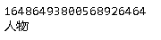

非常好的入门材料 [使用spaCy做进阶自然语言处理](https://course.spacy.io/zh)

## 词语、短语、名字和概念的检索

### Doc， Token和Span


```python
# 导入中文类
from spacy.lang.zh import Chinese

# 创建nlp对象
nlp = Chinese()

# 处理文本
doc = nlp("这是一个句子。")

# 打印文本
print(doc.text)

# 遍历doc实例中的词符
print('-'*50)
for token in doc:
    print(token.text)
    
# 截取Doc的一部分就成为了Span实例
print('-'*50)
span = doc[1:3]

# 使用.text属性获取span的文本
print(span.text)
```


### Token属性

~~~python
doc = nlp("这个肉夹馍花了￥5。")
print("Index:   ", [token.i for token in doc])
print("Text:    ", [token.text for token in doc])

print("is_alpha:", [token.is_alpha for token in doc])
print("is_punct:", [token.is_punct for token in doc])
print("like_num:", [token.like_num for token in doc])
~~~


- `is_alpha`：检测词符是否有字母表字符组成
- `is_punct`：是否是标点符号或者

- `like_num`：是否_代表了_一个数字

zh_core_web_sm默认采用pkuseg分词。

~~~python
import spacy 

nlp = spacy.load("zh_core_web_sm")
print(nlp.tokenizer.segmenter)

# 处理文本
doc = nlp(
    "在1990年，一份豆腐脑可能只要￥0.5。"
    "现在一份豆腐脑可能要￥5左右了。"
)

# 遍历doc中的词符
print('-'*50)
for token in doc:
    # 检测词符的文本是否是"￥"
    print(token.text)

print('-'*50)
for token in doc:
    # 检测词符的文本是否是"￥"
    if token.text == "￥":
        # 获取文档中的下一个词符
        next_token = doc[token.i + 1]
        # 检测下一个词符是否组成一个数字
        if next_token.like_num:
            print("Price found:", next_token.text)
~~~


### 词性标注

统计模型让spaCy可以通过语境来做抽取。抽取结果通常包括了词性标注、依存关系和命名实体。

~~~python
import spacy

# 读取小版本的中文模型
nlp = spacy.load("zh_core_web_sm")

# 处理文本
doc = nlp("我吃了个肉夹馍")

# 遍历词符
for token in doc:
    # Print the text and the predicted part-of-speech tag
    print(token.text, token.pos_)
~~~


### 依存关系解析

除了词性分析以外，我们还可以预测词与词之间的关系。比如一个词是某一个句子或者物体的主语。

- `.dep_`属性返回预测的依存关系标注。
- `.head`属性返回句法头词符。你可以认为这是词在句子中所依附的母词符。

~~~python
for token in doc:
    print(token.text, token.pos_, token.dep_, token.head.text)
spacy.displacy.render(doc, style="dep")     
~~~


### 命名实体识别

~~~python
doc = nlp("微软准备用十亿美金买下这家英国的创业公司。")

# 遍历识别出的实体
for ent in doc.ents:
    # 打印实体文本及其标注
    print(ent.text, ent.label_)
    
spacy.displacy.render(doc, style="ent") 
~~~


可以用`spacy.explain`这个帮手函数 来快速获得大部分常见的标注和标签定义。

~~~python
print(spacy.explain("GPE"))
print(spacy.explain("NNP"))
print(spacy.explain("dobj"))
print(spacy.explain("ORG"))
~~~


### 基于规则的匹配

与正则表达式相比，matcher是配合`Doc`和`Token`这样的方法来使用的， 而不是只作用于字符串上。

#### 例1：查询文本

查询第一个词是iPhone，第二次词是X

~~~python
import spacy
from spacy.matcher import Matcher

def search(doc, matcher):
    print('-'*50)
    for token in doc:
        # Print the text and the predicted part-of-speech tag
        print(token.i, token.text, token.pos_)

    # 在doc上面调用matcher
    print('-'*50)
    matches = matcher(doc)
    print(matches)

    print('-'*50)
    for match_id, start, end in matches:
        # 获取匹配的跨度
        matched_span = doc[start:end]
        print(matched_span.text)

# 读取一个模型，创建nlp实例
nlp = spacy.load("zh_core_web_sm")

# 给matcher加入模板
pattern = [[{"TEXT": "iPhone"}, {"TEXT": "X"}]]
matcher = Matcher(nlp.vocab)
matcher.add("IPHONE_PATTERN", pattern)

# 处理文本
doc = nlp("即将上市的iPhone X发布日期被泄露了")
        
search(doc, matcher)
~~~


#### 例2：根据属性查询

~~~python
nlp = spacy.load("zh_core_web_sm")

matcher = Matcher(nlp.vocab)
pattern = [
    {"POS": "VERB"},
    {"POS": "NOUN"}
]

matcher.add("1", [pattern])
doc = nlp("我喜欢狗但我更喜欢猫。")
search(doc, matcher)
~~~


#### 例3：使用运算符和量词 

~~~python
# 读取一个模型，创建nlp实例
nlp = spacy.load("zh_core_web_sm")

matcher = Matcher(nlp.vocab)
pattern = [
    {"POS": "VERB"},
    {"POS": "NUM", "OP": "?"},  # 可选: 匹配0次或者1次
    {"POS": "NOUN"}
]
matcher.add("1", [pattern])

doc = nlp("我买个肉夹馍。我还要买包子。")
search(doc, matcher)
~~~


| 例子          | 说明               |
| ------------- | ------------------ |
| `{"OP": "!"}` | 否定: 0次匹配      |
| `{"OP": "?"}` | 可选: 0次或1次匹配 |
| `{"OP": "+"}` | 1次或更多次匹配    |
| `{"OP": "*"}` | 0次或更多次匹配    |

## 使用spaCy进行大规模数据分析

### Vocab, Lexemes和StringStore

spaCy把所有共享数据都存在一个词汇表里，也就是Vocab。这里面除了有很多词汇，还包括了标注和实体的标注方案。为了节省内存，所有的字符串都被编码成哈希ID。 如果一个词出现多过一次，我们就不需要每次都多存储一次。

~~~python
import spacy

nlp = spacy.load("zh_core_web_sm")
doc = nlp("周杰伦是一个人物。")

# 查找标签是"人物"的字符串的哈希值
person_hash = nlp.vocab.strings['人物'] 
print(person_hash)

# 查找person_hash来拿到字符串
person_string = nlp.vocab.strings[person_hash]
print(person_string)
~~~



### Doc、Span和Token

`Doc`是spaCy的核心数据结构之一。 当我们用`nlp`实例来处理文本时`Doc`就会被自动创建， 当然我们也可以手动初始化这个类。

`Doc`类有三个参数：共享的词汇表，词汇和空格。

~~~python
from spacy.lang.en import English
nlp = English()

# 导入Doc类
from spacy.tokens import Doc

# 用来创建doc的词汇和空格
words = ["Hello", "world", "!"]
spaces = [True, False, False]

# 手动创建一个doc
doc = Doc(nlp.vocab, words=words, spaces=spaces)
doc
~~~


一个`Span`是doc的一段包含了一个或更多的词符的截取。 `Span`类有最少三个参数：对应的doc以及span本身起始和终止的索引。 注意终止索引代表的词符是不包含在这个span里面的！


~~~python
from spacy.lang.zh import Chinese

nlp = Chinese()

# 导入Doc和Span类
from spacy.tokens import Doc, Span

words = ["我", "喜欢", "周", "杰伦"]
spaces = [False, False, False, False]

# 用words和spaces创建一个doc
doc = Doc(nlp.vocab, words=words, spaces=spaces)
print(doc.text)

# 为doc中的"周杰伦"创建一个span，并赋予其"PERSON"的标签
span = Span(doc, 2, 4, label="PERSON")
print(span.text, span.label_)

print(doc.ents)
# 把这个span加入到doc的实体中
doc.ents = [span]

# 打印所有实体的文本和标签
print([(ent.text, ent.label_) for ent in doc.ents])
~~~


### 词向量和语义相似度

spaCy能够比较两个实例然后判断它们有多相似， 这包括了文档document、跨度span或者单个的词符token。默认是余弦相似度。

~~~python
import spacy

nlp = spacy.load("zh_core_web_md")

doc1 = nlp("这是一个温暖的夏日")
doc2 = nlp("外面阳光明媚")

# 获取doc1和doc2的相似度
similarity = doc1.similarity(doc2)
print(similarity)
~~~


~~~python
import spacy

nlp = spacy.load("zh_core_web_md")

doc = nlp("这是一家不错的餐厅。之后我们又去了一家很好的酒吧。")

for i, token in enumerate(doc):
    print(i, token.text)

# 给"great restaurant"和"really nice bar"分别创建span
span1 = doc[2:5]
span2 = doc[12:15]

print(span1, span2)

# 获取两个span的相似度
similarity = span1.similarity(span2)
print(similarity)
~~~


### 模型和规则的结合

在线规则工具： https://explosion.ai/demos/matcher

将统计模型与规则系统结合使用，是自然语言处理工具箱里面最强大的方法之一。

当我们要查找的例子差不多是有限个的时候，基于规则的方法就变得很有用。比如世界上所有的国家名或者城市名、药品名或者甚至狗的种类。

在spaCy中我们可以用定制化的分词规则以及matcher和phrase matcher这样的匹配器来完成这些任务。`PhraseMatcher`和普通正则表达式或者关键词搜索类似

|               | **统计模型**                           | **规则系统**                         |
| ------------- | -------------------------------------- | ------------------------------------ |
| **使用场景**  | 需要根据例子来 *泛化* 的应用           | 有限个例子组成的字典                 |
| **真实范例**  | 产品名、人名、主宾关系                 | 世界上的国家、城市、药品名、狗的种类 |
| **spaCy功能** | 实体识别器、依存句法识别器、词性标注器 | 分词器, `Matcher`, `PhraseMatcher`   |

#### matcher

matcher是精确匹配。

~~~python
import spacy
from spacy.matcher import Matcher

nlp = spacy.load("zh_core_web_sm")

doc = nlp("荣耀发布锐龙笔记本，显然会配备7nm工艺、Zen2 架构的"
          "全新锐龙4000 系列，但具体采用低功耗的锐龙4000U 系列，还是高性能的锐龙4000H 系列"
         )

print('-'*50)
for i, token in enumerate(doc):
    print(i, token.text, token.pos_)

# 创建匹配模板
pattern1 = [{"POS": "NOUN"},{"TEXT": "笔记本"}]
pattern2 = [{"TEXT": "锐龙"}, {"LIKE_NUM": True}, {"IS_ASCII": True}]

# 初始化matcher并加入模板
matcher = Matcher(nlp.vocab)
matcher.add("PATTERN1", [pattern1])
matcher.add("PATTERN2", [pattern2])

# 遍历匹配结果
print('-'*50)
for match_id, start, end in matcher(doc):
    # 打印匹配到的字符串名字及匹配到的span的文本
    print(doc.vocab.strings[match_id], doc[start:end].text)
~~~


#### 正则表达式

如果用正则表达式，可以实现相同的效果。

~~~python
import spacy
from spacy.matcher import Matcher

nlp = spacy.load("zh_core_web_sm")

doc = nlp("荣耀发布锐龙笔记本，显然会配备7nm工艺、Zen2 架构的"
          "全新锐龙4000 系列，但具体采用低功耗的锐龙4000U 系列，还是高性能的锐龙4000H 系列"
         )

print('-'*50)
for i, token in enumerate(doc):
    print(i, token.text, token.pos_)

# 创建匹配模板
pattern1 = [{"POS": "NOUN"},{"TEXT": "笔记本"}]
pattern2 = [{"TEXT": "锐龙"}, {"TEXT": {"REGEX": "\d+"}}, {"TEXT": {"REGEX": "[a-z0-9A-Z_]+"}}]

# 初始化matcher并加入模板
matcher = Matcher(nlp.vocab)
matcher.add("PATTERN1", [pattern1])
matcher.add("PATTERN2", [pattern2])

# 遍历匹配结果
print('-'*50)
for match_id, start, end in matcher(doc):
    # 打印匹配到的字符串名字及匹配到的span的文本
    print(doc.vocab.strings[match_id], doc[start:end].text)
~~~


可以看到，上面的正则表达式，是在token范围工作的。下面在全局范围查找文档。

~~~python
import spacy
import re

nlp = spacy.load("en_core_web_sm")
doc = nlp("The United States of America (USA) are commonly known as the United States (U.S. or US) or America.")

expression = r"[Uu](nited|\.?) ?[Ss](tates|\.?)"
for match in re.finditer(expression, doc.text):
    start, end = match.span()
    span = doc.char_span(start, end)
    # This is a Span object or None if match doesn't map to valid token sequence
    if span is not None:
        print("Found match:", span.text)
~~~


#### PhraseMatcher

~~~python
import json
import requests
from spacy.lang.zh import Chinese


COUNTRIES = ['阿富汗', '奥兰群岛', '阿尔巴尼亚', '阿尔及利亚', '美属萨摩亚', '安道尔', 
             '安哥拉', '安圭拉', '安提瓜和巴布达', '阿根廷', '亚美尼亚', '阿鲁巴', 
             '澳大利亚', '奥地利', '阿塞拜疆', '孟加拉', '巴林', '巴哈马', '巴巴多斯', 
             '白俄罗斯', '比利时', '伯利兹', '贝宁', '百慕大', '不丹', '玻利维亚', 
             '波斯尼亚和黑塞哥维那', '博茨瓦纳', '布维岛', '巴西', '文莱', '保加利亚', 
             '布基纳法索', '布隆迪', '柬埔寨', '喀麦隆', '加拿大', '佛得角', '中非', 
             '乍得', '智利', '圣诞岛', '科科斯群岛', '哥伦比亚', '科摩罗', '刚果', 
             '刚果', '库克群岛', '哥斯达黎加', '科特迪瓦', '中国', '克罗地亚', '古巴', 
             '捷克', '塞浦路斯', '丹麦', '吉布提', '多米尼加', '东帝汶', '厄瓜多尔', '埃及', 
             '赤道几内亚', '厄立特里亚', '爱沙尼亚', '埃塞俄比亚', '法罗群岛', '斐济', '法国', 
             '法国大都会', '法属圭亚那', '法属波利尼西亚', '加蓬', '冈比亚', '格鲁吉亚', '德国', 
             '加纳', '直布罗陀', '希腊', '格林纳达', '瓜德罗普岛', '关岛', '危地马拉', '根西岛', 
             '几内亚比绍', '几内亚', '圭亚那', '海地', '洪都拉斯', '匈牙利', '冰岛', '印度', 
             '印度尼西亚', '伊朗', '伊拉克', '爱尔兰', '马恩岛', '以色列', '意大利', '牙买加', 
             '日本', '泽西岛', '约旦', '哈萨克斯坦', '肯尼亚', '基里巴斯', '韩国', '朝鲜', 
             '科威特', '吉尔吉斯斯坦', '老挝', '拉脱维亚', '黎巴嫩', '莱索托', '利比里亚', 
             '利比亚', '列支敦士登', '立陶宛', '卢森堡', '马其顿', '马拉维', '马来西亚', 
             '马达加斯加', '马尔代夫', '马里', '马耳他', '马绍尔群岛', '马提尼克岛', 
             '毛里塔尼亚', '毛里求斯', '马约特', '墨西哥', '密克罗尼西亚', '摩尔多瓦', 
             '摩纳哥', '蒙古', '黑山', '蒙特塞拉特', '摩洛哥', '莫桑比克', '缅甸', 
             '纳米比亚', '瑙鲁', '尼泊尔', '荷兰', '新喀里多尼亚', '新西兰', '尼加拉瓜', 
             '尼日尔', '尼日利亚', '纽埃', '诺福克岛', '挪威', '阿曼', '巴基斯坦', '帕劳', 
             '巴勒斯坦', '巴拿马', '巴布亚新几内亚', '巴拉圭', '秘鲁', '菲律宾', '皮特凯恩群岛', 
             '波兰', '葡萄牙', '波多黎各', '卡塔尔', '留尼汪岛', '罗马尼亚', '卢旺达', '俄罗斯联邦', 
             '圣赫勒拿', '圣基茨和尼维斯', '圣卢西亚', '圣文森特和格林纳丁斯', '萨尔瓦多', '萨摩亚', 
             '圣马力诺', '圣多美和普林西比', '沙特阿拉伯', '塞内加尔', '塞舌尔', '塞拉利昂', '新加坡', 
             '塞尔维亚', '斯洛伐克', '斯洛文尼亚', '所罗门群岛', '索马里', '南非', '西班牙', '斯里兰卡', 
             '苏丹', '苏里南', '斯威士兰', '瑞典', '瑞士', '叙利亚', '塔吉克斯坦', '坦桑尼亚', '泰国', 
             '特立尼达和多巴哥', '东帝汶', '多哥', '托克劳', '汤加', '突尼斯', '土耳其', '土库曼斯坦', 
             '图瓦卢', '乌干达', '乌克兰', '阿拉伯联合酋长国', '英国', '美国', '乌拉圭', '乌兹别克斯坦', 
             '瓦努阿图', '梵蒂冈', '委内瑞拉', '越南', '瓦利斯群岛和富图纳群岛', '西撒哈拉', '也门', 
             '南斯拉夫', '赞比亚', '津巴布韦']

nlp = Chinese()
doc = nlp("智利可能会从斯洛伐克进口货物")

# 导入PhraseMatcher并实例化
from spacy.matcher import PhraseMatcher

matcher = PhraseMatcher(nlp.vocab)

# 创建Doc实例的模板然后加入matcher中
# 下面的代码比这样的表达方式更快： [nlp(country) for country in COUNTRIES]
patterns = list(nlp.pipe(COUNTRIES))
# patterns = [nlp.make_doc(text) for text in COUNTRIES]  # 和上一句相同效果
print(type(patterns[0]))
matcher.add("COUNTRY", patterns)

# 在测试文档中调用matcher并打印结果
matches = matcher(doc)
print([doc[start:end] for match_id, start, end in matches])
~~~


接下来的例子是忽略大小写。

~~~python
from spacy.lang.en import English
from spacy.matcher import PhraseMatcher

nlp = English()
# 如果不设置attr="LOWER"，无法进行匹配。
matcher = PhraseMatcher(nlp.vocab, attr="LOWER")
patterns = [nlp.make_doc(name) for name in ["Angela Merkel", "Barack Obama"]]
matcher.add("Names", patterns)

doc = nlp("angela merkel and us president barack Obama")
for match_id, start, end in matcher(doc):
    print("Matched based on lowercase token text:", doc[start:end])
~~~


使用shape进行匹配。

~~~python
from spacy.lang.en import English
from spacy.matcher import PhraseMatcher

nlp = English()
matcher = PhraseMatcher(nlp.vocab, attr="SHAPE")
matcher.add("IP", [nlp("127.0.0.1"), nlp("127.127.0.0")])

doc = nlp("Often the router will have an IP address such as 192.168.1.1 or 192.168.2.1.")
for match_id, start, end in matcher(doc):
    print("Matched based on token shape:", doc[start:end])
~~~


下面是一个稍微复杂一点的例子。

~~~python
import json
import requests
from spacy.lang.zh import Chinese


COUNTRIES = ['阿富汗', '奥兰群岛', '阿尔巴尼亚', '阿尔及利亚', '美属萨摩亚', '安道尔', 
             '安哥拉', '安圭拉', '安提瓜和巴布达', '阿根廷', '亚美尼亚', '阿鲁巴', 
             '澳大利亚', '奥地利', '阿塞拜疆', '孟加拉', '巴林', '巴哈马', '巴巴多斯', 
             '白俄罗斯', '比利时', '伯利兹', '贝宁', '百慕大', '不丹', '玻利维亚', 
             '波斯尼亚和黑塞哥维那', '博茨瓦纳', '布维岛', '巴西', '文莱', '保加利亚', 
             '布基纳法索', '布隆迪', '柬埔寨', '喀麦隆', '加拿大', '佛得角', '中非', 
             '乍得', '智利', '圣诞岛', '科科斯群岛', '哥伦比亚', '科摩罗', '刚果', 
             '刚果', '库克群岛', '哥斯达黎加', '科特迪瓦', '中国', '克罗地亚', '古巴', 
             '捷克', '塞浦路斯', '丹麦', '吉布提', '多米尼加', '东帝汶', '厄瓜多尔', '埃及', 
             '赤道几内亚', '厄立特里亚', '爱沙尼亚', '埃塞俄比亚', '法罗群岛', '斐济', '法国', 
             '法国大都会', '法属圭亚那', '法属波利尼西亚', '加蓬', '冈比亚', '格鲁吉亚', '德国', 
             '加纳', '直布罗陀', '希腊', '格林纳达', '瓜德罗普岛', '关岛', '危地马拉', '根西岛', 
             '几内亚比绍', '几内亚', '圭亚那', '海地', '洪都拉斯', '匈牙利', '冰岛', '印度', 
             '印度尼西亚', '伊朗', '伊拉克', '爱尔兰', '马恩岛', '以色列', '意大利', '牙买加', 
             '日本', '泽西岛', '约旦', '哈萨克斯坦', '肯尼亚', '基里巴斯', '韩国', '朝鲜', 
             '科威特', '吉尔吉斯斯坦', '老挝', '拉脱维亚', '黎巴嫩', '莱索托', '利比里亚', 
             '利比亚', '列支敦士登', '立陶宛', '卢森堡', '马其顿', '马拉维', '马来西亚', 
             '马达加斯加', '马尔代夫', '马里', '马耳他', '马绍尔群岛', '马提尼克岛', 
             '毛里塔尼亚', '毛里求斯', '马约特', '墨西哥', '密克罗尼西亚', '摩尔多瓦', 
             '摩纳哥', '蒙古', '黑山', '蒙特塞拉特', '摩洛哥', '莫桑比克', '缅甸', 
             '纳米比亚', '瑙鲁', '尼泊尔', '荷兰', '新喀里多尼亚', '新西兰', '尼加拉瓜', 
             '尼日尔', '尼日利亚', '纽埃', '诺福克岛', '挪威', '阿曼', '巴基斯坦', '帕劳', 
             '巴勒斯坦', '巴拿马', '巴布亚新几内亚', '巴拉圭', '秘鲁', '菲律宾', '皮特凯恩群岛', 
             '波兰', '葡萄牙', '波多黎各', '卡塔尔', '留尼汪岛', '罗马尼亚', '卢旺达', '俄罗斯联邦', 
             '圣赫勒拿', '圣基茨和尼维斯', '圣卢西亚', '圣文森特和格林纳丁斯', '萨尔瓦多', '萨摩亚', 
             '圣马力诺', '圣多美和普林西比', '沙特阿拉伯', '塞内加尔', '塞舌尔', '塞拉利昂', '新加坡', 
             '塞尔维亚', '斯洛伐克', '斯洛文尼亚', '所罗门群岛', '索马里', '南非', '西班牙', '斯里兰卡', 
             '苏丹', '苏里南', '斯威士兰', '瑞典', '瑞士', '叙利亚', '塔吉克斯坦', '坦桑尼亚', '泰国', 
             '特立尼达和多巴哥', '东帝汶', '多哥', '托克劳', '汤加', '突尼斯', '土耳其', '土库曼斯坦', 
             '图瓦卢', '乌干达', '乌克兰', '阿拉伯联合酋长国', '英国', '美国', '乌拉圭', '乌兹别克斯坦', 
             '瓦努阿图', '梵蒂冈', '委内瑞拉', '越南', '瓦利斯群岛和富图纳群岛', '西撒哈拉', '也门', 
             '南斯拉夫', '赞比亚', '津巴布韦']

TEXT = """冷战结束后，联合国在维和方面有显著的扩展，在十年内的维和行动数量超过过去四十年。在1988年和2000年间，通过的安理会决议数量翻了超过一倍，维和的预算也增加超过十倍。联合国调停结束萨尔瓦多内战，成功进行纳米比亚的维和任务，并监督了南非种族隔离和柬埔寨红色高棉统治之后的民主选举。1991年，联合国授权美国领导的同盟军事行动，击退伊拉克对科威特的入侵。1971年至1985年担任副秘书长的布莱恩·厄克特后来说这些行动的成功为联合国带来一种“虚假复兴”——在之后，联合国的任务变得更为艰难。

联合国宪章原本目的是阻止一个国家对另一个国家的进攻，但在90年代初联合国面临许多同时发生的严重国内危机，包括索马里、海地、莫桑比克和前南斯拉夫。在美国于摩加迪沙之战中损失惨重而撤出之后，联合国在索马里的行动被普遍认为是失败的；而联合国在波黑的行动则因为面对种族清洗显得任务不清和不果决而成为“世界的笑柄”。1994年，联合国卢旺达援助团在安理会无法决断的情况下没能对卢旺达大屠杀进行介入。

在冷战的最后数十年中，联合国受到来自美国和欧洲的批评家的批评，被指管理不善和腐败。1984年，美国总统罗纳德·里根停止对联合国教科文组织的资助，英国和新加坡也紧随其后。1992年至1996年在任的联合国秘书长布特罗斯·布特罗斯-加利对秘书处进行改革，在一定程度上精简了组织的规模。他的继任者科菲·安南（1997年-2006年在任）面对美国撤资的威胁进行进一步的管理改革。

20世纪90年代末和21世纪初，联合国授权的国际介入形式多样。联合国在塞拉利昂的任务得到英国皇家海军陆战队的支持，而对阿富汗的入侵则由北约领衔。2003年，在安理会决议未能通过授权的情况下，美国仍然入侵伊拉克，新一轮的对联合国是否有效的争论就此展开。在秘书长潘基文任下，联合国维和行动介入苏丹的达尔富尔冲突和刚果民主共和国的基伍冲突，并派出观察员和化学武器核查人员前往叙利亚内战。2013年，对联合国于2009年在斯里兰卡内战末期的行动的内部审查表明，该组织遭遇“系统性的失败”。在2010年海地地震中，有101名联合国人员殉职，这是联合国历史上最为惨痛的损失。"""

nlp = spacy.load("zh_core_web_sm")
matcher = PhraseMatcher(nlp.vocab)
patterns = list(nlp.pipe(COUNTRIES))
matcher.add("COUNTRY", None, *patterns)

# 创建一个doc并重置其已有的实体
doc = nlp(TEXT)
doc.ents = []

# 遍历所有的匹配结果
for match_id, start, end in matcher(doc):
    # 创建一个标签为"GPE"的span
    span = Span(doc, start, end, label='GPE')

    # 覆盖doc.ents并添加这个span
    doc.ents = list(doc.ents) + [span]

    # 获取这个span的根头词符
    span_root_head = span.root.head 

    # 打印这个span的根头词符的文本及span的文本
    print(span_root_head.text, "-->", span.text)

# 打印文档中的所有实体
print([(ent.text, ent.label_) for ent in doc.ents if ent.label_ == "GPE"])
~~~


## 处理流程

### 流程


处理流程如下：

- tokenzier将一段文本的字符串变成一个`Doc`实例。

-  一系列的流程组件处理这个doc。

  - 词性标注器tagger

    设定了`token.tag`和`token.pos`

  - 依存关系标注器parser

    添加了`token.dep`和`token.head`属性，同时也负责检测句子和基础的名词 短语，也被称作名词块。

  - 实体识别器entity recognizer 

    将检测到的实体添加到`doc.ents`属性中，同时对词符设定了实体类别的属性， 表明该词符是否是一个实体的一部分。

| 名字        | 描述                                                         | 创建结果                                                  |
| ----------- | ------------------------------------------------------------ | --------------------------------------------------------- |
| **tagger**  | 词性标注器                                                   | `Token.tag`, `Token.pos`                                  |
| **parser**  | 依存关系标注器                                               | `Token.dep`, `Token.head`, `Doc.sents`, `Doc.noun_chunks` |
| **ner**     | 命名实体识别器                                               | `Doc.ents`, `Token.ent_iob`, `Token.ent_type`             |
| **textcat** | 文本分类器。设定适用于整个文本的类别，将其加入`doc.cats`属性中。文本的类别往往是特定的，所以默认文本分类器不包含在任何一个预训练好的 | `Doc.cats`                                                |

显示流程组件列表。

~~~python
print(nlp.pipe_names)
print(nlp.pipeline)
~~~


在后台，流程是依次定义在模型的meta.json文件里


### 定制化流程组件

一个流程组件就是一个函数或者callable，它读取一个doc，修改 和返回这个doc，作为下一个流程组件的输入。

~~~python
import spacy
from spacy.language import Language

# 定义定制化组件
@Language.component(name='length_component')
def length_component(doc):
    # 获取doc的长度
    doc_length = len(doc)
    print(f"This document is {doc_length} tokens long.")
    # 返回这个doc
    return doc


# 读取小规模的中文模型
nlp = spacy.load("zh_core_web_sm")

# 将组件加入到流程的最前面，打印流程组件名
nlp.add_pipe('length_component', first=True)
print(nlp.pipe_names)

# 处理一段文本
doc = nlp("这是一个句子。")
~~~

下面是复杂一点的例子。

~~~python
import spacy
from spacy.matcher import PhraseMatcher
from spacy.tokens import Span
from spacy.language import Language

nlp = spacy.load("zh_core_web_sm")
animals = ["金毛犬", "猫", "乌龟", "老鼠"]
animal_patterns = list(nlp.pipe(animals))
print("animal_patterns:", animal_patterns)
matcher = PhraseMatcher(nlp.vocab)
matcher.add("ANIMAL", animal_patterns)

# 定义定制化组件
@Language.component(name='animal_component')
def animal_component(doc):
    # 把matcher应用到doc上
    matches = matcher(doc)
    # 为每一个匹配结果生成一个Span并赋予标签"ANIMAL"
    spans = [Span(doc, start, end, label='ANIMAL') for match_id, start, end in matches]
    # 用匹配到的span覆盖doc.ents
    doc.ents = spans
    return doc


# 把组件加入到流程中，紧跟在"ner"组件后面
nlp.add_pipe('animal_component', after='ner')
print(nlp.pipe_names)

# 处理文本，打印doc.ents的文本和标签
doc = nlp("我养了一只猫和一条金毛犬。")
print([(ent.text, ent.label) for ent in doc.ents])
~~~


### 扩展属性

学习如何添加定制化属性到`Doc`、`Token`和`Span`实例中 来储存一些定制化的数据。同时可以使用`set_extension`方法将一个定制化属性注册到全局的 `Doc`、`Token`和`Span`上。有三种扩展：

- 特性（Attribute）扩展

  ~~~python
  import spacy 
  from spacy.tokens import Token
  
  # 为Token设置一个有默认值的扩展
  Token.set_extension("is_weather", default=False)
  
  nlp = spacy.load("zh_core_web_sm")
  doc = nlp("今天回下雨。")
  
  print(doc[2]._.is_weather )
  # 覆盖默认扩展特性的值
  doc[2]._.is_weather = True
  print(doc[2]._.is_weather )
  ~~~

  

- 属性（Property）扩展

  ~~~python
  import spacy 
  from spacy.tokens import Token
  
  # 定义取值器函数
  def get_is_color(token):
      colors = ["红色", "黄色", "蓝色"]
      return token.text in colors
  
  nlp = spacy.load("zh_core_web_sm")
  
  # 为词符设置有取值器的扩展
  Token.set_extension("is_color", getter=get_is_color)
  
  doc = nlp("天空是蓝色的。")
  print(doc[2]._.is_color, "-", doc[2].text)
  ~~~

  

  对Span进行扩展。

  ~~~python
  from spacy.tokens import Span
  
  # 定义取值器函数
  def get_has_color(span):
      colors = ["红色", "黄色", "蓝色"]
      return any(token.text in colors for token in span)
  
  # 为Span设置一个带有取值器getter的扩展
  Span.set_extension("has_color", getter=get_has_color)
  
  doc = nlp("天空是蓝色的")
  print(doc[1:4]._.has_color, "-", doc[1:4].text)
  print(doc[0:2]._.has_color, "-", doc[0:2].text)
  ~~~

  

  对Entity进行扩展，Entity也是一种Span。

  ~~~python
  import spacy
  from spacy.tokens import Span
  
  nlp = spacy.load("zh_core_web_sm")
  
  
  def get_wikipedia_url(span):
      # 如果span有其中一个标签则获取其维基百科URL
      if span.label_ in ("PERSON", "ORG", "GPE", "LOCATION"):
          entity_text = span.text.replace(" ", "_")
          return "https://zh.wikipedia.org/w/index.php?search=" + entity_text
  
  
  # 设置Span的扩展wikipedia_url及其取值器get_wikipedia_url
  Span.set_extension("wikipedia_url", getter=get_wikipedia_url)
  
  doc = nlp(
      "出道这么多年，周杰伦已经成为几代年轻人共同的偶像。"
  )
  for ent in doc.ents:
      # 打印实体的文本和其维基百科URL
      print(ent.text,  ent._.wikipedia_url)
  ~~~

  

  下面的例子，综合了属性（Property）扩展和流程定制。

  ~~~python
  import json
  from spacy.lang.zh import Chinese
  from spacy.tokens import Span
  from spacy.matcher import PhraseMatcher
  from spacy.language import Language
  
  COUNTRIES = ['阿富汗', '奥兰群岛', '阿尔巴尼亚', '阿尔及利亚', '美属萨摩亚', '安道尔', 
               '安哥拉', '安圭拉', '安提瓜和巴布达', '阿根廷', '亚美尼亚', '阿鲁巴', 
               '澳大利亚', '奥地利', '阿塞拜疆', '孟加拉', '巴林', '巴哈马', '巴巴多斯', 
               '白俄罗斯', '比利时', '伯利兹', '贝宁', '百慕大', '不丹', '玻利维亚', 
               '波斯尼亚和黑塞哥维那', '博茨瓦纳', '布维岛', '巴西', '文莱', '保加利亚', 
               '布基纳法索', '布隆迪', '柬埔寨', '喀麦隆', '加拿大', '佛得角', '中非', 
               '乍得', '智利', '圣诞岛', '科科斯群岛', '哥伦比亚', '科摩罗', '刚果', 
               '刚果', '库克群岛', '哥斯达黎加', '科特迪瓦', '中国', '克罗地亚', '古巴', 
               '捷克', '塞浦路斯', '丹麦', '吉布提', '多米尼加', '东帝汶', '厄瓜多尔', '埃及', 
               '赤道几内亚', '厄立特里亚', '爱沙尼亚', '埃塞俄比亚', '法罗群岛', '斐济', '法国', 
               '法国大都会', '法属圭亚那', '法属波利尼西亚', '加蓬', '冈比亚', '格鲁吉亚', '德国', 
               '加纳', '直布罗陀', '希腊', '格林纳达', '瓜德罗普岛', '关岛', '危地马拉', '根西岛', 
               '几内亚比绍', '几内亚', '圭亚那', '海地', '洪都拉斯', '匈牙利', '冰岛', '印度', 
               '印度尼西亚', '伊朗', '伊拉克', '爱尔兰', '马恩岛', '以色列', '意大利', '牙买加', 
               '日本', '泽西岛', '约旦', '哈萨克斯坦', '肯尼亚', '基里巴斯', '韩国', '朝鲜', 
               '科威特', '吉尔吉斯斯坦', '老挝', '拉脱维亚', '黎巴嫩', '莱索托', '利比里亚', 
               '利比亚', '列支敦士登', '立陶宛', '卢森堡', '马其顿', '马拉维', '马来西亚', 
               '马达加斯加', '马尔代夫', '马里', '马耳他', '马绍尔群岛', '马提尼克岛', 
               '毛里塔尼亚', '毛里求斯', '马约特', '墨西哥', '密克罗尼西亚', '摩尔多瓦', 
               '摩纳哥', '蒙古', '黑山', '蒙特塞拉特', '摩洛哥', '莫桑比克', '缅甸', 
               '纳米比亚', '瑙鲁', '尼泊尔', '荷兰', '新喀里多尼亚', '新西兰', '尼加拉瓜', 
               '尼日尔', '尼日利亚', '纽埃', '诺福克岛', '挪威', '阿曼', '巴基斯坦', '帕劳', 
               '巴勒斯坦', '巴拿马', '巴布亚新几内亚', '巴拉圭', '秘鲁', '菲律宾', '皮特凯恩群岛', 
               '波兰', '葡萄牙', '波多黎各', '卡塔尔', '留尼汪岛', '罗马尼亚', '卢旺达', '俄罗斯联邦', 
               '圣赫勒拿', '圣基茨和尼维斯', '圣卢西亚', '圣文森特和格林纳丁斯', '萨尔瓦多', '萨摩亚', 
               '圣马力诺', '圣多美和普林西比', '沙特阿拉伯', '塞内加尔', '塞舌尔', '塞拉利昂', '新加坡', 
               '塞尔维亚', '斯洛伐克', '斯洛文尼亚', '所罗门群岛', '索马里', '南非', '西班牙', '斯里兰卡', 
               '苏丹', '苏里南', '斯威士兰', '瑞典', '瑞士', '叙利亚', '塔吉克斯坦', '坦桑尼亚', '泰国', 
               '特立尼达和多巴哥', '东帝汶', '多哥', '托克劳', '汤加', '突尼斯', '土耳其', '土库曼斯坦', 
               '图瓦卢', '乌干达', '乌克兰', '阿拉伯联合酋长国', '英国', '美国', '乌拉圭', '乌兹别克斯坦', 
               '瓦努阿图', '梵蒂冈', '委内瑞拉', '越南', '瓦利斯群岛和富图纳群岛', '西撒哈拉', '也门', 
               '南斯拉夫', '赞比亚', '津巴布韦']
  
  CAPITALS = {'中国': '北京', '蒙古': '乌兰巴托', '朝鲜': '平壤', '韩国': '首尔', '日本': '东京', 
              '菲律宾': '马尼拉', '印度尼西亚': '雅加达', '文莱': '斯里巴加湾市', '新加坡': '新加坡', '泰国': '曼谷', 
              '马来西亚': '吉隆坡', '越南': '河内', '老挝': '万象', '柬埔寨': '金边', '缅甸': '内比都', '不丹': '廷布', 
              '东帝汶': '帝力', '尼泊尔': '加德满都', '印度': '新德里', '孟加拉国': '达卡', '斯里兰卡': '科伦坡', 
              '马尔代夫': '马累', '巴基斯坦': '伊斯兰堡', '阿富汗': '喀布尔', '塔吉克斯坦': '杜尚别', 
              '吉尔吉斯斯坦': '比什凯克', '哈萨克斯坦': '阿斯塔纳', '乌兹别克期坦': '塔什干', '土库曼斯坦': '阿什哈巴德', 
              '伊朗': '德黑兰', '伊拉克': '巴格达', '科威特': '科威特城', '卡塔尔': '多哈', '阿拉伯联合酋长国': '阿布扎比', 
              '巴林': '麦纳麦', '阿曼': '马斯喀特', '也门': '萨那', '沙特阿拉伯': '利雅得', '约旦': '安曼', 
              '巴勒斯坦': '耶路撒冷', '以色列': '耶路撒冷', '叙利亚': '大马士革', '黎巴嫩': '贝鲁特', '塞浦路斯': '尼科西亚', 
              '土耳其': '安卡拉', '阿塞拜疆': '巴库', '格鲁吉亚': '第比利斯', '亚美尼亚': '埃里温', '挪威': '奥斯路', 
              '冰岛': '雷克雅未克', '瑞典': '斯德哥尔摩', '芬兰': '赫尔辛基', '爱沙尼亚': '塔林', '拉脱维亚': '里加', 
              '立陶宛': '维尔纽斯', '白俄罗斯': '明斯克', '俄罗斯': '莫斯科', '乌克兰': '基辅', '摩尔多瓦': '基希讷乌', 
              '波兰': '华沙', '捷克': '布拉格', '斯洛伐克': '布拉提斯拉发', '匈牙利': '布达佩斯', '德国': '柏林', 
              '英国': '伦敦', '爱尔兰': '都柏林', '丹麦': '哥本哈根', '荷兰': '阿姆斯特丹', '摩纳哥': '摩纳哥', 
              '法国': '巴黎', '比利时': '布鲁塞尔', '卢森堡': '卢森堡', '奥地利': '维也纳', '瑞士': '伯尔尼', 
              '列支敦士登': '瓦杜兹', '西班牙': '马德里', '安道尔': '安道尔', '葡萄牙': '里斯本', '意大利': '罗马', 
              '马耳他': '瓦莱塔', '圣马力诺': '圣马力诺', '梵蒂冈': '梵蒂冈城', '斯洛文尼亚': '卢布尔雅那', 
              '克罗地亚': '萨格勒布', '波斯尼亚和黑塞哥维那': '萨拉热窝', '南斯拉夫': '贝尔格莱德', '马其顿': '斯科普里', 
              '阿尔巴尼亚': '地拉那', '罗马尼亚': '布加勒斯特', '保加利亚': '索非亚', '希腊': '雅典', '埃及': '开罗', 
              '苏丹': '喀土穆', '埃塞俄比亚': '亚的斯亚贝巴', '厄立特里亚': '阿斯马拉', '吉布提': '吉布提', 
              '索马里': '摩加迪沙', '利比亚': '的黎波里', '阿尔及利亚': '阿尔及尔', '突尼斯': '突尼斯', 
              '摩洛哥': '拉巴特', '佛得角': '普拉亚', '毛里塔尼亚': '努瓦克肖特', '马里': '巴马科', '塞内加尔': '达喀尔', 
              '冈比亚': '班珠尔', '几内亚比绍-': '比绍', '几内亚': '科纳克里', '塞拉利昂': '弗里敦', '利比里亚': '蒙罗维亚', 
              '科特迪瓦': '亚穆苏克罗', '布基纳法索': '瓦加杜古', '尼日尔': '尼亚美', '乍得': '恩贾梅纳', 
              '尼日利亚': '阿布贾', '加纳': '阿克拉', '多哥': '洛美', '贝宁': '波多诺伏-', '喀麦隆': '雅温得', 
              '加蓬': '利伯维尔', '赤道几内亚': '马拉博', '圣多美和普林西比': '圣多美', '中非': '班吉', 
              '刚果': '布拉柴维尔', '刚果民主共和国': '金沙萨', '乌干达': '坎帕拉', '卢旺达': '基加利', 
              '布隆迪': '布琼布拉', '坦桑尼亚': '多多马', '肯尼亚': '内罗华', '安哥拉': '罗安达', '赞比亚': '卢萨卡', 
              '马拉维': '利隆圭', '莫桑比克': '马普托', '马达加斯加': '塔那那利佛', '科摩罗': '莫罗尼', 
              '塞舌尔': '维多利亚', '毛里求斯': '路易港', '津巴布韦': '哈拉雷', '博茨瓦纳': '哈博罗内', '纳米比亚': 
              '温得和克', '斯威士兰': '姆巴巴内', '莱索托': '马塞卢', '南非': '比勒陀利亚', '澳大利亚': '堪培拉', 
              '巴布亚新几内亚': '莫尔兹比港', '所罗门群岛': '霍尼亚拉', '瓦努阿图': '维拉港-', '新西兰': '惠灵顿', 
              '斐济': '苏瓦', '汤加': '努库阿洛法', '瑙鲁': '亚伦', '基里巴斯': '塔拉瓦', '图瓦卢': '富纳富提', 
              '萨摩亚': '阿皮亚', '密克罗尼西亚联邦': '帕利基尔', '马绍尔群岛': '马朱罗', '帕劳': '科罗尔', 
              '加拿大': '渥太华', '美国': '华盛顿', '墨西哥': '墨西哥城', '危地马拉': '危地马拉', '伯利兹': '贝尔莫潘', 
              '萨尔瓦多': '圣萨尔瓦多', '洪都拉斯': '特古西加尔巴', '尼加拉瓜': '马那瓜', '哥斯达黎加': '圣何塞', 
              '巴拿马': '巴拿马城', '古巴': '哈瓦那', '巴哈马': '拿骚', '海地': '太子港--', '多米尼加共和国': '圣多明各', 
              '牙买加': '金斯敦', '圣基茨和尼维斯': '巴斯特尔', '安提瓜和巴布达': '圣约翰', '多米尼克': '罗索', 
              '圣卢西亚': '卡斯特里', '圣文森特和格林纳丁斯': '金斯敦', '格林纳达': '圣乔治', '巴巴多斯': '布里奇敦', 
              '特立尼达和多巴哥': '西班牙港--', '哥伦比亚': '波哥大', '厄瓜多尔': '基多', '委内瑞拉': '加拉加斯', 
              '圭亚那-': '乔治敦', '苏里南': '帕拉马里博', '秘鲁': '利马', '玻利维亚': '苏克雷', '巴拉圭': '亚松森', 
              '阿根廷': '布宜诺斯艾利斯', '乌拉圭': '蒙得维的亚', '巴西': '巴西利亚', '智利': '圣地亚哥'}
  
  nlp = Chinese()
  matcher = PhraseMatcher(nlp.vocab)
  # matcher.add("COUNTRY", None, *list(nlp.pipe(COUNTRIES)))
  matcher.add("COUNTRY", list(nlp.pipe(COUNTRIES)))
  
  @Language.component(name='countries_component')
  def countries_component(doc):
      # 对所有匹配结果创建一个标签为"GPE"的实体Span
      matches = matcher(doc)
      doc.ents = [Span(doc, start, end, label='GPE') for match_id, start, end in matches]
      return doc
  
  
  # 把这个组件加入到流程中
  #nlp.add_pipe(countries_component)
  nlp.add_pipe('countries_component')
  print(nlp.pipe_names)
  
  # 取值器，在国家首都的字典中寻找span的文本
  get_capital = lambda span: CAPITALS.get(span.text)
  
  # 用这个取值器注册Span的扩展属性"capital"
  Span.set_extension('capital', getter=get_capital, force=True) 
  
  # 处理文本，打印实体文本、标签和首都属性
  doc = nlp("中国将邦族新加坡和马来西亚一起建造高铁。")
  print([(ent.text, ent.label_, ent._.capital) for ent in doc.ents])
  ~~~

  

- 方法（Method）扩展

  ~~~python
  from spacy.tokens import Doc
  
  # 定义含有参数的方法
  def has_token(doc, token_text):
      in_doc = token_text in [token.text for token in doc]
      return in_doc
  
  # 在doc上设置方法扩展
  Doc.set_extension("has_token", method=has_token)
  
  doc = nlp("天空是蓝色的。")
  print(doc._.has_token("蓝色"), "- 蓝色")
  print(doc._.has_token("云朵"), "- 云朵")
  ~~~

  

### 规模化和性能

处理大规模语料
- 使用`nlp.pipe`方法
- 用流模式来处理文本，生成`Doc`实例
- 这比直接在每段文本上面调用`nlp`快得多

不好的方法：

```python
docs = [nlp(text) for text in LOTS_OF_TEXTS]
```

好的方法：

```python
docs = list(nlp.pipe(LOTS_OF_TEXTS))
```

#### nlp.pipe

使用`nlp.pipe`方法 可以极大地加速，它用流模式来处理文本生成`Doc`实例。

在`nlp.pipe`设置`as_tuples=True`，这样我们可以传入一些列形式为 `(text, context)`的元组。

~~~python
import json
from spacy.lang.en import English
from spacy.tokens import Doc

DATA = [['One morning, when Gregor Samsa woke from troubled dreams, he found himself transformed in his bed into a horrible vermin.', {'author': 'Franz Kafka', 'book': 'Metamorphosis'}], ["I know not all that may be coming, but be it what it will, I'll go to it laughing.", {'author': 'Herman Melville', 'book': 'Moby-Dick or, The Whale'}], ['It was the best of times, it was the worst of times.', {'author': 'Charles Dickens', 'book': 'A Tale of Two Cities'}], ['The only people for me are the mad ones, the ones who are mad to live, mad to talk, mad to be saved, desirous of everything at the same time, the ones who never yawn or say a commonplace thing, but burn, burn, burn like fabulous yellow roman candles exploding like spiders across the stars.', {'author': 'Jack Kerouac', 'book': 'On the Road'}], ['It was a bright cold day in April, and the clocks were striking thirteen.', {'author': 'George Orwell', 'book': '1984'}], ['Nowadays people know the price of everything and the value of nothing.', {'author': 'Oscar Wilde', 'book': 'The Picture Of Dorian Gray'}]]

nlp = English()

# 注册Doc的扩展"author"（默认值为None）
Doc.set_extension('author', default=None, force=True) 

# 注册Doc的扩展"book"（默认值为None）
Doc.set_extension('book', default=None, force=True) 

for doc, context in nlp.pipe(DATA, as_tuples=True):
    # 从context中设置属性doc._.book和doc._.author
    doc._.book = context['book']
    doc._.author = context['author']

    # 打印文本和定制化的属性数据
    print(f"{doc.text}\n — '{doc._.book}' by {doc._.author}\n")
~~~


#### nlp.make_doc

如果我们只是需要一个分词过的`Doc`实例，我们可以用`nlp.make_doc`方法 读入一段文本并返回一个doc。

~~~python
import spacy

nlp = spacy.load("zh_core_web_sm")
text = (
    "在300多年的风雨历程中，历代同仁堂人始终恪守“炮制虽繁必不敢省人工，品味虽贵必不敢减物力”的古训，"
    "树立“修合无人见，存心有天知”的自律意识，造就了制药过程中兢兢小心、精益求精的严细精神。"
)

doc = nlp(text)
print([(token.text, token.pos_) for token in doc])

# 仅对文本做分词
doc = nlp.make_doc(text)
print([(token.text, token.pos_) for token in doc])
~~~


#### nlp.disable_pipe

用`nlp.disable_pipes`方法disable一些组件。

~~~python
import spacy

nlp = spacy.load("zh_core_web_sm")
text = (
    "在300多年的风雨历程中，历代同仁堂人始终恪守“炮制虽繁必不敢省人工，品味虽贵必不敢减物力”的古训，"
    "树立“修合无人见，存心有天知”的自律意识，造就了制药过程中兢兢小心、精益求精的严细精神。"
)

print(nlp.pipe_names)

doc = nlp(text)
print(doc.ents)

with nlp.disable_pipes("tagger", "parser", 'ner'):
    # 处理文本
    doc = nlp(text)
    print(doc.ents)
~~~


## 训练神经网络模型


训练数据是我们想要用来更新模型的输入例子。文本应该是一个句子、一个段落或者更长的文档。要得到最好的结果，这些文本应该 尽可能与模型将要在生产环境中预测的文本格式相似。

训练模型有两种方式。一种是传统的方法，编写python代码调用spaCy API进行训练，另外一种方法是采用spaCy CLI（Command Line Interface）的方式。后一种方式是spaCy  3推荐的方式。

### python api

#### 创建训练数据

~~~python
import json
from spacy.matcher import Matcher


TEXTS = ['如何预定 iPhone X', 
         'iPhone X就要来了', 
         '为买一个iPhone X花上万块钱值得吗？', 
         'iPhone 8的评测出来了', 
         'iPhone 11 vs iPhone 8：有哪些升级？', 
         '我急需一部新手机，给点建议吧！']

nlp = spacy.load("zh_core_web_sm")
matcher = Matcher(nlp.vocab)

# 两个词符，其小写形式匹配到"iphone"和"x"上
pattern1 = [{"LOWER": "iphone"}, {"LOWER": "x"}]

# 词符的小写形式匹配到"iphone"和一个数字上
pattern2 = [{"LOWER": "iphone"}, {"IS_DIGIT": True}]

TRAINING_DATA = []

# 把模板加入到matcher中然后检查结果
matcher.add("GADGET", [pattern1, pattern2])
for doc in nlp.pipe(TEXTS):
    # 在doc上做匹配，创建一个匹配结果span的列表
    spans = [doc[start:end] for match_id, start, end in matcher(doc)]
    # 获取(start character, end character, label)这样的匹配结果元组
    entities = [(span.start_char, span.end_char, "GADGET") for span in spans]
    # 将匹配结果的格式变为(doc.text, entities)元组
    training_example = (doc.text, {"entities": entities})
    # 把这些例子加入到训练数据中
    TRAINING_DATA.append(training_example)
    
print(*TRAINING_DATA, sep="\n")
~~~


#### 训练过程 

~~~python
import spacy
import random
import json
from spacy.training import Example
    
TRAINING_DATA = [['如何预定iPhone X', {'entities': [[4, 12, 'GADGET']]}], 
                 ['iPhone X就要来了', {'entities': [[0, 8, 'GADGET']]}], 
                 ['为买一个iPhone X花上万块钱值得吗？', {'entities': [[4, 12, 'GADGET']]}], 
                 ['iPhone 8的评测出来了', {'entities': [[0, 8, 'GADGET']]}], 
                 ['最新的iPhone已经到第11代了', {'entities': [[3, 9, 'GADGET']]}], 
                 ['我急需一部新手机，给点建议吧！', {'entities': []}]]

nlp = spacy.blank("zh")
ner = nlp.create_pipe("ner")
nlp.add_pipe("ner")
ner.add_label("GADGET")

examples = []
for text, annots in TRAINING_DATA:    
    examples.append(Example.from_dict(nlp.make_doc(text), annots))
    
nlp.initialize(lambda: examples)

# 开始训练
nlp.begin_training()

# 迭代10个循环
epochs = 10  
for itn in range(epochs):
    losses = {}
    random.shuffle(examples)
    for batch in spacy.util.minibatch(examples, size=8):
        nlp.update(batch, losses=losses) 
    print(f'{itn+1}/{epochs}', losses)
~~~


### CLI

#### 创建训练数据

~~~python
import pandas as pd
from tqdm import tqdm
import spacy
from spacy.tokens import DocBin

nlp = spacy.blank("en") # load a new spacy model
db = DocBin() # create a DocBin object

for text, annot in tqdm(TRAIN_DATA): # data in previous format
    doc = nlp.make_doc(text) # create doc object from text
    ents = []
    for start, end, label in annot["entities"]: # add character indexes
        span = doc.char_span(start, end, label=label, alignment_mode="contract")
        if span is None:
            print("Skipping entity")
        else:
            ents.append(span)
    doc.ents = ents # label the text with the ents
    db.add(doc)

db.to_disk("./train.spacy") # save the docbin object
~~~

