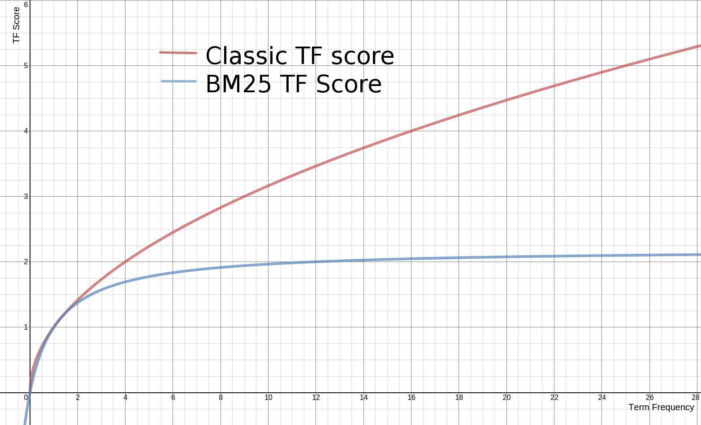
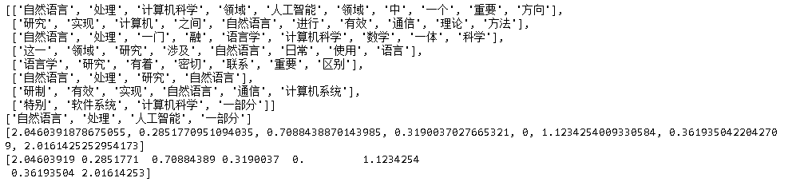

在信息索引和搜索引擎领域中， BM25是广泛运用的技术之一 。它是由科学家 S • 罗伯森（S. Robertson）和 K • 琼斯（K. Jones）在20世纪70~80年代提出，BM 是 Best Matching (最佳匹配) 的缩写，20 世纪 80~90 年代伦敦城市大学建立了 Okapi 信息检索系统，第一次真正实现了这种技术，所以又称之为[Okapi BM25](https://en.wikipedia.org/wiki/Okapi_BM25)。而且，BM25 还有几个变体，其较新的变体是 BM25F，其他变体包括 BM15 和 BM25+。本文将重点介绍Okapi BM25。

Okapi BM25 是采用一个基于词袋（BOW）的模型，根据用户输入检索相关文档的文档排名和检索函数。BM25 仅仅考虑词频，它不考虑多个搜索词在文档里是不是靠近，只考虑它们各自的出现次数。

### 公式

$$
\text{score}(D,Q) = \sum_{i=1}^n\text{IDF}(q_i)\cdot\left[\frac{f(q_i,D)\cdot\left(k_1+1\right)}{f(q_i,D) + k_1\cdot\left(1-b+b\cdot\frac{|D|}{\text{avgdl}}\right)}\right]
$$

其中各符号含义如下：

- $D$: 文档  

- $Q$: 搜索词 (多个)  

- $f(q_i,D)$: $q_i$ 这个词在文档 D 中的出现次数  

- $|D|$: 文档中的单词数  

- $avgdl$: 整个文档库中文档的平均长度  

- $k1, b$: 自由参数，一般取值范围是 $k1\in [1.2,2.0], b=0.75  $

- $IDF(q_i)$: inverse document frequency，通常由下述公式计算  
  $$
  \text{IDF}(q_i) = \log\left(\frac{N-n(q_i)+0.5}{n(q_i) + 0.5}\right)
  $$

  -  $N$ 是文档库里总的文档数。
  -  $n(q_i) $是包含单词 $q_i $的文档个数。一个单词的 IDF 大，意味着这个单词只在较少文档中出现，也就意味着这个单词比较独特。

  上面 IDF 的定义有个问题，那就是，如果一个词在超过半数的文档里出现，则其 IDF 是负数，于是这个词对 BM25 分数的贡献是负的。因此，所以当 IDF 为负数时，一般用0或者一个比较小的正数进行替换。

BM25可以看成是[TF-IDF](https://zh.wikipedia.org/zh-hans/Tf-idf)的优化，它主要进行了如下改进：

- 降低了高频词在向量中的过高的权重。

  

  上面图形的公式是：
  $$
  tf_score = \frac{f(q_i,D)\cdot\left(k_1+1\right)}{f(q_i,D) + k_1}
  $$
  显见，随着Term Freuency的增加，BM25很快进入饱和，其上限是$k_1+1$。

- 考虑文档长度，降低了长文档的得分。
  $$
  1-b+b\cdot\frac{|D|}{\text{avgdl}}
  $$

### 代码

- 手工实现Okapi BM25 

  ~~~python
  import math
  import jieba
  import urllib
  from gensim.corpora.dictionary import Dictionary
  from collections import Counter
  
  
  class BM25(object):
  
      def __init__(self, docs, k1=1.5, b=0.75, epsilon=0.25):
          self.docs = docs
          self.avgdl = sum([len(doc) for doc in docs]) / len(self.docs)            
          
          self.dict = Dictionary(self.docs) 
          self.corpora = [{id:cnt  for id, cnt in self.dict.doc2bow(doc)} for doc in self.docs]        
              
          self.k1 = k1
          self.b = b
          self.epsilon = epsilon
          
          self.idfs = {id:math.log(self.dict.num_docs - n + 0.5) - math.log(n + 0.5) for id, n in self.dict.dfs.items()}
          self.average_idf = sum(self.idfs.values())/len(self.idfs)
          # 文档矩阵（不过每篇文档中，采用dictionary来保存向量。）
          self.weights = [{id:self._bm25(id, corpus, k1, b) for id, f in corpus.items()}  for corpus in self.corpora]
  
      
      def _bm25(self, id, corpus, k1, b):
          if id not in corpus: return 0
          idf = self.idfs[id] 
          if idf <=0: idf = self.epsilon * self.average_idf
          corpus_len = sum(corpus.values())
          f = corpus[id]
          bm25 = idf*f*(self.k1 + 1)/(f + self.k1*(1-self.b+self.b*corpus_len/self.avgdl))
          return bm25
          
  
      def scores(self, query):
          '''计算文档库中每篇文档和query的相似程度打分。'''
          scores=[]
          query_corpus = self.dict.doc2bow(query)
          for corpus in self.corpora:
              score = 0
              for id, cnt in query_corpus:
                  if id not in corpus:
                      continue
                  bm25 = self._bm25(id, corpus, self.k1, self.b)*cnt
                  score += bm25
              scores.append(score)
          return scores
  
  
  def get_doc(sent, stop_words):
      return [word for word in jieba.cut(sent) if word not in stop_words]
  ~~~

- 测试，并和开源库[rank-bm25](https://pypi.org/project/rank-bm25/)进行比较。

  ~~~python
  # pip install rank_bm25
  
  from pprint import pprint
  from rank_bm25 import BM25Okapi
  
  # 下载停用词
  response = urllib.request.urlopen('https://raw.githubusercontent.com/goto456/stopwords/master/cn_stopwords.txt')
  stop_words = [str(word[:-1],'utf-8') for word in response.readlines()]
  
  sents =  ['自然语言处理是计算机科学领域与人工智能领域中的一个重要方向。',
       '它研究能实现人与计算机之间用自然语言进行有效通信的各种理论和方法。',
       '自然语言处理是一门融语言学、计算机科学、数学于一体的科学。',
       '因此，这一领域的研究将涉及自然语言，即人们日常使用的语言，',
       '所以它与语言学的研究有着密切的联系，但又有重要的区别。',
       '自然语言处理并不是一般地研究自然语言，',
       '而在于研制能有效地实现自然语言通信的计算机系统，',
       '特别是其中的软件系统。因而它是计算机科学的一部分。']
  query = "自然语言处理是人工智能的一部分"
  
  docs = [get_doc(sent, stop_words=stop_words) for sent in sents ]
  query_doc = get_doc(query, stop_words=stop_words)
  pprint(docs)
  pprint(query_doc)
  
  model = BM25(docs)
  print(model.scores(query_doc))
  
  bm25 = BM25Okapi(docs)
  doc_scores = bm25.get_scores(query_doc)
  print(doc_scores)
  ~~~

  

  可以看到两个BM25算法返回的结果完全相同。另外，第一个和最后一个句子取得了最高的匹配度，其中最后一个句子得分高的原因在于”一部分“这个词的匹配，和明显，这是有些不合理的，这也是基于词频（包括BM25）来打分算法的局限性。

## 参考

- [文档相似度分析](https://wiki.shileizcc.com/confluence/pages/viewpage.action?pageId=42533387)
- [Okapi BM25, TF-IDF, 以及 ElasticSearch/Lucene 搜索结果的分数](http://fjdu.github.io/coding/2017/03/16/bm25-elasticsearch-lucene.html) 
- [Practical BM25 - Part 2: The BM25 Algorithm and its Variables](https://www.elastic.co/cn/blog/practical-bm25-part-2-the-bm25-algorithm-and-its-variables): 介绍的非常仔细， 很好懂
- [[译]Practical BM25 - Part 3: 怎样选取 Elasticsearch 的 b 和 k1 参数](https://farer.org/2018/11/24/practical-bm25-part-3-considerations-for-picking-b-and-k1-in-elasticsearch/)

