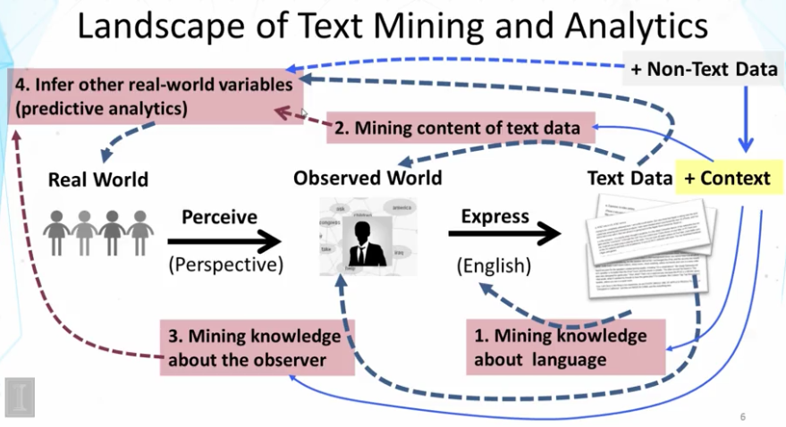
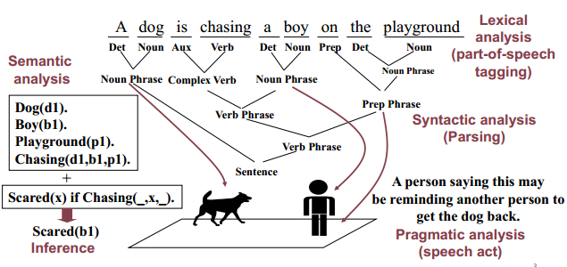
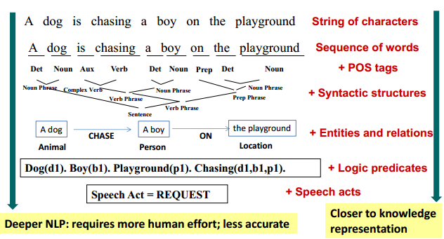

去年学习了翟成祥老师在Couseras的课程[Text Mining and Analytics](https://www.coursera.org/learn/text-mining/)，现在将其中的学习笔记整理成系列文章，并添加了一些自己的理解和代码，分享出来。

> 这个系列的文章，建议正在学习这门课的朋友来参阅。否则，可能会觉得思路混乱。

该课程的内容和目标是：

- 介绍了文本挖掘分析中许多基本概念和主要的算法

- 介绍了统计语言模型，特别是主题模型。主题模型可以用于发现和分析任意文本中的topic

- 实现了一些文本挖掘和分析算法。包括一些实验

本文是第一周的学习笔记，其主要内容是：

- 介绍了NLP的一些基本概念
- 介绍了表示文本的不同方法
- 介绍了两种word associations，并解释了如何从文本中挖掘paradigmatic 关系。

## 1.1 Overview Text Mining and Analytics

### 1.11 Text Mining和Text Analytics

**文本挖掘（Text Mining）**

Text Mining 几乎等同于 Text Analytics： 把文本数据转化成高质量的信息或可用的知识。

- 最小化人工（Minimizes human effort）
- 为决策支持提供更好的知识（Supplies knowledge for optimal decision making）

**文本检索（Text Retrieval）**

Text Retrieval是Text Mining系统的必要组件。

- Text Retrieval是Text Mining之前的预处理器。把大量文本数据转化成小量的相关文本数据。
- Text Retrieval is needed for knowledge provenance。当在文本中发现某种模式和知识，通常还需要用Text Retrieval来到原始文本中进行查找，以验证这个模式和知识是可靠的。

### 1.12 Text 

文本数据是人类产生的，人类通过文本来传递信息和理解世界，这也是人类文明的传承的最重要方式。

#### 文本的重要性（textual information）

- 文本（自然语言）是人类知识的最天然的编码方式。    
Text (natural language) is the most natural way of encoding human knowledge.
- 文本是是人们最普遍的信息沟通方式。    
Text is by far the most common type of information encountered by people.
- 文本是用来描述视频和图片的最佳表现形式。   
Text is the most expressive form of information in the sense that it can be used to describe other media such as video or images. 

由于文本语义的丰富性和不确定性，目前只有人类才可以很好的识别其中的含义。这如同，使用温度计来得到温度，使用GPS来获取位置信息。

### 1.13 Text Mining的问题

1. 人们通过互联网和书籍发布文本。这些文本代表了人们对世界的看法和认识。
2. 这些文本信息（包括，一些非文本信息）被传播到更到的人们。
3. **如何来从这些信息中获取知识——这就是Text Mining的主要问题和挑战。**

### 1.14 Text Mining的现状

通过对真实世界(Real World)的观察，每个人的大脑中都有一个自己的Observed World。通过文本，每个人来表达自己的Observed World。非文本信息为文本数据提供了上下文，非文本和文本的结合，能够更好的来推断真实世界。

1. 分析文本语法：发现其中的一些pattern
2. 理解文本含义
3. 分析观察者（人）
4. 推断/预测真实世界

### 1.15 Roadmap

在本课程中，是按照下图的路线进行展开的。

## 1.2  自然语言处理（Natural Language Processing）

### 1.21 基本概念

如上图所示，NLP可以分为几个层次：

- 词汇分析（lexical analysis）
- 语法分析（syntactic analysis）
- 语义分析（semantic analysis）

  - 实体关系抽取（entity/relation extraction）
- 词语消除歧义（word sense disambiguation）
- 情感分析（sentiment analysis）
- 语用分析（pragmatic analysis）： pragmatic analysis的目的是推断在文本上下文中含义，比如，文本之后带来的行为。和semantic analysis相比，pragmatic analysis能够进一步理解沟通的目的，是对自然语言更深的理解。

### 1.22 难度和挑战

为了有效的沟通，人们在表达时，往往：
- 假定受众已经知道，所以省略了许多常识（common sense）。
- 假定受众知道如何区分，所以有很多含糊的表达（ambiguities）。

这使得NLP中的每一步都很难。比如以下的任务：

- 词汇含糊（Word-level  Ambiguity）
    - POS标注（Part-of-Speech Tagging）： 比如，design可以是名词也可以是动词
    - 含义：root有很多的含义
- 语法含糊（Syntactic Ambiguity）
    - natural language processing
        - 自然语言处理
        - 语言处理是自然的
    - a man saw a boy with a telescope
        - 介词短语归属（PP(prepositional phrase) attachment）
- 人称代词消解(anaphora resolution)
    - John persuaded Bill to buy a TV for himself(himself = John or Bill?)
- 臆测(Presupposition)
    - "He has quit smoking" : 隐含他以前是抽烟的。

> 对于省略的常识和含糊的表达，进一步可以看到：
>
> - 人类情感的复杂。比如，李白的诗给人气势磅礴的画面感，但又渗透着孤独和骄傲。还有，一个成年人去做小学生的语文阅读理解，往往会发现不少题目也会错。虽然每个字都认识，但放在一起往往就抓不住重点。对于人类来说，也需要大量训练才能掌握对复杂情感的理解能力。
> - 语言的多层结构。比如，数学也可以看成是一门语言， 一个小学生，如果去看大学高等数学的公式，完全就是天书。这是因为高等数学的很多概念是建立在初等数学之上的，如果没有掌握初等数学，理解高等数学是很难的。也就是说，语言是分层次的，知识是分层次的。

### 1.23 当前的水平（state of art ）

- 词汇分析（lexical analysis）: POS Tagging：97%， 无法做到100%

- 语法分析（syntactic analysis）: Parsing：90%， 无法做到General complete parsing

- 语义分析（semantic analysis）。可以分为以下的一些任务。
  - 实体关系抽取（entity/relation extraction）
  - 词语消除歧义（word sense disambiguation）
  - 情感分析（sentiment analysis）
  - Inference： 只能在特定领域来做
  - Speech act analysis： 用户的行为。只能在特定领域来做

总体上，我们的现状是：  
- NLP是Text Mining的基础
- 目前的技术还远远不能理解自然语言
  - Deep NLP需要常识和推理，目前还不够precise和robust，目前只能在特定领域做到，需要人工的帮助。
  - Shallow NLP基于统计方法，有很好的通用性，被广泛的应用。
- 实际中，NLP作为基础，人工的作用非常重要。下面金字塔中，越往下越难，是NLP的挑战。

*“Easy” vs. “difficult” NLP applications.*

## 1.3. 文本表示（Text Representation）

### 1.31 文本表示的层次

从上往下，NLP由浅入深。

### 1.32 本课程的重点

总体上，我们认为：

- 存在多种文本表示的方式
  - 字符串，词汇，语法结构，实体-关系图（entity-relation graph)，预测模型
  - 这些文本方式可以混合起来使用

- 本课程的重点是word-based representation，它的优点是：
  - 通用而且健壮（General and robust）
  - 几乎不需要人工（No/little manual effort）
  - 其实已经很强大了，“Surprisingly” powerful for many applications (not all!)
  - 可以和其他更复杂的文本表示来合并使用（ Can be combined with more sophisticated representations ）

## 1.4 词汇联想(Word Association) Mining & Analysis

### 1.41 基本词汇关系（basic word relation）

- Paradigmatic （聚合关系）：A和B可以互相被替换B，意味A和B属于相同类别。比如：cat和dog，Monday和Wednesday，晴天和阴天，张三和李四。
- Syntagmatic （组合关系）：A和B合并在一起使用，意味着A和B有语义关联。比如：cat和bite， car和drive。

### 1.42 How to mine word associations 

- Paradigmatic: 相似的上下文（similar context ）

  - 用上下文来表示词汇（Represent each word by its context）
  - 计算上下文的相似度（Compute context similarity）
  - 上下文高度相似的词汇很可能paradigmatic （Words with high context similarity likely have paradigmatic relation）

  

- Syntagmatic: 关联出现（correlated occurrences ）

  - Count how many times two words occur together in a context (e.g., sentence or paragraph)
  - Compare their co-occurrences with their individual occurrences
  - Words with high co-occurrences but relatively low individual occurrences
    likely have syntagmatic relation 
  

这两种关系的联系是：Paradigmatic词汇的syntagmatic词汇往往相同（Paradigmatically related words tend to have syntagmatic relation with the same word ）

### 1.43 Paradigmatic Relation Discovery

Paradigmatic 关系的词语context非常相似， 如何把context表示出来呢？

#### Word Context as "Pseudo Document"

思路很简单， 把词语的context也看成是一篇`伪`（`Pseudo`）文档。

上图中有三个context. 

- Left1: 左边第一个词语列表
- Right1：右边第一个词语列表
- WIndow8: 周围长度为8的window包含的词语列表

既然有Left1, Right1, 当然可以获得Left2, Left3,  Right2, Right3等等.

#### 计算相似度

High $Sim(word1, word2) $  说明words1 and word2是Paradigmatic 关系. 

#### Bag of Words 

通过统计BOW, 可以把文档表示成了向量, 这就是向量空间模型Vector Space Model(VSM). 

#### VSM for Paradigmatic Relation Mining

如何使用VSM来进行Paradigmatic Relation Mining呢? 首先我们有两个问题. 

- 如何计算向量

  直接统计单词的频次是得到向量的最简单的方式. 

- 如何计算$Sim(d1, d2)$

回答这两个问题有很多方法, 下面来看最简单的一种. 

#### Expected Overlap of Words in Context(EOWC)

- 向量 =  每个词语在文档中出现的概率

- $Sim(d1, d2)$  =  $d1, d2$的内积. 

> 上面公式中$x_i$指的就是TF（Term Frequency）。它是指一个文档中出现某个单词（Term）的频率（Frequency）。所用的是频率而不是次数的原因是为了防止文档内容过长从而导致某些单词出现过多。

#### EOWC主要的缺点

- 向量中高频词语占据了过大的权重, 计算结果主要依赖于这些词, 这使得计算结果不够稳定. 

  比如: 两篇文档中都是关于硬盘的, 是高度相似的, 第一篇中,硬盘是高频词, 第二篇中, HD是高频词. 如果使用EOWC, 这两篇的相似度并不会很高.

- 向量中每个词语都是等同对待的.

  比如: `the`是频繁出现的, 但它几乎没啥意义. 

克服这两个缺点的主要思路是:

- 更新TF（Term Frequency）: 加入[次线性]([https://baike.baidu.com/item/%E6%AC%A1%E7%BA%BF%E6%80%A7%E5%87%BD%E6%95%B0/18996619](https://baike.baidu.com/item/次线性函数/18996619))的变换

- 引入IDF（Inverse Document Frequency）: 增加低频词语的权重, 减少高频词权重
  $$
  {IDF({w_i})} =\log {\frac {M}{1+k}}
  $$
  其中

  - $M$：表示文档的总数
  - $k$ ：包含词语$w_i$的文档数量。如果词语不在任何文档中，就导致分子为零，因此一般情况下使用分母加了一个1。

#### TF变换之一: log函数

$$ y= \log {(1+x)}$$

#### TF变换之二: BM25

$$ y= \frac {(k+1)x} {x+k}$$

以上两种变换的目的是, 降低高频词的值， 尤其BM25，当词语的频次增加后,  TF的值逐渐达到饱和。 BM25的极限值是$k+1$. 这样无疑降低了高频词在向量中的权重.  通俗来说, 频次越高, TF会越大, 但就大那么一点点。

BM25的相关详细描述和代码，参见[Okapi BM25 ](https://eipi10.cn/nlp/2020/06/08/bm25/)。

#### IDF权重: 惩罚高频词

词语越常见, IDF值越小. 极端情况下, 如果这个词在所有文档中都有, IDF值接近为0. 

#### Paradigmatic关系挖掘

$Sim(d1,d2) = \sum_{i=1}^N IDF(w_i) x_i y_j$

一个词的上下文文档相似度越高, 说明它越有可能是Paradigmatic关系.

#### Syntagmatic关系挖掘

词汇$w$ 的上下文是$d1$, 经过加权后得到$IDF-weighted\ d1$, 在向量中, 值越大, 说明该词和$w$越有可能是Syntagmatic关系. 
