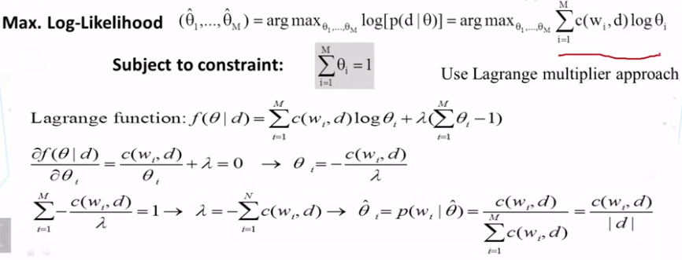

第二周的主要内容如下：

- 介绍了如何来发现Syntagmatic关系。主要使用信息熵来进行处理。 
- 介绍了文本主题挖掘的计算过程，特别是输入和输出
- 解释了使用一个term来表示主题
- 解释了只使用一个term来表示主题的一些限制，并提出了一个主题可以用一组word的概率分布来表示。
- 介绍了统计语言模型中的一些基本概念：“language model”, “unigram language model”, “likelihood”, Maximum Likelihood estimate.
- 解释了如何使用模型（ unigram language model）从一个文本中来挖掘一个主题。

## 2.1 组合关系的发现：熵(Syntagmatic Relation Discovery: Entropy)

### 2.21 定义

熵 (entropy) 这一词最初来源于热力学。1948年，香农将热力学中的熵引入信息论，所以也被称为香农熵 (Shannon entropy)，信息熵 (information entropy)。
$$
H(X) =  - \sum_{i=1}^n {p({x_i})} \log (p({x_i}))~~~~(i = 1,2, \ldots ,n)
$$
其中$X$ 表示的是随机变量，随机变量的取值为 ${x_1},{x_2}, \ldots ,{x_n}$，$p({x_i}) $表示事件发生的概率，且有$\sum {p({x_i})}  = 1$ 。熵可以理解为信息的不确定程度，是随机变量不确定性的度量.  熵越大，随机变量不确定性越大，系统越混乱（无序）。详细的内容参见：[信息熵](https://eipi10.cn/mathematics/2020/06/16/entropy/)。

### 2.22 使用

要计算eats的Syntagmatic 相关词，假设有三选项。

- meat：适度出现
- the：频繁出现
- unicorn：非常稀少

根据信息熵的公式，很明显，meat的熵最大，或许它或许是最好的答案。

## 2.2 Syntagmatic Relation Discovery: Conditional Entropy

在2.1中，进行了没有任何先决条件的预测。如果知道一些内容，这个预测又将如何进行呢？

下图中，已知句子中`eats`个词汇，如何判断`meat`是否也会出现在句子中呢？条件熵可以帮助我们来做这个判断。

### 2.21定义

若$(X,Y)\sim p(x,y)$，条件熵定义为：
$$
\begin{array}{l}
H(Y|X) &= \sum_{x \in X} {p(x)H(Y|X = x)} \\ 
       &=  - \sum_{x \in X} {p(x)} \sum_{y \in Y} {p(y|x)\log p(y|x)} \\ 
       &=  - \sum_{x \in X} {\sum_{y \in Y} {p(x,y)\log p(y|x)} }  \end{array}
$$
其物理意义：$X$给定条件下, $Y$ 的条件概率分布的熵对 X 的数学期望。而且

$$
H(Y|X) <= H(Y)
$$
其含义是， 当在一个系统中，知道了$X$的信息，则整个系统的熵是变小的。

### 2.22 使用

条件熵可以用来发现Syntagmatic关系。 具体算法如下。 

For each word $W_1$
- 对除$W_1$以外的每一个word，计算conditional entropy $H(X_{W_1}|X_{W})$

- 对 $H(X_{W_1}|X_{W})$从小到大排序

- 取Top n个Word，它们更有可能和$W_1$有 Syntagmatic关系。

  $H(X_{W_1}|X_{W})$越小，说明$W$已经提供了很多关于$W_1$的相关信息，则$W_1$和$W$更加可能有 Syntagmatic关系。

- Need to use a threshold for each W1

  可能对于每个$W_1$，需要选取不同top n或者条件熵值。

下面有个问题，可以思考一下：

- $H(X_{W_1}|X_{W_2}) ,  H(X_{W_1}|X_{W_3}) $可以用来比较$W_2$, $W_3$哪一个词更有可能和$W_1$有syntagmatic关系，但为何说使用$ H(X_{W_2}|X_{W_1}) , H(X_{W_3}|X_{W_1}) $不可以呢？

  简而言之，这是因为$H(X_{W_1}|X_{W_2}) ,  H(X_{W_1}|X_{W_3}) $都小于等于$H(X_{W_1})$,  它们的上界相同。而$ H(X_{W_2}|X_{W_1}) , H(X_{W_3}|X_{W_1}) $上界完全不同。 

## 2.3 Syntagmatic Relation Discovery: Mutual Information

### 2.31 定义

互信息: $I(X; Y)= H(X) – H(X|Y) = H(Y)-H(Y|X)$

实际上，采用互信息来判断，和采用条件熵来判断，原理相同，只是互信息前面加了一个固定的常量$ H(X)$。

### 2.32 使用

从上面分析可以看出，互信息越大，表示单词之间越有可能是Syntagmatic关系。

#### 平滑处理

对于没有出现的Word，设置其概率为一个很小的值，这样能够使得数据更加的平滑。

### 2.33 Summary of Syntagmatic Relation Discovery

- Syntagmatic 关系可以通过词的同时出现的相关性来衡量
- 信息熵可以用来衡量Syntagmatic 关系
  - Entropy H(X): measures the uncertainty of a random variable X
  - Conditional entropy H(X|Y): entropy of X given we know Y
  - Mutual information I(X;Y): entropy reduction of X (or Y) due to knowing Y (or X)

- Mutual information 提供了一种有效的方式来发现Syntagmatic 关系

### 2.34 Summary of Word Association Mining

- 两种基本的关联：
  - paradigmatic ： 聚合关系
  - syntagmatic ： 组合关系

- 纯统计的方法可以发现上诉两种关联

  - 可以处理任何文本
  - 多种方式定义上下文(context) 

- 发现的关联关系可以用于很多应用

## 2.4 Topic Mining and Analysis: Motivation and Task Definition

### 2.41 主题Topic

Topic  $\approx $ 文本中谈论的主要论点。它可以有不同的粒度：句子的topic， 文章的topic等等。 它的应用非常广泛。

- 微博用户今天在谈论什么
- 机器学习现在热门的研究主题是什么？和三年前有何不同？
- 人们喜欢华为P30哪些特性？
- 过去一年，中美贸易战中双方争论的主要焦点是什么？

### 2.42 Topic发现流程

topic发现过程中，往往会加入一些非文本的信息。

每一篇文档可以属于多个topic。

数学表达如下：

- Input
  - A collection of $N$ text documents $ C=\{d_1, …, d_N\} $
  - Number of topics: $k$

- Output

  - k topics: $  \{  \theta_1, …,  \theta_k \}  $

  - Coverage of topics in each $d_i: \{ \pi_{i1}, …, \pi_{ik} \}$

  - $\pi_{ij} = prob.\ of\ d_i$ covering topic $\theta_{j}$

    $\sum_{j=1}^k \pi_{ij}= 1$

## 2.5 Topic Mining and Analysis: Term as Topic

主题分析，首要的问题是获得主题，而最简单或许方式是把Term当成主题。

主要处理过程如下：

- 把文本拆分成word, 每个word作为候选的term
- 设计一个函数来比较哪些term适合作为topic
  - 有代表性的词汇（高频词）
  - 去除stop words（the，a）
  - TF-IDF来平衡权重
  - 根据业务知识来设定（e.g., favor title words, hashtags in tweets）

- 选择分数最高的k个term来作为topic

  - 如果多个term是相似含义，选择其中一个，而忽略其他。 

看一个例子:

上面例子中，列出了三个问题。这些也是基于term为topic比较难处理的地方。

1. 需要统计相关的word。例子中，里面有NBA球队：骑士队（Cavaliers），金州勇士队（Golden State Warriors），NBA季后赛决赛，篮球等词语，很明显这是运动相关的。但如何把这些词找出来呢？
2. Star有双重含义，即可以指恒星，而也可以指球星，歌星等。
3. 挖掘复杂主题。很多文章有多重主题，比如：一个科普文章里面介绍哪些运动有助于健康，一个旅游文章中谈到极光的这种科学原理。

### 2.51 Term as Topic的问题

- 缺乏足够的表达能力
  - 仅能够表达简单主题
  - 不能表达复杂主题
- 词汇覆盖不完整
  - 不能覆盖一些词汇的变形或者关联词汇： 英文中，很多词汇有变形，中文中有很多近义词，同义词
- 词汇的多义： 不同领域，不同上下文中，同一词汇的意义不同。
  - basketball star vs. star in the sky

## 2.6 Topic Mining and Analysis: Probabilistic Topic Models

对于使用term as topic的一些问题，采用Probabilistic Topic Model 可以解决。

### 2.61 Improved Idea: Topic = Word Distribution

一个topic表现为一些词汇的概率分布。数学表达如下：

- Input
  - A collection of $N$ text documents $ C=\{d_1, …, d_N\} $
  - Vocabulary set: $V=\{w_1, …, w_M \}$
  - Number of topics: $k$

  > 两个输入：
  >
  > 1. Term-Document矩阵
  > 2. 主题数量
  
- Output

  - k topics: $  \{  \theta_1, …,  \theta_k \}  $      

    $\theta_i$是一个$M$维的向量。

  - Coverage of topics in each $d_i: \{ \pi_{i1}, …, \pi_{ik} \}$

    $\sum_{w \in V} p(w|\theta_i)=1$

  - $\pi_{ij} = prob.\ of\ d_i$ covering topic $\theta_{j}$

    $\sum_{j=1}^k \pi_{ij}= 1$
  
  > 两个输出：
  >
  > 1. Document-Topic矩阵。对于文档$i$，对应的概率分布是：$ \{ \pi_{i1}, …, \pi_{ik} \}$
  > 2. Term-Topic矩阵：这是一个隐含输出，每一个Topic中Term的概率分布。

计算过程如下：

### 2.62 Generative Model for Text Mining

根据上面的模型，可以建立一个生成模型（问题是如何建，课程没有交代，可能要看后续的课程）

上面的参数个数是

$$
k*M  + k*N
$$
其中加号前面是Document-Topic矩阵的参数，加号后面是Term-Topic矩阵的参数。

## 2.7 Overview of Statistical Language Models

### 2.71 什么是统计语言模型 - Statistical Language Model (SLM)?

- 统计语言模型是一个word序列的概率分布
  - p(“Today is Wednesday”) $\approx$ 0.001
  - p(“Today Wednesday is”)  $\approx$ 0.0000000000001 ： 这个句子是一个语法错误，所以概率非常低。
  - p(“The eigenvalue is positive”)  $\approx$ 0.00001

- 上下文依赖： 上面说的这种概率分布是上下文依赖的，这体现在：

  - 不同的word序列在统一上下文中的概率不同
  - 相同word序列在不同上下文中的概率也不同。

  感觉文本挖掘中，语料差异非常大。比如： 聊天和书面文章的差异就非常大。

### 2.72 最简单的语言模型: Unigram LM

为了简化模型，假设所有word都是独立的, 即：$p(w_1 w_2 ... w_n)=p(w_1)p(w_2)…p(w_n)$。然后根据word的分布来生成Text。

### 2.73 Text Generation with Unigram LM

- Sampling: 根据每个topic的word分布来产生sample文本。

- Estimation: 

  

### 2.74 Maximum Likelihood vs. Bayesian

常用来估计$\theta $ 的方法有：

- Maximum likelihood estimation 最大似然估计

  $$
  \hat{\theta} = \arg \max_{\theta} P(X|\theta)
  $$
  如果样本数太少，这个估计的偏差将会非常大。

   in the case of text data, let's say, all observed 100 words did not contain another word related to text mining.  Now, our maximum likelihood estimator will give that word a zero probability.

- Bayesian estimation 贝叶斯估计:  最大后验概率估计 Maximum a Posteriori (MAP) estimate
  $$
  \hat{\theta} = \arg \max_{\theta} P(\theta|X) =  \arg \max_{\theta} P(X|\theta)P(\theta)
  $$
  在统计$P(X|\theta)$的时候考虑了$P(\theta)$的发生的概率（先验概率），这样结合起来就相当于计算$P(\theta|X) $。
  $$
  P(\theta|X) = \frac {P(X|\theta)P(\theta)} {P(X)} \\
  
  p(\theta|X) \propto P(X|\theta)P(\theta)
  $$
  

  贝叶斯估计比最大似然估计更加好，当认为$P( \theta) $是一个常量时，贝叶斯分布退化到最大似然分布。

### 2.75 **图解**Bayesian Estimation

最大后验概率估计是先验概率和最大似然估计综合起来的估计。

> 下面这个图的解释，留待以后再丰富。

## 2.8 Probabilistic Topic Models: Mining One Topic

本小节描述一篇文档针对一个topic如何挖掘。假设某一篇文档完全属于一个topic。

数学表达如下：

- V表示所有的word构成的集合。$ V=\{w_1 ,…, w_M\}$
- 文档d可以表示为： $d= [x_1, x_2, … ,x_{|d|}] , \ x_i \in V$
- Unigram LM： 下面$\theta$表示一个topic
  - $\theta  = \{\theta_1, ..., \theta_M \} $  
  - $\theta_i = p(w_i|\theta)$
  - $\theta_1+…+\theta_M=1$

- 似然函数：

  

- 最大似然估计：

  

- log最大似然估计：

  

  采用拉格朗日函数求极值后，可以发现，对于${\theta}_i $的估计值就是对于词频的统计概率。 这符合我们一般的使用和假设。

### 2.81 一个问题

由于公共words在所有文档中出现的频次都很高，所以在最大似然估计中，将会取得很高的概率值，这使得所有的文档看上去都差不多而趋同。如何去掉这些词呢。  

