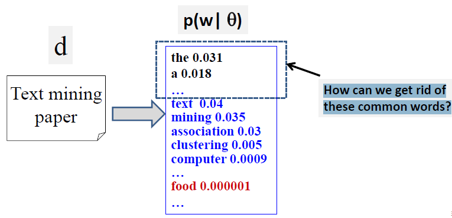
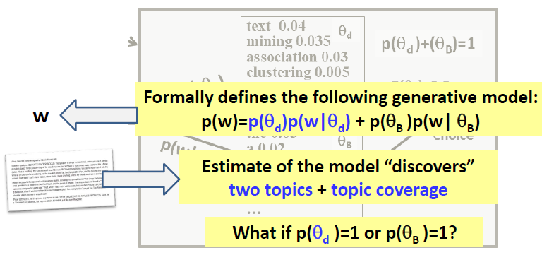

第三周的主要内容如下：

- 解释了混合unigram模型，并介绍了使用混合background language的方法来抽取公共words。
- 解释了概率隐语义分析（PLSA： Probabilistic Latent Semantic Analysis），并介绍了如何使用该方法来进行主题挖掘。
- 介绍了生成模型（ generative model ）来进行文本挖掘的基本思想
- 解释了如何从混合模型（比如：PLSA）来计算一个word出现的概率
- 介绍了EM算法的基本思路和如何工作的。
- 介绍了LDA（Latent Dirichlet Allocation）和PLSA的区别。

## 3.1 Mixture of Unigram LMs

上一周提出了一个问题：如何抽取公共words。 采用混合的Unigram模型可以解决这个问题。

可以采用混合unigram模型来解决这个问题。构建两个主题：

- 正常主题: $\theta_d$
- background topic: $\theta_B$

计算word出现概率。

$
\begin{align*}  
P(the) &=p(\theta_d)p(the|\theta_d) _+ p(\theta_B)p(the|\theta_B) \\ 
&= 0.5*0.000001+ 0.5*0.03 \\
&=0.0015005
\end{align*}
$

$
\begin{align*}  
P(text) &=p(\theta_d)p(text|\theta_d) _+ p(\theta_B)p(text|\theta_B) \\ 
&= 0.5*0.04+ 0.5*0.000006 \\
&= 0.002003
\end{align*}
$

As a Generative Model： 应该就是EM的工作流程

上面最后的问题的答案是：假设$p(\theta_d)=1$，$ p(w|\hat{\theta}_d) = \frac {c(w, d)} {|d|}$，参考week2最后一小节。

混合模型的数学表达如下：

- Data ： Document  D
- Mixture Model: parameters  $\Lambda=(\{p(w|\theta_d )\}, \{p(w|\theta_B )\}, p(\theta_B), p(\theta_d ))$
  - Two unigram LMs: $\theta_d$ (the topic of d); $\theta_B$ (background topic)
  - Mixing weight(topic choice):  $p(\theta_d )+p(\theta_B)=1$

- 似然函数：

  

- 最大似然估计：

  

## 3.2 混合模型的参数估计（Mixture Model Estimation）

先看最简单的情况，一个文档只包含两个word： text和the. 而且已知background主题中这两个word的分布。

根据数学常识，为了达到平衡，$p(text|\theta_d)$将会取得很高的值。

增加一点复杂性，如果考虑到词频,  $p(w|\theta_d )$将会有如何变化呢？比如，下图中the出现的频次就非常高。

在上图的情况下，优化的方案是下面哪个方向？ 

- $p(“the”|\theta_d) > 0.1$
- $p(“the”|\theta_d) < 0.1$

答案：第一个方向，也就是说随着the的频次的增加，$p(“the”|\theta_d)$会越来越大。

如果$p(\theta_B)$增加, 将会发生什么?

答案： $\theta_d$对文档的影响将会减少。$p(w|\theta_d )$的优化方向将不会变化，只是变化的幅度会很小，这是因为公式的后边部分已经足够大了。

**总结**

- 混合模型的通用规律
  - 每个子模型都倾向于把high probabilities分配给highly frequent words。这样会“collaboratively maximize likelihood”
  - 不同子模型都倾向于平衡不同word的高概率。一个子模型中某个word的概率很高，其他子模型中该word的概率就会降低，这样会avoid “competition” or “waste of probability”
  - 每个子模型的先验概率将会平衡collaboration/competition
    - 子模型的先验概率越大，其high probabilities分配给highly frequent words就越明显，否则相反。

## 3.3 Probabilistic Topic Models: Expectation-Maximization (EM) Algorithm

之前在看第三周的内容时，有的时候不知道翟老师想说什么，感觉绕来绕去，后来看 视频列表中有EM的内容，结合以前对EM算法的了解，突然明白了翟老师的思路了。总体上，他希望能深入浅出的把topic挖掘的来龙去脉交代清除，所以前面可能感觉有些过于简单，让人怀疑为啥要怎么做。到这一章，才真正进入正途了。

### Estimation of One Topic: $P(w| \theta_d)$

首先回到我们的问题。

### Expectation-Maximization (EM) Algorithm

详细的EM算法，这里就不赘述了。详见：

- EM算法通俗实例](https://blog.csdn.net/justry24/article/details/78043307)：非常通俗易懂。
- [（EM算法）The EM Algorithm](http://www.cnblogs.com/jerrylead/archive/2011/04/06/2006936.html): 这篇文章中数学推导非常严谨。EM算法的确巧夺天工。
- [EM算法原理及其应用](https://vividfree.github.io/docs/2016-08-19-introduction-about-EM-algorithm-doc1.pdf): PPT格式，非常清晰。
-  [Jensen不等式初步理解及证明](https://zhuanlan.zhihu.com/p/39315786): EM算法基于Jensen不等式，有必要了解其证明过程。

### EM原理

EM是一个Hill-Climbing 过程，收敛于Local Maximum。每一次迭代的过程中，建立似然函数下界（E步），然后优化似然函数下界（M步）。

## 3.4 Probabilistic Latent Semantic Analysis (PLSA)

参考：

- [[NLP] 主题模型 PLSA 算法](https://alphafan.github.io/posts/plsa_em.html)

PLSA 算法，就是基于一个文章可能具有多种主题的这种情况，进行的建模。通过该算法，我们的最终目标是要得到两个东西。

- 对于文档库中的任意一个文章，我想要知道这个文章各个主题的占比是多少。
- 一个文章中的特定单词，它是属于某个主题的概率是多少。

第一个目标好理解，即是说，通过计算，我们要知道文章《从 NBA 球场看中国经济的发展》中，体育占比 0.35，经济占比 0.5，无主题的 Background Words 占比 0.15。

那么第二个目标什么意思呢？举个例子，假如在一大段文字中，你看到了单词“比赛”，现在你要猜测 “比赛” 这个单词是出现在关于主题 “体育” 中的一段话中呢？还是出现在属于关于 “娱乐” 的一段话中呢？

生活经验告诉你，“比赛” 这个单词出现在 “体育” 主题的文字中的概率，比出现在 “娱乐” 主题文字的概率，要大一些。那如果我们用数字来描述它的话，可能它出现在体育的概率是 0.7，出现在娱乐中的概率是 0.2，出现在无主题文字中的概率是 0.1。

下图是一篇关于飓风 Katrina 的博文。红色部分的主题是政府的举措，紫色部分的主题是现场时事的报道，绿色部分说的是捐款和赈灾的情况。而黑色的部分是无任何主题的，我们称之为 Background words。通过不同颜色文字占的比例，我们可以一眼看出文章主题的分布是如何的。

### 整体思路

## Generate Text with PLSA

在正式的求解之前，我们来开一个脑洞，反向的来思考一个问题。现在我们不再是已知文章求主题，而是已知一个文章是由音乐，体育，政治和无主题组成，并且知道每个主题的占比，以及在每个单词在该主题中出现的概率是多少，通过这些值，我们的目标是生成一个文章。

这看上去有点不可理喻，仅仅凭一些主题的占比，以及单词出现的概率分布，就想生成文章？好像觉得是不可理喻的。但是，现实生活中，我们确确实实是有这样的例子的。我们可以想象一个作家在写文章之前，他其实心里是预设好了我要写哪些主题的东西的。然后每个主题涉及到的词，一般来说，如果不是刻意去回避的话，都会按照概率的大小去使用到。这样想想，这种脑洞好像也并不是完全无稽之谈。

估计着定义一些单词和出现在主题里的概率分布。

- 无主题的文字占比为 0.2。
- 有主题的文字一共由三个主题组成：音乐 50% ，体育 30% ，政治 20%。
- 下面是我们词库里的单词，三个单词属于各个主题的概率见下表

有了这些信息之后，我们开看看这个“作家”会如何根据主题和概率的分布来写文章吧。我们来推测一下，我们的这位作家，他会写哪一个单词呢？这就需要我们得到每个单词被他写的概率。

上面的公式是由贝叶斯公式计算得来的，我们知道当前的概率分布后，得到作家写第一个词是 Rock 的概率是 0.324，同理，我们可以得到第一个词是 Basketball 的概率为：0.266，第一个词是 Policy 的概率为：0.194。

上面过程的如下图所示。

### PLSA EM求解过程

EM 算法的精髓在我看来其实是两个。

- 引入一个合适的 hidden vector 隐藏变量。
- 找到一个可自收敛的 E 过程 和 M 过程来将需要求解的参数。

数学表示如下：

- $\lambda_B$ ：background words的比例（已知的）。
- $p(w|\theta_B)$： background的words分布。

#### E Steps

#### M Steps

总结起来：

### EM的矩阵推导过程

整个EM的求解过程，可以用下面这个图来表示。尤其具体实现过程中，采用下面的矩阵操作，会更加简单。

- 初始
    1. 矩阵$DW$： word-document矩阵，document中word的分布，一般采用BOW（或者tfidf等）。
    2. $B$: 矩阵$\theta D$：topic-document矩阵，document在不同topic中概率分布。其中$\sum b =1$。比如：某篇文章有三个主题: 音乐 50% ，体育 30% ，政治 20%.
    3. $C$: 矩阵$\theta W$：topic-word矩阵，topic中word的概率分布。 其中$\sum d  =1 $。 
    
- E Steps

	4. 矩阵$\theta DW$：计算一篇document中word来源自不同topic的概率（相当于$p(z_{d, w}=j)$）。计算公式：
  $$
  e = \frac {b*c} {b \cdot {c^{T}}}  \\
   \sum e = 1
  $$

- M Steps

    5. 矩阵$\theta DW$：根据上面的概率（word来自不同topic的概率），把word在document的出现次数进行分配。计算公式：
    $$
    g = a * f
    $$

    6. 更新$B,C$。
    
       - SUM投影: 指把矩阵沿着某个轴，把数据进行SUM。这样三维矩阵就变成二维。
    
       - $G_{W\theta}$: 沿着$D$轴, 把矩阵SUM投影到$ W\theta$平面， 得到一个二维矩阵。
    
       - $G_{D\theta}$: 沿着$W$轴， 把矩阵SUM投影到$ D \theta$平面， 得到一个二维矩阵。
    
       - 更新：
       $$
       B_{new} = \frac {G_{D\theta}}  {sum(G_{D\theta}, axis=\theta )} \\
              
            C_{new} = \frac {G_{W\theta}}   {sum(W_{W\theta}, axis=W )}
       $$
       
       
       
       

 

