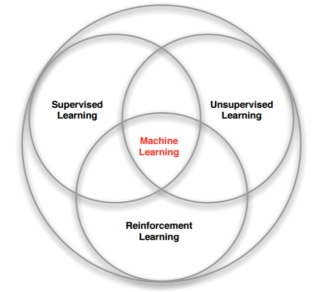
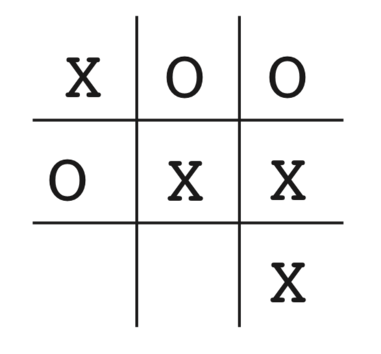

# Week 1

## 1.1 Learning Objectives

- Module 00: Welcome to the Course

  Understand the prerequisites, goals and roadmap for the course.

- Module 01: The K-Armed Bandit Problem
  - Lesson 1: The K-Armed Bandit Problem
    - Define reward
    - Understand the temporal nature of the bandit problem
    - Define k-armed bandit
    - Define action-values
  - Lesson 2: What to Learn? Estimating Action Values
    - Define action-value estimation methods
    - Define exploration and exploitation
    - Select actions greedily using an action-value function
    - Define online learning
    - Understand a simple online sample-average action-value estimation method
    - Define the general online update equation
    - Understand why we might use a constant stepsize in the case of non-stationarity
  - Lesson 3: Exploration vs. Exploitation Tradeoff
    - Define epsilon-greedy
    - Compare the short-term benefits of exploitation and the long-term benefits of
    - exploration
    - Understand optimistic initial values
    - Describe the benefits of optimistic initial values for early exploration
    - Explain the criticisms of optimistic initial values
    - Describe the upper confidence bound action selection method
    - Define optimism in the face of uncertainty

## 1.2 Introduction

强化学习（reinforcement learning）是和监督学习，非监督学习并列的第三种机器学习方法。它能够学习根据不同的状况来做action，并从中最大化所获收益（reward ）。和其它机器学习方法不同，强化学习更加强调从交互（interaction）中进行目标导向（goal-directed）的学习。

强化学习是一种学习如何将状态映射到动作，以获得最大奖励的学习机制。 学习者不会被告知要采取哪些动作，而是必须通过尝试来发现哪些动作会产生最大的回报。 在最有趣和最具挑战性的案例中，动作不仅可以影响直接奖励，还可以影响下一个状态，并通过下一个状态，影响到随后而来的奖励。 这两个特征 - 试错法和延迟奖励 - 是强化学习的两个最重要的可区别特征。

### 强化学习 vs. 监督学习（supervised learning）

强化学习没有监督学习已经准备好的训练数据输出值的，只有奖励值，但是这个奖励值和监督学习的输出值不一样，它不是事先给出的，而是延后给出的。

比如学习走路，如果摔倒了，那么我们大脑后面会给一个负面的奖励值，说明走的姿势不好。然后我们从摔倒状态中爬起来，如果后面正常走了一步，那么大脑会给一个正面的奖励值，我们会知道这是一个好的走路姿势。

### 强化学习 vs. 非监督学习（unsupervised learning）

非监督学习一般用于从没有标记的数据中发现隐藏的结构，它是没有输出值也没有奖励值的，它只有数据特征。同时和监督学习一样，数据之间也都是独立的，没有强化学习这样的前后依赖关系。

强化学习需要权衡探索（Exploration）与利用（Exploitation）之间的关系（即exploit－explore问题）。exploration是为了探索更好的action，而exploitation是从以往的经历中学习。为了获得大量奖励，强化学习个体必须倾向于过去已经尝试过并且能够有效获益的行动。 但是要发现这样的行为，它必须尝试以前没有选择过的行为。 个体必须充分Exploitation它既有经验以获得收益，但它也必须Exploration，以便在未来做出更好的动作选择。

和很多只考虑单个子系统的方法相比，强化学习的另一个关键特征是它明确吧目标导向的agent与不确定环境相互作用作为一个整体来考虑。强化学习具有一个完整的、交互式的、寻求目标（goal-seeking）的agent，这个agent有明确的目标，可以感知环境的各个方面，并可以选择影响其环境的动作。

最后，强化学习也在某种程度上符合人工智能回归简单的一般性原则的大趋势。 自20世纪60年代后期以来，许多人工智能研究人员认为普遍性的原则是不存在的，而智能则归因于拥有大量特殊用途的技巧，过程和启发式方法。 有人说，如果我们能够将相关的事实充分地提供给一台机器，比如一百万或十亿，那么它就会变得聪明起来。

> exploit－explore问题。exploit 就是：对用户比较确定的兴趣，当然要利用开采迎合，好比说已经挣到的钱，当然要花；explore 就是：光对着用户已知的兴趣使用，用户很快会腻，所以要不断探索用户新的兴趣才行，这就好比虽然有一点钱可以花了，但是还得继续搬砖挣钱，不然花完了就得喝西北风。

### 1.3 例子

理解强化学习的一个好方法是思考指导其发展的一些例子和可能的应用。

- 国际象棋大师落子。落子决定既通过规划 - 期待的回复和逆向回复 （anticipating possible replies and counterreplies），也出于对特定位置和移动及时直觉的判断。
- 自适应控制器实时调节炼油厂操作的参数。控制器在指定的边际成本的基础上优化产量/成本/质量交易，而不严格遵守工程师最初建议的设定。
- 一头瞪羚在出生后几分钟挣扎着站起来。半小时后，它能以每小时20英里的速度奔跑。
- 移动机器人决定是否应该进入新房间以寻找和收集更多垃圾来，或尝试回到充电站充电。 它根据电池的当前电池的充电水平，以及过去能够快速轻松地找到充电站的程度做出决定。
- 菲尔准备他的早餐。仔细检查，即使是这个看似平凡的行动，也会发现一个复杂的条件行为网和互锁的目标-子目标关系： 走到橱柜，打开它，选择一个麦片盒，然后伸手去拿，抓住并取回盒子。 拿到碗，勺子和牛奶盒也需要其他复杂的，调整的，交互的行为序列来完成。每个步骤都涉及一系列眼球运动，以获取信息并指导到达和移动。 它们需要对于如何拿住物品或者在拿其他物品之前将它们中的一些运送到餐桌上做出快速判断。 每个步骤都以目标为指导并为其他目标服务，例如抓起勺子或走到冰箱，比如一旦麦片准备好就拿勺子吃以最终获得营养。 无论他是否意识到这一点，菲尔都在获取有关他身体状况的信息，这些信息决定了他的营养需求，饥饿程度和食物偏好。

这些例子共同的特征非常基础，以至于很容易被忽略。 所有这些都涉及积极的决策个体与其环境之间的 *交互*，个体于存在不确定性的环境中寻求实现 *目标*。 个体的行为能影响未来的环境状态（例如，下一个国际象棋位置，炼油厂的水库水位，机器人的下一个位置以及其电池的未来充电水平），从而影响个体之后可以采取的动作和机会。 正确的选择需要考虑到动作的间接延迟后效应，因此可能需要预见或规划。

同时，在所有这些例子中，动作的效果都无法被完全预测；因此，个体必须经常监控其环境并做出适当的反应。 例如，菲尔必须观察他倒入麦片的碗中的牛奶以防止溢出。 所有这些例子都涉及明确的目标，即个体可以根据其直接感知的内容判断完成目标的进度。 国际象棋选手知道他是否获胜，炼油厂控制员知道生产了多少石油，瞪羚小牛知道它何时倒下，移动机器人知道它的电池何时耗尽，菲尔知道他是否正在享用他的早餐。

在所有这些例子中，个体可以使用其经验来改善其性能。 国际象棋选手改进了他用来评估位置的直觉，从而改善了他的发挥；瞪羚提高了它的活力；菲尔学会精简他的早餐。 个体在任务开始时所具有的知识 - 无论是之前的相关任务经验还是通过设计或演变带来的 - 都会影响有用或易于学习的内容， 但与环境的交互对于调整行为以利用任务的特性至关重要。

## 1.4 强化学习的要素

强化学习系统一般有四个要素：

- 策略（policy）

  定义了学习个体在给定时间内的行为方式。 简单来说，策略是从感知的环境状态到在这些状态下要采取的行动的映射。 

- 奖励信号（reward signal）

  定义了强化学习问题的目标。 在每个时间步骤，环境向强化学习个体发送的单个数字称为 *奖励*。 个体的唯一目标是最大化其长期收到的总奖励。

- 价值函数（value function）

  指定了长期收益。 粗略地说，一个状态的价值是个体从该状态开始在未来可以预期累积的收益总额。虽然奖励决定了环境状态的直接，内在的价值，但价值表明了在考虑了可能遵循的状态和这些状态下可获得的奖励之后各状态的 *长期* 价值。比如，一个状态可能总是会产生较低的即时奖励，但仍然具有较高的价值，因为其他状态经常会产生高回报。

- 环境模型（a model of the environment）：可选的，有些强化学习可能没有这部分。

  环境模型是对环境的模拟，或者更一般地说，它对环境的行为做出推断。 例如，给定状态和动作，模型可以预测结果的下一状态和下一个奖励。

## 1.5 局限性和范围

强化学习在很大程度上依赖于状态的概念 - 作为策略和价值函数的输入，以及模型的输入和输出。 非正式地，我们可以将状态视为向个体传达某种特定时间“环境如何”的信号。

本书中所考虑的大部分强化学习方法都是围绕估计价值函数构建的，但它对于解决强化学习问题而言并不是必须的。 例如，诸如遗传算法，遗传规划，模拟退火和其他优化方法的解决方法已被用于研究强化学习问题，而不必求助于价值函数。 这些方法应用多个静态策略，每个策略在较长时间内与单独的环境实例进行交互。 获得最多奖励的策略及其随机变化将延续到下一代策略，并重复该过程。 我们称这些方法为进化方法是因为它们的行为类似于生物进化方式，这种方式产生具有熟练行为的生物，即使它们在个体生命期间内不学习。 如果策略空间足够小，或者容易被构造，或者如果有大量的时间可用于搜索，那么进化方法可能是有效的。 此外，进化方法在学习个体不能感知环境的完整状态的问题上具有优势。

## 1.6 扩展例子：井字棋

为了说明强化学习的一般概念并将其与其他方法进行对比，我们接下来将详细地考虑一个简单的例子。

考虑熟悉的孩子玩的井字棋游戏。两名玩家轮流在一个三乘三的棋盘上比赛。 一个玩家画叉，另一个画圈，若叉或圈的连续三个棋子落于一行或一列或同一斜线上则获胜；若棋盘被填满了也不能决出胜负则为平局。

以下是使用价值函数的方法来解决井字棋问题的方法。

首先，我们将建立一个数字表，每个数字对应一个可能的游戏状态。 每个数字都是我们从该状态获胜概率的最新估计。 我们将此估计视为状态 *价值*，整个表是学习的价值函数。 如果我们从A获胜的概率的当前估计值高于从B开始的概率的估计值，我们就认为状态A的价值高于状态B的，或认为状态A比状态B“更好”。 假设我们总是画叉，那么对于所有三个叉处于一行的状态的获胜概率是1，因为我们已经赢了。 类似地，对于连续三个圈处于一行或棋盘全部填满的所有状态，获胜的概率为0，因为我们无法获胜。 我们将所有其他状态的初始值设置为0.5，表示我们有50％的获胜机会。

我们和对手进行了许多场比赛。 为了选择我们的动作，我们检查每个动作可能产生的状态（在棋盘上的每个空格中有一个），并在表格中查找它们当前的值。 大多数时候，我们 *贪婪地* 选择具有最大价值的动作，也就是说，有最高的获胜概率。然而，偶尔我们会从其他动作中随机选择。 这些被称为 *探索性* 动作，因为它们使我们体验到我们可能永远不会看到的状态。 在游戏中移动和考虑的一系列动作可以如图1.1所示。

*图1.1：一系列井字棋移动。黑色实线代表游戏中所采取的动作；虚线表示我们（我们的强化学习者）考虑但未做出的动作。 我们的第二步移动 e∗e∗ 是一次探索性的移动，这意味着 e∗e∗ 所表示的移动甚至优于当前移动。 探索性移动不会导致任何学习，但是我们的其他每个移动都会导致更新，如红色箭头弧线所示， 其估计价值自下而上移动到树的早期节点，如文中详述。*

在我们比赛期间，我们按游戏中的发现不断改变状态的值。 我们试图让他们更准确地估计获胜的可能性。 为此，在贪婪移动后，我们重写前一状态的值，如图1.1中的箭头所示。 更准确地说，前一状态的当前值被更新为更接近后续状态的值。 这可以通过将先前状态的值移动到稍后状态的值的一小部分来完成。 如果我们让 $S_t$ 表示贪婪移动之前的状态，而 $S_{t+1} $表示移动之后的状态， 那么将  $S_t$的估计值的更新表示为 $V(S_t)$，可以写为
$$
V(S_t) \leftarrow V(S_t)+\alpha[V(S_t+1)−V(S_t)]
$$
其中 $\alpha$是小正分数，称为 *步长*，它影响学习速度。 此更新规则是 *时序差分* 学习方法的一个例子，之所以称为时序差分， 是因为其变化基于两个连续时间的估计之间的差，即 $V(S_{t+1})−V(S_t)$。

上述方法在此任务上表现良好。例如，如果步长参数随着时间的推移而适当减小，那么对于任何固定的对手， 该方法会收敛于在给定玩家最佳游戏的情况下从每个状态获胜的真实概率。 此外，采取的动作（探索性动作除外）实际上是针对这个（不完美的）对手的最佳动作。 换句话说，该方法收敛于针对该对手玩游戏的最佳策略。 如果步长参数没有随着时间的推移一直减小到零，那么这个玩家也可以很好地对抗那些慢慢改变他们比赛方式的对手。

这个例子说明了进化方法和学习价值函数的方法之间的差异。 为了评估策略，进化方法保持策略固定并且针对对手进行多场游戏，或者使用对手的模型模拟多场游戏。 胜利的频率给出了对该策略获胜的概率的无偏估计，并且可用于指导下一个策略选择。 但是每次策略进化都需要多场游戏来计算概率，而且计算概率只关心最终结果，*每场游戏内* 的信息被忽略掉了。 例如，如果玩家获胜，那么游戏中的 *所有* 行为都会被认为是正确的，而不管具体移动可能对获胜至关重要。 甚至从未发生过的动作也会被认为是正确的！ 相反，值函数方法允许评估各个状态。 最后，进化和价值函数方法都在搜索策略空间，但价值函数学习会利用游戏过程中可用的信息。

这个简单的例子说明了强化学习方法的一些关键特征。 首先，强调在与环境交互时学习，在这里就是与对手玩家下棋。 其次，有一个明确的目标，考虑到选择的延迟效果，正确的行为需要计划或前瞻。 例如，简单的强化学习玩家将学习如何为短视的对手设置多个行动陷阱。 强化学习解决方案的一个显着特征是它可以在不使用对手模型的情况下实现规划和前瞻的效果， 并且无需对未来状态和动作的可能序列进行精确搜索。

虽然这个例子说明了强化学习的一些关键特征，但它很简单，它可能给人的印象是强化学习比实际上更受限。 虽然井字棋游戏是一个双人游戏，但强化学习也适用于没有外部对手的情况，即在“对自然的游戏”的情况下。 强化学习也不仅限于行为分解为单独步骤的问题，例如井字棋游戏，仅在每步结束时获得奖励。 当行为无限持续并且可以随时接收各种大小的奖励时，它也是适用的。 强化学习也适用于甚至不能分解为像井字棋游戏这样的离散时间步骤的问题。 一般原则也适用于连续时间问题，虽然理论变得更加复杂，我们在这份简介中将不会介绍。

井字棋游戏具有相对较小的有限状态集，而当状态集非常大或甚至无限时，也可以使用强化学习。 例如，Gerry Tesauro（1992,1995）将上述算法与人工神经网络相结合，学习玩西洋双子棋，其具有大约 10201020 个状态。 在这么多状态中，只能经历一小部分。Tesauro的规划学得比以前的任何规划都要好得多，最终比世界上最好的人类棋手更好（第16.1节）。 人工神经网络为程序提供了从其经验中泛化的能力，以便在新状态下，它能根据其网络确定的过去面临的类似状态保存下来的信息来选择移动。 强化学习系统在如此大型状态集的问题中如何运作，与它从过去的经验中泛化的程度密切相关。 正是在这种情况中，我们最需要有强化学习的监督学习方法。 人工神经网络和深度学习（第9.6节）并不是唯一或最好的方法。

在这个井字棋游戏的例子中，学习开始时没有超出游戏规则的先验知识，但强化学习绝不是需要学习和智能的白板（a tabula rasa view）。 相反，先验信息可以以各种方式结合到强化学习中，这对于有效学习是至关重要的（例如，参见第9.5，17.4和13.1节）。 我们也可以在井字棋游戏例子中访问真实状态，而强化学习也可以在隐藏部分状态时应用，或者当学习者看到不同状态相同时也可以应用强化学习。

最后，井字棋游戏玩家能够向前看并知道每个可能移动所产生的状态。 要做到这一点，它必须拥有一个游戏模型，使其能够预见其环境如何随着它可能永远不会发生的动作变化而变化。 许多问题都是这样的，但在其他问题上，甚至可能缺乏行动效果的短期模型。 这些情况下都可以应用强化学习。模型不是必须的，但如果模型可用或可以学习，则模型可以很轻松使用（第8章）。

另一方面，也有根本不需要任何环境模型的强化学习方法。 无模型系统甚至无法预测其环境如何响应单一操作而发生变化。 对于对手来说，如果井字棋游戏玩家没有任何类型的对手的模型，则他也是无模型的。 因为模型必须合理准确才有用，所以当解决问题的真正瓶颈是构建足够精确的环境模型时，无模型方法可以优于更复杂的方法。 无模型方法同时也是基于模型方法的重要组成模块。 在我们讨论如何将它们用作更复杂的基于模型方法的组件之前，我们在本书中将用几个章节专门介绍无模型方法。

强化学习可以在系统的高级和低级层次中使用。 虽然井字棋游戏玩家只学习游戏的基本动作，但没有什么可以阻止强化学习在更高层次上工作， 其中每个“动作”本身可能是一个复杂的问题解决方法的应用。 在分层学习系统中，强化学习可以在几个层面上同时工作。

- 练习1.1： *自我对弈* 假设上面描述的强化学习算法不是与随机对手对抗，而是双方都在学习。在这种情况下你认为会发生什么？是否会学习选择不同的行动策略？
- 练习1.2： *对称性* 由于对称性，许多井字位置看起来不同但实际上是相同的。我们如何修改上述学习过程以利用这一点？ 这种变化会以何种方式改善学习过程？现在再想一想。假设对手没有利用对称性，在这种情况下，我们应该利用吗？那么，对称等价位置是否必须具有相同的价值？
- 练习1.3： *贪婪地游戏* 假设强化学习玩家是 *贪婪的*，也就是说，它总是选择使其达到最佳奖励的位置。 它可能会比一个不贪婪的玩家学得更好或更差吗？可能会出现什么问题？
- 练习1.4： *从探索中学习* 假设在 *所有* 动作之后发生了学习更新，包括探索性动作。 如果步长参数随时间适当减小（但不是探索倾向），则状态值将收敛到不同的概率集。 从探索性动作中的学习，我们行动和不行动两组的计算的概率（概念上）是什么？ 假设我们继续做出探索性的动作，哪一组概率可能学习得更好？哪一个会赢得更多？
- 练习1.5： *其他改进* 你能想到其他改善强化学习者的方法吗？你能想出更好的方法来解决所提出的井字棋游戏问题吗？

## 1.7 小结

强化学习是一种理解和自动化目标导向学习和决策的计算方法。 它与其他计算方法的区别在于它强调个体通过与环境的直接交互来学习，而不需要示范监督或完整的环境模型。 我们认为，强化学习是第一个认真解决从与环境交互中学习以实现长期目标时出现的计算问题的领域。

强化学习使用马尔可夫决策过程（Markov Decision Process）的正式框架来定义学习个体与其环境之间在状态，行为和奖励方面的交互。 该框架旨在表示人工智能问题的基本特征。 这些特征包括因果性，不确定感和不确定性（a sense of uncertainty and nondeterminism），以及明确目标的存在。

价值和价值函数的概念是我们在本书中考虑的大多数强化学习方法的关键。 我们认为价值函数对于在策略空间中高效搜索非常重要。 价值函数的使用将强化学习方法与在整个策略评估指导下直接搜索策略空间的进化方法区分开来。

> 马尔科夫决策过程(Markov Decision Process, MDP)是时序决策(Sequential Decision Making, SDM)事实上的标准方法。时序决策里的许多工作，都可以看成是马尔科夫决策过程的实例。

## 1.8 强化学习早期历史

强化学习的早期历史有三个主线，这三条主线相互独立发展，而又互相融合促进。

- 通过试错试验来学习
- 使用值函数和动态规划的最优控制（optimal control）
- 时序差分方法（temporal-difference learning）

### 通过试错试验来学习

试验和错误学习的概念可以追溯到19世纪50年代， 亚历山大·贝恩（Alexander Bain）通过“摸索和实验”讨论学习， 更明确地和英国伦理学家和心理学家Conway Lloyd Morgan的1894年使用该术语来描述他对动物行为的观察进行讨论。 

我们构建了许多巧妙的机电机器以演示试错试验。最早的可能是由托马斯罗斯（Thomas Ross，1933）建造的机器， 它能够通过一个简单的迷宫找到它的路，并记住通过开关设置的路径。 1951年，W. Gray Walter建立了他的“机械乌龟”（Walter，1950）的一个版本，能够进行简单的学习。 1952年，Claude Shannon展示了一只名为Theseus的迷宫老鼠，它使用试错试验通过迷宫找到解决方式， 迷宫本身通过在其地板下的磁铁和继电器记住了成功方向（参见Shannon，1951）。 J. A. Deutsch（1954）描述了一种基于他的行为理论的迷宫解决机器（Deutsch，1953）， 它具有与基于模型的强化学习相同的一些性质（第8章）。 在他的博士学位博士论文Marvin Minsky（1954）讨论了强化学习的计算模型，并描述了他的模拟机器的构造， 该模拟机器由他称为SNARC（随机神经 - 模拟增强计算器）的组件组成，其意图类似于大脑中可修改的突触连接（第15章）。 网站 [cyberneticzoo.com](https://rl.qiwihui.com/zh_CN/latest/chapter1/cyberneticzoo.com) 包含有关这些和许多其他机电学习机器的大量信息。

这条主线贯穿了人工智能领域的一些最早的工作，并导致了20世纪80年代早期强化学习的复兴。

### 使用值函数和动态规划的最优控制

“最优控制”在20世纪50年代后期开始使用，用于描述设计控制器以最小化或最大化动态系统随时间变化的行为的问题。解决这个问题的方法之一是由理查德·贝尔曼（Richard Bellman）和其他人在20世纪50年代中期 通过扩展19世纪汉密尔顿（Hamilton）和雅可比（Jacobi）理论而发展起来的。 该方法使用动态系统的状态和值函数或“最优返回函数”的概念来定义函数方程，现在通常称为Bellman方程。 通过求解该方程来解决最优控制问题的方法被称为动态规划（Bellman，1957a）。 Bellman（1957b）还引入了称为马尔可夫决策过程（MDPs）的最优控制问题的离散随机版本。 罗纳德霍华德（Ronald Howard，1960）设计了MDP的策略迭代方法。所有这些都是现代强化学习理论和算法的基本要素。

动态规划被广泛认为是解决一般随机最优控制问题的唯一可行方法。它取决于贝尔曼所说的“维度的诅咒”， 意味着它的计算需求随着状态变量的数量呈指数增长，但它仍然比任何其他通用方法更有效，更广泛适用。 动态规划自20世纪50年代后期以来得到了广泛的发展，包括对部分可观察的MDP的扩展（Lovejoy，1991年调查）， 许多应用（White，1985,1988,1993），近似方法（由Rust调查，1996）和异步方法（Bertsekas，1982,1983）。 有许多可行的优秀的动态编程现代处理方法 （例如，Bertsekas，2005年，2012年；Puterman，1994; Ross，1983；以及Whittle，1982，1983）。 Bryson（1996）提供了最优控制的权威历史。

### 时序差分方法（temporal-difference learning）

时序差分方法指从采样得到的不完整的状态序列学习，该方法通过合理的 bootstrapping，先估计某状态在该状态序列(episode)完整后可能得到的 return，并在此基础上利用累进更新平均值的方法得到该状态的价值，再通过不断的采样来持续更新这个价值。

时间差分(TD) 学习是蒙特卡罗(MC) 思想和动态规划(DP) 的结合。与MC方法 类似，TD方法 可以直接从经验中学习，而不需要知道环境模型。与 DP 类似，TD方法基于其他学习的估计值来更新估计值，而不用等待最终的结果。

时序差分学习方法的独特之处在于由相同数量的时间连续估计之间的差异驱动 - 例如，在井字棋子示例中获胜的概率。 这个主线比其他两个主线更小，更不明显，但它在该领域发挥了特别重要的作用，部分原因是时序差分方法似乎是强化学习的新特性。

时序差分学习的起源部分在于动物学习心理学，特别是在辅助强化学的概念中。 辅助强化剂是与主要强化物（例如食物或疼痛）配对的刺激物，因此已经具有类似的增强特性。 Minsky（1954）可能是第一个意识到这种心理学原理对人工学习系统很重要的人。 Arthur Samuel（1959）是第一个提出并实施包含时序差分思想的学习方法的人，这是他着名的跳棋游戏计划的一部分（第16.2节）。

Sutton（1978a，b，c）进一步发展了Klopf的思想，特别是与动物学习理论的联系，描述了由时间连续预测的变化驱动的学习规则。 他和Barto改进了这些观点，并开发了一种基于时差学习的经典条件心理模型（Sutton和Barto，1981a；Barto和Sutton，1982）。 接下来是基于时序差分学习的几种其他有影响的经典条件心理模型（例如，Klopf，1988；Moore等，1986；Sutton和Barto，1987,1990）。 此时开发的一些神经科学模型在时序差分学习方面得到了很好的解释 （Hawkins和Kandel，1984；Byrne，Gingrich和Baxter，1990； Gelperin，Hopfield和Tank，1985；Tesauro，1986; Friston等，1994）， 尽管在大多数情况下没有历史联系。

我们在时序差分学习方面的早期工作受到动物学习理论和Klopf工作的强烈影响。 Minsky的“步骤”论文和Samuel的跳棋运动员的关系后来才得到认可。 然而，到1981年，我们完全了解上面提到的所有先前工作，作为时序差分和试错法主线的一部分。 这时我们开发了一种使用时间差的方法学习与试错学习相结合，被称为 *演员 - 评论家架构*， 并将这种方法应用于Michie和Chambers的极点平衡问题（Barto，Sutton和Anderson，1983）。 这种方法在Sutton（1984）的博士论文中得到了广泛的研究。论文并扩展到Anderson（1986）博士论文中使用反向传播神经网络。 大约在这个时候，Holland（1986）以他的戽式（bucket-brigade）算法的形式将时序差分思想明确地纳入他的分类器系统。 Sutton（1988）采取了一个关键步骤，将时序差分学习与控制分开，将其作为一般预测方法。 该论文还介绍了TD(λλ)算法并证明了它的一些收敛性。

1989年，Chris Watkins开发了Q-learning，将时序差分和最优控制线完全结合在一起。 这项工作扩展并整合了强化学习研究的所有三个主线的先前工作。 Paul Werbos（1987）通过争论自1977年以来试错学习和动态规划的融合，为这种整合做出了贡献。 到Watkins的工作时期，强化学习研究已经有了巨大的增长，主要是在人工智能的机器学习子领域， 而且在人工神经网络和人工智能方面也更广泛。1992年，Gerry Tesauro的十五子棋游戏项目TD-Gammon的成功引起了人们对该领域的更多关注。

## 参考

- [强化学习（一）模型基础 - 刘建平Pinard](https://www.cnblogs.com/pinard/p/9385570.html)
- [强化学习导论 - 中文翻译 - 第一章](https://rl.qiwihui.com/zh_CN/latest/chapter1/introduction.html)

# 