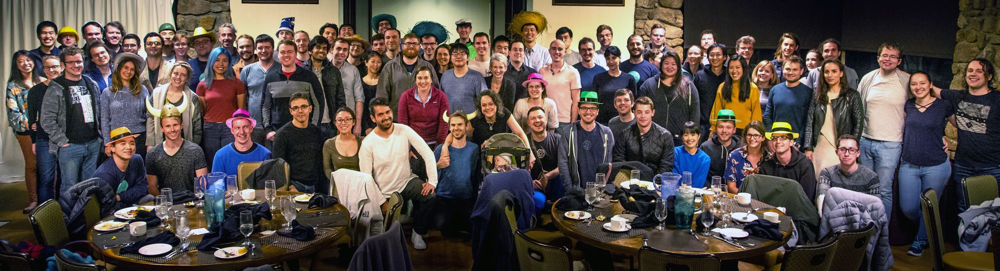
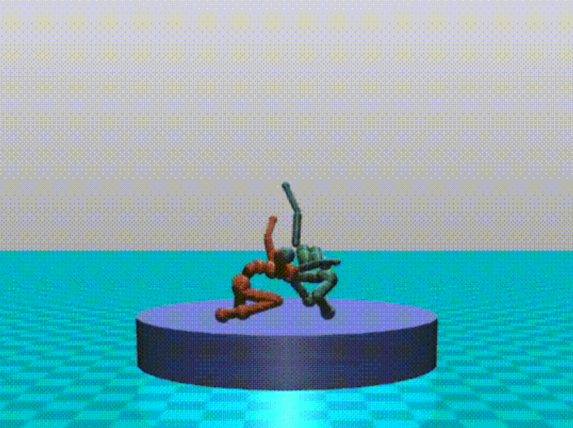
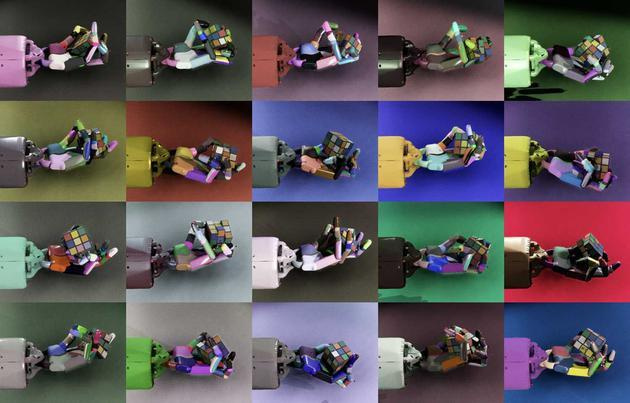
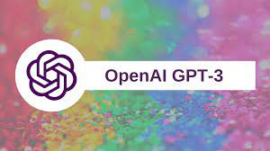
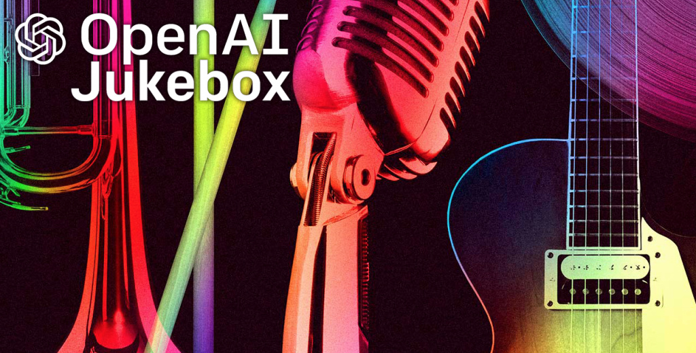
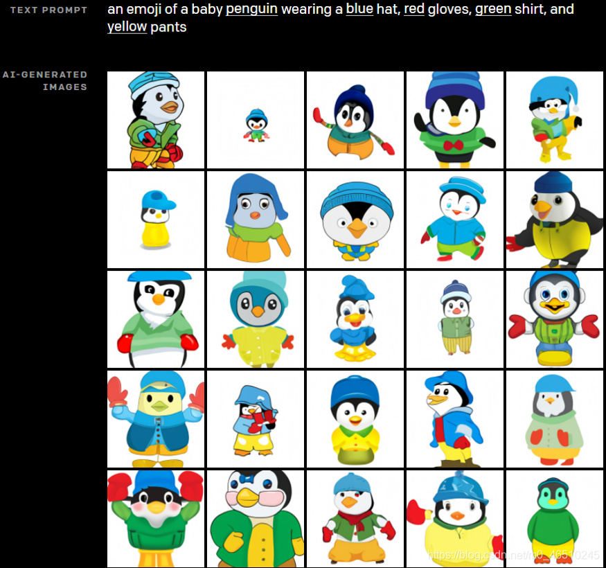
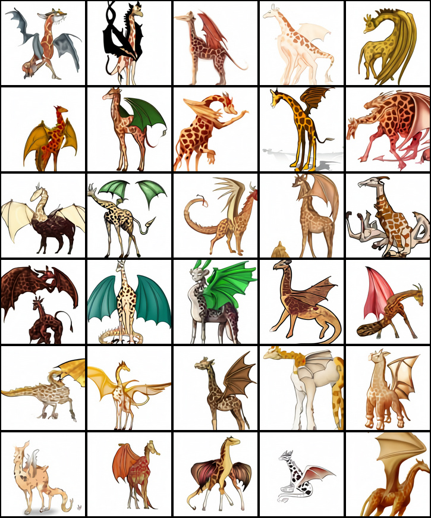
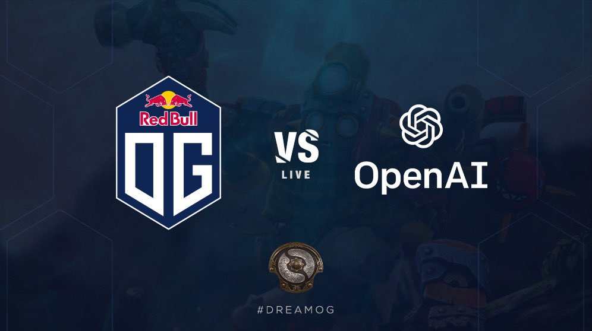

### [Top Players | OpenAI：和游戏走得最近的全球顶尖人工智能“公司”](https://forum.latticex.foundation/t/topic/5243)

> **发展历史**

- 2015年10月，Elon Musk（特斯拉和SpaceX创始人）和Sam Altman（Y Combinator前总裁），以及其他一些投资人共同宣布成立人工智能（AI）研究实验室OpenAI，并计划投入10亿美元资金从事“以有益于全人类的方式促进和发展友好人工智能”的研究。他们将通过向公众开放其专利和研究内容的方式，来与其他机构和人员进行自由合作。

- 2016年4月27日，OpenAI发布其强化学习（Reinforcement Learning)研究平台OpenAI Gym

- 2016年12月5日，OpenAI发布Universe软件平台，用于通过全球的游戏、网站和其他各类应用程序来训练AI的通用智能。

- 2018年2月21日，Elon Musk辞去了OpenAI的董事会席位，原因是该工作与特斯拉自动驾驶AI的开发在未来存在潜在的利益冲突。但Elon Musk依旧是OpenAI的捐助者。

- 2019年3月，OpenAI进行了重组，成立了名为“OpenAI LP”的子公司，该子公司归属于OpenAI Inc.（也就是OpenAI的非营利组织），并规定 OpenAI LP 对 OpenAI Inc. 的义务通常要放在首位。该公司是一个“有限利润（capped-profit）”（100倍）公司。有限利润是指：如果现在给OpenAI LP投资1000万美元，那么只有在这1000万美元创造了10亿美元的回报之后，超出10亿美金的部分才会归OpenAI Inc.所有（以后加入的投资人享受的倍数可能会低于100倍）。OpenAI的成员以雇员的身份加入了OpenAI LP并持有其股权。同时，OpenAI接受了微软10亿美元的投资。

  

- 2020年6月，OpenAI发布了GPT-3，如前介绍的，这是一种通过互联网上数万亿个单词训练出来的语言模型。同时还发布了一个附属的API，名字就叫作“the API”，以构成其第一个商业产品的核心部分。

> **发展历史**

- 2015年10月，Elon Musk（特斯拉和SpaceX创始人）和Sam Altman（Y Combinator前总裁），以及其他一些投资人共同宣布成立人工智能（AI）研究实验室OpenAI，并计划投入10亿美元资金从事“以有益于全人类的方式促进和发展友好人工智能”的研究。他们将通过向公众开放其专利和研究内容的方式，来与其他机构和人员进行自由合作。

- 2016年4月27日，OpenAI发布其强化学习（Reinforcement Learning)研究平台OpenAI Gym

- 2016年12月5日，OpenAI发布Universe软件平台，用于通过全球的游戏、网站和其他各类应用程序来训练AI的通用智能。

- 2018年2月21日，Elon Musk辞去了OpenAI的董事会席位，原因是该工作与特斯拉自动驾驶AI的开发在未来存在潜在的利益冲突。但Elon Musk依旧是OpenAI的捐助者。

- 2019年3月，OpenAI进行了重组，成立了名为“OpenAI LP”的子公司，该子公司归属于OpenAI Inc.（也就是OpenAI的非营利组织），并规定 OpenAI LP 对 OpenAI Inc. 的义务通常要放在首位。该公司是一个“有限利润（capped-profit）”（100倍）公司。有限利润是指：如果现在给OpenAI LP投资1000万美元，那么只有在这1000万美元创造了10亿美元的回报之后，超出10亿美金的部分才会归OpenAI Inc.所有（以后加入的投资人享受的倍数可能会低于100倍）。OpenAI的成员以雇员的身份加入了OpenAI LP并持有其股权。同时，OpenAI接受了微软10亿美元的投资。

  

- 2020年6月，OpenAI发布了GPT-3，如前介绍的，这是一种通过互联网上数万亿个单词训练出来的语言模型。同时还发布了一个附属的API，名字就叫作“the API”，以构成其第一个商业产品的核心部分。

#### **产品一览**

- **Gym**

OpenAI Gym是一款用于研发和比较强化学习算法的工具包，它支持训练智能体（agent）做任何事——从行走到玩Pong或围棋之类的游戏都在范围中。它与其他的数值计算库兼容，如tensorflow 或者theano 库。主要支持的是python 语言。

- **RoboSumo**

一个机器人相扑游戏。在该游戏中由AI控制的角色进行相扑对抗，但这些角色从一开始甚至连走路都没有学会。它们不得不在规则下反复进行学习，以赢得比赛的胜利。经过大约10亿次的对抗，它们开发出例如蹲下这样的有效策略。

- **Debate Game**

2018年OpenAI推出了Debate Game（辩论赛），以教育机器在人类裁判面前就玩具问题（Toy Problem，玩具问题没有科学上立即的重要性，不过可以作为工具，和其他人说明一些更复杂问题中的一些特征，或是用来解释一些问题求解上的技巧。玩具问题常用来展示及测试不同的方法，研究者也常用玩具问题来比较不同算法的性能。）进行辩论。

- **Dactyl**

Dactyl是仿真机器手，使用机器学习从头开始训练，使用与OpenAI Five相同的强化学习算法代码。据OpenAI团队在2019年10月发布的消息称，Dactyl已经学会了单手解决魔方问题。

对于OpenAI而言，Dactyl的成就让公司向更广泛的AI和机器人行业长期追索的目标又更进了一步：无需数月乃至多年的训练，无需特定编程，机器人也可以学习并执行各种现实世界中的任务。

- **GPT**

语言模型生成式预训练（GPT，Generative Pre-Training ）的原始论文由Alec Radford及其同事撰写，并于2018年6月11日以预印本的形式发布在OpenAI的网站上，这正式宣告了GPT的诞生。它展示语言的生成模型如何通过对具有连续长文本的多样化语料库进行预训练，以获得世界知识以及处理长程依赖性。

2020年5月推出的GPT-3引发了网络热议，因为其参数量比当年2月发布的全球最大的深度学习模型Turing NLP 要大10倍，而且不仅可以更好地答题、翻译、写文章，还带有一些数学计算的能力。

OpenAI的研究人员在[论文](https://arxiv.org/abs/2005.14165)中描述GPT-3是一种具有1,750亿个参数的自然语言深度学习模型，比以前的版本GPT-2高100倍。该模型经过了将近0.5万亿个单词的预训练，并且在不进行微调的情况下，可以在多个NLP基准上达到最先进的性能。

- **音乐**

MuseNet (2019年发布) 是一个深度神经网络，训练用于预测MIDI音乐文件中的后续音符。它可以用 15 种不同风格的 10 种不同乐器生成歌曲。

Jukebox (2020年发布) 是一种开源算法，用于生成带有人声的音乐。在对 120 万个样本进行训练后，系统在接受指定的流派、艺术家和一段歌词后，就可以输出歌曲样本。OpenAI 表示这些歌曲“表现出本地音乐的连贯性，遵循传统的和弦模式”，但承认这些歌曲缺乏“熟悉的更大的音乐结构，例如重复的合唱”，而且Jukebox和人类创作的音乐之间“存在重大差距”。

- **DALL-E和CLIP**

DALL-E 是一种 Transformer 模型，它根据文本描述创建图像，由 OpenAI 于 2021 年 1 月公布。而CLIP则正好与DALL-E相反，它是为给定的图像创建描述。

DALL-E 使用 GPT-3 的 120 亿参数版本来解释自然语言输入并生成相应的图片。它能够创建现实物体的图像（例如“带有蓝色草莓图像的彩色玻璃窗”）以及现实中不存在的物体（例如“具有豪猪纹理的立方体”）。

下图是DALL-E 在得到文本提示“一个戴着蓝色帽子、红色手套，穿着绿色T恤和黄色裤子的企鹅宝宝表情包”时生成的图像。

下图是DALL-E在得到文本提示“长颈鹿龙结合体的专业高质量插图，模仿龙的长颈鹿。由龙制成的长颈鹿”时生成的图像。

- **OpenAI FIVE**

OpenAI Five是由五个 OpenAI 控制的机器人组成的战队，这些机器人比赛的游戏是5V5电竞游戏Dota 2。这些机器人通过反复的试验算法的学习，完全能以高水平与人类玩家对战。

在组成五人团队之前，OpenAI Five的第一次公开表演是在TI7，这是该游戏的年度冠军赛事。乌克兰职业选手Dendi在现场1v1对决中输给了机器人。比赛结束后，OpenAI 的CTO Greg Brockman 介绍道，该机器人使用了一种强化学习的形式，通过在几个月内每天数百次与自己对战来进行学习，并会因杀死敌人和获取地图目标等行为而获得奖励。

2018 年 6 月，机器人的能力扩大到可以组成一个完整的五人团队，他们能够击败业余和半职业玩家组成的团队。在TI8上，OpenAI Five 与职业选手进行了两场表演赛，但最终都输掉了比赛。

2019年4月，OpenAI Five在旧金山的一场现场表演赛中以2:0击败了当时的卫冕世界冠军OG。

机器人最后一次公开露面是在当月晚些时候，在为期四天的公开在线比赛中，他们总共参加了 42,729 场比赛，赢得了 99.4% 的比赛。