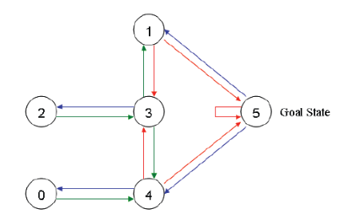
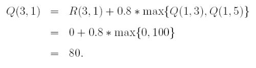

参考:

- [一个 Q-learning 算法的简明教程](https://blog.csdn.net/itplus/article/details/9361915)

问题：

转移规则：

算法：

初始状态：

假设 $ \gamma =0.8 $，

1. 第一次：初始状态为房间1，从R矩阵第二行可以看到有两个非负值，即有两种行为可能，状态3或者状态5，假设我们选择了随机状态5，则

   

   更新Q矩阵。

   

   

   由于这时已经处于状态5了，已经达到目标状态，则任务完成。

2. 第二次：初始状态为房间3，它有三个可能行为：1，2， 4。随机选择状态1，则

   

   更新Q矩阵。

   

   

   接下来，状态变成了1，而1有两种可能行为：3和5，假设随机选择了5，则

   

   矩阵Q没有任何变化。由于达到目标状态，则任务完成。

3. 再次循环随机选择初始状态，最终矩阵Q将收敛到：

   

   把每个元素除以矩阵最大值（500）再乘以100，则可得

   

   也就是：

   

   