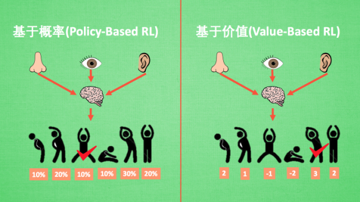

## 简介

### 什么是强化学习

强化学习是一类算法, 是让计算机实现从一开始什么都不懂, 通过不断地尝试, 从错误中学习, 最后找到规律, 学会达到目的的方法. 

和监督学习不同, 强化学习中数据没有对应的标签，而是通过一次次在环境中的尝试, 获取这些数据和标签的, 以及它们的关系, 然后通过学习到的这些规律, 可以自动的选择带来高分的行为。

经典的例子有：

- [Alpha go](https://deepmind.com/research/case-studies/alphago-the-story-so-far)：远远超越当今最顶尖的围棋棋手。
- [Dota](https://openai.com/blog/openai-five/)：击败了业余人类玩家。
- [Atari](https://deepmind.com/blog/article/Agent57-Outperforming-the-human-Atari-benchmark): 玩57种 Atari经典游戏。

还有一些非常精彩的视频：

- 教计算机在虚拟世界控制机器人
  - https://d4mucfpksywv.cloudfront.net/openai-baselines-ppo/knocked-over-stand-up.mp4
- 真实世界复制策略：
  - https://youtu.be/jwSbzNHGflM

### 核心概念 

- Agent：Agent观察环境所处的State，决定自己的Action。Agent的目标是获取最大的Return（也就是Cumulative Reward）
- Environment：根据Agent的Action改变State，并给出相应的Reward。

### 算法分类

总体情况：

|                      | 价值和行为 | 理解环境 | 概率 or 价值 | 策略更新 | 否在线     |
| -------------------- | ---------- | -------- | ------------ | -------- | ---------- |
| Q Learning           | 价值       | 不理解   | 价值         |          | Off-Policy |
| Sarsa                | 价值       | 不理解   | 价值         |          | On-Policy? |
| Deep Q Network       | 价值       | 不理解   |              |          | Off-Policy |
| Policy Gradients     | 直接行为   | 不理解   | 概率         | 回合更新 |            |
| 升级Policy Gradients | 直接行为   | 不理解   | 概率         | 单步更新 |            |
| Model based RL       | 想象环境   | 理解     |              |          |            |
| Actor-Critic         |            | 不理解   | 混合         |          |            |
| Monte-Carlo Learning |            |          |              | 回合更新 |            |

详细描述如下：

- 从价值和行为上
  - 通过价值选择行为
    - Q Learning
    - Sarsa
    - Deep Q Network
  - 直接选行为
    - Policy Gradients
  - 想象环境，并从中学习
    - Model based RL

- 是否理解环境

  

  - 不理解（Model-Free RL）

    不尝试去理解环境, 环境给了我们什么就是什么. 用模型来表示环境, 那理解了环境也就是学会了用一个模型来代表环境。

    - Q learning
    - Sarsa
    - Policy Gradients 

  - 理解 （Model-Based RL）

    机器人会通过过往的经验, 先理解真实世界是怎样的, 并建立一个模型来模拟现实世界的反馈, 最后他不仅可以在现实世界中玩耍, 也能在模拟的世界中玩耍。

    和Model-Free RL相比，Model-based RL 只是多了一道程序, 为真实世界建模, 我们不仅可以像Model-Free RL那样在现实中玩耍,还能在游戏中玩耍, 而且它还有想象力.

    Model-Free RL中, 机器人只能按部就班, 一步一步等待真实世界的反馈, 再根据反馈采取下一步行动. 而 Model-Free RL, 能通过想象来预判断接下来将要发生的所有情况. 然后选择这些想象情况中最好的那种. 并依据这种情况来采取下一步的策略, 这也就是围棋场上 AlphaGo 能够超越人类的原因. 

- 基于概率还是价值

  

  - 基于概率：根据概率采取行动, 所以每种动作都有可能被选中, 只是可能性不同. 

    - Policy Gradients

  - 基于价值：根据最高价值来选着动作, 选择价值最高的动作。

    对于选取连续的动作, 基于价值的方法是无能为力的. 我们却能用一个概率分布在连续动作中选取特定动作, 这也是基于概率的方法的优点之一.

    - Q Learning
    - Sarsa

  - 混合概率和价值

    -  [Actor-Critic](https://morvanzhou.github.io/tutorials/machine-learning/ML-intro/4-08-AC/), actor 会基于概率做出动作, 而 critic 会对做出的动作给出动作的价值

- 策略更新

  

  想象强化学习就是在玩游戏, 游戏回合有开始和结束. 回合更新指的是游戏开始后, 我们要等待游戏结束, 然后再总结这一回合中的所有转折点, 再更新我们的行为准则. 而单步更新则是在游戏进行中每一步都在更新, 不用等待游戏的结束, 这样我们就能边玩边学习了.

  - 回合更新
    - Monte-Carlo learning 
    - Policy Gradients 
  - 单步更新：现在大多方法都是基于单步更新
    - 升级版的 Policy Gradients

- 是否在线

  

  - 在线学习（On-Policy）

    指我必须本人在场, 并且一定是本人边玩边学习

    - Sarsa，Sarsa Lambda

  - 离线学习（Off-Policy）

    可以选择自己玩, 也可以选择看着别人玩, 通过看别人玩来学习别人的行为准则。离线学习 同样是从过往的经验中学习, 但是这些过往的经历没必要是自己的经历, 任何人的经历都能被学习. 或者我也不必要边玩边学习, 我可以白天先存储下来玩耍时的记忆, 然后晚上通过离线学习来学习白天的记忆.

    - Q learning
    - Deep-Q-Network

## Reference

- [莫烦-强化学习](https://morvanzhou.github.io/tutorials/machine-learning/reinforcement-learning/)
- [Part 1: Key Concepts in RL](https://spinningup.openai.com/en/latest/spinningup/rl_intro.html#id2)

### Resources

- Reinforcement Learning : An introduction

  提到强化学习，就不得不提这本书了，这是强化学习的奠基人Sutton历时多年，几经修改撰写的强化学习领域最经典的书，如果能够将该书从头到尾啃下，基本能够对强化学习有一个全面和深入的认识了。且书籍是最直接的养料，可以避免其他专栏和博客中作者见解上难免的偏颇，摒除各方解读的杂音，亲身理解，深入思考，把片段化的东西组成一个完整的体系。

  - 书籍： http://incompleteideas.net/book/RLbook2020.pdf
  - 代码：http://incompleteideas.net/book/code/code2nd.html

- 莫凡-强化学习教程

  https://morvanzhou.github.io/tutorials/machine-learning/reinforcement-learning/

- 专栏
  - [强化学习知识大讲堂](https://zhuanlan.zhihu.com/sharerl) 

    该专栏作者即为《深入浅出强化学习：原理入门》一书的作者，专栏的讲解包括：入门篇、进阶篇、前沿篇和实践篇，深入浅出，内容翔实，是专门针对强化学习的知识大讲堂。

  - [智能单元](https://zhuanlan.zhihu.com/intelligentunit)  

    该专栏涵盖的内容较广，主要包括深度学习和强化学习及其相应的实践应用，是知乎上深度学习和强化学习领域关注量最大的专栏，其中对强化学习的介绍也较浅显易懂。

  - [神经网络与强化学习](https://zhuanlan.zhihu.com/c_101836530)  

    该专栏主要是作者关于强化学习经典入门书籍《Reinforcement Learning : An introduction》的读书笔记，因此，非常适合在啃该书的时候参考该专栏，以有更深入的理解。

  - [强化学习](https://link.zhihu.com/?target=http%3A//www.cnblogs.com/jinxulin/tag/%E5%A2%9E%E5%BC%BA%E5%AD%A6%E4%B9%A0/)

    该专栏介绍的是传统强化学习的基础内容，包括强化学习的概念和基本方法，讲的非常细致，可以作为强化学习的初步入门选择。

  - [深度强化学习](https://link.zhihu.com/?target=https%3A//blog.csdn.net/u013236946/article/category/6965927)

    该专栏介绍了几个经典和常用的深度强化学习方法，包括伪代码的介绍和详细的图解，对于理解训练过程非常有帮助，真心推荐，作为深度强化学习的初步入门选择。

- 视频教程

  - AlphaGo项目负责人David Silver:  [Teaching](https://link.zhihu.com/?target=http%3A//www0.cs.ucl.ac.uk/staff/D.Silver/web/Teaching.html)
  - 加州大学伯克利分校: [CS 294 Deep Reinforcement Learning, Spring 2017](https://link.zhihu.com/?target=http%3A//rll.berkeley.edu/deeprlcourse/)
  - 卡内基梅隆大学: [Deep RL and Control](https://link.zhihu.com/?target=https%3A//katefvision.github.io/)

  - 全面的机器学习视频教程：[莫烦Python](https://link.zhihu.com/?target=https%3A//morvanzhou.github.io/tutorials/machine-learning/reinforcement-learning/)
    - 莫烦python是一个很全面的机器学习教学视频网站，包括python学习、机器学习、强化学习、深度学习和相关实践教程。作者是一位博士，**周沫凡**，而且人很亲切友善，听他的课是一种享受。
  
- 实践代码
  - [莫烦python强化学习教程全部代码](https://link.zhihu.com/?target=https%3A//github.com/MorvanZhou/Reinforcement-learning-with-tensorflow)
  - [github上强化学习star数最多的代码](https://link.zhihu.com/?target=https%3A//github.com/dennybritz/reinforcement-learning)
  - [Sutton书对应的python代码](https://link.zhihu.com/?target=https%3A//github.com/ShangtongZhang/reinforcement-learning-an-introduction)

## Reference

- [强化学习怎么入门好？](https://www.zhihu.com/question/277325426/answer/411907338)