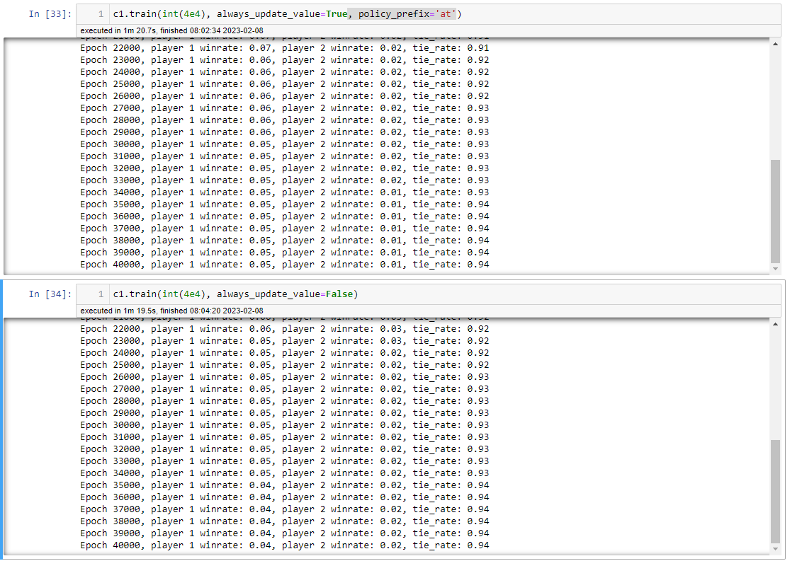
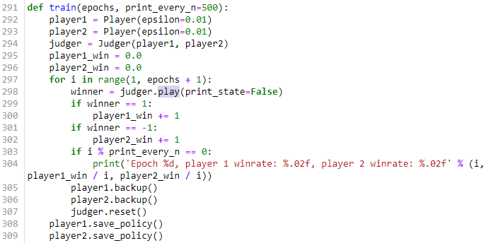

本文摘自《[Reinforcement Learning: An Introduction](http://incompleteideas.net/book/the-book-2nd.html)》（第二版）

# 前言

- 书

  - 英文版
    -  http://incompleteideas.net/book/RLbook2020.pdf
    -  [local RLbook2020.pdf](..\..\..\..\..\ai\book\machine_learning\RLbook2020.pdf) 
  - [中文翻译](https://rl.qiwihui.com/zh_CN/latest/index.html)
- [代码](http://incompleteideas.net/book/code/code2nd.html)
  - [python](https://github.com/ShangtongZhang/reinforcement-learning-an-introduction)
  - [local python](http://15.15.174.138:28888/notebooks/eipi10/xuxiangwen.github.io/_notes/05-ai/47-rl/rl_an_introduction/notebooks/code.ipynb)
- 练习
  - https://github.com/brynhayder/reinforcement_learning_an_introduction/blob/master/exercises/exercises.pdf
  - http://tianlinliu.com/files/notes_exercise_RL.pdf
  - https://github.com/vojtamolda/reinforcement-learning-an-introduction
  - https://github.com/LyWangPX/Reinforcement-Learning-2nd-Edition-by-Sutton-Exercise-Solutions

# 1 简介

一个婴儿玩耍，挥动手臂或环顾四周时，他没有明确的老师，但他确实通过直接的感觉与环境联系，并且从因果关系中学习有价值的信息。 (When an infant plays, waves its arms, or looks about, it has no explicit teacher, but it does have a direct sensorimotor connection to its environment.)

不同于其他机器学习方法，*强化学习（Reinforcement Learning）*，更侧重于从交互中进行目标导向的学习。（reinforcement learning, is much more focused on goal-directed learning from interaction than are other approaches to machine learning）

从交互中学习，是强化学习的重要特征。

## 1.1 强化学习

强化学习是一种学习如何将状态映射到动作，以获得最大奖励的学习机制。 学习者不会被告知要采取哪些动作，而是必须通过尝试来发现哪些动作会产生最大的回报。 在实际案例中，动作不仅可以影响直接奖励，还可以影响下一个状态，并通过下一个状态，影响到随后而来的奖励。 

强化学习有如下特征：

- 如何权衡探索（Exploration）与利用（Exploitation）之间的关系 （the trade-off between exploration and exploitation）。

  为了获得大量奖励，强化学习个体必须倾向于过去已经尝试过并且能够有效获益的行动。 但是要发现这样的行为，它必须尝试以前没有选择过的行为。 个体必须充分 *利用* 它既有经验以获得收益，但它也必须 *探索*，以便在未来做出更好的动作选择。 困境在于，任何探索和利用都难以避免失败。 个体必须尝试各种动作，逐步地选择那些看起来最好的动作。 在随机任务中，每一个动作必须经过多次尝试才能得到可靠的预期收益。

- 明确地考虑了目标导向的个体（agent）与不确定环境（environment）相互作用的 *整个* 问题（whole problem），而不是其中的孤立的子问题（subproblems）。而很多其他学习方法大多仅仅考虑孤立的子问题。

## 1.2 例子

下面这些例子可以帮助我们更好的理解强化学习。

- 国际象棋大师落子。落子决定既通过规划 - 期待的回复和逆向回复 （anticipating possible replies and counterreplies），也出于对特定位置和移动及时直觉的判断。
- 自适应控制器实时调节炼油厂操作的参数。控制器在指定的边际成本的基础上优化产量/成本/质量交易，而不严格遵守工程师最初建议的设定。
- 一头瞪羚在出生后几分钟挣扎着站起来。半小时后，它能以每小时20英里的速度奔跑。
- 移动机器人决定是否应该进入新房间以寻找和收集更多垃圾来，或尝试回到充电站充电。 它根据电池的当前电池的充电水平，以及过去能够快速轻松地找到充电站的程度做出决定。

## 1.3 强化学习的要素

在个体和环境之外，强化学习系统一般有四个要素：

- 策略（policy）： 定义了学习个体在给定时间内的行为方式。
- 奖励信号（reward signal）：定义了强化学习问题的目标。
- 价值函数（value function）：定义了长期收益。粗略地说，一个状态的价值是个体从该状态开始在未来可以预期累积的奖励总额。 
- 环境模型（a model of the environment）：它是对环境的模拟。它不是必须的。

## 1.4 局限性和范围

略

## 1.5 拓展例子：井字棋（ Tic-Tac-Toe）

两名玩家轮流在一个三乘三的棋盘上比赛。 一个玩家画叉，另一个画圈，若叉或圈的连续三个棋子落于一行或一列或同一斜线上则获胜；若棋盘被填满了也不能决出胜负则为平局。

使用价值函数的方法来解决井字棋问题的策略如下：

  
图1.1：井字棋移动序列

上图中：

  - 黑色实线代表游戏中所采取的动作

  - 虚线表示（强化学习）考虑但未做出的动作

  - $${}^*$$ 表示当前的动作是被认为是最佳的。第二次动作 $e$ 是explore动作。

  - 红色实线表示（通过下一个动作的价值）更新状态的价值。只有exploit的动作才会产生更新的操作，explore并不会产生学习，所以可以看到 $e$ 并没有更新 $c*$ 状态的价值。

    > question: 如果explore也进行更新，会发生什么呢？
    >
    > 答：经过实验，发现如果这样的话，学习效率将会降低。下图中，如果explore也更新，学习更慢（player1胜率高得多）。
    >
    > 

下面我们来详细分解。详见[代码](http://15.15.174.138:28888/notebooks/eipi10/xuxiangwen.github.io/_notes/05-ai/47-rl/rl_an_introduction/notebooks/code.ipynb#chapter-1)

- 将建立一个hash表，其中每一个hash值对应一个可能的游戏状态，也就保存棋盘中棋子分布的所有可能情况。由于棋盘很小，所有的状态有5478个。

  

- 每一个（非人类）player创建一个**价值表**。

  

- 训练的一次对弈中，player交替下棋。

  

  这里使用了 $\epsilon-greedy$ 策略选择动作。

- 训练中，由两个player进行多次对弈。

  
  
  每次对弈结束，都会进行backup，即更新**价值表**，也就是图1.1的红色线。
  
  

  更新公式如下：
  $$
  V(S_t) \leftarrow V(S_t) + \alpha \left[ V(S_{t+1}) - V(S_t) \right]，
  $$
  其中 $S_t$ 表示贪婪移动之前的状态， $S_{t+1}$ 表示移动之后的状态，$\alpha$ 表示步长（step size）。这个更新规则被称为 *时序差分（temporal-dierence ）* 学习。

- 训练完成后，由两个player进行对弈。由于井字棋比较简单，如果应对无误的话，就是平局，因此，经过充分训练后，两个player每次也是平局结束。

  

- AI和人类下，人类没法赢了。

  

- 查看某个状态下的价值。

  

### 练习1.1-1.5

- 练习1.1：*自我对弈（Self-Play）* 假设上面描述的强化学习算法不是与随机对手对抗，而是双方都在学习。在这种情况下你认为会发生什么？是否会学习选择不同的行动策略？

  答： 感觉就是木桶效应。

  - 如果双方的算法非常的高级，能使得自我对弈更加快速的进行学习，而且比起随机的对手，这种方式能够学习到更加高明的策略。比方，双方都是象棋高手，如果来学习围棋，通过长时间对弈，各自都有很大提高的。

  - 如果一方学习算法非常的低级，则另外一方即使策略很高明，也很难学习到足够好的策略。比方，成人和一个3岁孩子下棋。

    对于强化学习的一方来说，对方就是环境，而环境如果不能反应动作的价值，当换一个环境（对手），原有的学习策略将会无效。这种请况下， 还不如一个随机对手，因为随机对手提供全面的反应。

  - 如果双方学习算法非常的低级，则双方都会徘徊于简单的策略。比方，两个3岁孩子下棋。

- 练习1.2 *对称性（Symmetries）* 由于对称性，许多井字位置看起来不同但实际上是相同的。如何修改上述学习过程以利用这一点？ 这种变化会以何种方式改善学习过程？假设对手没有利用对称性，在这种情况下，我们应该利用吗？那么，对称等价位置是否必须具有相同的价值？

  答：

  - 如何修改上述学习过程以利用这一点？ 

    通过标记对称性相同的状态，能够大大减少搜寻的空间。能够使得算法更快的收敛。

  - 假设对手没有利用对称性，在这种情况下，我们应该利用吗？

    由于对手没有利用对称性，它的学习速度要慢一些，但是长期来看，它也能学习到这种对称性，即学习到对称等价位置是否必须具有相同的价值。

- 练习1.3 *Greedy Play* 假设强化学习玩家是 *Greedy*，也就是说，它总是选择使其达到最佳奖励的位置。 它可能会比一个Nogreedy玩家学得更好或更差吗？可能会出现什么问题？

  答：Greedy玩家和Nogreedy玩家对弈。

  - 如果Greedy玩家初始的状态价值估计是非常不准的（甚至错误），当进行一个错误动作后，长期来看，它会输的多一点，这样也能进行一些（负向反馈）学习，但学习的速度非常非常慢。中短期来看，Greedy玩家不如Nogreedy玩家， 但由于Nogreedy玩家总是随机，所以无法学习，从长期来看，Greedy玩家还是比Nogreedy玩家好的。
  - 如果Greedy玩家初始的状态价值估计是比较准确的，由于Greedy玩家将赢多负少，正向反馈较多，这样学习的效率还是不错的。

- 练习1.4 *从探索（explore）中学习*  假设在每一次移动后，包括explore的动作，都进行学习更新。另外，step-size参数也会随着时间适度减少，这样状态价值（state value）将会收敛到一组不同的概率集。What (conceptually) are the two sets of probabilities computed when we do, and when we do not, learn from exploratory moves? 假设我们继续做出探索性的动作，哪一组概率可能学习得更好？哪一个会赢得更多？

  答：explore学习策略，会使得学习的效率变低（为何变低，不知道），这次策略不如no-explore学习策略。后者将会赢的更多。

- 练习1.5： *其他改进* 你能想到其他改善强化学习者的方法吗？你能想出更好的方法来解决所提出的井字棋游戏问题吗？

  答：无

## 1.6 小结

强化学习与其他计算方法的区别在于它强调个体通过与环境的直接交互来学习，而不需要示范监督或完整的环境模型。

强化学习使用马尔可夫决策过程（Markov decision processes）的正式框架。这个框架定义了个体（Agent）与环境（environment）之间的交互（包括状态，动作和奖励）。 该框架旨在用一种简化的方式表达人工智能问题的基本特征。 这些特征包括因果性，不确定性，以及明确目标的存在性（These features include a sense of cause and e↵ect, a sense of uncertainty and nondeterminism, and the existence of explicit goals.）。

价值和价值函数（value and value function）的概念是在本书中大多数强化学习方法的关键。在策略空间中能够高效搜索价值函数非常的重要。价值函数的使用使得我们可以强化学习和进化方法（evolutionary methods）区分开来。

> 进化方法直接从策略空间进行搜索。所以效率低啊，但是也是能学习的，地球生命的进化史就是这样的过程，总体前期非常慢，后期逐步加快，当有了人类之后，飞速加快， 这是因为人类能够进行高效的学习，能够传承知识。

## 1.7 强化学习早期历史

略。

