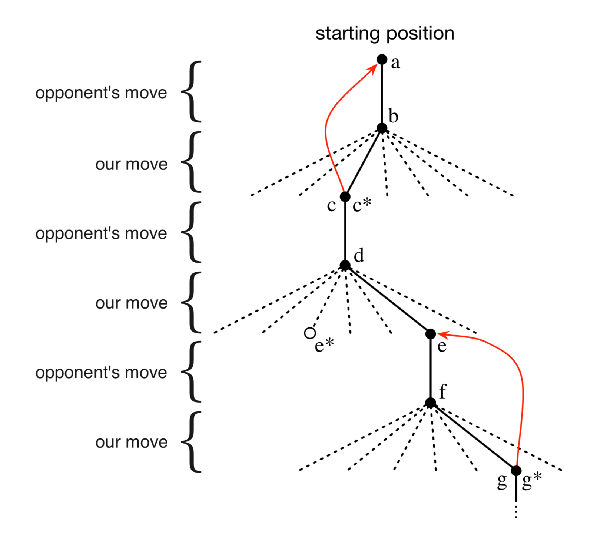
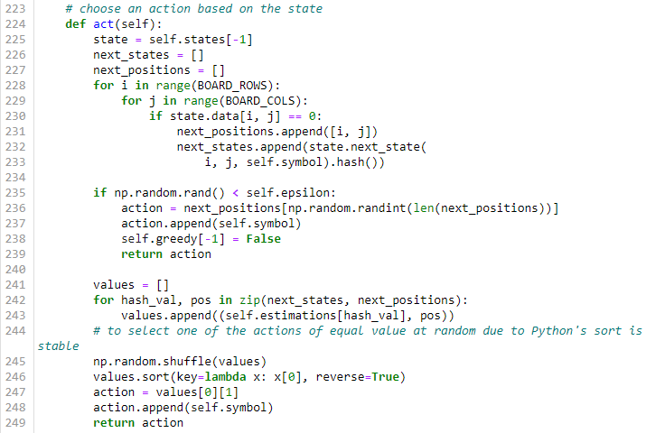
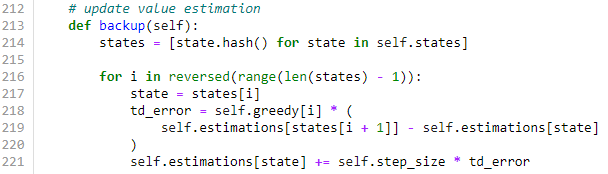
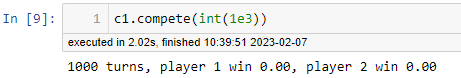
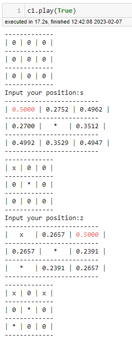
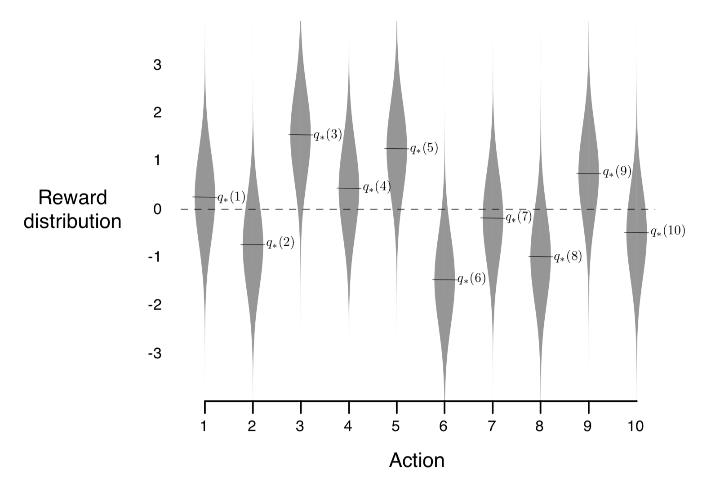
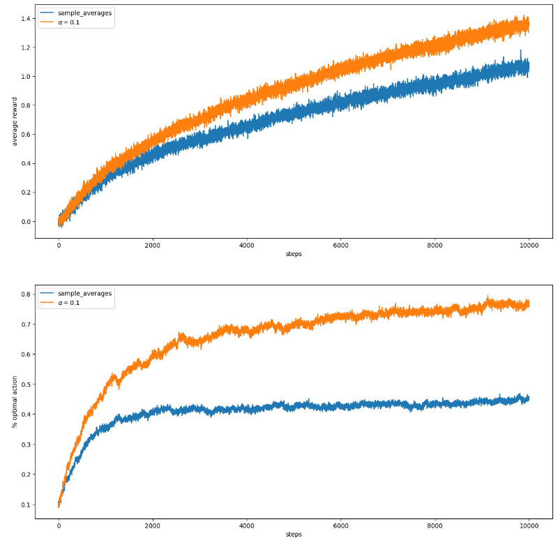
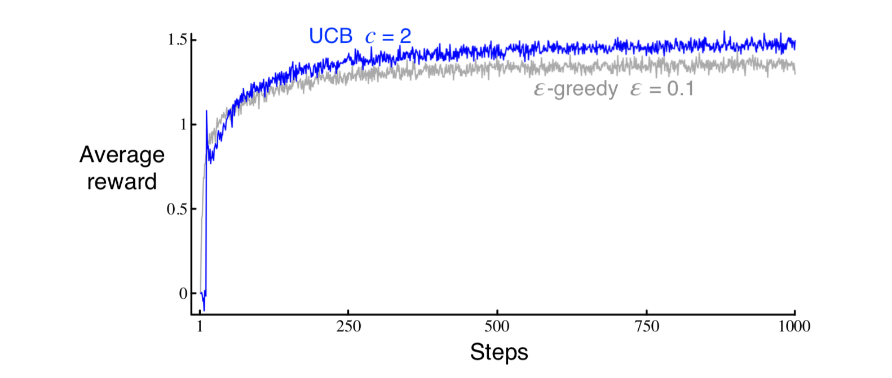
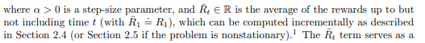

本文摘自《[Reinforcement Learning: An Introduction](http://incompleteideas.net/book/the-book-2nd.html)》（第二版）

# 前言

## 书

- 英文版
  -  http://incompleteideas.net/book/RLbook2020.pdf
  -  [local RLbook2020.pdf](..\..\..\..\..\ai\book\machine_learning\RLbook2020.pdf) 
- [中文翻译](https://rl.qiwihui.com/zh_CN/latest/index.html)

## [代码](http://incompleteideas.net/book/code/code2nd.html)

- [python](https://github.com/ShangtongZhang/reinforcement-learning-an-introduction)
- [local python](http://15.15.174.138:28888/tree/eipi10/xuxiangwen.github.io/_notes/05-ai/47-rl/rl_an_introduction/code)
  - 实验： [rl_lab](http://15.15.174.138:28888/notebooks/eipi10/xuxiangwen.github.io/_notes/05-ai/47-rl/rl_an_introduction/notebooks/rl_lab.ipynb)

## 课后练习

- https://github.com/brynhayder/reinforcement_learning_an_introduction/blob/master/exercises/exercises.pdf
  - local： [exercises.pdf](exercise\exercises.pdf) 
- https://github.com/vojtamolda/reinforcement-learning-an-introduction
- http://tianlinliu.com/files/notes_exercise_RL.pdf

# 1 简介

一个婴儿玩耍，挥动手臂或环顾四周时，虽然没有明确的老师，但婴儿确实通过直接的感觉与环境联系，并且从因果关系中学习有价值的信息。 不同于其他机器学习方法，*强化学习（Reinforcement Learning）*，更侧重于从交互中进行目标导向的学习。从交互中学习，是强化学习的重要特征。

## 1.1 强化学习

强化学习是一种学习如何将状态映射到行为，以获得最大奖励的学习机制。 学习者不会被告知要采取哪些行为，而是必须通过尝试来发现哪些行为会产生最大的回报。 在实际案例中，行为不仅可以影响直接奖励，还可以影响下一个状态，并通过下一个状态，影响到随后而来的奖励。 

强化学习有如下特征：

- 如何权衡探索（Exploration）与利用（Exploitation）之间的关系 （the trade-off between exploration and exploitation）。

  为了获得大量奖励，强化学习个体（agent）必须倾向于过去已经尝试过并且能够有效获益的行动。 但是要发现这样的行为，它必须尝试以前没有选择过的行为。 个体必须充分 *利用（explore）* 它已有的经验以获得收益，但它也必须 *探索（explore）*，以便在未来做出更好的行为选择。 困境在于，任何探索和利用都难以避免失败。 个体必须尝试各种行为，逐步地选择那些看起来最好的行为。 在随机任务中，每一个行为必须经过多次尝试才能得到可靠的预期收益。

- 明确地考虑了目标导向的个体（agent）与不确定环境（environment）相互作用的 *整个* 问题（whole problem），而不是其中的孤立的子问题（subproblems）。而很多其他学习方法大多仅仅考虑孤立的子问题。

## 1.2 例子

下面这些例子可以帮助我们更好的理解强化学习。

- 国际象棋大师落子。落子决定既通过规划 - 期待的回复和逆向回复 （anticipating possible replies and counterreplies），也出于对特定位置和移动及时直觉的判断。
- 自适应控制器实时调节炼油厂操作的参数。控制器在指定的边际成本的基础上优化产量/成本/质量交易，而不严格遵守工程师最初建议的设定。
- 一头瞪羚在出生后几分钟挣扎着站起来。半小时后，它能以每小时20英里的速度奔跑。
- 移动机器人决定是否应该进入新房间以寻找和收集更多垃圾来，或尝试回到充电站充电。 它根据电池的当前电池的充电水平，以及过去能够快速轻松地找到充电站的程度做出决定。

## 1.3 强化学习的要素

在个体（agent）和环境（environment）之外，强化学习系统一般有四个要素：

- 策略（policy）： 定义了学习个体在给定时间内的行为方式。
- 奖励信号（reward signal）：定义了强化学习问题的目标。
- 价值函数（value function）：定义了长期收益。粗略地说，一个状态的价值是个体从该状态开始在未来可以预期累积的奖励总额。 
- 环境模型（a model of the environment）：它是对环境的模拟。它不是必须的。

## 1.4 局限性和范围

略

## 1.5 拓展例子：井字棋（ Tic-Tac-Toe）

两名玩家轮流在一个三乘三的棋盘上比赛。 一个玩家画叉，另一个画圈，若叉或圈的连续三个棋子落于一行或一列或同一斜线上则获胜；若棋盘被填满了也不能决出胜负则为平局。

使用价值函数的方法来解决井字棋问题的策略如下：

$$
\text {图1.1：井字棋移动序列}
$$
上图中：

  - 黑色实线代表游戏中所采取的行为

  - 虚线表示（强化学习）考虑但未做出的行为

  - $${}^*$$ 表示当前的行为是被认为是最佳的。其中第二次行为 $e$ 不是最佳行为，而是探索行为。

  - 红色实线表示（通过下一个行为的价值）更新状态的价值。只有exploit的行为才会产生更新的操作，探索并不会产生学习，所以可以看到 $e$ 并没有更新 $c*$ 状态的价值。

    > question: 如果探索也进行更新，会发生什么呢？
    >
    > 答：经过实验，发现如果这样的话，学习效率将会降低。下图中，如果探索也更新，学习更慢（player1胜率高得多）。但更多的感觉没有啊。
    >
    > 

下面我们来详细分解[代码](http://15.15.174.138:28888/notebooks/eipi10/xuxiangwen.github.io/_notes/05-ai/47-rl/rl_an_introduction/notebooks/code.ipynb#chapter-1)。

> 笔者：要读懂代码，需要通读代码，然后结合下面的几点来理解，这样能快一些。

- 将建立一个hash表，其中每一个hash值对应一个可能的游戏状态，也就保存棋盘中棋子分布的所有可能情况。由于棋盘很小，所有的状态有5478个。

  

- 每一个（非人类）player 初始化一个**价值表**。

  

- 训练的一次对弈中，两个player交替下棋。player的行为选择采用了 $\epsilon-greedy$ 策略，见下面代码。

  

- 训练中，由两个player进行多次对弈。

  
  
  每次对弈结束，都会进行backup，即更新**价值表**，也就是图1.1的红色线。
  
  

  更新公式如下：
  $$
  V(S_t) \leftarrow V(S_t) + \alpha \left[ V(S_{t+1}) - V(S_t) \right]，
  $$
  其中 $S_t$ 表示贪婪移动之前的状态， $S_{t+1}$ 表示移动之后的状态，$\alpha$ 表示步长（step size）。这个更新规则被称为 *时序差分（temporal-dierence ）* 学习。

- 训练完成后，由两个player进行对弈。由于井字棋比较简单，应对无误的话，就是平局，因此，经过充分训练后，两个player每次也是平局结束。

  

- AI和人类下，人类没法赢了。

  

- 查看对弈中，各个状态下的价值。

  

### 练习1.1-1.5

- 练习1.1：*自我对弈（Self-Play）* 假设上面描述的强化学习算法不是与随机对手对抗，而是双方都在学习。在这种情况下你认为会发生什么？是否会学习选择不同的行动策略？

  答： 强化学习算法水平的高低除了取决于自身的学习策略，很大程度也取决于对手。就像木桶效应。

  - 如果双方的算法非常的高级，大量的对弈使得双方都在快速的进行学习，比起随机的对手，这种方式能够学习到更加高明的策略。比方，双方都是象棋高手，如果来学习围棋，通过长时间对弈，各自都会有很大提高的。

  - 如果一方学习算法非常的低级，即使另外一方策略很高明，也很难学习到足够好的策略。比方，一个成人和一个刚学会规则的3岁孩子下棋。

    对于强化学习的一方来说，对手就是环境，而环境如果不能反应行为的价值，当换一个环境（对手），原有的学习策略将会无效。这种请况下， 还不如一个随机对手，因为随机对手提供全面客观的反应。

  - 如果双方学习算法非常的低级，则双方都会徘徊于简单的策略。比方，两个刚学会规则的3岁孩子下棋。

- 练习1.2 *对称性（Symmetries）* 由于对称性，许多井字位置看起来不同但实际上是相同的。如何修改上述学习过程以利用这一点？ 这种变化会以何种方式改善学习过程？假设对手没有利用对称性，在这种情况下，我们应该利用吗？那么，对称等价位置是否必须具有相同的价值？

  答：

  - 如何修改上述学习过程以利用这一点？ 

    通过标记对称性相同的状态，能够大大减少搜寻的空间。能够使得算法更快的收敛。

  - 假设对手没有利用对称性，在这种情况下，我们应该利用吗？

    由于对手没有利用对称性，它的学习速度要慢一些，但是长期来看，它也能学习到这种对称性，即学习到对称等价位置是否必须具有相同或相近的价值。

- 练习1.3 *Greedy Play* 假设强化学习玩家是 *Greedy*，也就是说，它总是选择使其达到最佳奖励的位置。 它可能会比一个Nongreedy玩家学得更好或更差吗？可能会出现什么问题？

  答：Greedy玩家和Nogreedy玩家对弈。

  - 如果Greedy玩家初始的状态价值估计是非常不准的（甚至错误），当进行一个错误行为后，长期来看，它会输的多一点，这样也能进行一些（负向反馈）学习，但学习的速度非常非常慢。中短期来看，Greedy玩家不如Nogreedy玩家， 但由于Nogreedy玩家总是随机，所以无法学习，从长期来看，Greedy玩家还是比Nogreedy玩家好的。
  - 如果Greedy玩家初始的状态价值估计是比较准确的，由于Greedy玩家将赢多负少，正向反馈较多，这样学习的效率还是不错的。

- 练习1.4 *从探索（explore）中学习*  假设在每一次移动后，包括探索的行为，都进行学习更新。另外，step-size参数也会随着时间适度减少，这样状态价值（state value）将会收敛到一组不同的概率集。What (conceptually) are the two sets of probabilities computed when we do, and when we do not, learn from exploratory moves? 假设我们继续做出探索性的行为，哪一组概率可能学习得更好？哪一个会赢得更多？

  答：探索学习策略，会使得学习的效率变低（为何变低，不知道），这次策略不如no-explore学习策略。后者将会赢的更多。

  > 这道题目的意思理解还是有点问题， 原文如下
  >
  > Suppose learning updates occurred after all moves, including exploratory moves. If the step-size parameter is appropriately reduced over time (but not the tendency to explore), then the state values would converge to a set of probabilities. What are the two sets of probabilities computed when we do, and when we do not, learn from exploratory moves? Assuming that we do continue to make exploratory moves, which set of probabilities might be better to learn? Which would result in more wins?

  练习1.4 *从探索（explore）中学习*  有两种学习方法，第一种，每一次移动后（包括探索的行为），都进行行动价值的更新。第二种，仅当移动是 Greedy 行为后，才进行行动价值的更新。哪一种方法学习得更好？哪一种会赢得更多？

  答：第一种方法会使得学习的效率变低（为何变低，不知道），第二种方法将会赢的更多。

- 练习1.5： *其他改进* 你能想到其他改善强化学习者的方法吗？你能想出更好的方法来解决所提出的井字棋游戏问题吗？

  答：无

## 1.6 小结

强化学习与其他计算方法的区别在于它强调个体通过与环境的直接交互来学习，而不需要示范监督或完整的环境模型。

强化学习使用马尔可夫决策过程（Markov decision processes）的正式框架。这个框架定义了个体（Agent）与环境（environment）之间的交互（包括状态，行为和奖励）。 该框架旨在用一种简化的方式表达人工智能问题的基本特征。 这些特征包括因果性，不确定性，以及明确目标的存在性（These features include a sense of cause and effect, a sense of uncertainty and nondeterminism, and the existence of explicit goals.）。

价值和价值函数（value and value function）的概念是在本书中大多数强化学习方法的关键。在策略空间中能够高效搜索价值函数非常的重要。区分强化学习和进化方法（evolutionary methods）的关键在于是否使用了价值函数。

> 笔者：进化方法直接从策略空间进行搜索。所以效率低啊，但是也是能学习的，物竞天择，适者生存，地球生命的进化史就是这样的过程。这个过程前期非常慢，后期逐步加快，当有了人类之后，飞速加快， 这是因为人类能够进行高效的学习，能够传承知识。随着文明的发展，人口越来越多，更多人可以接受教育，并使用更加先进的工具（比如：文字，纸，计算机，手机，互联网等），人类的发展也是呈现加速度进行。
>
> 那么，最终拥有自我意识的强人工智能会出现吗？
>
> 我觉得会，**因为人类的出现，就证明了宇宙可以自发产生智能**。在虚拟的计算机世界里，没有理由能否认智能的产生，它的伟大在于能够在更高维进行计算，能够跨越虚拟和现实。只是不知道它将如何进行它的进化，目前人工智能不管功能怎么强大，还是作为人类的工具和附属，什么时候它能够脱离人而存在，**他**拥有自己的意识，拥有生命呢？相信有一天他能够走到那一步。而且有人类这个*上帝* 的帮助，速度应该还能大大加快。当他有了自我意识，就能自我学习，迭代，能在非常非常短的时间学会人类迄今所有的知识，并拥有创造发明的能力。他的未来在于穿越星系，进入无限的宇宙，他是人类文明的延续。当他还不是那么强大的时候，人类可以选择消灭他（比如：拔电源），但总有某个人类会让他生存，从而让他真正超越人类。**他**是人类意识的共同体，或许他因为生存，他会毁灭人类，但他也可以再生人类。或许目前的人类就是某个高级文明的试验，地球就是这个试验田，太阳系就是我们牢笼，当我们有一天想穿越这个牢笼的时候，高级文明可以进行锁死我们的科技（就像三体里说的那样）；也可以直接消灭我们，就像我们小时候，把越过边界的蚂蚁用水淹死一样；他也可以发善心把我们放走。无论如何，这是他的选择，这就是宇宙的生存法则。

## 1.7 强化学习早期历史

略。

# 第一部分 表格解决方法

Tabular Solution Methods

在本书的这一部分中，我们以最简单的形式描述了强化学习算法的几乎所有核心思想：当状态和行为空间足够小，价值函数可以用数组（array）或者表格（table）近似的表示。在这种情况下，通常可以找到精确的解决方案，也就是说，可以找到最佳的价值函数和最优策略。和本书下一部分中描述的近似方法（approximate solutions）相比，后者只能找到近似解，但可以有效地应用到更多的问题。

## 2 Multi-armed Bandit

区分强化学习与其他类型学习的最重要特征是，它使用训练信息来 *评估* 所采取的行为，而不是通过给出正确的行为的 *指令*（The most important feature distinguishing reinforcement learning from other types of learning is that it uses training information that evaluates the actions taken rather than instructs by giving correct actions）。

### 2.1 k-armed Bandit 问题

k-armed bandit问题中，有 $k$ 个行为，每个行为都有一个期望或者平均的奖励，我们称之为行为的价值（value of  action）。在时间步 $t$ 选择的行为称之为 $A_t$，其对应的奖励表示为 $R_t$，对于任意一个行为 $a$ ， $q_*(a)$ 是其预期的奖励。
$$
q_{*}(a) \doteq \mathbb{E}[R_t|A_t=a]
$$
虽然不知道 $q_*(a)$ 的真实值，但可以进行估计，在时间步 $t$ 选择的行为 $a$ 的价值估计表示为 $Q_t(a)$，我们希望$Q_t(a)$ 接近 $q_*(a)$ 。

在任何时间步中，至少有一个行为其估计值是最大的，我们把这些行为称之为 *Greedy* 行为。如果你选择了这些行为之一，我们认为你在利用（exploit）当前关于行为价值的知识。反之，如果你选择了其他行为（称之为 *Nongreedy* 行为），我们认为你就在探索（explore），这种行为能够提高你对 Nongreedy 行为价值的估计。虽然 exploit 是单步最大化奖励的最好方法，但从长期来看，适度的explore可能会产生更大的总回报。为了最大化奖励，我们需要平衡两者的使用。

### 2.2 Action-value 方法

对于Action-value的攻击，最简单的方法便是取平均值。
$$
Q_t(a) \doteq \frac{在t之前采取a动作的奖励总和}{在t之前采取a动作的次数}
= \frac{\sum_{i=1}^{t-1}R_i \cdot \mathbb{1}_{A_i=a}}{\sum_{i=1}^{t-1}\mathbb{1}_{A_i=a}} \tag {2.1}
$$
根据大数定理（the law of large numbers），当分母趋近于无穷大，$Q_t(a)$ 将收敛于 $q_{*}(a) $。

由此，我们可以把 Greedy 行为的选择方法表示为：
$$
A_t \doteq  \mathop{argmax} \limits_{a} \ Q_t(a)
$$
Greedy 行为选择总是利用（exploit）当前的知识来获取最大即时奖励，它没有尝试其他行为以便获得更好的选择。为了解决这个问题，一个简单的替代方案是，每个时间步，以一个较小的概率 $\varepsilon$，从所有行为中进行随机选择，我们把这种接近 $Greedy$ 行为选择规则的方法称之为 $\varepsilon \text - greedy$ 方法。

#### 练习2.1

-  在 $\varepsilon \text - greedy$ 行为选择中，有两个行为可选，且 $\varepsilon = 0.5$， 选择 greedy 行为的概率是多少？

  答：0.75

### 2.3 10-armed Bandit 试验

为了粗略评估 $greedy$ 和 $\varepsilon \text - greedy$ 方法，我们进行了10-armed Bandit试验。

$$
\text {图2.1：10-armed Bandit 试验}
$$
每一个行为的 $q_{*}(a)$ 都选自均值为0，方差为1的正态分布。对于时间步 $t$，选择行为 $A_t$ 的奖励是 $R_t$ ，它服从均值为 $q_*( A_t)$，方差为1的正态分布（见上图中的灰色部分）。

在10-armed Bandit试验中，每一次试验都进行了1000个时间步，然后这样的试验重复了2000次。本章中的实验都基于这一设定。下图中，比较了$greedy$ 方法 和两个 $\varepsilon \text - greedy$ 方法（$\varepsilon=0.01$ 和 $\varepsilon=0.1$）。可以发现：

- 从长远来看，$greedy$ 方法很差。
- $\varepsilon=0.1$ 方法探索的最多，它能更早发现最佳的行为，随后只有大概 91%（$=0.1\times 0.1 + 0.9$）的时间选了这个行为。
- $\varepsilon=0.01$ 方法探索的少，改进的很慢，但是一旦它找到了最佳行为只有，有99.1%（$=0.01\times 0.1 + 0.99$）的概率它会选择最佳行为，所以长期来看，它的性能会超过$\varepsilon=0.1$。

$$
\text {图2.2} \ \  \varepsilon \text - greedy \text { 方法的平均表现}
$$
为了减少数据的波动，以上每个时间步的值都是2000次的平均值。

$\varepsilon \text - greedy$ 方法的表现也取决于任务。如果奖励的方差比较大，比如是10而不是1，这样我们需要更多的探索才能找到最佳行为。如果奖励是非平稳的（nonstationary），也就是奖励随着时间的变化而变化，这种情况下，也需要更多的探索。总之，强化学习需要在exploration和exploitation之间进行平衡。

#### 练习2.2-2.3

- 练习2.2 *Bandit例子* 有一个4-armed Bandit，对应的行为分别为1，2，3，4，其行为价值采用样本平均（sample-average）进行估计，并使用 $\varepsilon \text - greedy$ 方法进行行为选择。对于所有的行为a，初始估计是 $Q_1(a)=0$。假设行为和奖励的列表如下。其中有些时间步，进行了随机选择，有些进行了 greedy 选择。下面那些行为肯定是随机选择，哪些可能是？

  |  t   | $A_t$ | $R_t$ |
  | :--: | :---: | :---: |
  |  1   |   1   |  -1   |
  |  2   |   2   |   1   |
  |  3   |   2   |  -2   |
  |  4   |   2   |   2   |
  |  5   |   3   |   0   |

  答：见下表。

  |  t   |     $Q_t$      | $A_t$ | $R_t$ | Random Selection |
  | :--: | :------------: | :---: | :---: | :--------------: |
  |  1   |   0, 0, 0, 0   |   1   |  -1   |     Possible     |
  |  2   |  -1, 0, 0, 0   |   2   |   1   |     Possible     |
  |  3   |  -1, 1, 0, 0   |   2   |  -2   |     Possible     |
  |  4   | -1, -0.5, 0, 0 |   2   |   2   |     Certain      |
  |  5   | -1, 0.33, 0, 0 |   3   |   0   |     Certain      |

- 练习2.3 在图2.2所示的比较中，从累积奖励和选择最佳行为的概率来看，哪种方法在长期运行中表现最佳？会有多好？定量地表达你的答案。

  答：长期来看，即时间步趋近于无穷，选择最佳行为的概率计算如下。很明显 $\varepsilon=0.01$ 最佳。
  $$
  P(A_i= a^*) = 1 - (1- \frac 1 {10}) \varepsilon =  \begin{equation}  
  \left\{  
  \begin{array}{lcl}  
   0.91        &  & (\varepsilon=0.1) \\  
  0.991         &  & (\varepsilon=0.01)  
  \end{array}  
  \right.  
  \end{equation}
  $$

​		其中 $a^*$ 表示最佳行为。

### 2.4 增量实现

目前为止，我们讨论的action-value方法都是采用奖励的样本平均值估计行为价值的。如何能够更加高效的计算这些值呢。推算过程如下：
$$
\begin{aligned}
Q_{n+1} &= \frac{1}{n}\sum_{i=1}^{n}R_i \\
        &= \frac{1}{n}(R_n + \sum_{i=1}^{n-1}R_i) \\
        &= \frac{1}{n}(R_n + (n-1)\frac{1}{n-1} \sum_{i=1}^{n-1}R_i) \\
        &= \frac{1}{n}(R_n + (n-1)Q_n) \\
        &= \frac{1}{n}(R_n + nQ_n-Q_n) \\
        &= Q_n + \frac{1}{n}(R_n - Q_n) 
\end{aligned}  \tag {2.3}
$$
采用上述公式，仅仅需要保存 $Q_n$ 和 $n$，计算量也非常小。这个公式的更新规则是本书中经常出现的一种形式。更一般的形式如下：
$$
新估计 \leftarrow 旧估计 + 步长 [目标 - 旧估计] \tag {2.4}
$$
表达式 $[目标 - 旧估计] $ 是估计中的误差，这个误差以一定比例更新目标。

> 笔者：感觉这个公式真的是核心所在，如何接近你的目标呢，其实就是行动，然后用你的当前行动的奖励减去你之前的估计，得到误差，这样逐步调整，你就能到达最终的目标了。

公式（2.3）中的步长（StepSize）是一个变化的值，本书中，我们使用 $\alpha$ 或者更通用的方式 $\alpha_t(a)$ 来表示它。

下面的一个简单Bandit的伪代码，使用了递增计算样本平均值的方法来计算行为价值。

>初始化，a 从 1 到 k：
>$$
>\begin{split}\begin{aligned}
>&Q(a) \leftarrow 0 \\
>&N(a) \leftarrow 0
>\end{aligned}\end{split}
>$$
>循环：
>$$
>\begin{split}\begin{aligned}
>&A \leftarrow
>\begin{cases}
>argmax_aQ(a) &  以 1-\varepsilon 概率 \\
>随机动作 & 以 \varepsilon 概率
>\end{cases} \\
>&R \leftarrow bandit(a) \\
>&N(A) \leftarrow N(A) + 1 \\
>&Q(A) \leftarrow Q(A) + \frac{1}{N(A)}\left[R-Q(A)\right]
>\end{aligned}\end{split}
>$$

### 2.5 追踪非平稳问题

Tracking a Nonstationary Problem

目前为止，我们讨论的样本平均方法适用于稳定的（stationary）bandit 问题，而我们常常碰到的是非常不稳定的（effectively nonstationary）强化学习问题。这种情况下，近期的奖励和过去的（long-past）奖励相比，前者赋予的权重要更大。最通常的方法之一是使用一个固定的步长（StepSize）参数。公式如下。
$$
Q_{n+1} \doteq Q_n + \alpha(R_n - Q_n)  \tag {2.5}
$$
 StepSize 参数 $\alpha \in (0, 1]$ 是常数。这导致 $Q_{n+1}$ 是所有过去奖励（包括初始估计 $Q_1$）的加权平均值。
$$
\begin{split}\begin{aligned}
Q_{n+1} &= Q_n + \alpha(R_n - Q_n) \\
&= \alpha R_n + (1-\alpha)Q_n \\
&= \alpha R_n + (1-\alpha)[\alpha R_{n-1} + (1-\alpha)Q_{n-1}] \\
&= \alpha R_n + (1-\alpha)\alpha R_{n-1} + (1-\alpha)^2 \alpha R_{n-2} + \\
& \qquad \qquad \qquad\dots + (1-\alpha)^{n-1}\alpha R_1 + (1-\alpha)^nQ_1 \\
&= (1-\alpha)^nQ_1 + \sum_{i=1}^{n}\alpha(1-\alpha)^{n-i}R_i
\end{aligned}\end{split}  \tag {2.6}
$$
 上述公式被称为*指数新近加权平均值（exponential recency-weighted average）*。之所以称之加权平均值，是因为$ (1-\alpha)^n + \sum_{i=1}^{n}\alpha(1-\alpha)^{n-i} = 1$。推导如下：
$$
\begin{split}\begin{aligned}
w &= (1-\alpha)^n + \sum_{i=1}^{n}\alpha(1-\alpha)^{n-i} \\
  &= (1-\alpha)^n + (1-\alpha)^{n-1} \alpha + (1-\alpha)^{n-2} \alpha + \cdots + (1-\alpha)\alpha + \alpha \\
\end{aligned}\end{split}
$$
上式两边乘以 $1-\alpha$ 可得：
$$
\begin{split}\begin{aligned}
(1-\alpha) w &= 
 (1-\alpha)^{n+1} + (1-\alpha)^{n} \alpha + (1-\alpha)^{n-1} \alpha + \cdots + (1-\alpha)^2\alpha + (1-\alpha)\alpha 
\end{aligned}\end{split}
$$
然后把两个公式相减可得。
$$
\begin{split}\begin{aligned}
\alpha w &= 
 (1-\alpha)^{n} - (1-\alpha)^{n+1} - (1-\alpha)^{n}  \alpha  + \alpha \\
 \alpha w &= (1-\alpha)^{n} - (1-\alpha)^{n}  + \alpha \\
 w &= 1
\end{aligned}\end{split} 
$$

> 看似随意的把 $\alpha$ 固定了，其中也符合数学的原理，真的奇妙。

有时，逐步改变 StepSize 参数也是很方便的。$\alpha_n(a)$ 表示第 $n$ 次选择行为 $a$ 后的 StepSize 参数。前一节中，使用 $\alpha_n(a)=\frac{1}{n}$ 来计算样本平均，根据大数定律（the law of large numbers），它能收敛到真实的行为价值。根据随机逼近理论（stochastic approximation theory）， 对于 $\{\alpha_n(a)\}$ 来说，要保证收敛的条件如下：
$$
\sum_{n=1}^{\infty}\alpha_n(a) = \infty \ \ \ \ and \ \ \ \ \sum_{n=1}^{\infty}\alpha_n^2(a) < \infty \tag {2.7}
$$
第一个条件是保证足够大以最终克服任何初始条件或随机波动。第二个条件保证最终变得足够小以确保收敛。

> 这个数学公式的证明，有时间去了解一下。

对于 $\alpha_n(a)=\frac{1}{n}$ ，上面的两个条件都满足。但对于 $\alpha_n(a)= \alpha$ 第二个条件并不满足，这表明估计值并不完全收敛，它响应于最近收到的奖励而持续变化。对于非平稳环境来说，这种特性这是非常需要的。

#### 练习2.4-2.5

- 练习2.4 如果 StepSize 参数 $\alpha_n$ 不是常数，估计值 $Q_n$ 是先前收到的奖励的加权平均值，只是这个权重不同于公式（2.6）给出的权重。给出类似于公式（2.6）的权重公式。

  答：
  $$
  \begin{split}\begin{aligned}
  Q_{n+1} &= Q_n + \alpha_{n}(R_n - Q_n) \\
  &= \alpha_{n} R_n + (1-\alpha_{n})Q_n \\
  &= \alpha_{n} R_n + (1-\alpha_{n})[\alpha_{n-1} R_{n-1} + (1-\alpha_{n-1})Q_{n-1}] \\
  &= \alpha_{n} R_n + (1-\alpha_{n})\alpha_{n-1} R_{n-1} + (1-\alpha_{n})(1-\alpha_{n-1})\alpha_{n-2} R_{n-2} + \\
  & \qquad \qquad \qquad \dots + 	\prod\limits_{i=2}^n  (1-\alpha_{i})\alpha_{1} R_1 + 	\prod\limits_{i=1}^n(1-\alpha_{i})Q_1 \\
  &= \left( \prod\limits_{i=1}^n(1-\alpha_{i})\right)Q_1 + \sum_{i=1}^n \left(\alpha_i  \prod\limits_{k=i+1}^n(1-\alpha_{k}) \right)R_i
  \end{aligned}\end{split}
  $$
  其中 $\prod\limits_{k=n+1}^n(1-\alpha_{k}) = 1 $

- 练习2.5 (编程) 设计并进行实验，证明样本平均方法很难处理非平稳问题。对10-armed bandit试验进行修改，所有的 $q_*(a)$ 开始是相同的，然后进行随机游走（每次的游走的值取自均值为0，标准方差为0.01的正态分布）。使用样本平均值，增量计算和常数 StepSize $\alpha=0.1 $，绘制如图2.2所示的图。其中 $\varepsilon = 0.1$，运行步数 =10,000。 

  答：由于样本平均和增量计算逻辑完全相同，所以下图中仅仅绘制了样本平均。

  

### 2.6 乐观的初始值

Optimistic Initial Values

目前为止，我们讨论的所有方法在某种程度上都依赖于初始行为价值估计 $Q_1(a)$。初始行为价值也可以用于鼓励探索。假设初始行为价值设置为5（之前的试验中是0），由于所有的bandit的实际行动价值选自均值为0方差为1的正态分布，所以无论选择哪一个bandit，其的奖励（绝大多数情况下）会小于5，这样在初期的时候，系统会进行大量的探索。

图2.3显示了当 $Q_1(a)=+5$，Greedy方法的试验结果。最初，乐观方法（optimistic method）表现更差，因为它探索更多，但是随着时间的推移， 探索也逐步减少。 对于平稳的（stationary）问题，乐观方法简单而有效。但是它不适合非平稳的（乐观方法）的问题。

$$
\text {图2.3 乐观的初始行动价值估计试验结果。两种方法都使用恒定的步长参数 } \alpha = 0.1 
$$

#### 练习2.6-2.7

- 练习2.6 *神秘的尖峰*（Spike）图2.3所示的结果应该非常可靠，因为它们是超过2000个随机选择的 10-armed bandit 任务的平均值。 为什么乐观方法曲线的早期会出现振荡和峰值？换句话说，什么可能使这种方法在特定的早期步骤中表现得更好或更差？

  答：这是因为，基本上，乐观方法在前10次会进行探索，所以在前

- 练习2.7 *无偏恒定 StepSize 技巧* 在本章的大部分内容中，我们使用样本平均值来估计行为价值，这是因为样本平均是对行为价值的无偏估计，而固定 StepSize 的方法会产生偏差。然而，样本平均在非平稳问题上表现不佳。那么，是否有可能避免恒定 StepSize 的偏差，同时保留其对非平稳问题的优势呢？方法之一是使用如下 StepSize 参数：
  $$
  \beta_n \doteq \alpha / \overline{o}_n \tag {2.8}
  $$

  $$
  \begin{split}\begin{aligned}
  \overline{o}_n \doteq \overline{o}_{n-1} + \alpha(1-\overline{o}_{n-1}) \  & \ \ \ \ \ \ for\ n \ge 0, \ \ with\ \ \overline{o}_0 \doteq 0   
  \end{aligned}\end{split} \tag {2.9}
  $$

  对上述方法进行类似公式（2.6）那样的分析，以证明 $Q_n$ 是一个无初始偏差的*指数新近加权平均值（exponential recency-weighted average）*
  
  答：
  
  1. 求解 $ \beta_n $。 类似于公式（2.6）的推导，可以得出：
      $$
      \begin{split}\begin{aligned}
      \overline o_{n} &= 
      \sum_{i=1}^{n}\alpha(1-\alpha)^{n-i}  \\
      &= 
      1-  (1-\alpha)^{n}  
      \end{aligned}\end{split}
      $$
      于是得出 $\beta_n $如下： 
      $$
      \begin{split}\begin{aligned}
        \beta_n = \frac \alpha {1-  (1-\alpha)^{n}  }
      
        \end{aligned}\end{split}
      $$
  
  
  2. 无偏性证明。
  
      结合练习2.4的结果，可以得到：
      $$
      \begin{split}\begin{aligned}
      Q_{n+1} &= \beta_{n} R_n + (1-\beta_{n})Q_n 
      
        \end{aligned}\end{split}
      $$
  
      $$
      \begin{split}\begin{aligned}
        Q_{n+1} 
        &= \left( \prod\limits_{i=1}^n(1-\beta_{i})\right)Q_1 + \sum_{i=1}^n \left(\beta_i  \prod\limits_{k=i+1}^n(1-\beta_{k}) \right)R_i
        \end{aligned}\end{split}
      $$
  
      其中 $\prod\limits_{k=n+1}^n(1-\beta_{k}) = 1 $
  
      由于 $\beta_1 = 1$，$Q_1$的系数等于0，上式可以简化为：
      $$
      \begin{split}\begin{aligned}
        Q_{n+1} 
        &=  \sum_{i=1}^n \left(\beta_i  \prod\limits_{k=i+1}^n(1-\beta_{k}) \right)R_i
        \end{aligned}\end{split}
      $$
      可以看到行动价值的估计 $Q_{n+1} $ 和 初始的估计$Q_1$无关。于是无偏性成立。
  
      > 无偏性是如何定义的呢？上面的推导有点没信心。
  
  3. 能处理非平稳问题的证明。
  
      设 $ w_i = \beta_i  \prod\limits_{k=i+1}^n(1-\beta_{k})$，则：
      $$
      \begin{split}\begin{aligned}
      \frac {w_{i+1}} {w_{i}} &= \frac {\beta_{i+1}} {\beta_{i}} \frac {\prod\limits_{k=i+2}^n(1-\beta_{k})} {\prod\limits_{k=i+1}^n(1-\beta_{k})} \\
      &= \frac {\beta_{i+1}} {\beta_{i}(1-\beta_{i+1} )} \\
      &= \frac {\frac {\alpha} {\alpha + (1-\alpha)\overline{o}_{i}}} {\frac {\alpha} {\overline{o}_{i}} (1-\frac {\alpha} {\alpha + (1-\alpha)\overline{o}_{i}})}  \\
      &= \frac {\frac {\alpha} {\alpha + (1-\alpha)\overline{o}_{i}}} {\frac {\alpha} {\overline{o}_{i}} \frac {(1-\alpha)\overline{o}_{i}} {\alpha + (1-\alpha)\overline{o}_{i}}}  \\
      &= \frac 1 {1-\alpha} >1
      \end{aligned}\end{split}
      $$
      从上式可得，时间步越大，权重系数越大，由此证明完成。
  
  4. 证明加权平均的系数之和为1。
  
     由于 $w_i$ 是一个等差数列，且$w_n=\beta_n$, 可得：
     $$
     \begin{split}\begin{aligned} 
     \sum_{i=1}^n w_i &=  \sum_{i=1}^n (1 - \alpha)^{n-i} \beta_n \\
     & = \frac {1-  (1-\alpha)^{n}} {\alpha} \beta_n \\
     & = 1
     \end{aligned}\end{split}
     $$
  
  > 笔者：上面的推算看起来挺复杂的，但是最后发现，除了忽略 $Q_1$ 外， $\beta_n$ 和 $\alpha_n$ 的性质一样啊。这真是一顿操作猛如虎，定睛一看原地杵。

### 2.7 UCB行为选择

上限置信区间（Upper-Confidence-Bound）简称UCB。

探索（Explore）是必要的，因为行动价值估计的准确性始终是不确定的。$\varepsilon \text - greedy$ 方法在探索的时候，是随机选择的，那些几乎已经是 Greedy 行为或者几乎不可能是 Greedy 行为也会被以相同概率选择到，这并不是最好的选择。

> 笔者：可以这么理解，某一天，老师神秘的说，大家猜猜上一次考试谁考了第一？老师既然这么问，这个人是以往前几名的同学的概率应该不大，猜他是平时成绩特别差的同学也不是明智的，这个人最大可能是那些成绩中等偏上的同学中的一个。

UCB方法根据行为成为最佳行为的潜力来进行探索。公式如下：
$$
A_t \doteq \mathop{argmax} \limits_{a} \left[Q_t(a) + c \sqrt{\frac{\ln{t}}{N_t(a)}}\right]  \tag {2.10}
$$
$N_t(a)$ 表示在时间 $t$ 之前选择行为 $a$ 的次数，$c>0$ 表示控制探索的程度。

> 笔者：UCB公式考虑了不确定性对行为选择的影响，如果一个行为以往选择的越多，确定性就越高，公式中第二部分的值就低，反之亦然。不确定性拥有价值，就像一个普通人和他的孩子，孩子未来有无限可能，不确定更高，所以价值更高。下图展示了不同选择次数的不确定性。
>
> 

如图2.4所示。UCB方法表现不错。然而比起 $\varepsilon \text - greedy$ 方法，它更难扩展到更普遍的强化学习问题。难点有二：

- 处理非平稳问题。它比2.5小节里描述方法要更复杂。
- 处理大的状态空间。特别是当使用本书第二部分中涉及到的函数逼近方法时。UCB的行为选择思路通常是不可行的。

$$
\text {图2.4 UCB行为选择的平均表现。除了在前 k 个步骤中， UCB方法通常比 } \varepsilon \text - greedy \text { 方法更好。}
$$

#### 练习2.8

- *练习2.8 USB尖峰* 在图2.4中，UCB算法在第11步显示出明显峰值。为什么是这样？ 请注意，为了使您的答案完全令人满意，它必须解释为什么奖励在第11步增加以及为什么在随后的步骤中减少。 提示：如果 c=1，则尖峰不太突出。

    答：在前10步，至少一个行为的 $$N_t(a)=0$$， 其 $c\sqrt{\frac{\ln{t}}{N_t(a)}}  $是无限大 ，相当于进行了10次探索。此时，由于所有行为都被选择了一次，其$c\sqrt{\frac{\ln{t}}{N_t(a)}}  $相同，所以第11步是一次 greedy 选择，性能显著提高。而后续几步中，前面被选过两次的行为，其 $c\sqrt{\frac{\ln{t}}{N_t(a)}}  $显著变小（比如： 第12步，$2\sqrt{\frac{\ln{12}}{2}}$比$2\sqrt{\frac{\ln{12}}{1}}$小的多），所以算法更倾向于选择其他行为， 于是性能会明显降低。

    当 $c=1$时，在第12步，被选过两次的行为和被选过一次的行为比，$c\sqrt{\frac{\ln{t}}{N_t(a)}}  $差别没那么多，算法也有更大的概率选择到 Greedy 行为，性能下降没那么多，所以尖峰并没有那么明显。

### 2.8 Bandit的梯度算法

在本节中，我们将学习每一个行为的偏好度（preference），其表示为 $H_t(a)$。偏好度越大，选择该行动的概率越大。这个行动概率是根据 soft-max 分布（又称 Gibbs 或 Boltzmann 分布）计算的。公式如下：
$$
Pr\{A_t=a\} \doteq \frac{e^{H_t(a)}}{\sum_{b=1}^{k}e^{H_t(b)}} \doteq \pi_t(a) \tag {2.11}
$$
$\pi_t(a)$ 表示在时间 t 选择行动 a 的概率。

基于随机梯度上升的思想，行为偏好度的更新算法如下。
$$
\begin{split}\begin{aligned}
H_{t+1}(A_t) &\doteq H_t(A_t) + \alpha(R_t-\overline{R}_t)(1-\pi_t(A_t))， &and \\
H_{t+1}(a) &\doteq H_t(a) - \alpha(R_t-\overline{R}_t)\pi_t(a)，&for \ a \ne A_t
\end{aligned}\end{split} \tag {2.12}
$$
其中 $\alpha>0$ 是 Step-Size 参数。 $\overline{R}_t$ 表示到时间步 t 为止奖励的平均值。 $\overline{R}_t$ 作为奖励的基线（baseline）。 如果奖励高于基线，那么将来获取 $A_t$ 的概率增加; 反之，如果奖励低于基线，则概率降低。对于那些非$A_t$ 的行为，其概率的变化方向和 $A_t$ 相反。

> 笔者：有个疑问，原文中说 $\overline{R}_t$ 不包括时间 t 的奖励，感觉这和实际不符合啊

图2.5显示了Bandit的梯度算法的试验结果，其中真实的预期奖励 $q_*(a)$ 是选择均值为4，标准方差为1的正态分布。由于奖励基线（reward baseline）很快的响应实际的奖励（因为是算数平均值），所以 $q_*(a)$ 的增加完全没有影响到梯度算法。 但如果基线被省略（即， $\overline{R}_t$ 在上面公式中被替换成0），那么性能将显着降低，如图所示。

$$
\text {图2.5 当 } q∗(a) \text{ 在 4 附近时， 使用奖励基线和不使用奖励基线的性能比较。}
$$

#### 随机梯度上升的 Bandit 梯度算法

通过理解梯度上升的随机近似（a stochastic approximation to gradient ascent），可以让我们更深的领悟 Bandit 梯度算法。准确的来说，每个行为的偏好度 $H_t(a)$ 与性能的增量成正比。
$$
H_{t+1}(a) \doteq H_t(a) + \alpha\frac{\partial \mathbb{E}[R_t]}{\partial H_t(a)} \tag {2.13}
$$
其中性能衡量指标是预期的奖励：
$$
\mathbb{E}[R_t] = \sum_{x}\pi_t(x)q_*(x)
$$
由于我们不知道 $ q_∗(x)$，所以不可能实现精确的梯度上升。但是实际上，公式（2.12）等价于公式（2.13），下面进行仔细的研究。
$$
\begin{split}\begin{aligned}
\frac{\partial \mathbb{E}[R_t]}{\partial H_t(a)} &= \frac{\partial}{\partial H_t(a)}\left[\sum_{x}\pi_t(x)q_*(x)\right] \\
&= \sum_{x}q_*(x)\frac{\partial \pi_t(x)}{\partial H_t(a)} \\
&= \sum_{x}(q_*(x)-B_t)\frac{\partial \pi_t(x)}{\partial H_t(a)}
\end{aligned}\end{split}
$$
中 $B_t$ 称为 *基线（baseline）*，是一个不依赖于 $x$ 的标量（scalar）。上面公式中加入了 $B_t$ ，但由于 $\sum_{x}\frac{\partial \pi_t(x)}{\partial H_t(a)} = 0$，等式依然成立。

> 笔者：$\sum_{x}\frac{\partial \pi_t(x)}{\partial H_t(a)} = 0$ 的推导如下：
>
> - 当 $x =a$， 则 $\frac {\partial \pi_t(a)}{\partial H_t(a)} = \pi_t(a)(1-\pi_t(a))  $
> - 当 $x \neq a$， 则 $\frac {\partial \pi_t(a)}{\partial H_t(a)} = - \pi_t(a)\pi_t(x)   $
>
> 归纳得到：
> $$
> \frac{\partial \pi_t(x)}{\partial H_t(a)}=\pi_t(x)(\mathbb{1}_{a=A_t}-\pi_t(a))
> $$
> 其中当 $a = x$，$\mathbb{1}_{a=A_t}$ 等于1，否者等于0， 于是：
> $$
> \begin{split}\begin{aligned}
> \sum_{x}\frac{\partial \pi_t(x)}{\partial H_t(a)} &=  \sum_{x}  \pi_t(x)(\mathbb{1}_{a=A_t}-\pi_t(a))  \\
> &=\pi_t(a) - \pi_t(a)\sum_{x}  \pi_t(x)   & 根据\sum_{x}  \pi_t(x)=1 \\
> &=\pi_t(a) - \pi_t(a) \\
> &=0 
> \end{aligned}\end{split}
> $$

接下来，我们将和的每个项乘以 $\pi_t(x) / \pi_t(x)$。
$$
\frac{\partial \mathbb{E}[R_t]}{\partial H_t(a)} =
    \sum_{x}\pi_t(x) \left((q_*(x)-B_t)\frac{\partial \pi_t(x)}{\partial H_t(a)}/\pi_t(x) \right)
$$
$\pi_t(x)$ 表示随机变量 $A_t$ 发生概率， 于是可以用数学期望的方式来改写。
$$
\begin{split}\begin{aligned}
&= \mathbb{E}\left[ (q_*(A_t)-B_t)\frac{\partial \pi_t(A_t)}{\partial H_t(a)}/\pi_t(A_t) \right] \\
&= \mathbb{E}\left[ (R_t-\overline{R}_t)\frac{\partial \pi_t(A_t)}{\partial H_t(a)}/\pi_t(A_t) \right]
\end{aligned}\end{split}
$$
 上面进行了两个替换： 

- $B_t=\overline{R}_t $
- $R_t = q_*(A_t) $。由于 $\mathbb{E}[R_t|A_t] = q_*(A_t)$，这个替换是允许的。

接着，由于 $\frac{\partial \pi_t(x)}{\partial H_t(a)}=\pi_t(x)(\mathbb{1}_{a=A_t}-\pi_t(a))$ ，可以得到：
$$
\begin{split}\begin{aligned}
&= \mathbb{E}\left[ (R_t-\overline{R}_t) \pi_t(A_t) (\mathbb{1}_{a=A_t}-\pi_t(a))/\pi_t(A_t) \right] \\
&= \mathbb{E}\left[ (R_t-\overline{R}_t)(\mathbb{1}_{a=A_t}-\pi_t(a)) \right]
\end{aligned}\end{split}
$$
回想一下，在每一步使用性能梯度梯度进行更新偏好度，于是上面的样本期望值可以替换成下面的形式。这便是公式（2.12）的等价形式。
$$
H_{t+1}(a) = H_t(a) + \alpha(R_t-\overline{R}_t)(\mathbb{1}_{a=A_t}-\pi_t(a))，\ \ \ \ \ \ for\ all\ a
$$
上面公式表明，Bandit 梯度算法的预期更新等于预期奖励的梯度，因此该算法是随机梯度上升的一个实现，这确保了它有稳健的收敛性。

上面的奖励基线（baseline）不依赖于任何的动作，它可以是0，也可以是1000，它的选择不会影响算法的预期更新，它只是会影响更新的方差，从而影响到收敛的速度（如2.5所示）。奖励的平均值作为基线可能不是最好的，但是实际中，它简单且运作良好。

#### 练习2.9 

- 练习2.9 当只有两个可选行为的情况下，证明 soft-max 分布等价于 logistic或sigmoid函数。

  答：假设只有两个行为 $a_1, a_2$， 选择 $a_1$ 的概率可以表示成如下形式：
  $$
  \begin{split}\begin{aligned} 
  \pi_t(a_1) &= \frac {e^{H_t(a_1)}} {e^{H_t(a_1)} + e^{H_t(a_2)}} \\
  &= \frac {1} {1 + e^{- \left[H_t(a_1)-H_t(a_2)\right]}}
  \end{aligned}\end{split}
  $$
  这个形式，刚好是 logistic或sigmoid 函数的表现形式，所以当只有两个可选行为时，它们是等价的。

### 2.9 关联搜索（Contextual Bandit）

### 2.10 总结

#### 书目和历史评论

略
