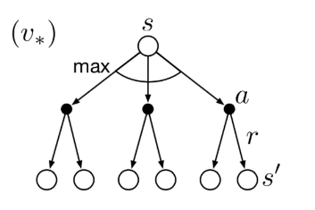
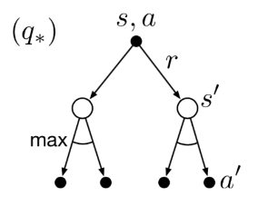

$$
\begin{align}
& price\_factor = 0.1 \\ 
& center = (1-price\_factor) * s + price\_factor*num\_spaces*(1 - \frac a {num\_prices}) \\ 
& p(s', r, s, a) =  \frac {e^{-\lvert s'-center \rvert /5} } {\sum_{s^{''}}^{2 num\_spaces} e^{-\lvert s^{''}-center \rvert /5}}
\end {align}
$$

## 2. MAB

Multi-armed Bandit

### 基本

#### 预期的奖励 $q_{*}(a)$

$$
q_{*}(a) \doteq \mathbb{E}[R_t|A_t=a]
$$

虽然不知道 $q_*(a)$ 的真实值，但可以进行估计，在时间步 $t$ 选择的行为 $a$ 的价值估计表示为 $Q_t(a)$，我们希望$Q_t(a)$ 接近 $q_*(a)$ 。

#### 行为价值方法 - 均值

计算行为价值的最简单的方法便是取平均值。
$$
Q_t(a) \doteq \frac{在t之前采取a动作的奖励总和}{在t之前采取a动作的次数}
= \frac{\sum_{i=1}^{t-1}R_i \cdot \mathbb{1}_{A_i=a}}{\sum_{i=1}^{t-1}\mathbb{1}_{A_i=a}} \tag {2.1}
$$
根据大数定理（the law of large numbers），当分母趋近于无穷大，$Q_t(a)$ 将收敛于 $q_{*}(a) $。

由此，我们可以把 Greedy 行为的选择方法表示为：
$$
A_t \doteq  \mathop{argmax} \limits_{a} \ Q_t(a)  \tag {2.2}
$$

#### 估计的奖励 $Q_t(a)$ 

- 样本平均
  $$
  \begin{aligned}
  Q_{n+1} &= \frac{1}{n}\sum_{i=1}^{n}R_i \\
          &= Q_n + \frac{1}{n}(R_n - Q_n)    
  \end{aligned} \tag {2.3}
  $$
  采用上述公式，仅仅需要保存 $Q_n$ 和 $n$，计算量也非常小。这个公式的更新规则是本书中经常出现的一种形式。更一般的形式如下：
  $$
  新估计 \leftarrow 旧估计 + 步长 [目标 - 旧估计] \tag {2.4}
  $$
  表达式 $[目标 - 旧估计] $ 是估计中的误差，这个误差以一定比例更新目标。
  
- 固定 $\alpha $

  对于非平稳（effectively nonstationary）的强化学习问题，最通常的方法之一是使用一个固定的步长（StepSize）参数。
  $$
  Q_{n+1} \doteq Q_n + \alpha(R_n - Q_n)  \tag {2.5}
  $$
  StepSize 参数 $\alpha \in (0, 1]$ 是常数。 $Q_{n+1}$ 是所有过去奖励（包括初始估计 $Q_1$）的加权平均值。
  $$
  \begin{split}\begin{aligned}
  Q_{n+1} &= Q_n + \alpha(R_n - Q_n) \\
  &= \alpha R_n + (1-\alpha)Q_n \\
  &= \alpha R_n + (1-\alpha)[\alpha R_{n-1} + (1-\alpha)Q_{n-1}] \\
  &= \alpha R_n + (1-\alpha)\alpha R_{n-1} + (1-\alpha)^2 \alpha R_{n-2} + \\
  & \qquad \qquad \qquad\dots + (1-\alpha)^{n-1}\alpha R_1 + (1-\alpha)^nQ_1 \\
  &= (1-\alpha)^nQ_1 + \sum_{i=1}^{n}\alpha(1-\alpha)^{n-i}R_i
  \end{aligned}\end{split}  \tag {2.6}
  $$
  上述公式被又称指数新近加权平均（exponential recency-weighted average）。
  
- 非固定 $\alpha$
  $$
  \begin{split}\begin{aligned}
  Q_{n+1} &= Q_n + \alpha_{n}(R_n - Q_n) \\
  &= \alpha_{n} R_n + (1-\alpha_{n})Q_n \\
  &= \alpha_{n} R_n + (1-\alpha_{n})[\alpha_{n-1} R_{n-1} + (1-\alpha_{n-1})Q_{n-1}] \\
  &= \alpha_{n} R_n + (1-\alpha_{n})\alpha_{n-1} R_{n-1} + (1-\alpha_{n})(1-\alpha_{n-1})\alpha_{n-2} R_{n-2} + \\
  & \qquad \qquad \qquad \dots + 	\prod\limits_{i=2}^n  (1-\alpha_{i})\alpha_{1} R_1 + 	\prod\limits_{i=1}^n(1-\alpha_{i})Q_1 \\
  &= \left( \prod\limits_{i=1}^n(1-\alpha_{i})\right)Q_1 + \sum_{i=1}^n \left(\alpha_i  \prod\limits_{k=i+1}^n(1-\alpha_{k}) \right)R_i
  \end{aligned}\end{split} \tag {2.7}
  $$
  其中 $\prod\limits_{k=n+1}^n(1-\alpha_{k}) = 1 $

- 非固定 $\beta$

  样本平均是对行为价值的无偏估计，而固定 StepSize 的方法会产生偏差。然而，样本平均在非平稳问题上表现不佳。那么，是否有可能避免恒定 StepSize 的偏差，同时保留其对非平稳问题的优势呢？方法之一是使用如下 StepSize 参数：
  $$
  \beta_n \doteq \alpha / \overline{o}_n \tag {2.8}
  $$

  $$
  \begin{split}\begin{aligned}
  \overline{o}_n \doteq \overline{o}_{n-1} + \alpha(1-\overline{o}_{n-1}) \  & \ \ \ \ \ \ for\ n \ge 0, \ \ with\ \ \overline{o}_0 \doteq 0   
  \end{aligned}\end{split} \tag {2.9}
  $$

  求解后公式如下：
  $$
  \begin{split}\begin{aligned}
    \beta_n = \frac \alpha {1-  (1-\alpha)^{n}  }
  
    \end{aligned}\end{split}
  $$

### greedy 方法

$$
A_t \doteq  \mathop{argmax} \limits_{a} \ Q_t(a)
$$

###  $\varepsilon \text - greedy$ 方法

$$
A_t \doteq  
\begin{equation}\left\{  
\begin{array}{lcl}  
\mathop{argmax} \limits_{a} \ Q_t(a)        &  &  {with\ probability }\  1 - \varepsilon \\  
 any\ action(a) &  &  {with\ probability }\  \varepsilon   
\end{array}  
\right.\end{equation}
$$

### UCB 方法

UCB方法根据行为成为最佳的潜力来进行探索。公式如下：
$$
A_t \doteq \mathop{argmax} \limits_{a} \left[Q_t(a) + c \sqrt{\frac{\ln{t}}{N_t(a)}}\right]  \tag {2.10}
$$
$N_t(a)$ 表示在时间 $t$ 之前选择行为 $a$ 的次数，$c>0$ 表示控制探索的程度。

### 梯度算法

学习每一个行为的偏好度（preference），其表示为 $H_t(a)$。偏好度越大，选择该行动的概率越大。这个行动概率是根据 soft-max 分布（又称 Gibbs 或 Boltzmann 分布）计算的。公式如下：
$$
Pr\{A_t=a\} \doteq \frac{e^{H_t(a)}}{\sum_{b=1}^{k}e^{H_t(b)}} \doteq \pi_t(a) \tag {2.11}
$$
$\pi_t(a)$ 表示在时间 t 选择行动 a 的概率。

基于随机梯度上升的思想，行为偏好度的更新算法如下。
$$
\begin{split}\begin{aligned}
H_{t+1}(A_t) &\doteq H_t(A_t) + \alpha(R_t-\overline{R}_t)(1-\pi_t(A_t))， &and \\
H_{t+1}(a) &\doteq H_t(a) - \alpha(R_t-\overline{R}_t)\pi_t(a)，&for \ a \ne A_t
\end{aligned}\end{split} \tag {2.12}
$$
其中 $\alpha>0$ 是 Step-Size 参数。 $\overline{R}_t$ 表示到时间步 t 为止奖励的平均值。 $\overline{R}_t$ 作为奖励的基线（baseline）。 如果奖励高于基线，那么将来获取 $A_t$ 的概率增加; 反之，如果奖励低于基线，则概率降低。对于那些非$A_t$ 的行为，其概率的变化方向和 $A_t$ 相反。

#### 随机梯度上升的 Bandit 梯度算法

通过理解梯度上升的随机近似（a stochastic approximation to gradient ascent），可以让我们更深的领悟 Bandit 梯度算法。准确的来说，每个行为的偏好度 $H_t(a)$ 与性能的增量成正比。
$$
H_{t+1}(a) \doteq H_t(a) + \alpha\frac{\partial \mathbb{E}[R_t]}{\partial H_t(a)} \tag {2.13}
$$
其中性能衡量指标是预期的奖励：
$$
\mathbb{E}[R_t] = \sum_{x}\pi_t(x)q_*(x)
$$
由于我们不知道 $ q_∗(x)$，所以不可能实现精确的梯度上升。但是实际上，公式（2.12）等价于公式（2.13），下面进行仔细的研究。
$$
\begin{split}\begin{aligned}
\frac{\partial \mathbb{E}[R_t]}{\partial H_t(a)} &= \frac{\partial}{\partial H_t(a)}\left[\sum_{x}\pi_t(x)q_*(x)\right] \\
&= \sum_{x}q_*(x)\frac{\partial \pi_t(x)}{\partial H_t(a)} \\
&= \sum_{x}(q_*(x)-B_t)\frac{\partial \pi_t(x)}{\partial H_t(a)}
\end{aligned}\end{split}
$$
其中 $B_t$ 称为 *基线（baseline）*，是一个不依赖于 $x$ 的标量（scalar）。上面公式中加入了 $B_t$ ，但由于 $\sum_{x}\frac{\partial \pi_t(x)}{\partial H_t(a)} = 0$，等式依然成立。

## 3. MDP

Markov Decision Process

### 动力学函数

环境和个体一起产生了如下的序列或轨迹。
$$
S_0,A_0,R_1,S_1,A_1,R_2,S_2,A_2,R_3,\dots \tag {3.1}
$$
函数 $p $ 定义了MDP的动力学函数（dynamics function），即 $$p: \mathcal{S} \times \mathcal{R} \times \mathcal{S} \times \mathcal{A} \to [0, 1]$$。
$$
p(s^\prime,r|s,a) \doteq Pr\{S_t=s^\prime,R_t=r|S_{t-1}=s,A_{t-1}=a\}  \tag {3.2}
$$
满足如下性质。
$$
\sum_{s^\prime \in \mathcal{S}}\sum_{r \in \mathcal{R}}p(s^\prime,r|s,a)=1，for\ all \ s \in \mathcal{S}，a \in \mathcal{A}(s) \tag {3.3}
$$
状态转移概率（state-transition probabilities）$p : \mathcal{S} \times \mathcal{S} \times \mathcal{A} \to [0, 1]$ 。
$$
p(s^\prime|s,a) \doteq Pr\{S_t=s^\prime|S_{t-1}=s,A_{t-1}=a\}=\sum_{r\in\mathcal{R}}p(s^\prime,r|s,a) \tag {3.4}
$$
状态-行为对（pairs）的预期奖励，$r : \mathcal{S} \times \mathcal{A} \to \mathbb{R}$。
$$
r(s,a)\doteq\mathbb{E}\left[R_t|S_{t-1}=s,A_{t-1}=a\right]=\sum_{r\in\mathcal{R}}r\sum_{s^\prime\in\mathcal{S}}p(s^\prime,r|s,a) \tag {3.5}
$$
状态-行动-下一状态三元组（triples）的预期奖励，$r : \mathcal{S} \times \mathcal{A} \times \mathcal{S} \to \mathbb{R}$。
$$
r(s,a,s^\prime)\doteq\mathbb{E}\left[R_t|S_{t-1}=s,A_{t-1}=a,S_t=s^\prime\right]=\sum_{r\in\mathcal{R}}r\frac{p(s^\prime,r|s,a)}{p(s^\prime|s,a)}   \tag {3.6}
$$

### 情节任务

在最简单的情况下，*预期收益（expected return）*$G_t$ 可以表示如下。
$$
G_{t} \doteq R_{t+1} +R_{t+2} + R_{t+3} + \dots + R_{T}  \tag {3.7}
$$

### 持续任务

*预期收益（expected return）*$G_t$ 可以表示如下。
$$
G_{t} \doteq R_{t+1} + \gamma R_{t+2} + \gamma^2 R_{t+3} + \dots = \sum_{k=0}^{\infty}\gamma^k R_{t+k+1} \tag {3.8}
$$

$$
\begin{split}\begin{aligned}
G_{t} &\doteq R_{t+1} + \gamma R_{t+2} + \gamma^2 R_{t+3} + \gamma^3 R_{t+4} + \dots \\
&= R_{t+1} + \gamma(R_{t+2} + \gamma R_{t+3} + \gamma^2 R_{t+4} + \dots) \\
&= R_{t+1} + \gamma G_{t+1}
\end{aligned}\end{split} \tag {3.9}
$$

其中 $\gamma $ 称之为 *衰减率（discount rate）*，满足 $0 \leq\gamma \leq 1$。当$R_t$是常数1时，可得：
$$
G_t = \sum_{k=0}^{\infty}\gamma^k = \frac{1}{1-\gamma} \tag {3.10}
$$

### 情节和持续任务的统一符号

$$
G_t \doteq \sum_{k=t+1}^{T} \gamma^{k-t-1} R_k  \tag {3.11}
$$

其中 $T = \infin$ 或者 $\gamma = 1$ （但不同时满足）。

### 状态价值函数

状态 $s$ 下，策略 $\pi$ 下的 *价值函数（value function）*表示为 $v_\pi(s)$，是从 $s$ 开始，遵循策略 $\pi$ 的预期收益。定义如下：
$$
v_\pi(s) \doteq \mathbb{E}_\pi\left[G_t|S_t=s\right]
= \mathbb{E}_\pi\left[\sum_{k=0}^{\infty} \gamma^k R_{t+k+1}|S_t=s\right]，对所有 s\in \mathbb{S} \tag {3.12}
$$

#### $v_\pi(s)$ 和 $q_\pi(s, a) $

$$
v_\pi(s) \doteq \mathbb{E}_\pi[q_\pi(S_t, A_t)|S_t=s]
$$

$$
v_\pi(s) \doteq \sum_{a}\pi(a|s) q_\pi(s, a)
$$

#### $v_\pi(s)$ 和 $v_\pi(s^\prime) $

$$
\begin{split}\begin{aligned}
v_\pi(s) &\doteq \mathbb{E}_\pi[G_t|S_t=s] \\
&= \mathbb{E}_\pi[R_{t+1} + \gamma G_{t+1}|S_t=s] \ \ \ \ \ \ \ \ \ \ \ \ (by\ (3.9)) \\
&= \sum_a\pi(a|s) \sum_{s^\prime}\sum_r p(s^\prime,r|s,a) \left[r+\gamma\mathbb{E}_\pi[G_{t+1}|S_{t+1}=s^\prime]\right] \\
&= \sum_a\pi(a|s) \sum_{s^\prime,r}p(s^\prime,r|s,a)[r+\gamma v_\pi(s^\prime)], \ \ \ \ \ \ for \ all \ s\in\mathcal{S}
\end{aligned}\end{split} \tag {3.14}
$$
上面公式被称之为 $v_\pi$ 的贝尔曼方程（Bellman equation）。它表达了状态价值与下一个状态价值之间的关系。

### 行为价值函数

在策略 $\pi$ 下，状态 $s$ 下采用行为 $a$ 的 *行为价值函数（action-value function）* 表示为 $q_\pi(s, a)$，是从 $s$ 开始， 遵循策略 $\pi$ 采用行为 $a$,的预期收益。定义如下：
$$
q_\pi(s,a) \doteq \mathbb{E}_\pi\left[G_t|S_t=s,A_t=a\right]
= \mathbb{E}_\pi\left[\sum^{\infty}_{k=0}\gamma^kR_{t+k+1}|S_t=s,A_t=a\right]  \tag {3.13}
$$

####  $q_\pi(s, a) $ 和 $v_\pi(s^\prime)$ 

$$
q_\pi(s, a) \doteq \mathbb{E}_\pi[R_{t+1} + \gamma v_\pi(S_{t+1})| S_t=s,  A_t=a]
$$

$$
q_\pi(s, a) \doteq \sum_{s^\prime,r}p(s^\prime,r|s,a) (r + \gamma v_\pi(s^\prime))
$$

####  $q_\pi(s, a) $ 和 $q_\pi(s^\prime, a^\prime)$ 

$$
\begin{split}\begin{aligned}
q_\pi(s, a) &\doteq \mathbb{E}_\pi[G_t|S_t=s,A_t=a] \\
&= \mathbb{E}_\pi[R_{t+1} + \gamma G_{t+1}|S_t=s,A_t=a] \ \ \ \ \ \ \ \ \ \ \ \ (by\ (3.9)) \\
&= \sum_{s^\prime}\sum_r p(s^\prime,r|s,a)   \left[r+\gamma\mathbb{E}_\pi[G_{t+1}|S_{t+1}=s^\prime, A_{t+1}=a^\prime]\right] \\
&= \sum_{s^\prime,r}p(s^\prime,r|s,a)  [r+\gamma \sum_{a^\prime}\pi(a^\prime|s^\prime)q_\pi(s^\prime, a^\prime)]   
\end{aligned}\end{split}
$$
上面公式被称之为 $q_\pi$ 的贝尔曼方程（Bellman equation）。它表达了行为价值与下一个行为价值之间的关系。

### 最优状态价值函数

*最优状态价值函数optimal state-value function*，表示为 $v_*$。
$$
v_*(s) \doteq \max_\pi v_\pi(s)，  \ \ \ \ for \ all \ s\in \mathcal{S}  \tag {3.15}
$$

#### $v_*(s)$ 和 $q_*(s, a) $

$$
v_*(s) = \max_{a\in\mathcal{A}(s)} q_{\pi_*}(s,a)
$$

#### $v_*(s)$ 和 $v_*(s^\prime) $

$$
\begin{split}\begin{aligned}
v_*(s) &= \max_{a\in\mathcal{A}(s)} q_{\pi_*}(s,a) \\
&=\max_a \mathbb{E}_{\pi_*}[G_t|S_t=s,A_t=a] \\
&=\max_a \mathbb{E}_{\pi_*}[R_{t+1}+\gamma G_{t+1}|S_t=s,A_t=a]  \ \ \ \ & (by (3.9)) \\
&=\max_a \mathbb{E}[R_{t+1}+\gamma v_*(S_{t+1})|S_t=s,A_t=a] \ \ \ \ &( 3.18) \\
&=\max_{a\in \mathcal{A}(s)}\sum_{s^\prime,r} p(s^\prime,r|s,a)[r+\gamma v_*(s^\prime)] \ \ \ \  &(3.19)
\end{aligned}\end{split}
$$

### 最优行为价值函数

*最优行为价值函数（optimal action-value function）*，表示为 $q_*$。
$$
q_*(s,a) \doteq \max_\pi q_\pi(s,a) \ \ \ \ for \ all \ s\in \mathcal{S}  \  and  \ a\in \mathcal{A} \tag {3.16}
$$

对于状态价值对 $(s, a)$，这个函数给出了在状态 $s$ 执行 $a$ 行为，并在此后遵循最优策略的预期收益。因此我们用 $q_*$ 来表示 $v_*$， 定义如下：
$$
q_*(s,a) = \mathbb{E}\left[R_{t+1}+\gamma v_* (S_{t+1})|S_t=s,A_t=a\right] \tag {3.17}
$$

####  $q_*(s, a) $ 和 $v_*(s^\prime)$ 

$$
\begin{split}\begin{aligned}
q_*(s,a) &= \mathbb{E}\left[R_{t+1}+\gamma\sum_{a^\prime}q_*(S_{t+1,a^\prime})|S_t=s,A_t=a\right] \\
&=\sum_{s^\prime,r}p(s^\prime,r|s,a)[r+\gamma \max_{a^\prime}q_*(s^\prime,a^\prime)] \\
&=\sum_{s^\prime,r}p(s^\prime,r|s,a)[r+\gamma v_*(s^\prime)] 
\end{aligned}\end{split}
$$

#### $q_*(s, a) $ 和 $q_*(s^\prime, a^\prime)$ 

$$
\begin{split}\begin{aligned}
q_*(s,a) &= \mathbb{E}\left[R_{t+1}+\gamma\sum_{a^\prime}q_*(S_{t+1,a^\prime})|S_t=s,A_t=a\right] \\
&=\sum_{s^\prime,r}p(s^\prime,r|s,a)[r+\gamma \max_{a^\prime}q_*(s^\prime,a^\prime)]
\end{aligned}\end{split} \tag {3.20}
$$

## 4. DP

如前文所述，一旦找到如下的最优价值函数  $v_*$ 或者 $q_*$ ，最优策略便很容易获得。
$$
\begin{split}\begin{aligned}
v_*(s) &= \max_a\mathbb{E}[R_{t+1}+\gamma v_*(S_{t+1}) | S_t=s,A_t=a] \\
&= \max_a\sum_{s',r}p(s',r|s,a)[r+\gamma v_*(s')]
\end{aligned}\end{split}   \tag {4.1}
$$
或
$$
\begin{split}\begin{aligned}
q_*(s,a)& = \mathbb{E}[R_{t+1}+\gamma \max_{a'} q_*(S_{t+1},a') | S_t=s,A_t=a]\\
&=\sum_{s',r}p(s',r|s,a)[r+\gamma\max_{a'} q_*(s',a')],
\end{aligned}\end{split} \tag {4.2}
$$
其中 $\cal{s}\in\cal{S},\ a\in\cal{A(s)},\  \cal{s}'\in\mathcal{S}^+$ 。

### 策略评估

迭代策略评估（iterative policy evaluation）公式如下：
$$
\begin{split}\begin{aligned}
v_{k+1}(s)& \overset{\cdot}{=}\mathbb{E}[R_{t+1}+\gamma v_k(S_{t+1}) | S_t=s] \\
&= \sum_{a}\pi(a|s)\sum_{s',r}p(s',r|s,a)[r+\gamma{v_k(s')}],
\end{aligned}\end{split} \tag {4.5}
$$

> **迭代策略评估，用于估算 $V \approx v_\pi$**
>
> 输入：
>
> - $\pi$: 要被评估的策略。
>
> - $\theta$: 算法参数：一个小的阈值 $\theta > 0$， 它用于控制估计的准确性。
> - $V(s)$：进行初始化，当 $s\in\mathcal{S}^+$，可以是任意值，当是终止节点，$V(terminal) = 0$。
>
> $$
> \begin{align}
> & \text {Loop} \\
> & \quad \Delta \leftarrow 0  \\
> & \quad \text {Loop for each } s \in \mathcal S:\\
> & \quad \quad v \leftarrow V(s)\\
> & \quad \quad V(s) \leftarrow \sum_{a}\pi(a|s)\sum_{s',r}p(s',r|s,a)[r+\gamma V(s')]\\
> & \quad \quad \Delta \leftarrow \max(\Delta,|v-V(s)|)\\
> & \quad \text {until } \Delta < \theta
> \end{align}
> $$

### 策略提升

基于当前状态 $s$ 选择一个行为 $a$ （笔者：并没有根据策略 $\pi$ 来选择），此后再遵循策略 $\pi$，这种方式的价值是：
$$
\begin{split}\begin{aligned}
q_\pi(s,a)& \doteq \mathbb{E}[R_{t+1}+\gamma v_\pi(S_{t+1}) | S_t=s,A_t=a] \\
&= \sum_{s',r}p(s',r|s,a)[r+\gamma v_\pi(s')]
\end{aligned}\end{split}   \tag {4.6}
$$
对于每个状态，选择 $q_\pi(s, a)$ 最大的那个行为。即Greedy 策略 $\pi^\prime$ ，其表示如下：
$$
\begin{split}\begin{aligned}
\pi'(s)& \doteq \arg\max_a q_\pi(s,a) \\
& =\arg \max_a\mathbb{E}[R_{t+1}+\gamma v_\pi(S_{t+1}) | S_t=s,A_t=a]\\
&=\arg\max_a\sum_{s',r}p(s',r|s,a)[r+\gamma v_\pi(s')],
\end{aligned}\end{split} \tag {4.9}
$$
Greedy 策略根据 $v_\pi$，向前展望一步，选择短期内看起来最好的行为。

### 策略迭代

> **策略迭代（使用迭代策略评估）估计 $\pi \approx \pi_*$**
>
> 1. 初始化（Initialization）
>
>    对于所有的 $s\in\mathcal{S}$，$V(s)\in\mathbb{R}$， $\pi(s)\in\cal{A}(s)$；且 $V(terminal) = 0$
>
> 2. 策略评估（Policy Evaluation）
>    $$
>    \begin{flalign}
>    & \text {Loop:}  \\
>    & \quad  Delta \ \leftarrow \ 0\\
>    & \quad \text{Loop for each } s\in{S}: \\
>    & \quad \quad v\leftarrow{V(s)}\\
>    & \quad \quad V(s) \ {\leftarrow} \ \sum_{s',r}p(s',r|s,\pi(s))[r+\gamma{V(s')}] \\
>    & \quad \quad \Delta \ {\leftarrow} \ {\max(\Delta,|v-V(s)|)} \\
>    & \text {Until }  \Delta<\theta \text {（一个小的正数，其决定了估计准确性的）} \\
>    \end{flalign}
>    $$
>
> 3. 策略提升（Policy Improvement）
>
> $$
> \begin{flalign}
> &  {policy\text -stable} \leftarrow true\\
>    &  \text {For each } s\in{S} : \\
>    &  \quad {old \text - action}  \leftarrow {\pi(s)} \\
> &  \quad \pi(s)\leftarrow{\arg\max_a\sum_{s',r}p(s',r|s,a)[r+\gamma V(s')]}\\
>    &  \quad \text {If } old\text -action \not=\pi(s) \text  {, then } policy\text -stable \leftarrow \text {false} \\
> &  \text {If } policy\text -stable \text{, then stop and return } V \approx{v_*}  \text { and } \pi \approx{\pi_*} ; \text {else go to 2}  \\
>    \end{flalign}
> $$

### 价值迭代

$$
\begin{split}\begin{aligned}
v_{k+1}(s)&\doteq \max_a\mathbb{E}[R_{t+1}+\gamma v_{k}(S_{t+1}) | S_t=s,A_t=a] \\
&= \max_a\sum_{s',r}p(s',r|s,a)[r+\gamma v_{k}(s')],
\end{aligned}\end{split} \tag {4.10}
$$

其中 $s\in\mathcal{S}$。

**价值迭代，用于估算 $\pi \approx \pi_*$**
$$
\begin{flalign}
& \text {算法参数： 小的阈值} \theta > 0 \text {，用于确定评估的准确性。}   \\
& \text {对于所有的 } s\in\mathcal{S} ，V(s) \text {可以初始化任何值；} V(terminal) = 0   \\
& \text {Loop:}       \\
& \quad  \Delta \leftarrow 0       \\
& \quad  \text {Loop for each} s \in \cal S \\
& \quad \quad v\leftarrow{V(s)}        \\  
& \quad \quad V(s){\leftarrow}\max_a\sum_{s',r}p(s',r|s,a)[r+\gamma{V(s')}] \\
& \quad \quad \Delta{\leftarrow}{\max(\Delta,|v-V(s)|)}  \\
& \text {until } \Delta<\theta  \\
& \text 输出一个确定性的策略， \pi \approx \pi_*, 即 \\
& \pi(s)=\arg\max_a\sum_{s',r}p(s',r|s,a)[r+\gamma{V(s')}]
\end {flalign}
$$

## 5. MC Methods

### 首次访问 MC 预测

> **首次访问 MC 预测，估计 $V \approx v_\pi$,**
> $$
> \begin{flalign}
> &\text {输入（Input）：用来评估的策略} \pi   \\
> &\text {初始化（Initialize）：}   \\
> & \quad V(s)\in\mathbb{R} \\
> & \quad   Returns(s) \leftarrow \text {一个空的列表（List）}    \\
> &  \text {Loop forever (for each episode): }   \\
> &  \quad  \text {根据 } \pi \text { 生成情节：}  S_0, A_0, R_1, S_1, A_1, R_2, \dots , S_{T-1}, A_{T-1}, R_{T}  \\
> &   \quad G \leftarrow 0    \\
> &   \quad \text {Loop for each step of episode, }  t = T-1, T-2, \dots, 0 :  \\
> &   \quad \quad G \leftarrow \gamma{G} + R_{t+1}  \\
> &   \quad \quad \text {Unless } S_t \text { appears in }S_0, S_1,...,S_{t-1}:   \\
> &  \quad \quad  \quad \text {Append } G \text { to } Returns(S_t)    \\
> &   \quad \quad  \quad V(s) \leftarrow average(Returns(s))   \\
> \end{flalign}
> $$

### 探索开端的蒙特卡洛

> **Monte Carlo ES (Exploring Starts)**， 用于估算 $\pi \approx \pi_*$
> $$
> \begin{flalign}
> & \text {Initialize}:
> \\ &  \quad  \pi(s) \in  \mathcal A(s) \text { (arbitrarily), } \text {for all } s \in \mathcal S
> \\ &  \quad Q(s, a) \in  \mathcal  R  \text { (arbitrarily), for all } s \in  \mathcal S, a \in  \mathcal A(s)
> \\ &  \quad Returns(s, a) \leftarrow \text {empty list, for all } s \in  \mathcal S, a \in  \mathcal A(s)
> \\ &   \text {Loop forever (for each episode): }
> \\ &  \quad \text {Choose } S_0 \in  \mathcal S, A_0 \in  \mathcal A(S_0)  \text  { randomly such that all pairs have probability > 0}
> \\ &  \quad \text {Generate an episode from } S_0, A_0, \text {following } \pi: S_0, A_0, R_1,...,S_{T-1}, A_{T-1}, R_T
> \\ &  \quad G \leftarrow 0
> \\ &   \quad\text {Loop for each step of episode, } t = T -1, T -2, \cdots, 0:
> \\ &  \quad \quad  G \leftarrow \gamma G + R_{t+1}
> \\ &  \quad \quad \text {Unless the pair } S_t, A_t \text { appears in }S_0, A_0, S_1, A_1 ...,S_{t-1}, A_{t-1}:
> \\ &  \quad \quad \quad \text {Append } G \text { to }Returns(S_t, A_t)
> \\ &  \quad \quad \quad Q(S_t, A_t) \leftarrow  average(Returns(S_t, A_t))
> \\ &  \quad \quad \quad \pi(S_t) \leftarrow \arg\max_a Q(S_t, a)
> \end{flalign}
> $$

### **On-policy首次访问MC控制**

> **On-policy first-visit MC control （对于** **$\epsilon-soft$** **策略），用于估算** **$V \approx v_\pi$**
> $$
> \begin{flalign}
> &  \text {Algorithm parameter:：small } \epsilon > 0
> \\ & \text {Initialize}:
> \\ &  \quad  \pi(s)  \leftarrow \text { an arbitrary } \varepsilon\text -soft \text { policy}
> \\ &  \quad Q(s, a) \in  \mathcal  R  \text { (arbitrarily), for all } s \in  \mathcal S, a \in  \mathcal A(s)
> \\ &  \quad Returns(s, a) \leftarrow \text {empty list, for all } s \in  \mathcal S, a \in  \mathcal A(s)
> \\ &   \text {Loop forever (for each episode): }
> \\ &  \quad \text {Choose } S_0 \in  \mathcal S, A_0 \in  \mathcal A(S_0)  \text  { randomly such that all pairs have probability > 0}
> \\ &  \quad \text {Generate an episode from } S_0, A_0, \text {following } \pi: S_0, A_0, R_1,...,S_{T-1}, A_{T-1}, R_T
> \\ &  \quad G \leftarrow 0
> \\ &   \quad\text {Loop for each step of episode, } t = T -1, T -2, \cdots, 0:
> \\ &  \quad \quad  G \leftarrow \gamma G + R_{t+1}
> \\ &  \quad \quad \text {Unless the pair } S_t, A_t \text { appears in }S_0, A_0, S_1, A_1 ...,S_{t-1}, A_{t-1}:
> \\ &  \quad \quad \quad \text {Append } G \text { to }Returns(S_t, A_t)
> \\ &  \quad \quad \quad Q(S_t, A_t) \leftarrow  average(Returns(S_t, A_t))
> \\ &  \quad \quad \quad A^* \leftarrow \mathop{argmax} \limits_{a} Q(S_t, a)  \quad \quad \quad \quad \text {(with ties broken arbitrarily)}
> \\ &  \quad \quad \quad \text {For all } a \in \mathcal A(S_t):
> \\ &  \quad \quad \quad \quad \begin{split}\pi\left(a|S_{t}\right) \leftarrow\left\{\begin{array}{ll}
> 1-\varepsilon+\varepsilon /\left|\mathcal{A}\left(S_{t}\right)\right| & \text { if } a=A^{*} \\
> \varepsilon /\left|\mathcal{A}\left(S_{t}\right)\right| & \text { if } a \neq A^{*}
> \end{array}\right.\end{split}
> \end{flalign}
> $$

设 $\pi'$ 为 $\varepsilon \text - greedy$ 策略，应用策略提升理论可得如下推导：
$$
\begin{split}\begin{aligned}
q_{\pi}\left(s, \pi^{\prime}(s)\right) &=\sum_{a} \pi^{\prime}(a | s) q_{\pi}(s, a) \\
&=\frac{\varepsilon}{|\mathcal{A}(s)|} \sum_{a} q_{\pi}(s, a)+(1-\varepsilon) \max _{a} q_{\pi}(s, a) \\
& \geq \frac{\varepsilon}{|\mathcal{A}(s)|} \sum_{a} q_{\pi}(s, a)+(1-\varepsilon) \sum_{a} \frac{\pi(a | s)-\frac{\varepsilon}{|\mathcal{A}(s)|}}{1-\varepsilon} q_{\pi}(s, a) \\

\end{aligned}\end{split} \tag {5.2}
$$
注意，由于 $\sum_{a} \frac{\pi(a | s)-\frac{\varepsilon}{|\mathcal{A}(s)|}}{1-\varepsilon} q_{\pi}(s, a)$是一个加权平均值，所以 $\max _{a} q_{\pi}(s, a)  \geq \sum_{a} \frac{\pi(a | s)-\frac{\varepsilon}{|\mathcal{A}(s)|}}{1-\varepsilon} q_{\pi}(s, a)$。继续推导可得。
$$
\begin{split}\begin{aligned}
\quad\quad\quad\quad\quad\quad\quad    &=\frac{\varepsilon}{|\mathcal{A}(s)|} \sum_{a} q_{\pi}(s, a)-\frac{\varepsilon}{|\mathcal{A}(s)|} \sum_{a} q_{\pi}(s, a)+\sum_{a} \pi(a | s) q_{\pi}(s, a) \\
&=v_{\pi}(s)
\end{aligned}\end{split}
$$
由此，根据应用策略提升理论，可得 $\pi^{'} \geq \pi$ （即对所有 $s \in \mathcal S，v_{\pi^{'}}(s) \geq v_\pi(s)$​）。

### 重要性采样的离策略预测

几乎所有的离策略方法都使用重要性采样（importance sampling,，这是一种使用另外一个样本分布来估计原分布下的期望值的通用技术。我们通过根据目标策略和行为策略下轨迹发生的相对概率（称为重要性采样比率（importance-sampling ratio））对回报进行加权，将重要性采样应用于离策略学习。给定一个开始状态$S_t$，后续状态-动作轨迹，$A_t, S_{t+1},A_{t+1},\cdots ,S_{T}$，在策略$\pi$下发生的概率是：
$$
\begin{split}\begin{aligned}
&Pr\{A_t, S_{t+1},A_{t+1},\dots,S_T | S_t,A_{t:T-1} \sim \pi\} \\
&=\pi(A_t|S_t)p(S_{t+1}|S_t,A_t)\pi(A_{t+1}|S_{t+1})\cdots p(S_{T}|S_{T-1},A_{T-1}) \\
&=\prod_{k=t}^{T-1} \pi(A_k|S_k)p(S_{k+1}|S_k,A_k),
\end{aligned}\end{split}
$$
其中， $p$是状态转移概率函数，它的定义参见公式3.4。 因此，在目标策略和行动策略下的该轨迹的发生的相对概率为（即重要性采样率）。
$$
\rho_{t:T-1} \doteq \frac{\prod_{k=t}^{T-1} \pi(A_k|S_k)p(S_{k+1}|S_k,A_k)}
{\prod_{k=t}^{T-1} b(A_k|S_k)p(S_{k+1}|S_k,A_k)}
= \prod_{k=t}^{T-1} \frac{\pi(A_k|S_k)}{b(A_k|S_k)} \tag {5.3}
$$
注意到上式中的轨迹的概率依赖于MDP的转移概率（常常是未知的），但是它们在分子和分母中都是相同的，能够被消掉。 即是说，重要性采样率最终仅仅依赖于两个策略和序列，而与MDP无关。

回想一下，我们希望估计目标策略下的期望回报（价值），但我们所有的回报$G_t$都是由于行动策略产生的。这些回报有错误的期望$\mathbb{E}[G_t|S_t=s]=v_b(s)$，因此不能平均得到$v_{\pi}$。比率$\rho_{t:T-1}$将回报转化为具有正确期望值的形式（这也就是重要性采样的作用）：
$$
\tag{5.4} \mathbb{E}[\rho_{t:T-1}G_t|S_t=s]=v_{\pi}(s)
$$

现在我们准备给出一个蒙特卡洛算法：在策略b下，使用一批观察到的情节平均回报以估计 $v_\pi(s)$。 为了方便，我们将时间步设置为穿过回合的递增形式，即下一个回合开始时的时间步不清零，而是接着上个回合的末尾加一。 比如，这一批的回合中，第一情节在时间 $100$ 的时候结束，那么下一个情节开始于时间 $t=101$ 。 这使我们能够使用时间步编号来引用特定情节中的特定步骤。 特别是，我们可以定义在状态 $s$ 被访问的所有时间步的集合，记为 $\cal{T}(s)$。 这是对于每次访问而言的。对于首次访问，$\cal{T}(s)$ 只包含第一次访问 $s$ 的时间步。 此外，$T(t)$ 表示时间 $t$ 之后的第一次终止时间，$G_t$ 表示 $t$ 之后到 $T(t)$ 的回报。 然后集合 $\{G_t\}_{t \in \cal{T}(s)}$ 表示状态 $s$ 的所有回报， $\{\rho_{t:T(t)-1} \}_{t \in \cal{T}(s)}$ 表示其对应的重要性采样率。 为了估计 $v_\pi(s)$ ，我们用重要性采样率来缩放回报，然后求平均：

$$
V(s) \doteq \frac{\sum_{t \in \cal{T}(s)} \rho_{t:T(t)-1} G_t}{|\cal{T}(s)|} \tag {5.5}
$$

当重要性采样只是以上面的简单的方式求平均时，我们称为 *普通重要性采样（ordinary importance sampling）* 。

另一个选择是 *加权重要性采样（weighted importance sampling）* ，它使用了加权平均，定义为：
$$
V(s) \doteq \frac{\sum_{t \in \cal{T}(s)} \rho_{t:T(t)-1} G_t}{\sum_{t \in \cal{T}(s)} \rho_{t:T(t)-1}} \tag {5.6}
$$
若分母为零，加权重要性采样也为零。 
